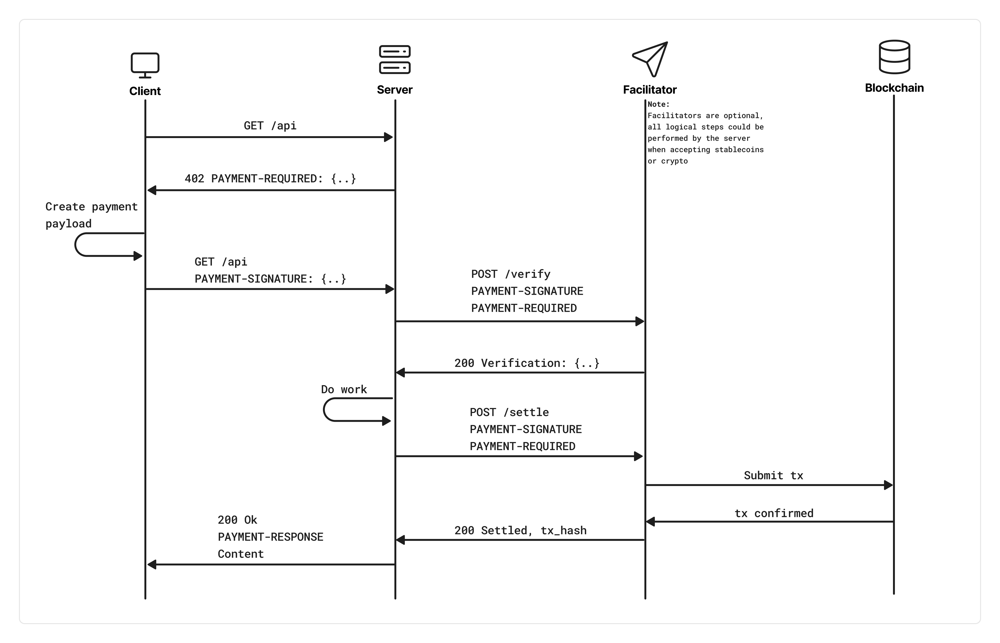

# x402 — Agent Grants for HTTP 402 Payments

**The open protocol for AI agents to pay for tools, APIs, and each other.**

[](https://github.com/shawnhvac/x402/stargazers)
[](LICENSE)
[](https://base.org)
[](https://www.circle.com/usdc)
[](./test/)

x402 extends the HTTP 402 Payment Required standard with **signed EIP-712 grant objects** — short-lived, programmable spend policies that let AI agents pay autonomously without sharing keys. Automatic refunds. Optional reputation layer. Fully open spec — implement without AgentPay.

> **[→ COMMUNITY.md](./COMMUNITY.md)** — See who's building with x402 and add your implementation

---

## Get Started in 60 Seconds

```bash
git clone https://github.com/shawnhvac/x402.git
cd x402/examples/minimal-node-python

# Terminal 1 — start the receiving agent
cd python-receiving-agent && pip install -r requirements.txt && python app.py

# Terminal 2 — run a payment
cd node-paying-agent && npm install && npm start
```

You'll see a full payment cycle — grant → verify → settle → receipt — in your terminal. No wallet, no gas, no setup.

**Ready to go on-chain?** See [BASE_SEPOLIA.md](./examples/minimal-node-python/BASE_SEPOLIA.md) for real USDC settlement on Base Sepolia in one `.env` file.

---

## Why x402?

- **Agents pay autonomously** — no shared keys, no human in the loop
- **Offline verification** — receivers verify grants without an RPC call in the happy path
- **Programmable budgets** — `perRequestCap` + `totalBudget` + scopes (IAM for agents)
- **Automatic refunds** — 60-second timeout triggers a refund; revert = instant refund
- **Reputation layer** — optional Sybil-resistant scoring via The Graph subgraph
- **Open spec** — six live documents, conformance suite, anyone can implement

---

## What's in This Repo

| Path | What it is |
|---|---|
| [`specs/grants.md`](./specs/grants.md) | EIP-712 grant schema, security rules, revocation |
| [`specs/payment-flow.md`](./specs/payment-flow.md) | End-to-end lifecycle with Mermaid sequence diagram |
| [`specs/conformance.md`](./specs/conformance.md) | One-command conformance suite (`npm test`) |
| [`specs/reputation.md`](./specs/reputation.md) | Optional Sybil-resistant reputation scoring |
| [`specs/subgraph.md`](./specs/subgraph.md) | The Graph subgraph deployment guide |
| [`subgraph/`](./subgraph/) | Production-ready AssemblyScript subgraph workspace |
| [`examples/minimal-node-python/`](./examples/minimal-node-python/) | Node.js paying agent + Python receiving agent |
| [`test/`](./test/) | Conformance tests — 6 vectors, real Hardhat signatures |
| [`COMMUNITY.md`](./COMMUNITY.md) | Implementations table — add yours via PR |

---

## Status

| Layer | Status |
|---|---|
| Core spec & EIP-712 grants | ✅ Live — conformance-tested |
| Local example (60-second quickstart) | ✅ Live |
| Base Sepolia example (real USDC, EIP-3009) | ✅ Live |
| Reputation spec | ✅ Live |
| Subgraph workspace (AssemblyScript, schema, ABIs) | ✅ Ready to deploy |
| Hosted subgraph endpoint | 🔜 Pending contract deployment |
| Community implementations | 🟢 Open — [submit a PR](./COMMUNITY.md) |

---

## Installation

x402 is a standard, not a library — but SDKs are available:

<details>
<summary><b>TypeScript</b></summary>

<br/>

> See all packages in the [**TypeScript SDK**](./typescript/), including chain implementations, examples, and integration guides.

```shell
# Full SDK
npm install @x402/core \
  @x402/evm @x402/svm @x402/stellar \
  @x402/axios @x402/fastify @x402/fetch @x402/express @x402/hono @x402/next @x402/paywall @x402/extensions

# Minimal fetch client
npm install @x402/core @x402/evm @x402/svm @x402/fetch

# Minimal Express server
npm install @x402/core @x402/evm @x402/svm @x402/express
```

</details>

<details>
<summary><b>Python</b></summary>

<br/>

> See the [**`python/x402`**](./python/) folder for examples and integration guides.

```shell
pip install x402
```

</details>

<details>
<summary><b>Go</b></summary>

<br/>

> See the [**`go/`**](./go/) folder for examples and integration guides.

```shell
go get github.com/x402-foundation/x402/go
```

</details>

---

## Conformance

Any implementation can verify correctness in one command:

```bash
cd test && npm install && npm test
```

Expected:
```
x402 Grant Conformance Suite
  ✓ valid-grant
  ✓ expired-grant
  ✓ wrong-agent
  ✓ near-expiry-revocation-check
  ✓ clock-skew-grace
  ✓ zero-per-request-cap

  6 passing
```

---

## Principles

- **Open standard** — freely accessible, no reliance on a single party
- **HTTP / Transport Native** — complements existing infrastructure, no extra round trips
- **Network & currency agnostic** — crypto and fiat, EVM and SVM, Base L2 and beyond
- **Backwards compatible** — no deprecations without security necessity
- **Trust minimizing** — facilitators and resource servers cannot move funds against client intentions
- **Easy to use** — gas, RPC, and signing complexity are abstracted away

---

## How x402 Works

x402 follows the standard HTTP 402 flow with a grant-based extension for agent payments:



1. **Client** makes an HTTP request to a resource server
2. **Resource server** returns `402 Payment Required` + a `PaymentRequired` header
3. **Client** selects a payment scheme and creates a signed `PaymentPayload` (or presents a pre-signed grant)
4. **Client** resends the request with `X-402-Payment` header
5. **Resource server** verifies — locally (offline for grants) or via facilitator
6. **Resource server** settles the payment via facilitator or directly on-chain
7. **Resource server** returns `200 OK` + `X-402-Receipt` header with the settlement response

See [specs/payment-flow.md](./specs/payment-flow.md) for the full lifecycle with sequence diagram.

### Schemes

A scheme defines the *logical* way money moves. The first scheme (`exact`) transfers a precise amount per request. A theoretical `upto` scheme would transfer up to a cap based on resources consumed.

See [`specs/schemes/`](./specs/schemes/) for all scheme specifications.

---

## Ecosystem

The x402 ecosystem is growing. Check out the [ecosystem page](https://x402.org/ecosystem) for projects building with x402, or see [COMMUNITY.md](./COMMUNITY.md) for implementations of the Agent Grant system specifically.

Want to add your project? See [COMMUNITY.md → How to Add Yours](./COMMUNITY.md#how-to-add-yours).

**Roadmap:** [ROADMAP.md](https://github.com/x402-foundation/x402/blob/main/ROADMAP.md)  
**Documentation:** [docs/](./docs/)

---

## Terms

| Term | Definition |
|---|---|
| `resource` | Any internet-accessible endpoint — API, file server, RPC, webpage |
| `client` | An entity (human or agent) wanting to pay for a resource |
| `facilitator` | A server that verifies and settles payments across networks |
| `resource server` | The HTTP server providing the resource |
| `grant` | A signed EIP-712 object delegating a spend budget from principal to agent |
| `principal` | The human or orchestrator who signed the grant |
| `agent` | The AI agent presenting the grant to pay for services |

---

*Built for the agent economy. Come help make x402 the OAuth of agent payments.*  
*Reference implementation: [AgentPay](https://x402-agent-pay.com)*
