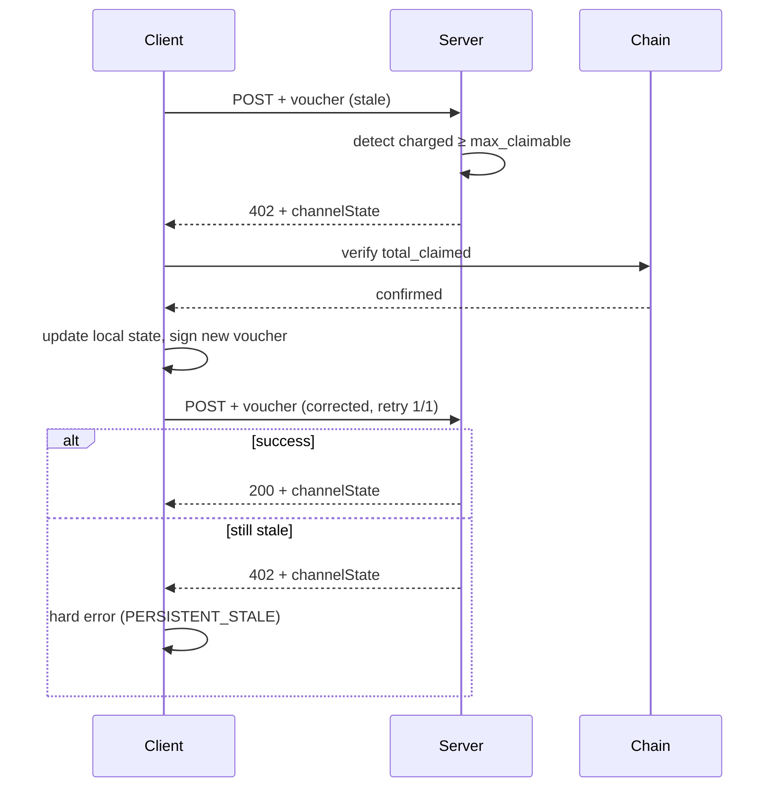

The `batch-settlement` scheme uses cumulative vouchers for repeated paid requests on a single channel. When two clients (or two in-flight retries) sign vouchers against the same channel state, one of them can arrive at the server with a `max_claimable_amount` that is already below the server's tracked cumulative. The server cannot accept that voucher — but the client also cannot recover without an authoritative state snapshot.

This document specifies the **corrective-402 recovery contract** that closes this gap, and links to the [reference vectors](./batch-settlement-recovery-vectors/v0/) any x402 SDK can implement against.

## When recovery is needed

A `corrective 402` is returned when the server's `charged_cumulative_amount` for the channel meets or exceeds the `max_claimable_amount` of the voucher in the incoming request:

```
server.charged_cumulative_amount > voucher.max_claimable_amount   →   accept
server.charged_cumulative_amount ≥ voucher.max_claimable_amount   →   corrective 402
```

This happens in three operationally distinct (but wire-identical) situations:

1. **Stale state (happy path)** — the client's local cumulative is behind the server's, for example because a previous response was lost, the client restarted from disk without re-syncing, or the channel was just opened and the client did not see prior charges.
2. **CAS conflict** — two concurrent requests on the same channel both signed against the same prior cumulative; one arrived first and bumped the server, the other is now stale.
3. **Persistent server-side drift (pathological)** — the server keeps bumping its cumulative between retries; the client cannot converge. This may be genuine concurrent traffic, a server-side bug, or an adversarial server.

Cases (1) and (2) are recoverable by a single retry. Case (3) is what the loop guard prevents.

## Invariant

After recovery, the channel must satisfy:

```
onchain.total_claimed   ≤   server.charged_cumulative_amount   ≤   voucher.max_claimable_amount
```

The middle term is monotone non-decreasing per channel; the left term lags it by at most one batched `claim()` transaction. The client trusts the server's `charged_cumulative_amount` **only after** verifying `total_claimed` against the onchain `BatchSettlement.channels(channel_id)` call — the trust-but-verify split that lets the client safely retry without re-reading the chain on every request.

## Wire shape of the corrective response

A corrective 402 carries the authoritative server state in `extra.channelState`:

```json
{
  "channelState": {
    "channel_id": "0x...",
    "balance": "<escrow balance>",
    "total_claimed": "<onchain total_claimed>",
    "charged_cumulative_amount": "<server cumulative, may exceed total_claimed>"
  }
}
```

This is the same `ChannelStateExtra` shape used by successful responses; only the HTTP status (402 vs 200) distinguishes them at the transport layer. The client uses this snapshot to:

1. **Verify** `total_claimed` against onchain `BatchSettlement.channels(channel_id)` (trust-but-verify)
2. **Replace** its local cumulative with `charged_cumulative_amount`
3. **Sign** a new voucher with `max_claimable_amount = charged_cumulative_amount + request_charge`
4. **Retry exactly once**

If the retry also receives a corrective 402, the client must surface a hard error (`PERSISTENT_STALE`) and not retry further. See [`loop-guard.json`](./batch-settlement-recovery-vectors/v0/loop-guard.json).

## Recovery flow



## Why retry is exactly once

A second corrective 402 means one of three things, none of which a client retry can fix:

- **Client-side bug** — the voucher reconstruction after the first recovery is producing the wrong `max_claimable_amount`.
- **Server-side persistent drift** — the server's `charged_cumulative_amount` keeps advancing between retries due to concurrent traffic or a server bug.
- **Adversarial server** — a malicious server can keep returning different `charged_cumulative_amount` values to force the client into a retry loop and deny the client's ability to complete any paid request. (The server cannot extract money — the client verifies `total_claimed` against onchain — but it can deny service.)

The loop guard caps client resource burn, surfaces the failure for human or operational diagnosis, and removes the denial-of-service surface.

## Telemetry

Implementations should emit a distinguishable label for each recovery type even though the wire shape is identical:

| Label | Trigger | Operational meaning |
| --- | --- | --- |
| `recovery.stale_state` | First corrective 402, client local cumulative was behind | Unexpected drift; investigate if frequent on a single channel |
| `recovery.cas_conflict` | First corrective 402, client had an up-to-date view but lost a concurrent race | Normal contention; expected at high request rates |
| `recovery.persistent_stale` | Second corrective 402 on the same logical request | Bug or attack; alert on the dashboard, do not retry |

The first two are recoverable by the standard single-retry flow; the third triggers the loop guard and surfaces a hard error.

## Reference vectors

Three machine-readable JSON vectors under [`batch-settlement-recovery-vectors/v0/`](./batch-settlement-recovery-vectors/v0/) pin the wire shape and expected client behaviour for each scenario:

- [`happy-path.json`](./batch-settlement-recovery-vectors/v0/happy-path.json) — stale local cumulative, single retry succeeds
- [`loop-guard.json`](./batch-settlement-recovery-vectors/v0/loop-guard.json) — retry also corrective, hard error
- [`cas-conflict.json`](./batch-settlement-recovery-vectors/v0/cas-conflict.json) — concurrent same-channel requests, one wins, the other recovers

SDKs implementing the `batch-settlement` scheme should add an integration test that walks each vector's `steps` array and asserts the `expected_client_behaviour`.

## Refs

- [`batch-settlement` scheme](./batch-settlement.mdx) — base scheme this recovery contract extends
- [#2061](https://github.com/x402-foundation/x402/pull/2061) — original TS implementation thread where the corrective-402 contract was proposed by @phdargen, with discussion of recovery semantics from @jithinraj and @Bortlesboat
- Byte-equivalence fixtures for the EIP-712 signing layer that this recovery contract sits above: `python/x402/tests/fixtures/batch-settlement-byte-equivalence/v0/`
