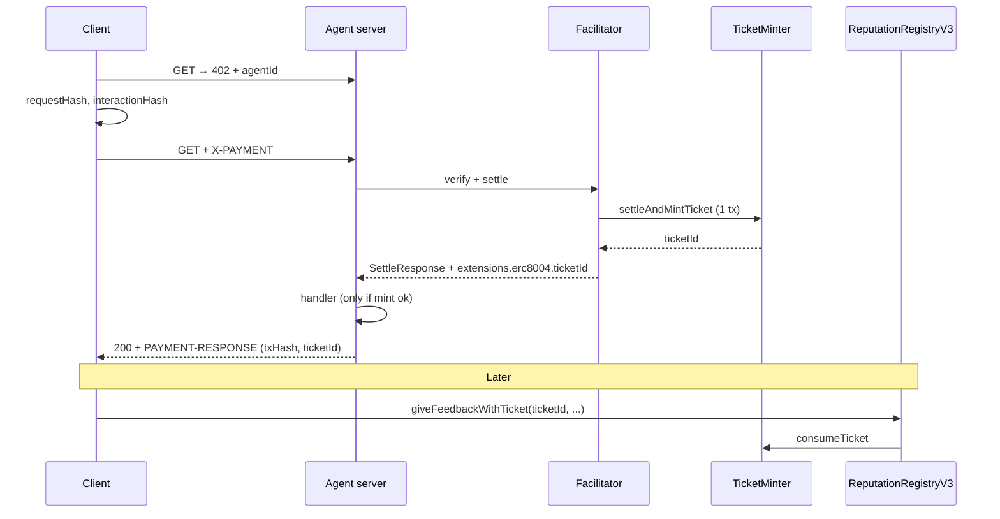

# ERC-8004 ticket — execution handoff (for implementing agents)

**Branch:** `feat/erc8004-extension`  
**Design spec:** [`erc8004_ticket.md`](./erc8004_ticket.md)  
**Flow diagram:** [`python/x402/extensions/erc8004/x402-erc8004-ticket-flow.html`](../../python/x402/extensions/erc8004/x402-erc8004-ticket-flow.html)  
**Gateway-less baseline:** `python/x402/extensions/erc8004/` (artifact, client, server — do not break without ticket mode flag)

---

## What is already done (Phase 1 — merged in branch, verify with tests)

### Solidity (`contracts/evm/src/erc8004/`)

| Contract | Purpose |
|----------|---------|
| `TicketMinter.sol` | `settleAndMintTicket` — ERC-20 `transferFrom` + mint ticket (Phase 1 settlement only) |
| `ReputationRegistryV3.sol` | `giveFeedbackWithTicket`, `giveFeedbackWithTicketFor` (EIP-712), `disputeFeedback`; `giveFeedback` reverts |
| `interfaces/ITicketMinter.sol` | Ticket struct **without** `settlementTxHash` |
| `interfaces/IIdentityRegistry.sol` | `ownerOf`, `isAuthorizedOrOwner` |

**Ticket lifecycle:** `NONE` → `MINTED` → `CONSUMED` (no finalize tx).

**Ticket fields:** `payer`, `agentId`, `requestHash`, `interactionHash`, `endpoint`, `status`.

**Dedup:** consume-once per `ticketId` + `(agentId, payer, feedbackHash)`.

**Recovery (no on-chain txHash → ticketId map):**

1. `PAYMENT-RESPONSE.extensions.erc8004.ticketId` (preferred)
2. Standard x402 `PAYMENT-RESPONSE.transaction` → receipt → `TicketMinted` event → `ticketId`

### Tests

```bash
cd contracts/evm
FOUNDRY_PROFILE=erc8004 forge test --match-path "test/erc8004/*"
```

`foundry.toml` has `[profile.erc8004]` with `via_ir = true` (registry stack depth).

### Docs committed

- `specs/extensions/erc8004_ticket.md` — locked decisions
- HTML flow diagram updated (hash table, no anchor tx)

---

## Architecture (end state)



**Actors**

- **Client:** binds hashes pre-pay; recovers `ticketId`; submits feedback (or signs `FeedbackIntent` for sponsor).
- **Agent server:** declares `agentId`; gates handler on successful mint; enriches `PAYMENT-RESPONSE` with `ticketId`; optional `X-X402-Interaction-Receipt` (digest uses **ticketId**, not tx hash — see Phase 4).
- **Facilitator:** routes settle to `TicketMinter` instead of plain transfer; pays mint gas; optional feedback relay via `giveFeedbackWithTicketFor`.

---

## Hash spec (must match `artifact.py` helpers)

| Field | Definition |
|-------|------------|
| `requestHash` | `keccak256(canonical_json(requestDigests))` |
| `interactionHash` | `keccak256(canonical_json({version, settlement*, request, response}))` — **settlement omits txHash** at bind time |
| `feedbackHash` | `keccak256(canonical_json(fullArtifact))` at feedback time |
| Agent receipt digest | `keccak256("x402-erc8004-receipt" ‖ chainId ‖ ticketId ‖ interactionHash)` — **change from current `tx_hash` in `artifact.py`** |

Implement `ticket_hashes.py` (Phase 4) wrapping existing `canonical_bytes`, `compute_interaction_hash`, etc.

---

## Phase 2 — Facilitator + deploy (execute next)

### 2.1 Deploy scripts

Create `contracts/evm/script/DeployERC8004Ticket.s.sol`:

- Deploy `TicketMinter(owner)`
- Deploy `ReputationRegistryV3(identityRegistry, ticketMinter)` — use existing IdentityRegistry address from env or mock for Anvil
- `minter.setFacilitator(facilitator, true)`
- `minter.setReputationRegistry(registry)`
- Log addresses to stdout / JSON for examples

### 2.2 Settlement inside minter

Replace Phase 1 `transferFrom`-only path with scheme routing:

- EIP-3009: `transferWithAuthorization` (mirror `python/x402/mechanisms/evm/exact/facilitator.py`)
- Permit2: mirror `settle_permit2` in `permit2_utils.py`
- Keep a single external entry: `settleAndMintTicket(payer, agentId, requestHash, interactionHash, endpoint, SettlePayment, bytes paymentCalldata)` if needed — **stored ticket fields stay the five logical args**; payment data is calldata only.

Reference: `contracts/evm/src/x402ExactPermit2Proxy.sol`, `ExactEvmScheme.settle`.

### 2.3 Python facilitator extension

New file: `python/x402/extensions/erc8004/facilitator.py`

- Register `ERC8004TicketFacilitatorExtension` on `x402Facilitator` (pattern: `erc20_approval_gas_sponsoring/types.py`)
- When `PaymentRequirements.extensions.erc8004` includes `ticketMinter` address:
  - After verify, call minter `settleAndMintTicket` instead of default token transfer
  - Return `SettleResponse` with `extensions.erc8004.ticketId` from return value / `TicketMinted` log

Hook point: `ExactEvmScheme.settle` or facilitator wrapper — read how `Erc20ApprovalFacilitatorExtension` intercepts in `permit2_utils.py` (`resolve_extension_signer`).

### 2.4 Constants

`python/x402/extensions/erc8004/constants.py` — add `TICKET_MINTER_ABI`, deployment addresses per chain (Anvil first).

### 2.5 Verification

- Foundry fork test optional
- Manual: deploy to Anvil, call settle via cast, read `tickets(1)`

**Phase 2 done when:** facilitator mints ticket on Anvil; `SettleResponse.extensions.erc8004.ticketId` populated.

---

## Phase 3 — Agent server

### 3.1 Mint gate

In resource server settle path (`python/x402/server_base.py` settle flow):

- After facilitator settle, require `settle_response.extensions.erc8004.ticketId` (or parse receipt)
- If missing / mint failed → do **not** run paid handler (402 or 500 per convention)

### 3.2 Enrich PAYMENT-RESPONSE

`enrich_settlement_response` in `python/x402/extensions/erc8004/server.py`:

- Include `ticketId` under `extensions.erc8004`

### 3.3 Interaction receipt

Update `create_interaction_receipt` in `server.py` to sign digest with **ticketId** (uint256 → 32-byte big-endian) once Phase 4 updates `receipt_digest`.

### 3.4 Wire settle routing into `ExactEvmScheme`

The Phase 2 facilitator extension (`ERC8004TicketFacilitatorExtension`,
`settle_via_ticket_minter`) is dead code until the scheme settle path looks it
up. Mirror the `Erc20ApprovalFacilitatorExtension` interception pattern in
`permit2_utils.py::settle_permit2`.

Hook point: top of `ExactEvmScheme.settle()` in
`python/x402/mechanisms/evm/exact/facilitator.py`, **before** the existing
`is_permit2_payload` branch.

Three guards — if all hold, route to TicketMinter; otherwise fall through to
the existing transfer/proxy path so non-erc8004 traffic is untouched:

1. `context.get_extension(EXTENSION_KEY)` returns an `ERC8004TicketFacilitatorExtension`
2. `ext.resolve_minter(str(requirements.network))` returns a non-None address
3. `extract_ticket_bind(payload)` returns a `TicketBind` (client populated the
   bind fields in `payload.extensions.erc8004`)

When routed, the call lands at `TicketMinter.settleAndMintTicketEIP3009` /
`settleAndMintTicketPermit2`. Settlement and mint share one tx; the
`TicketMinted` log on the receipt yields `ticketId`, surfaced on
`SettleResponse.extensions.erc8004.ticketId` (Phase 2 work).

**Activation contract — what each side must do for the extension to fire:**

| Side | Must do | Without it |
|------|---------|------------|
| Resource server | `server.register_extension(create_erc8004_resource_server_extension(config))` | 402 never advertises `erc8004`; clients can't bind. The bind is mandatory once the extension is registered — payloads without bind are rejected (`giveFeedback` is on-chain disabled, so a ticketless payment can never produce feedback) |
| Client | `client.register_extension(ERC8004ClientExtension())` (Phase 4 populates bind) | `payload.extensions.erc8004` is empty → guard #3 fails |
| Facilitator | `facilitator.register_extension(ERC8004TicketFacilitatorExtension(minters={...}))` | `context.get_extension("erc8004") is None` → guard #1 fails |

If any side opts out the routing branch short-circuits and the original
transfer/proxy path runs — backwards compat preserved for callers that don't
want ticketed settlement.

**Phase 3 done when:** paid request returns `ticketId`; handler skipped if mint fails;
`ExactEvmScheme.settle()` routes through `TicketMinter` whenever the three guards hold.

---

## Phase 4 — Client SDK

### 4.1 `ticket_hashes.py`

- `compute_request_hash(request_digests: dict) -> bytes`
- `compute_ticket_bind(requirements, payment_payload, agent_id, endpoint, request_digests, response_digests?) -> TicketBind`
- Echo bind in `PaymentPayload.extensions.erc8004` for facilitator

### 4.2 Client extension

Extend `ERC8004ClientExtension.enrich_payment_payload` to include `requestHash`, `interactionHash`.

### 4.3 Feedback

- `submit_feedback_with_ticket(ticket_id, params)` → `giveFeedbackWithTicket`
- `build_feedback_intent` + `submit_feedback_sponsored` for Path B
- Recover `ticket_id_from_receipt(w3, tx_hash)` — parse `TicketMinted`

### 4.4 Receipt digest migration

In `artifact.py`:

```python
def receipt_digest(chain_id: int, ticket_id: int, interaction_hash: bytes) -> bytes:
    return keccak(RECEIPT_PREFIX + chain_id.to_bytes(32, "big") + ticket_id.to_bytes(32, "big") + interaction_hash)
```

Update `InteractionReceipt` model if needed (optional `ticket_id` field vs keep `tx_hash` for artifact display only).

### 4.5 Tests

- `python/x402/tests/unit/extensions/erc8004/test_ticket_hashes.py`
- Update existing client tests

**Phase 4 done when:** unit tests pass; client can feedback with ticketId only.

---

## Phase 5 — Anvil e2e

Extend `examples/python/clients/erc8004/`:

- Deploy script or `run_on_fork.py` loads TicketMinter + RegistryV3 addresses
- Full flow: pay → mint → serve → feedback with ticket
- Optional: sponsored feedback path

Reference existing `main.py`, `utils.py`, `test_erc8004_e2e.py`.

**Phase 5 done when:** README documents ticket flow; one command runs green against Anvil.

---

## Files map (quick reference)

```
contracts/evm/src/erc8004/          # DONE Phase 1
contracts/evm/test/erc8004/         # DONE Phase 1
contracts/evm/script/              # TODO Phase 2 DeployERC8004Ticket.s.sol
python/x402/extensions/erc8004/
  artifact.py                       # UPDATE receipt_digest Phase 4
  client.py                         # UPDATE Phase 4
  server.py                         # UPDATE Phase 3
  facilitator.py                    # NEW Phase 2
  ticket_hashes.py                  # NEW Phase 4
  constants.py                      # UPDATE Phase 2
examples/python/clients/erc8004/    # UPDATE Phase 5
specs/extensions/erc8004_ticket.md
specs/extensions/erc8004_ticket_execution.md  # this file
```

---

## Explicit non-goals (do not implement unless asked)

- `settlementTxHash` on ticket struct
- `anchorSettlementTxHash` / second tx for hash
- `ticketIdByTxHash` on-chain mapping
- `finalizeTicket` / FINALIZED state
- IPFS required for feedback
- Upstream PR to `erc-8004-contracts` (separate effort)

---

## Commands cheat sheet

```bash
# Contracts
cd contracts/evm && FOUNDRY_PROFILE=erc8004 forge test --match-path "test/erc8004/*"
cd contracts/evm && FOUNDRY_PROFILE=erc8004 forge build

# Python (from python/x402)
uv run pytest tests/unit/extensions/erc8004/ -q
uv run pytest tests/integration/test_erc8004_e2e.py -q  # after Phase 5

# Anvil
anvil &
```

---

## Approval workflow

Human asked for **phase-by-phase approval**. After each phase:

1. Run verification commands above
2. Summarize diff
3. Wait for "approve phase N" before starting N+1

Phase 1 is complete on branch; start at **Phase 2** unless told otherwise.
