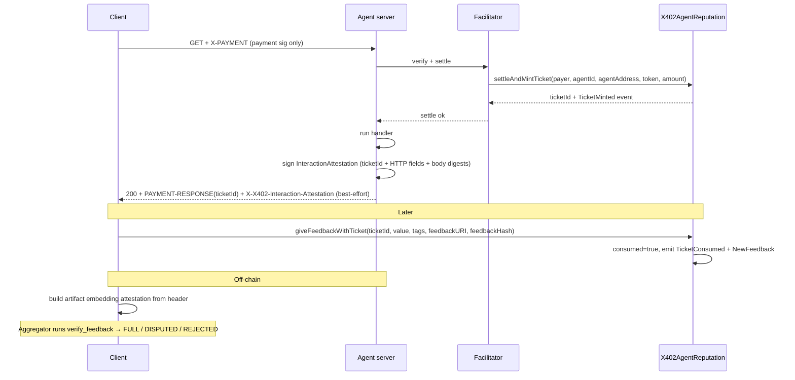
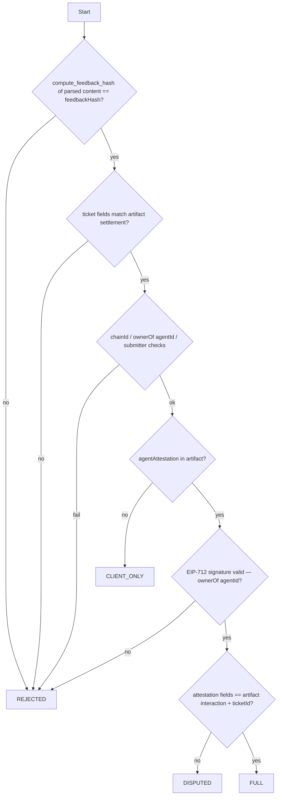

# x402 × ERC-8004 — Ticket wrapper v2 (design spec)

Date: 2026-06-05  
Status: **Draft — for review before implementation**  
Supersedes (partially): [`erc8004_ticket.md`](./erc8004_ticket.md) (Phases 1–5 / `TicketMinter` + `ReputationRegistryV3` split)  
Diagram: update `python/x402/extensions/erc8004/x402-erc8004-ticket-flow.html` after approval

---

## Summary

**Scope:** redesign of the smart contracts, the x402 Python parts (client, agent server, facilitator), and an e2e test — see [Implementation phases](#implementation-phases-after-approval).

Redesign the on-chain ticket layer as a **single wrapper contract** with **plain stored fields**, **minimal on-chain feedback checks**, and a clean trust split:

- **Ticket (on-chain) = payment proof.** Minted atomically with settlement from fields the facilitator already knows. **No request context at mint.**
- **`InteractionAttestation` (off-chain, EIP-712) = job binding.** Agent-signed HTTP fields + body digests, anchored to the ticket by `ticketId`, verified by aggregators.

Team feedback captured (2026-06-05): no hashes on ticket storage — plain values and rich events for indexers; store `agentAddress` (payment recipient at mint); no `endpoint` on the ticket; `consumed` bool, not a status enum; one wrapper contract; nothing the server/facilitator can compute is supplied by the client.

---

## Problem (unchanged)

`ReputationRegistry.giveFeedback` is permissionless: replay, no payment proof, no composable job binding. v1 added ticket-gated feedback but introduced weaknesses:

| v1 issue | Why it matters |
|----------|----------------|
| Client supplies `requestHash` / `interactionHash` at mint | Untrusted party can lie; facilitator forwards blindly |
| Hashes stored on ticket | Opaque on-chain; colleague preference for plain values + events |
| v1 `interactionHash` rollup at mint/feedback | Opaque bytes32; placeholder at mint did not bind real response; replaced by plain-field attestation |
| Two contracts (`TicketMinter` + `ReputationRegistryV3`) | Two addresses to deploy/approve; harder ops |
| `endpoint` on ticket | Not required for minimal on-chain gate |
| v1 disabled upstream `giveFeedback` | Blocks direct (non-ticket) feedback on canonical registry |

v2 fixes the **trust boundary** and **storage shape** while keeping what worked: atomic settle+mint, consume-once per ticket, payer attribution, sponsored feedback path.

---

## Locked decisions

This table is the **single source of truth** — later sections give mechanics and cross-reference it rather than restating decisions.

| Topic | Decision |
|-------|----------|
| HTTP | 1-step x402 — same URL: 402 → sign → retry `X-PAYMENT` (unchanged) |
| Contract shape | **Single wrapper** `X402AgentReputation` — settle + mint + ticket-gated feedback + dispute. **Does not replace** upstream `ReputationRegistry`. |
| Payment proof | Mint only if token settlement succeeds in **same tx** (unchanged) |
| Ticket storage (on-chain) | `payer`, `agentId`, `agentAddress`, `token`, `amount`, `consumed` — lifecycle indicator is a **`consumed` bool** (locked; no status enum) |
| Not stored on ticket | `endpoint`, `requestHash`, `interactionHash`, `settlementTxHash`, body digests |
| Mint inputs | **Payment fields only** — the facilitator already knows all of them from the verified settlement. **No request bind at mint**; job binding lives in the attestation. |
| `agentAddress` | **`payTo` at mint time** — the address that received funds in the settle tx. **Server-declared**; no on-chain `ownerOf(agentId)` match — aggregators downgrade if it mismatches the registry. |
| Direct feedback (no ticket) | **Open** on upstream `ReputationRegistry.giveFeedback` — wrapper does not disable or revert it |
| Ticket-gated feedback | Wrapper `giveFeedbackWithTicket` only; wrapper has **no** legacy `giveFeedback` entrypoint |
| Client at pay time | Signs x402 payment authorization **only** (no ticket bind in client payload) |
| Lifecycle | Mint → feedback sets `consumed = true`. Indexers also use `TicketMinted` / `TicketConsumed` events |
| Feedback events | `NewFeedback` / `FeedbackDisputed` keep the **canonical upstream ERC-8004 signatures verbatim** — no added fields; ticket → feedback linkage via wrapper-native `TicketConsumed` (same tx) |
| Agent attestation | **`InteractionAttestation`** (EIP-712) — attached to every paid 200, **best-effort**: if signing fails, the 200 is returned *without* the header (never a 500, never blocks x402) and the record caps at `CLIENT_ONLY`. **Scope: `ticketId` + `chainId` + HTTP fields + body digests.** Payment fields are *not* repeated in the attestation — `ticketId` resolves them from the on-chain ticket. |
| EIP-712 domain | `("X402AgentReputation", "1")`, `verifyingContract` = **wrapper address** — shared by `InteractionAttestation` and `FeedbackIntent` |
| Dispute | **Minimal:** `disputeFeedback(agentId, clientAddress, feedbackIndex)` — agent owner/operator only; sets `isDisputed`; no evidence requirement, no on-chain resolution |
| On-chain feedback checks | **Minimal** — see [Feedback gate (minimal)](#feedback-gate-minimal) |
| Body digests | `keccak256(raw_body_bytes)` for request and response — **only** content-level hash in v2 |
| Dedup | One feedback per **ticketId** (consume-once) + per `(agentId, payer, feedbackHash)` |
| Attribution | Client submits feedback; `msg.sender == payer` (or sponsored EIP-712 intent) |
| Feedback gas | **Path A:** client-paid. **Path B:** facilitator-sponsored via EIP-712 `FeedbackIntent` |
| `verify_feedback` strictness | Missing attestation → **`CLIENT_ONLY`** (payment proven, content unverified) — a record is never rejected solely for a missing attestation |
| Legacy receipt header | `X-X402-Interaction-Receipt` is **dead** — not emitted, **not accepted** (a v1 receipt cannot validate as a v2 attestation, so accepting it has no value) |
| IPFS | Not required; optional `feedbackURI` |
| Upstream ERC-8004 | **Out of scope** — wrapper-only deploy in x402 repo; separate upstream proposal later |

---

## Trust model



| Party | Trusted for | Not trusted for |
|-------|-------------|-----------------|
| Client | Payment signature; feedback opinion (`feedbackHash`, rating) | Mint fields; claiming a specific job without ticket + artifact |
| Agent server | `agentId`; `agentAddress` / payTo; `InteractionAttestation` on paid 200 (best-effort) | — |
| Facilitator | Submitting the settle tx with the payment fields it verified | Minting tickets unrelated to a verified settlement |
| Wrapper (on-chain) | Payment happened; ticket consume-once; payer match; dedup | Request/response content (off-chain) |
| Aggregator | `verify_feedback` trust tiers using receipt + artifact | — |

---

## Contract architecture: wrapper + upstream registry

v2 uses **two distinct on-chain surfaces**:

| Contract | Role | Feedback paths |
|----------|------|----------------|
| **Upstream `ReputationRegistry`** (canonical ERC-8004) | Permissionless reputation storage | **`giveFeedback(agentId, …)`** — direct submission, no ticket, no payment proof |
| **`X402AgentReputation` wrapper** | x402 settle + ticket + gated feedback | **`giveFeedbackWithTicket(ticketId, …)`** — requires unconsumed ticket; payment-backed |

The wrapper is a **new contract** — it does not proxy, upgrade, or disable the upstream registry. v1's mistake was making a standalone registry that reverted `giveFeedback`; v2 avoids that by keeping direct feedback on the existing contract.

References `IdentityRegistry` as immutable external (both contracts).

---

## Contract: `X402AgentReputation`

Single contract replacing v1's `TicketMinter` + `ReputationRegistryV3` pair (see [Contract architecture](#contract-architecture-wrapper--upstream-registry)).

### Ticket storage

```solidity
struct Ticket {
    address payer;
    uint256 agentId;
    address agentAddress;  // payTo at mint
    address token;
    uint256 amount;
    bool consumed;         // true after feedback
}
```

**Rationale**

- Plain fields are auditable and indexer-friendly.
- `agentAddress` is the economically meaningful recipient, not only `ownerOf(agentId)`.
- No `endpoint` — URL/context lives in the attestation and artifact.
- The feedback gate only reads `payer`, `agentId`, `consumed`, but `agentAddress` / `token` / `amount` stay in storage anyway: 2 extra slots is cheap and direct `tickets(id)` reads are friendlier for integrators than event lookups (see [Resolved questions](#resolved-questions)).

### Mint (facilitator-only)

Three settlement modes (carry forward from v1):

- `settleAndMintTicket` — ERC-20 `transferFrom`
- `settleAndMintTicketEIP3009` — EIP-3009 `transferWithAuthorization`
- `settleAndMintTicketPermit2` — Permit2 `permitWitnessTransferFrom`

**Common mint args (illustrative):**

```solidity
function settleAndMintTicket(
    address payer,
    uint256 agentId,
    address agentAddress,
    SettlePayment calldata payment    // token, payTo, amount — payTo must match agentAddress
) external onlyFacilitator returns (uint256 ticketId);
```

**Mint checks**

- `payer != 0`, `agentAddress != 0`, `token != 0`, `amount > 0`
- `payment.payTo == agentAddress`
- `identityRegistry.ownerOf(agentId)` exists (registered agent)
- No `payTo == ownerOf(agentId)` check — `agentAddress` is server-declared (see [Locked decisions](#locked-decisions)); registry mismatch is an aggregator downgrade, with event transparency

**Permit2 witness (v2)** binds plain payment + identity fields, **not** hashes:

```
TicketWitness(address payer, uint256 agentId, address agentAddress, address payTo, uint256 validAfter)
```

### Events (indexer contract)

`NewFeedback` and `FeedbackDisputed` keep the **canonical upstream ERC-8004 signatures verbatim** (copy from the canonical `ReputationRegistry` at implementation — v1's added `ticketId` field is dropped) so existing ERC-8004 indexers consume wrapper feedback without changes. Wrapper-specific data lives in the wrapper-native ticket events; ticket → feedback linkage comes from `TicketConsumed`, emitted in the **same tx** as `NewFeedback`.

```solidity
// Wrapper-native
event TicketMinted(
    uint256 indexed ticketId,
    address indexed payer,
    uint256 indexed agentId,
    address agentAddress,
    address token,
    uint256 amount
);

event TicketConsumed(
    uint256 indexed ticketId,
    address indexed payer,
    uint256 indexed agentId,
    uint64 feedbackIndex
);

// Canonical ERC-8004, verbatim — no added fields
event NewFeedback(
    uint256 indexed agentId,
    address indexed clientAddress,
    uint64 feedbackIndex,
    int128 value,
    uint8 valueDecimals,
    string indexed indexedTag1,
    string tag1,
    string tag2,
    string endpoint,
    string feedbackURI,
    bytes32 feedbackHash
);

event FeedbackDisputed(uint256 indexed agentId, address indexed clientAddress, uint64 indexed feedbackIndex);
```

Indexers join `ticketId` → `TicketMinted` → `TicketConsumed` → `NewFeedback` (same tx, keyed by `agentId` / `payer` / `feedbackIndex`) → off-chain artifact URI / `feedbackHash`.

### Feedback gate (minimal)

On-chain checks for `giveFeedbackWithTicket` and `giveFeedbackWithTicketFor`:

1. Ticket exists and `!consumed`
2. `ticket.payer == payer` (direct: `msg.sender`; sponsored: recovered from EIP-712)
3. Payer is not agent owner/operator for `ticket.agentId` (`SelfFeedbackNotAllowed`)
4. `(ticket.agentId, payer, feedbackHash)` not previously used
5. Value bounds (`valueDecimals <= 18`, `|value| <= MAX`)
6. Set `consumed = true` and emit `TicketConsumed`

**Explicitly not checked on-chain (wrapper)**

- Body digests, URL, method, response status
- `InteractionAttestation` presence or validity
- Artifact content beyond `feedbackHash` commitment

Those are aggregator responsibilities via `verify_feedback` — see [Off-chain verification (`verify_feedback`)](#off-chain-verification-verify_feedback).

### Feedback entrypoints (wrapper only)

The wrapper exposes **ticket-gated** entrypoints only. It has **no** `giveFeedback(agentId, …)` function — direct feedback stays on the upstream registry (see [Locked decisions](#locked-decisions)).

```solidity
function giveFeedbackWithTicket(
    uint256 ticketId,
    int128 value,
    uint8 valueDecimals,
    string calldata tag1,
    string calldata tag2,
    string calldata endpoint,   // pass-through to canonical NewFeedback; not stored
    string calldata feedbackURI,
    bytes32 feedbackHash
) external;

function giveFeedbackWithTicketFor(
    FeedbackSubmission calldata submission,
    uint256 nonce,
    uint256 deadline,
    bytes calldata signature
) external;
```

**EIP-712 `FeedbackIntent` (v2)** — remove `interactionHash`:

```
FeedbackIntent(
    uint256 ticketId,
    int128 value,
    uint8 valueDecimals,
    bytes32 tag1Hash,
    bytes32 tag2Hash,
    bytes32 endpointHash,
    bytes32 feedbackURIHash,
    bytes32 feedbackHash,
    uint256 nonce,
    uint256 deadline
)
```

Domain: `EIP712("X402AgentReputation", "1")`, `verifyingContract` = wrapper address (see [Locked decisions](#locked-decisions)).

### Dispute

**Minimal, locked** (carried verbatim from v1):

- `disputeFeedback(agentId, clientAddress, feedbackIndex)` — agent owner/operator only; sets `isDisputed`
- No evidence requirement, no on-chain resolution workflow in v2
- Aggregators treat `isDisputed` as downgrade signal (align with `TrustTier.DISPUTED` off-chain)

---

## InteractionAttestation

Replaces v1's `interactionHash` + `personal_sign` receipt: v1's single rollup hash was opaque and split across mint-time placeholders vs post-serve reality; v2 signs each field explicitly (EIP-712) so aggregators compare plain values. (EIP-712 still applies keccak internally when encoding strings — unavoidable for signatures; the **API surface** is plain.)

### Scope

The attestation binds the **HTTP interaction** to a **ticket**. It does **not** repeat payment fields (`payer`, `agentId`, `agentAddress`, `token`, `amount`) — `ticketId` + `chainId` already pin them via the on-chain ticket, which verifiers load anyway (step 2 of the pipeline). One canonical source per fact: **ticket = payment, attestation = interaction.**

### EIP-712 type

Domain:

```
name:    "X402AgentReputation"
version: "1"
chainId: <chain>
verifyingContract: <wrapper address>   // scopes the attestation to one deployment — ticketIds are only meaningful there
```

Primary type **`InteractionAttestation`**:

```
InteractionAttestation(
    uint256 ticketId,
    uint256 chainId,
    string method,
    string url,
    bytes32 requestBodyDigest,
    bytes32 responseBodyDigest,
    uint16 responseStatus
)
```

| Field | Source | Notes |
|-------|--------|-------|
| `ticketId` | Settle / `PAYMENT-RESPONSE` | Anchors attestation to the wrapper ticket — and via it: payer, agentId, agentAddress, token, amount |
| `chainId` | Network | Must match connected chain |
| `method` | Observed HTTP request | e.g. `GET` |
| `url` | Observed HTTP request | Full URL including path |
| `requestBodyDigest` | `keccak256(request_body)` | Strong request-body bind |
| `responseBodyDigest` | `keccak256(response_body)` | Strong response-body bind |
| `responseStatus` | HTTP status | e.g. `200` |

Signer: `IdentityRegistry.ownerOf(agentId)` (or authorized operator if extended later).

### Body digests

HTTP bodies are variable-length — storing or signing raw megabyte payloads is impractical. Content commitment uses one keccak per body:

```
requestBodyDigest  = keccak256(raw_request_body_bytes)   // empty body → keccak256("")
responseBodyDigest = keccak256(raw_response_body_bytes)
```

Python helper (new):

```python
def body_digest(raw: bytes) -> bytes:
    return keccak(raw)
```

These are the **only** content-level hashes in v2 attestation paths — no `requestHash`, no `interactionHash`. **Still used:** `feedbackHash = keccak256(canonical_json(fullArtifact))` for on-chain artifact commitment.

**Extension story:** header digests are out of scope for v2. Adding them later means a **new EIP-712 primary type** (e.g. `InteractionAttestationV2` with `requestHeaderDigest` / `responseHeaderDigest`) plus an **artifact version bump** — aggregators dispatch on the artifact `version` field, so old attestations stay verifiable.

### HTTP header

When the erc8004 extension is active, every **successful paid 200** carries (best-effort — see [Server enforcement](#server-enforcement)):

```
X-X402-Interaction-Attestation: <JSON InteractionAttestation>
```

The v1 header `X-X402-Interaction-Receipt` is neither emitted nor accepted (see [Locked decisions](#locked-decisions)).

### JSON wire format (header value)

```json
{
  "ticketId": "42",
  "chainId": 8453,
  "method": "GET",
  "url": "https://agent.example/v1/weather",
  "requestBodyDigest": "0x…",
  "responseBodyDigest": "0x…",
  "responseStatus": 200,
  "signature": "0x…"
}
```

The JSON fields mirror the EIP-712 message (excluding domain). Client embeds the object at `artifact.interaction.response.agentAttestation` (v2 path). v1 fields `agentSignature` / `interactionHash` are deprecated.

### Server enforcement

When erc8004 extension is registered:

1. After handler runs, server computes `requestBodyDigest` and `responseBodyDigest` from **raw bytes** received and served.
2. Server signs `InteractionAttestation` with agent owner key and attaches `X-X402-Interaction-Attestation`.
3. **If signing fails: log and return the 200 without the header.** The x402 payment flow is never disrupted — no 500, no blocking. The feedback record then simply caps at `CLIENT_ONLY` (unverified content) instead of `FULL`.

Implementation: replace `create_interaction_receipt()` with `create_interaction_attestation()` in `server.py`; signing helpers in `artifact.py`.

### Artifact alignment

The feedback artifact still carries full context for humans and aggregators:

```json
{
  "version": "x402-erc8004/2",
  "settlement": { "ticketId": 42, "payer": "0x…", "payTo": "0x…", "amount": "…", "asset": "0x…", … },
  "interaction": {
    "request": { "method": "GET", "url": "https://…", "bodyDigest": "0x…" },
    "response": { "status": 200, "bodyDigest": "0x…", "agentAttestation": { … } }
  },
  "feedback": { "agentId": 7, "value": 95, … }
}
```

`interaction.request.bodyDigest` **must equal** `requestBodyDigest` in the attestation; same for response. Payment fields (`payer`, `payTo`, `amount`, `asset`) live in `artifact.settlement` and are checked against the **on-chain ticket**, not the attestation.

**Why attach it:** without the attestation the response content is client-claimed and the record caps at `CLIENT_ONLY`; with it the agent co-signs URL, status, and both body digests → `FULL`. A missing attestation never blocks payment or feedback — the record is simply unverified.

### Deprecations (v1 → v2)

| v1 | v2 |
|----|-----|
| `compute_interaction_hash()` | Removed |
| `receipt_digest(chainId, ticketId, interactionHash)` | Removed |
| `InteractionReceipt` with `interactionHash` field | `InteractionAttestation` with plain fields |
| `personal_sign` over rollup digest | EIP-712 `sign_typed_data` |
| `X-X402-Interaction-Receipt` header | `X-X402-Interaction-Attestation` (legacy header not accepted) |

---

## Off-chain verification (`verify_feedback`)

Aggregators (indexers, reputation UIs, dispute tooling) call `verify_feedback` in `python/x402/extensions/erc8004/verify.py` to assign a **trust tier** to a feedback record. This is **not** an on-chain call — it runs off-chain with an RPC node and the artifact bytes.

### Inputs

| Input | Meaning |
|-------|---------|
| `w3` | Web3 connection to the chain |
| `identity_registry` | ERC-8004 IdentityRegistry address |
| `content` | Raw artifact bytes (e.g. from IPFS / `feedbackURI`) |
| `feedback_hash` | On-chain `feedbackHash` from `NewFeedback` event |
| `submitter` (optional) | On-chain feedback submitter; must match `settlement.payer` if provided |

### Pipeline (in order)



**Step 1 — Content integrity (single check)**

- Parse `content` → artifact; `compute_feedback_hash(artifact) == feedback_hash`

Since `feedbackHash = keccak256(canonical_json(artifact))`, re-canonicalizing the parsed artifact is the one rule — it accepts canonical bytes and rejects tampered content. (No separate raw-bytes `keccak(content)` check; it is subsumed.)

**Step 2 — Payment / ticket verification**

- Load wrapper `tickets(ticketId)` and confirm `payer`, `agentId`, `agentAddress`, `token`, `amount` match the artifact `settlement`
- Legacy fallback (`verify_settlement` via ERC-20 `Transfer` in settlement tx) applies **only** to records with no ticket (direct upstream feedback)

**Step 3 — Identity / payer checks**

- Chain ID matches connected chain
- `ownerOf(agentId)` equals attestation signer
- `submitter == payer` when provided

**Step 4 — InteractionAttestation**

- Read `artifact.interaction.response.agentAttestation`
- If **missing** → `CLIENT_ONLY` (payment proven via ticket; content client-claimed — e.g. server signing failed or client stripped the header)
- Recover signer from EIP-712 `InteractionAttestation` signature — must be `ownerOf(agentId)`
- **Field-by-field compare** attestation vs artifact:

| Attestation field | Must equal |
|-------------------|------------|
| `ticketId` | `settlement.ticketId` / on-chain ticket |
| `chainId` | Connected chain |
| `method` | `interaction.request.method` |
| `url` | `interaction.request.url` |
| `requestBodyDigest` | `interaction.request.bodyDigest` |
| `responseBodyDigest` | `interaction.response.bodyDigest` |
| `responseStatus` | `interaction.response.status` |

(Payment fields were already checked against the ticket in step 2 — the attestation does not carry them.)

- All match → **`FULL`**
- Signature valid but any field mismatch → **`DISPUTED`**
- On-chain `isDisputed` flag → downgrade to **`DISPUTED`**

### Trust tiers

| Tier | Meaning | Typical x402 ticket flow (v2) |
|------|---------|--------------------------------|
| `FULL` | Payment/ticket proven + agent attestation matches artifact | **Expected** |
| `CLIENT_ONLY` | Payment ok; no attestation | Direct upstream `giveFeedback`; ticket flows where the attestation is missing |
| `DISPUTED` | Attestation conflicts with artifact or on-chain dispute | Do not treat as verified |
| `REJECTED` | Failed integrity, payment, or bad signature | Do not index |

### v2 updates in `verify_feedback`

- Add `verify_interaction_attestation(attestation, artifact, ticket) -> bool`
- Remove `compute_interaction_hash` / `interactionHash` equality checks
- Missing attestation → `CLIENT_ONLY` for ticket-gated records (a present-but-invalid signature still → `REJECTED`; a field mismatch → `DISPUTED`)

---

## Python / x402 integration changes

### Agent server

- **Remove** mandatory client bind in `after_verify` (`extract_ticket_bind` gate).
- After handler: compute body digests, sign and attach **`X-X402-Interaction-Attestation`** — best-effort, never blocks the response (see [InteractionAttestation](#interactionattestation)).

### Facilitator

- Call wrapper `settleAndMintTicket*` with the payment fields from the verified settlement — no extra bind input.
- Return `ticketId` on `SettleResponse.extensions.erc8004.ticketId` (unchanged).

### Client

- Sign payment only; **remove** `compute_ticket_bind` / `echo_ticket_bind_in_payment_payload` from the pay path.
- At feedback: `giveFeedbackWithTicket(ticketId, …, feedbackHash)` — no hash args on wrapper.
- Embed `InteractionAttestation` from header (when present) into artifact at `interaction.response.agentAttestation` — without it the record caps at `CLIENT_ONLY`.

### Resource server extension activation

| Side | v2 requirement |
|------|----------------|
| Resource server | Extension registered; signs attestation post-handler |
| Client | Extension optional for feedback helpers; **not** required at pay time |
| Facilitator | Extension registered with wrapper address |

---

## Ticket recovery

Unchanged from v1:

1. **Preferred:** `PAYMENT-RESPONSE.extensions.erc8004.ticketId`
2. **Fallback:** settlement tx receipt → `TicketMinted` log → `ticketId`

---

## Migration from v1

| v1 | v2 |
|----|-----|
| `TicketMinter` + `ReputationRegistryV3` | `X402AgentReputation` wrapper + upstream `ReputationRegistry` |
| v1 registry reverts `giveFeedback` | Direct `giveFeedback` open on upstream registry |
| Ticket: hashes + endpoint + status enum | Ticket: plain payment fields + `consumed` bool |
| Client bind in payload | **No bind at mint** — job binding via attestation |
| v1 `interactionHash` + `InteractionReceipt` | **`InteractionAttestation`** (EIP-712 plain + body digests) |
| Optional interaction receipt header | `X-X402-Interaction-Attestation` on every paid 200 (best-effort; needed for `FULL` tier) |
| Permit2 witness with hashes | Plain-value witness |
| Deploy script wires two contracts | Deploy script: wrapper + facilitator allowlist; upstream registry address from env |

v1 contracts remain in repo until v2 is implemented and tested. The wrapper is a **new contract**, not an upgrade of upstream `ReputationRegistryUpgradeable`.

---

## Explicit non-goals

- Upstream PR to [erc-8004-contracts](https://github.com/erc-8004/erc-8004-contracts) in this effort
- Request context at mint (`requestDigests` or similar) — job binding is attestation-only
- `settlementTxHash` on ticket storage
- `ticketIdByTxHash` on-chain mapping
- `finalizeTicket` / second binding tx
- On-chain enforcement of rollup `interactionHash` or `endpoint`
- v1 `InteractionReceipt` / `compute_interaction_hash` in new code paths
- Full dispute arbitration workflow on-chain
- IPFS required for feedback

---

## Implementation phases (after approval)

| Phase | Scope |
|-------|--------|
| **1** | This spec approved; update flow diagram |
| **2** | Solidity: `X402AgentReputation` + Foundry tests |
| **3** | Python: `InteractionAttestation`, `body_digest`, facilitator mint path |
| **4** | Client feedback API + `verify_interaction_attestation`; deprecate `interactionHash` |
| **5** | Demo + fork e2e (`run_ticket_demo.py`) |
| **6** | Deprecate / remove v1 `TicketMinter` + `ReputationRegistryV3` paths |

---

## Resolved questions

Formerly open — resolved 2026-06-05:

1. **Contract name / EIP-712 domain** — **`X402AgentReputation`**. It names the purpose (x402 payment-backed agent reputation); `ERC8004TicketWrapper` names the mechanism. Domain: `("X402AgentReputation", "1")`.
2. **Dispute semantics** — **minimal**: `disputeFeedback(agentId, clientAddress, feedbackIndex)`, agent owner/operator only, sets `isDisputed`; aggregators downgrade to `DISPUTED`. No evidence requirement — anything richer is a follow-up spec.
3. **Attestation `verifyingContract`** — **wrapper address**. A `ticketId` is only meaningful relative to one wrapper deployment; binding the domain to that deployment prevents replaying an attestation against another deployment where the same `ticketId` exists with matching fields. The ecosystem must know the wrapper address anyway (clients submit feedback to it), so `address(0)`'s only benefit — config-free signing — is moot.
4. **Minimal ticket storage** — **keep the full struct**. The gate only reads `payer` / `agentId` / `consumed`, but 2 extra slots is cheap and direct `tickets(id)` reads are friendlier for integrators than `TicketMinted` log lookups.

---

## Review checklist

- [ ] Single wrapper contract acceptable for deploy/approve UX
- [ ] Upstream `ReputationRegistry.giveFeedback` remains open (wrapper does not revert it)
- [ ] Ticket storage fields sufficient (`payer`, `agentId`, `agentAddress`, `token`, `amount`, `consumed`)
- [ ] No request bind at mint confirmed (ticket = payment proof; attestation = job binding)
- [ ] `agentAddress` server-declared (no on-chain `ownerOf` match; aggregator downgrade) confirmed
- [ ] Minimal on-chain feedback gate confirmed
- [ ] **`InteractionAttestation`** scope (`ticketId` + `chainId` + HTTP fields + body digests, no payment fields) confirmed
- [ ] No rollup `interactionHash` in v2 paths
- [ ] Canonical `NewFeedback` / `FeedbackDisputed` signatures verbatim; ticket linkage via `TicketConsumed` confirmed
- [ ] `X-X402-Interaction-Attestation` best-effort on paid 200 (never blocks/500s the response; missing → `CLIENT_ONLY`) confirmed
- [ ] `verify_feedback` field-by-field attestation check understood
- [ ] Resolved questions accepted (name, dispute, `verifyingContract`, full ticket struct)

---

## References

- v1 spec: [`erc8004_ticket.md`](./erc8004_ticket.md)
- v1 execution log: [`erc8004_ticket_execution.md`](./erc8004_ticket_execution.md)
- Off-chain verification: `python/x402/extensions/erc8004/verify.py` (v2: attestation field checks)
- Artifact / attestation: `python/x402/extensions/erc8004/artifact.py` (v2: `body_digest`, `sign_interaction_attestation`)
