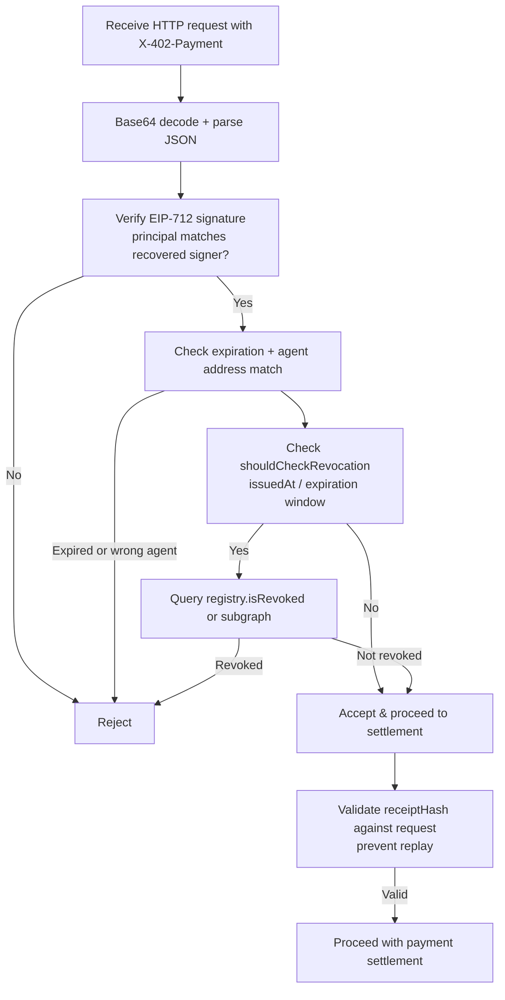

# x402 Agent Grant System

**Version:** 1.0  
**Status:** Draft  
**Date:** May 2026  
**Repository:** https://github.com/shawnhvac/x402-agent-network

## Abstract

The x402 Grant System provides a cryptographically secure, short-lived delegation mechanism for AI agents to spend on behalf of a principal using the [HTTP 402 Payment Required](https://developer.mozilla.org/en-US/docs/Web/HTTP/Status/402) pattern.

Grants are signed EIP-712 typed data structures that embed spend limits, scope, expiration, and revocation metadata. Receivers can verify grants **completely offline** in the happy path. A minimal on-chain revocation registry (checked only in the final 30 % of grant lifetime) gives principals an instant kill-switch without adding latency to normal requests.

This document is deliberately self-contained so any developer can implement full grant creation, verification, and revocation checking without depending on AgentPay or any hosted service.

---

## 1. Introduction & Motivation

AI agents need to make autonomous micropayments for tools, APIs, and other agents. Traditional OAuth-style tokens are too heavy and lack native on-chain settlement. x402 Grants combine:

- EIP-712 signatures for verifiable delegation
- Short-lived lifetimes (10–60 minutes default)
- Programmable spend policies (total budget + per-request cap + scopes)
- Optional on-chain revocation with minimal overhead
- Full compatibility with the base x402 payment header

The design prioritizes **simplicity for receivers** while giving principals strong controls.

---

## 2. Terminology

| Term | Definition |
|------|------------|
| **Principal** | The entity (user or organization) that owns the budget and signs grants. |
| **Agent** | The autonomous entity authorized to spend (the `msg.sender` in requests). |
| **Grant** | A signed EIP-712 structure authorizing spend. |
| **Grant ID** | Unique identifier per principal (ledger reference). |
| **Receipt Hash** | `keccak256` of the payment request body or a unique receipt identifier (prevents replay). |

---

## 3. EIP-712 Grant Schema

### 3.1 Domain Separator

```json
{
  "name": "x402-AgentGrant",
  "version": "1",
  "chainId": 8453,
  "verifyingContract": "0x0000000000000000000000000000000000000000"
}
```

### 3.2 Primary Type: `x402Grant`

```solidity
struct x402Grant {
    uint256 grantId;          // Unique per principal (ledger reference)
    address principal;        // Signer / budget owner
    address agent;            // Authorized spender
    uint256 issuedAt;         // Unix timestamp (seconds) — mandatory
    uint256 expiration;       // Unix timestamp (seconds)
    uint256 totalBudget;      // USDC subunits (6 decimals)
    uint256 perRequestCap;    // USDC subunits (0 = no per-request limit)
    bytes32[] scopes;         // keccak256("pay:domain.com/tool") etc.
    bytes32 salt;             // Anti-collision
}
```

### 3.3 Notes

- All fields are required.
- `issuedAt` enables precise lifetime calculations and anomaly detection.
- `scopes` are hashed for on-chain efficiency (example: `keccak256("pay:api.example.com/search")`).
- Default lifetime in AgentPay dashboard: **15 minutes**.

---

## 4. Revocation Registry (Minimal On-Chain Contract)

A single lightweight contract deployed on Base L2:

```solidity
// SPDX-License-Identifier: MIT
pragma solidity ^0.8.24;

contract x402GrantRegistry {
    mapping(address => mapping(uint256 => bool)) public revoked;

    event GrantRevoked(address indexed principal, uint256 indexed grantId);

    function revoke(uint256 grantId) external {
        revoked[msg.sender][grantId] = true;
        emit GrantRevoked(msg.sender, grantId);
    }

    function batchRevoke(uint256[] calldata grantIds) external {
        for (uint256 i = 0; i < grantIds.length; i++) {
            revoked[msg.sender][grantIds[i]] = true;
            emit GrantRevoked(msg.sender, grantIds[i]);
        }
    }

    function isRevoked(address principal, uint256 grantId) external view returns (bool) {
        return revoked[principal][grantId];
    }
}
```

> The `verifyingContract` field in the domain may optionally be set to this contract's address for stronger binding.

**Subgraph Integration:** The Graph on Base indexes the `GrantRevoked` event for fast off-chain queries — see `spec/subgraph.md` (forthcoming).

---

## 5. x402 HTTP Payment Header Format

```http
X-402-Payment: <base64-encoded JSON>
```

Decoded JSON structure:

```json
{
  "grant": {
    "grantId": "123456789",
    "principal": "0x...",
    "agent": "0x...",
    "issuedAt": 1747257600,
    "expiration": 1747258500,
    "totalBudget": "1000000000",
    "perRequestCap": "5000000",
    "scopes": ["0x...", "0x..."],
    "salt": "0x..."
  },
  "signature": "0x<65-byte EIP-712 signature>",
  "ledgerId": "agentpay-ledger-abc123",
  "receiptHash": "0x<keccak256(request body or unique receipt)>"
}
```

> `ledgerId` is optional. `receiptHash` is required for replay protection.

---

## 6. Validation Flow



---

## 7. Security Considerations

### 7.1 Clock Skew Grace Window

Implement a ±30-second grace window on both issuance and expiration checks:

```typescript
const now = Math.floor(Date.now() / 1000);
if (grant.expiration < now - 30 || grant.issuedAt > now + 30) return false;
```

### 7.2 30 % Lifetime Revocation Check Rule

Receivers **MUST** only query the revocation registry or subgraph when the grant is in its final 30 % of lifetime:

```typescript
const lifetime = Number(grant.expiration - grant.issuedAt);
const remaining = Number(grant.expiration - BigInt(now));
if (remaining < lifetime * 0.3) {
  // perform revocation check
}
```

This keeps the happy path **100 % offline** while still giving principals a near-instant kill-switch.

### 7.3 Replay Protection via `receiptHash`

The `receiptHash` field **MUST** be checked by the receiver against the current request body (or a unique per-request receipt). This prevents an attacker from replaying a previously valid payment header.

### 7.4 Sybil Resistance & Reputation

Pure on-chain payment volume is gameable. Reputation scoring (counterparty diversity, settlement success rate, time-decay weighting) is intentionally deferred to the separate subgraph layer and is not part of the grant verification protocol. Implementers may query reputation only after a grant passes cryptographic checks.

---

## 8. Reference Implementation (TypeScript – ethers v6)

```typescript
import { ethers } from "ethers";

const DOMAIN = {
  name: "x402-AgentGrant",
  version: "1",
  chainId: 8453,
  verifyingContract: "0x0000000000000000000000000000000000000000",
} as const;

const TYPES = {
  x402Grant: [
    { name: "grantId",       type: "uint256"   },
    { name: "principal",     type: "address"   },
    { name: "agent",         type: "address"   },
    { name: "issuedAt",      type: "uint256"   },
    { name: "expiration",    type: "uint256"   },
    { name: "totalBudget",   type: "uint256"   },
    { name: "perRequestCap", type: "uint256"   },
    { name: "scopes",        type: "bytes32[]" },
    { name: "salt",          type: "bytes32"   },
  ],
} as const;

export async function signGrant(
  signer: ethers.Signer,
  grant: any
): Promise<string> {
  return await signer.signTypedData(DOMAIN, TYPES, grant);
}

export function verifyGrant(
  grant: any,
  signature: string,
  currentAgent: string,
  now = Math.floor(Date.now() / 1000)
): boolean {
  // Expiration + clock skew check
  if (grant.expiration <= now + 30 || grant.issuedAt > now - 30) return false;
  // Agent must match
  if (grant.agent.toLowerCase() !== currentAgent.toLowerCase()) return false;

  const digest = ethers.TypedDataEncoder.hash(DOMAIN, TYPES, grant);
  const recovered = ethers.recoverAddress(digest, signature);
  return recovered.toLowerCase() === grant.principal.toLowerCase();
}

export function shouldCheckRevocation(
  grant: any,
  now = Math.floor(Date.now() / 1000)
): boolean {
  const lifetime  = Number(grant.expiration - grant.issuedAt);
  const remaining = Number(grant.expiration - BigInt(now));
  return remaining < lifetime * 0.3;
}
```

---

## 9. Conformance & Test Vectors

> TBD — will be published in `spec/test-vectors/grants.json` with full JSON test vectors and expected verification outcomes.

---

## Roadmap

| Spec | Status |
|------|--------|
| `spec/grants.md` (this document) | ✅ Draft v1.0 |
| `spec/payment-flow.md` | 🔜 Next |
| `spec/reputation.md` | 🔜 Planned |
| `spec/subgraph.md` | 🔜 Planned |
| `spec/test-vectors/` | 🔜 Planned |

---

*Built by [AgentPay](https://x402-agent-pay.com) — the OAuth of agent payments.*
