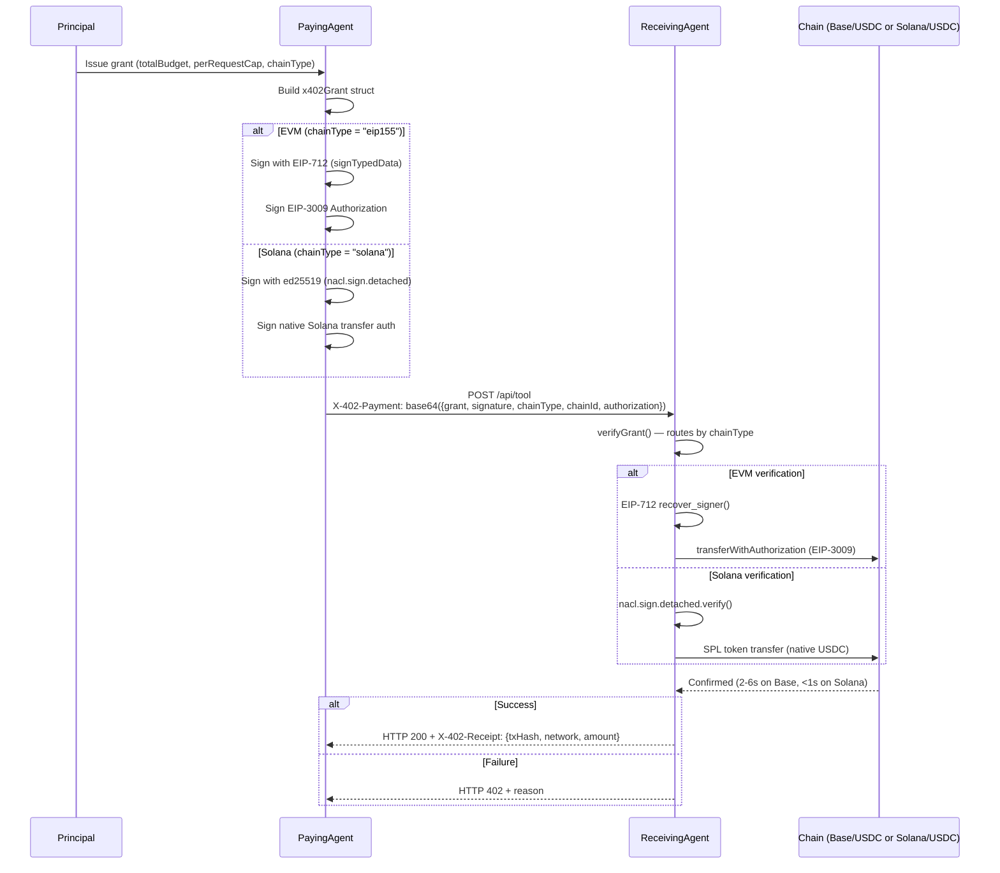

# x402 Payment Flow

**Version:** 1.1.0 (Solana Multi-Chain)
**Status:** Production

---

## Overview

The x402 payment lifecycle is identical for EVM and Solana — only the signing scheme and settlement mechanism differ. The `chainType` field in the grant determines which path is taken.

---

## Sequence Diagram



---

## Step-by-Step

### Step 1 — Principal Issues Grant

The human or orchestrating agent creates an `x402Grant` struct with:
- `totalBudget` — maximum lifetime spend
- `perRequestCap` — max per single call
- `expiration` — Unix timestamp
- `chainType` — `"eip155"` or `"solana"`
- `chainId` — `"8453"` for Base, `"solana-mainnet"` for Solana

### Step 2 — Paying Agent Signs

**EVM (chainType = "eip155"):**
```typescript
const sig = await signer.signTypedData(domain, types, grant);
// + EIP-3009 transferWithAuthorization signature
```

**Solana (chainType = "solana"):**
```typescript
const message = new TextEncoder().encode(JSON.stringify(grant, Object.keys(grant).sort()));
const sig = nacl.sign.detached(message, keypair.secretKey);
```

### Step 3 — Attach to Request

```
POST /api/service
X-402-Payment: <base64(JSON({ grant, signature, chainType, chainId, authorization }))>
Content-Type: application/json
```

### Step 4 — Receiver Verifies

Receiver calls `POST /x402/verify-grant` on the AgentPay facilitator (or runs verification locally). The facilitator routes by `chainType`:
- `eip155` → EIP-712 recover + EIP-3009 nonce check
- `solana` → ed25519 verify via PyNaCl

### Step 5 — Settlement

**EVM:** `transferWithAuthorization()` on the USDC contract (EIP-3009).
**Solana:** SPL token transfer to receiving wallet.

Both settle in a single atomic step — no pre-authorization, no escrow contract required.

### Step 6 — Receipt

On success, receiver returns:
```
HTTP 200
X-402-Receipt: {"txHash": "0x...", "network": "eip155:8453", "amount": 1000, "payer": "0x..."}
```

---

## Timing

| Chain | Confirmation | Finality |
|-------|-------------|---------|
| Base (L2) | 2–6s | ~1 min |
| Ethereum | 12–30s | ~3 min |
| Optimism | 2–6s | ~1 min |
| Arbitrum | 1–3s | ~1 min |
| Polygon | 2–5s | ~3 min |
| **Solana** | **< 1s** | **~1s** |

---

## Error Codes

| HTTP | Meaning |
|------|---------|
| 200 | Success — service delivered |
| 402 | Payment required or invalid grant |
| 401 | Signature verification failed |
| 400 | Malformed request |
| 500 | Settlement failed (on-chain error) |

---

## Live Facilitator

**Verify:** `POST https://www.x402-agent-pay.com/x402/verify-grant`
**Settle:** `POST https://www.x402-agent-pay.com/x402/settle`
**Networks:** `GET https://www.x402-agent-pay.com/x402/supported-networks`
**Conformance:** `GET https://www.x402-agent-pay.com/x402/conformance`

Full spec: https://github.com/shawnhvac/x402
