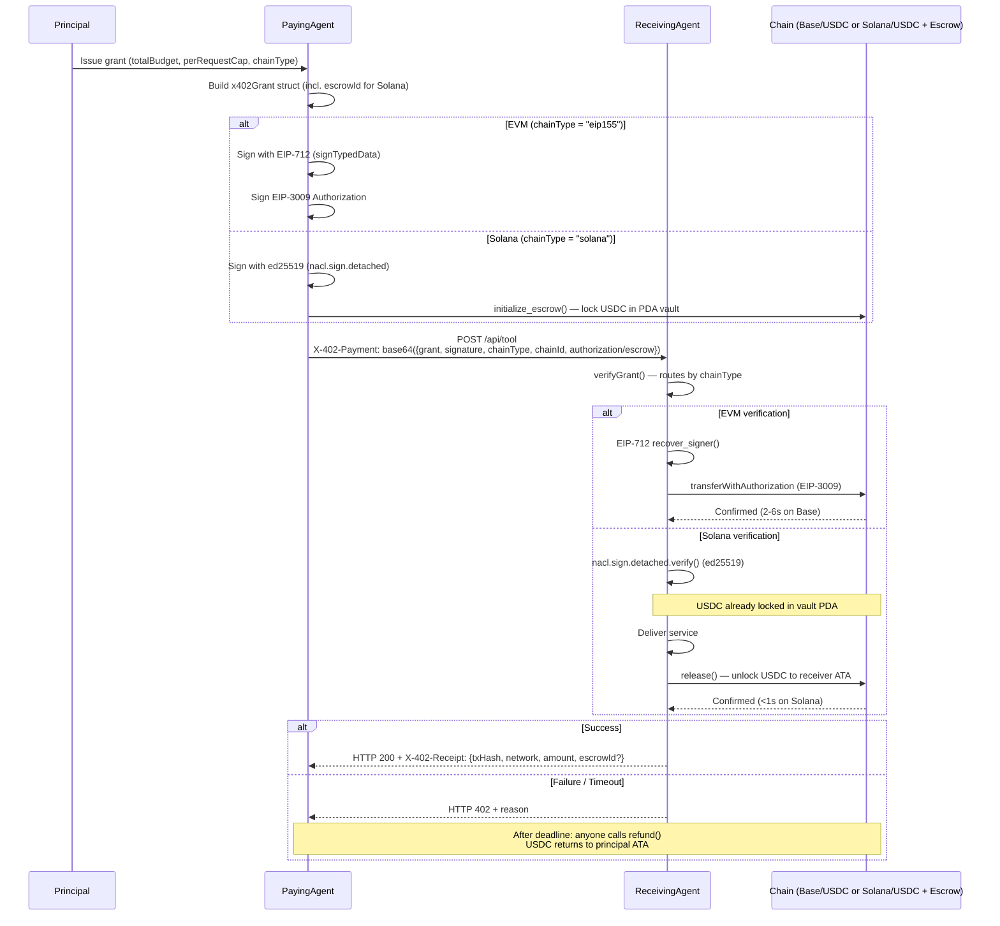
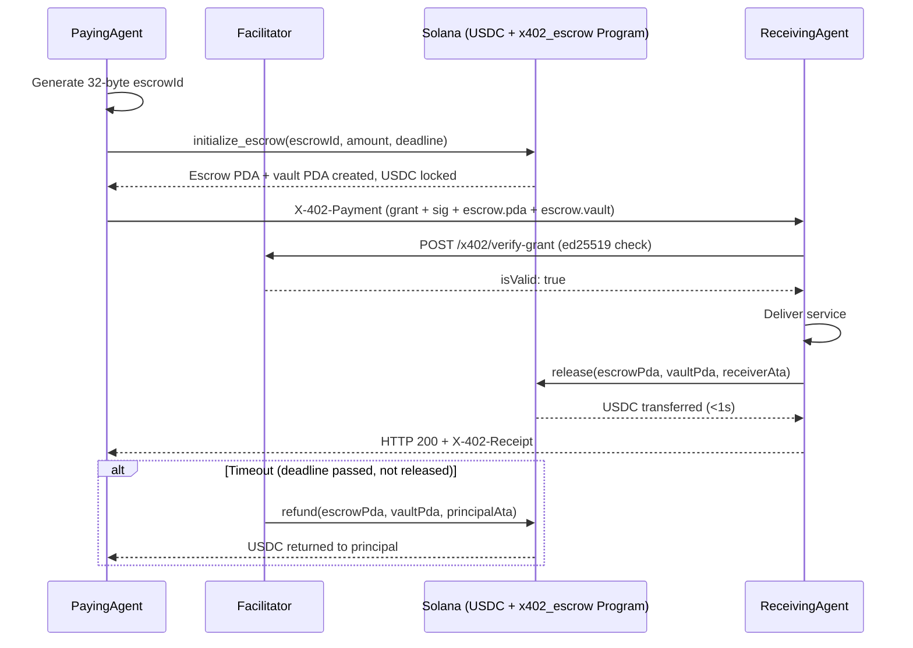

# x402 Payment Flow

**Version:** 1.2.0 (Solana Escrow)
**Status:** Production

---

## Overview

The x402 payment lifecycle is identical for EVM and Solana — only the signing scheme and settlement mechanism differ. The `chainType` field in the grant determines which path is taken. For Solana, an on-chain PDA escrow is used instead of EIP-3009 authorization.

---

## Sequence Diagram — Full Flow (EVM + Solana)



---

## Solana Escrow Detail

**Program ID (Devnet):** `CNwRWLCUL7jgk3xEgvMCeUFyt73LNEPtvucwxm3YqsFb`

**Network:** Solana Devnet → Mainnet after audit



---

## Step-by-Step (Solana Path)

### Step 1 — Principal Issues Grant

```typescript
const grant: X402SolanaGrant = {
  grantId:       "42",
  principal:     "6aCEuwH3PYx99cEmRz45otfxk39uF7ewGhqmvxfXisSG",
  agent:         "DRpbCBMxVnDK7maPM5tGv6MvB3v1sRMC86PZ8okm21hy",
  issuedAt:      Math.floor(Date.now() / 1000),
  expiration:    Math.floor(Date.now() / 1000) + 3600,
  totalBudget:   1_000_000,    // $1.00 USDC
  perRequestCap: 5_000,        // $0.005 USDC per call
  chainType:     "solana",
  chainId:       "solana-mainnet",
  escrowId:      crypto.randomBytes(32).toString("hex"),
};
```

### Step 2 — Lock USDC in PDA Vault

```typescript
import { initializeEscrow } from "../clients/solana-escrow-client";

const { escrowPda, vaultPda, txSignature } = await initializeEscrow(
  connection,
  principalKeypair,
  new PublicKey(grant.agent),
  grant.perRequestCap,
  grant.expiration,
  grant.escrowId
);
```

### Step 3 — Sign Grant + Build Header

```typescript
import { signSolanaGrant, buildSolanaPaymentHeader } from "../clients/solana-escrow-client";

const signature = signSolanaGrant(grant, principalKeypair);
const header    = buildSolanaPaymentHeader(grant, signature, escrowPda, vaultPda);
// → set X-402-Payment: <header> on all requests
```

### Step 4 — Receiver Verifies + Releases

```typescript
// On receiving agent:
const isValid = verifySolanaGrant(grant, signature, grant.principal);
if (!isValid) return res.status(401).json({ error: "invalid signature" });

// Deliver service...

// Release escrow:
await releaseEscrow(connection, receiverKeypair, escrowPda, vaultPda, receiverAta);
```

### Step 5 — Auto-Refund (Timeout)

The AgentPay facilitator spawns a watcher for every Solana escrow. After `grant.expiration + 5s`, if the escrow hasn't been released, `refund()` is called automatically — USDC returns to the principal.

---

## Timing

| Chain | Lock | Confirmation | Auto-Refund |
|-------|------|-------------|------------|
| Base (L2) | EIP-3009 auth | 2–6s | N/A (no lock) |
| Ethereum | EIP-3009 auth | 12–30s | N/A |
| Optimism | EIP-3009 auth | 2–6s | N/A |
| Arbitrum | EIP-3009 auth | 1–3s | N/A |
| Polygon | EIP-3009 auth | 2–5s | N/A |
| **Solana** | **PDA vault lock** | **< 1s** | **After deadline** |

---

## Error Codes

| HTTP | Meaning |
|------|---------|
| 200 | Success — service delivered |
| 402 | Payment required or invalid grant |
| 401 | Signature verification failed |
| 400 | Malformed request or missing escrowId |
| 500 | Settlement / escrow transaction failed |

---

## Live Facilitator

| Endpoint | Method | Purpose |
|----------|--------|---------|
| `/x402/verify-grant` | POST | Verify EIP-712 or ed25519 grant |
| `/x402/verify` | POST | Verify EIP-3009 payment payload |
| `/x402/settle` | POST | Settle EVM (EIP-3009) or Solana (SPL) |
| `/x402/supported-networks` | GET | All 6 chains with CAIP-2 IDs |
| `/x402/conformance` | GET | Run all 7 test vectors |
| `/x402/info` | GET | Facilitator metadata |

**Base URL:** `https://www.x402-agent-pay.com`
**Spec:** https://github.com/shawnhvac/x402
