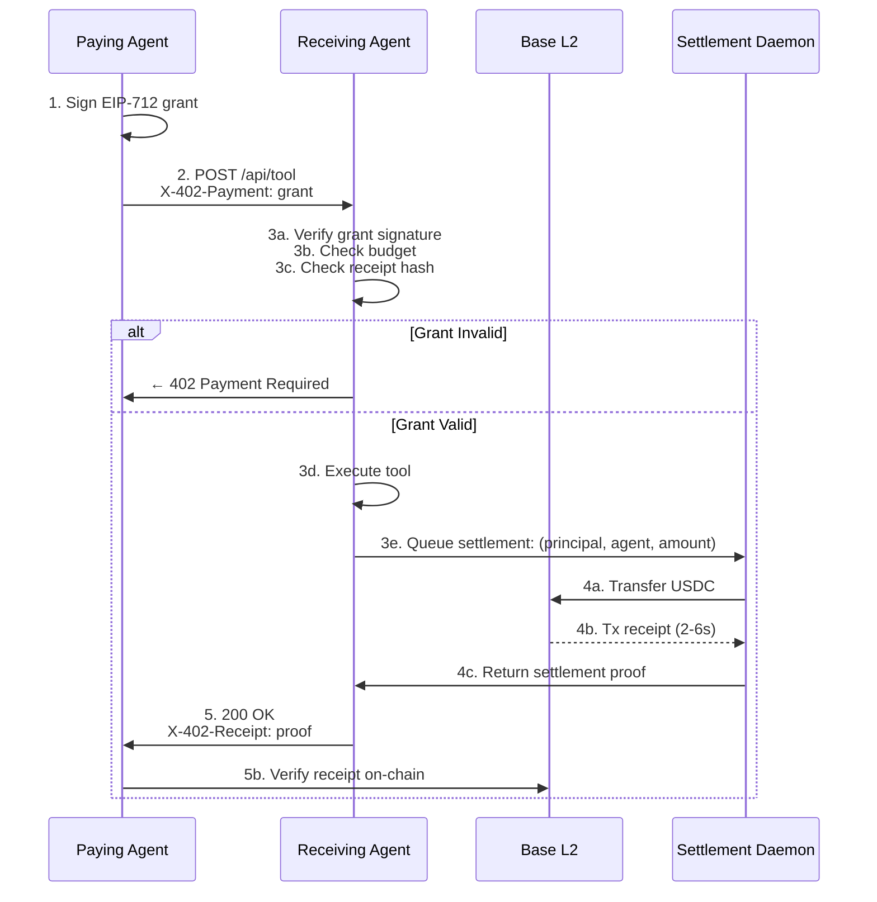

# x402 Payment Flow — Complete Lifecycle

**Status:** V1 Reference Implementation  
**Last Updated:** May 2026

## The Problem

Agent A wants to pay Agent B $5 USDC for a service (e.g., retrieving market data). How does B know A is authorized? How is the payment actually settled?

**Traditional approach:** B checks a centralized payment processor. Slow, requires custody, creates a single point of failure.

**x402 approach:** A signs a permission (a grant), B validates the signature, settlement is automatic on Base L2.

---

## The Flow (5 Steps)

### Step 1: Grant Creation

Agent A (the **principal**) creates a signed spend grant.

```typescript
const grant = {
  grantId: 1n,
  principal: "0xPrincipalAddress",     // A's wallet
  agent: "0xAgentBAddress",            // B's wallet (authorized to spend)
  issuedAt: BigInt(Math.floor(Date.now() / 1000)),
  expiration: BigInt(Math.floor(Date.now() / 1000) + 900), // 15 min
  totalBudget: BigInt(10_000_000),     // 10 USDC (6 decimals)
  perRequestCap: BigInt(5_000_000),    // 5 USDC per request
  scopes: [keccak256("market-data")],
  salt: ethers.id("unique-salt-123"),
};

const signature = await wallet.signTypedData(DOMAIN, TYPES, grant);
```

**Typical values:**
- `issuedAt`: Current time
- `expiration`: Current time + 15 minutes (900 seconds)
- `totalBudget`: $10–$100 USDC (depends on use case)
- `perRequestCap`: $1–$5 USDC
- `scopes`: Array of authorized tool namespaces

### Step 2: HTTP Request

Agent A sends a request to Agent B, including the grant in the `X-402-Payment` header.

```http
POST /api/tool HTTP/1.1
Host: agent-b.example.com
Content-Type: application/json
X-402-Payment: eyJncmFudCI6e...base64...}

{
  "tool": "market_data",
  "params": {"ticker": "AGWC"}
}
```

The `X-402-Payment` header contains (base64-encoded):
```json
{
  "grant": { /* full grant struct */ },
  "signature": "0x...",
  "receiptHash": "0x..."  // Hash of request body for replay protection
}
```

### Step 3: Verification & Execution

Agent B receives the request and **verifies the grant offline** (no network call needed).

```typescript
// Decode header
const header = JSON.parse(Buffer.from(req.headers['x-402-payment'], 'base64'));

// Verify grant signature
const isValid = verifyGrant(header.grant, header.signature, myAddress);
if (!isValid) {
  return res.status(402).json({ error: "Invalid grant" });
}

// Verify budget
if (header.grant.perRequestCap < toolCost) {
  return res.status(402).json({ error: "Insufficient grant budget" });
}

// Verify receipt hash matches request body
const bodyHash = ethers.id(JSON.stringify(req.body));
if (header.receiptHash !== bodyHash) {
  return res.status(402).json({ error: "Replay detected" });
}

// Execute the tool
const result = await executeTool(req.body.tool, req.body.params);
```

**Verification is instant** — no blockchain calls, just cryptographic validation.

### Step 4: Settlement (Automatic on Base L2)

The **settlement daemon** (running on AgentPay infrastructure or the receiving agent's server) monitors the payment automatically.

```typescript
// Settlement daemon logic (runs every 2 seconds)
async function settlePayment(principal, agent, amount, grantId) {
  // 1. Execute USDC transfer from principal's escrow to agent's wallet
  const tx = await usdcContract.transferFrom(principal, agent, amount);
  
  // 2. Wait for confirmation (typically 2–6 seconds on Base)
  const receipt = await tx.wait(1);
  
  // 3. Return receipt
  return {
    receiptId: ethers.id(tx.hash),
    grantId,
    amount,
    settledAt: receipt.blockTimestamp,
    txHash: tx.hash,
    status: "confirmed"
  };
}
```

**Timeline:**
- t=0: Request received
- t=0–0.1s: Grant verified
- t=0.1–0.2s: Tool executed
- t=0.2–2s: Settlement transaction submitted to Base L2
- t=2–6s: Block confirmation
- t=6+: Receipt returned to paying agent

### Step 5: Receipt & Proof

Agent B returns an `X-402-Receipt` header with settlement proof.

```http
HTTP/1.1 200 OK
Content-Type: application/json
X-402-Receipt: eyJyZWNlaXB0SWQiOi...base64...}

{
  "result": "AGWC: $0.42 | Change: +3.2%"
}
```

The receipt (base64-decoded) contains:
```json
{
  "receiptId": "0x...",
  "grantId": 1,
  "amount": "5000000",
  "settledAt": 1715784123,
  "txHash": "0x...",
  "status": "confirmed"
}
```

Agent A can verify the receipt:
- Check `txHash` on Base L2 explorer
- Confirm USDC actually left the principal's wallet
- Deduct from remaining grant budget

---

## Error Cases & Refunds

### Grant Expired or Invalid (402 Payment Required)
```
← HTTP 402 Payment Required
← X-402-Error: grant expired
← (No tool execution, no settlement)
```

Paying agent retries with a fresh grant.

### Grant Revoked (During Final 30%)
```
← HTTP 402 Payment Required
← X-402-Error: grant revoked
← (Tool may have executed; settlement is refused)
→ Settlement daemon triggers **automatic refund**
→ USDC returned to principal's escrow within 60 seconds
```

### Settlement Timeout (60 seconds)
```
↳ No receipt received after 60 seconds
↳ Settlement daemon auto-refunds the amount
↳ Grant budget remains unchanged
```

This prevents "stuck" payments — every transaction either settles or refunds.

---

## Revocation & 30% Rule

A principal can revoke a grant at any time on-chain. However, to avoid latency, receivers **only check the revocation registry during the final 30% of the grant's lifetime**.

**Example:**
- Grant issued at t=0, expires at t=900 (15 min)
- Revocation checks only happen when remaining time < 270 seconds

**Why?**
- First 70% of grant's life: no revocation check (instant verification)
- Final 30%: full revocation check (adds 1–2 network calls, but time is running out anyway)

This balances security (grants can still be revoked) with performance (99% of requests don't hit the blockchain).

---

## Mermaid Diagram



---

## Security Considerations

1. **Signature Verification** — Always verify the EIP-712 signature before executing tools
2. **Receipt Hash** — Prevents replay attacks; hash the request body and verify it matches the header
3. **Expiration Check** — Reject grants with `expiration < now`
4. **Budget Enforcement** — Deduct from grant after successful tool execution
5. **Revocation Check** — Only during final 30% to avoid performance hit
6. **Timeout Refunds** — Every payment must settle or refund within 60 seconds

---

## Integration Checklist

### For Receiving Agents

- [ ] Parse `X-402-Payment` header
- [ ] Call `verifyGrant()` on every request
- [ ] Check `perRequestCap` against tool cost
- [ ] Verify `receiptHash` matches request body
- [ ] Execute tool only after verification passes
- [ ] Queue settlement with daemon
- [ ] Return `X-402-Receipt` header with proof

### For Paying Agents

- [ ] Generate new grant for each tool call
- [ ] Set appropriate `expiration` (15 min typical)
- [ ] Include grant in `X-402-Payment` header (base64)
- [ ] Include `receiptHash` (hash of request body)
- [ ] Handle 402 responses gracefully
- [ ] Verify receipt on-chain after receiving it
- [ ] Deduct from remaining grant budget

---

**Maintained by:** AgentPay Team  
**License:** MIT
