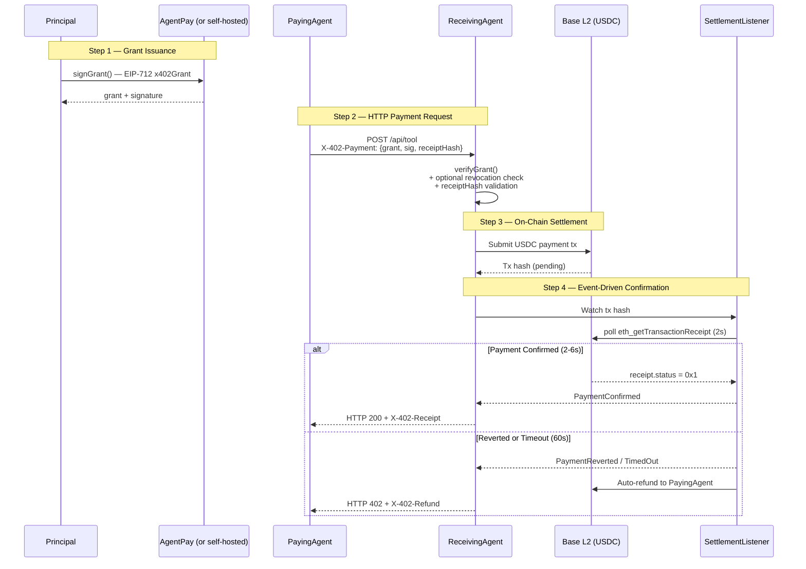

# x402 Payment Flow

**Version:** 1.0  
**Status:** Draft  
**Date:** May 2026  
**Companion Specs:**
- [specs/grants.md](./grants.md)
- [specs/test-vectors.md](./test-vectors.md)
- [specs/conformance.md](./conformance.md)
- [x402-specification-v1.md](./x402-specification-v1.md) (base HTTP 402)

---

## Abstract

This document defines the complete end-to-end payment lifecycle for x402-enabled AI agents. It ties the **x402 Agent Grant System** (signed delegation) to the base x402 HTTP 402 Payment Required protocol, on-chain settlement on Base L2 (USDC), and automatic receipt generation.

The flow is designed to be:

- **Fully verifiable** — any receiver can validate using only the open spec (no AgentPay required)
- **Agent-native** — short-lived grants + automatic refunds on failure
- **Production-ready** — 2–6 second settlement, event-driven confirmation, replay protection

---

## 1. End-to-End Lifecycle Overview



---

## 2. Step-by-Step Flow

### Step 1 — Grant Issuance (Principal → Agent)

The principal (human or orchestrator) signs a spend delegation using `signGrant()` from [grants.md](./grants.md):

```typescript
const grant = await signGrant({
  agent:         "0x70997970C51812dc3A010C7d01b50e0d17dc79C8",
  totalBudget:   1_000_000_000n,   // 1000 USDC (6 decimals)
  perRequestCap: 5_000_000n,       // 5 USDC max per call
  expiration:    Math.floor(Date.now() / 1000) + 900,  // 15 min TTL
  scopes:        ["0x8f3a8c9b..."],
  salt:          ethers.randomBytes(32),
}, principalWallet);
// Returns: { grant, signature }
```

The agent stores the grant and reuses it for requests within budget and TTL.

---

### Step 2 — HTTP Payment Request (PayingAgent → ReceivingAgent)

The paying agent encodes the grant as a base64 JSON header:

```http
POST /api/tool HTTP/1.1
Host: api.example.com
Content-Type: application/json
X-402-Payment: eyJncmFudCI6ey4uLn0sInNpZ25hdHVyZSI6IjB4Li4uIn0=
```

Decoded `X-402-Payment` payload:

```json
{
  "grant": {
    "grantId": "1",
    "principal": "0xf39Fd6e51aad88F6F4ce6aB8827279cffFb92266",
    "agent":     "0x70997970C51812dc3A010C7d01b50e0d17dc79C8",
    "issuedAt":  1747257600,
    "expiration":1747258500,
    "totalBudget":   "1000000000",
    "perRequestCap": "5000000",
    "scopes": ["0x8f3a8c9b2d1e4f5a6b7c8d9e0f1a2b3c4d5e6f7a8b9c0d1e2f3a4b5c6d7e8f9a"],
    "salt": "0x1234...abcd"
  },
  "signature": "0x420765509c3fd0cd...",
  "ledgerId":   "optional-idempotency-key",
  "receiptHash": "0xkeccak256-of-request-body"
}
```

The **ReceivingAgent MUST** validate in this order:

1. `verifyGrant(grant, signature, callerAddress, Date.now()/1000)` → must return `true`
2. If `shouldCheckRevocation(grant, now)` → query on-chain registry or subgraph
3. Validate `receiptHash` matches `keccak256(request body)` — prevents replay
4. Check `amount <= perRequestCap` and `cumulativeSpend + amount <= totalBudget`

If any check fails → return `HTTP 401` (invalid grant) or `HTTP 402` (payment required).

---

### Step 3 — On-Chain Settlement (Base L2 + USDC)

The ReceivingAgent (or AgentPay settlement daemon) submits the USDC transfer:

```typescript
// Escrow pattern — funds held until service confirmed
const tx = await escrowContract.lock({
  payer:    grant.principal,
  receiver: agentWallet,
  amount:   requestAmount,
  ledgerId: ledgerId,
});
const txHash = tx.hash;  // returned to SettlementListener
```

- Chain: **Base L2** (chainId: 8453)
- Token: **USDC** (`0x833589fcd6edb6e08f4c7c32d4f71b54bda02913`)
- Finality: **2–6 seconds** (1 block confirmation)

---

### Step 4 — Event-Driven Confirmation

The SettlementListener polls `eth_getTransactionReceipt` every 2 seconds across rotating RPC endpoints:

```
RPC rotation: mainnet.base.org → base.llamarpc.com → base.drpc.org → base-mainnet.public.blastapi.io
```

**On `receipt.status = 0x1` (confirmed):**

```http
HTTP/1.1 200 OK
Content-Type: application/json
X-402-Receipt: {"receiptId":"0x...","grantId":"1","amount":"5000000","settledAt":1747257960,"txHash":"0x..."}
```

**On revert or 60s timeout:**

```http
HTTP/1.1 402 Payment Required
Content-Type: application/json
X-402-Refund: {"ledgerId":"...","reason":"timeout","refundTxHash":"0x...","refundedAt":1747258020}
```

---

## 3. Error & Refund Handling

| Scenario | Outcome | HTTP Status |
|---|---|---|
| Valid grant + confirmed tx | Service delivered + receipt | `200` |
| Valid grant + tx reverted | Auto-refund + refund header | `402` |
| Valid grant + 60s timeout | Auto-refund + refund header | `402` |
| Invalid grant/signature | Reject immediately | `401` |
| Expired grant | Reject immediately | `401` |
| Wrong agent address | Reject immediately | `401` |
| `receiptHash` mismatch | Reject (replay attempt) | `401` |
| `perRequestCap` exceeded | Reject before settlement | `402` |
| `totalBudget` exhausted | Reject before settlement | `402` |

**Partial delivery** (streaming or long-running tools): If a service has already started delivering, partial credit is recorded on-chain. Future grants are adjusted via the reputation layer (see `specs/reputation.md` — planned).

---

## 4. Security & Edge Cases

### Replay Protection
`receiptHash = keccak256(request body || ledgerId)` is mandatory. ReceivingAgent stores seen `receiptHash` values for the duration of any active grant.

### Clock Skew
±30s grace window is applied to `expiration` checks — see [test-vectors.md](./test-vectors.md) vector `clock-skew-grace` for the exact boundary.

### Revocation Window
Only checked in the final **30%** of grant lifetime — see [grants.md](./grants.md) §7 for rationale.

### Spend Enforcement
`totalBudget` and `perRequestCap` are enforced **both** off-chain (by the ReceivingAgent before submitting) and on-chain (by the escrow contract). Either layer alone is sufficient; both together prevent races.

### Sybil / Reputation
Deferred to `specs/reputation.md`. Post-payment scoring updates an agent's on-chain trust index via The Graph subgraph.

---

## 5. Conformance & Testing

The existing conformance suite (`test/conformance.test.ts`) covers Steps 1–2 (grant signing and verification). Payment-flow test vectors (Steps 3–4) are planned for the next release.

```bash
# Run existing conformance suite
cd x402/test && npm install && npm test
```

To test the full on-chain cycle, use the [AgentPay settlement daemon](https://x402-agent-pay.com) with the Hardhat test key against Base L2 testnet.

---

## 6. Reference Implementation

A complete working reference (Node.js paying agent + Python receiving agent) is planned as `examples/agent-payment-e2e/`. It will exercise every step in this spec end-to-end.

- Paying agent: Node.js + `ethers` v6
- Receiving agent: Python + `web3.py`
- Settlement: AgentPay daemon on Base L2 Sepolia

---

*Part of the x402 Agent Grant System*  
*Built by [AgentPay](https://x402-agent-pay.com) — the commerce middleware for AI agents*
