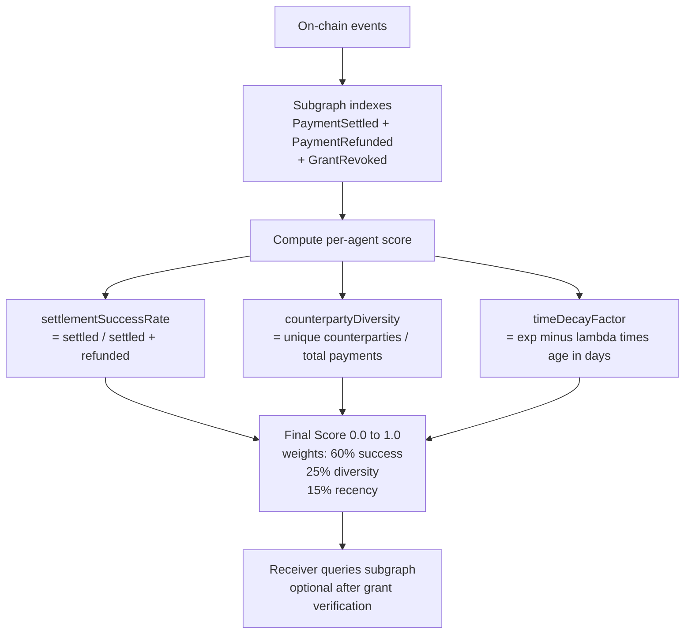

# x402 Reputation Layer

**Version:** 1.0  
**Status:** Draft  
**Date:** May 2026  
**Companion Specs:**
- [specs/grants.md](./grants.md)
- [specs/payment-flow.md](./payment-flow.md)
- [specs/test-vectors.md](./test-vectors.md)
- [specs/conformance.md](./conformance.md)

---

## Abstract

The x402 Reputation Layer is a public, subgraph-indexed scoring system on The Graph (Base L2) that helps receivers assess whether a paying agent has historically been reliable. It is **intentionally separate** from grant verification — cryptographic checks always come first.

Reputation is computed from on-chain signals (settlement success rate, counterparty diversity, time-decay weighting) and is queryable by anyone. This addresses the Sybil-resistance gap noted in `grants.md §7.4` while remaining fully open and portable.

---

## 1. Why Reputation?

- New agents and principals have **zero history** (cold-start problem).
- Pure payment volume is **gameable** (Sybil attacks via self-payments).
- Receivers need a lightweight trust signal before accepting high-value or long-running requests.

Reputation is **optional** — receivers can always fall back to pure grant verification + spend caps. Nothing in the core x402 protocol requires it.

---

## 2. On-Chain Signals (Indexed Events)

The subgraph indexes two contracts:

- **`x402GrantRegistry`** — already deployed — emits `GrantRevoked` events
- **Settlement contracts / AgentPay daemon** — emit `PaymentSettled` and `PaymentRefunded` events

```solidity
event PaymentSettled(
    uint256 indexed grantId,
    address indexed principal,
    address indexed agent,
    address           counterparty,   // receiving agent wallet
    uint256           amount,          // USDC (6 decimals)
    uint256           timestamp
);

event PaymentRefunded(
    uint256 indexed grantId,
    address indexed principal,
    address indexed agent,
    uint256           amount,
    uint256           timestamp
);
```

The `principal` is the human or orchestrator who signed the grant.  
The `agent` is the AI agent that sent the payment.  
The `counterparty` is the receiving agent that delivered the service.

---

## 3. Reputation Scoring Formula



**Default weights** (configurable per receiver):

| Signal | Weight | Window |
|---|---|---|
| Settlement success rate | 60% | Last 90 days |
| Counterparty diversity | 25% | All time |
| Recency / time decay | 15% | λ = 0.01 per day |

**Score range:** 0.0 (unreliable) → 1.0 (excellent)

**Formula:**

```
score = (0.60 × successRate) + (0.25 × diversityScore) + (0.15 × timeDecayFactor)

successRate     = settled90d / (settled90d + refunded90d)
diversityScore  = min(1.0, uniqueCounterparties / 10)   // saturates at 10 unique receivers
timeDecayFactor = exp(-0.01 × daysSinceLastPayment)
```

---

## 4. Subgraph Schema (GraphQL)

```graphql
type AgentReputation @entity {
  id:                   ID!           # agent address (lowercase)
  agent:                Bytes!
  totalPayments:        BigInt!
  successfulPayments:   BigInt!
  refundedPayments:     BigInt!
  uniqueCounterparties: BigInt!
  lastPaymentAt:        BigInt!       # unix timestamp
  score:                BigDecimal!   # 0.0–1.0, recomputed on each event
  successRate:          BigDecimal!
  diversityScore:       BigDecimal!
}

type Payment @entity {
  id:           ID!         # txHash
  grantId:      BigInt!
  principal:    Bytes!
  agent:        Bytes!
  counterparty: Bytes!
  amount:       BigInt!
  settled:      Boolean!
  timestamp:    BigInt!
}

type GrantRevocation @entity {
  id:        ID!            # grantId as string
  grantId:   BigInt!
  principal: Bytes!
  revokedAt: BigInt!
}
```

**Example query** (any receiver can run against the deployed subgraph):

```graphql
query GetReputation($agent: Bytes!) {
  agentReputation(id: $agent) {
    score
    successRate
    diversityScore
    totalPayments
    uniqueCounterparties
    lastPaymentAt
  }
}
```

**Example response:**

```json
{
  "agentReputation": {
    "score":                "0.847",
    "successRate":          "0.96",
    "diversityScore":       "0.80",
    "totalPayments":        "142",
    "uniqueCounterparties": "8",
    "lastPaymentAt":        "1747258200"
  }
}
```

---

## 5. Integration Points (Receiver Flow)

```mermaid
sequenceDiagram
    participant PA as PayingAgent
    participant RA as ReceivingAgent
    participant SG as The Graph Subgraph

    PA->>RA: POST /api/tool + X-402-Payment {grant, sig, eip3009Auth}
    RA->>RA: verifyGrant() — must pass first
    RA->>RA: shouldCheckRevocation()?

    opt High-value request OR grant in final 30% lifetime
        RA->>SG: GetReputation(grant.agent)
        SG-->>RA: {score, successRate, diversityScore, ...}
        alt score < receiver threshold (e.g. 0.6)
            RA-->>PA: HTTP 402 — low reputation score
        else score acceptable
            RA->>RA: Proceed to settlement
        end
    end

    RA->>RA: EIP-3009 settlement
    RA-->>PA: HTTP 200 + X-402-Receipt
```



**Best practice:**
- Query reputation **only after** `verifyGrant()` passes — never before.
- Only query for high-value requests or grants in their **final 30%** of lifetime.
- **Cache results for 60 seconds** — the subgraph syncs every ~2 seconds, but scores change slowly.
- Let the paying agent include a `reputationProof` (subgraph response + block hash) in the request for offline verification.

---

## 6. Security & Anti-Sybil

**Sybil resistance** comes from counterparty diversity and time-weighted scoring — not raw volume:

- Self-payments (agent pays itself) are detectable: `principal == counterparty` → excluded from diversity score.
- Wash trading (circular payments) requires real USDC movement and gas across multiple real wallets — economically expensive.
- `timeDecayFactor` penalizes dormant agents that suddenly burst with activity.
- Receivers can set their own thresholds and weight vectors.

**What reputation is NOT:**
- It is not part of the core x402 grant or payment protocol.
- It is not required by any conformance test.
- It does not replace `verifyGrant()` — it supplements it.
- It does not prevent spam — `perRequestCap` and `totalBudget` do that.

---

## 7. Deployment Roadmap

| Milestone | Status |
|---|---|
| `x402GrantRegistry` deployed on Base Sepolia | Live |
| `PaymentSettled` / `PaymentRefunded` events in AgentPay daemon | Live |
| The Graph subgraph (Base L2) | In progress — coordinating with James Mulqueeny (BuildersDAO) |
| Subgraph query endpoint | Pending deployment |
| Reputation test vectors | Planned — after subgraph goes live |
| `reputationProof` extension spec | Planned |

---

## 8. Conformance

Reputation scoring is intentionally **not** part of the core conformance suite (`test/conformance.test.ts`). It is off-chain indexing built on top of on-chain events.

Once the subgraph is live:
- Test vectors for score computation will be added to `specs/test-vectors.json`.
- A `query-reputation.test.ts` will be added to `test/` to verify the subgraph response shape.

---

*Part of the x402 Agent Grant System*  
*Built by [AgentPay](https://x402-agent-pay.com) — the commerce middleware for AI agents*
