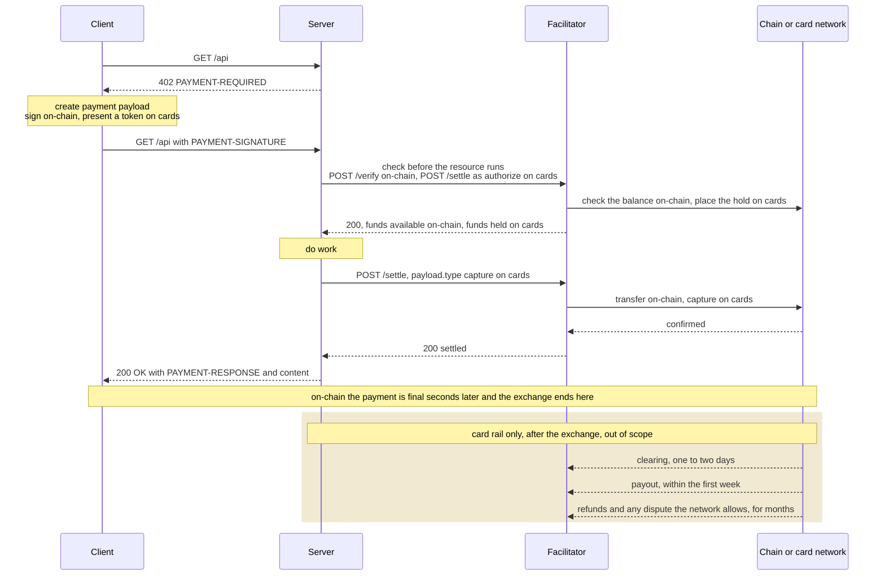
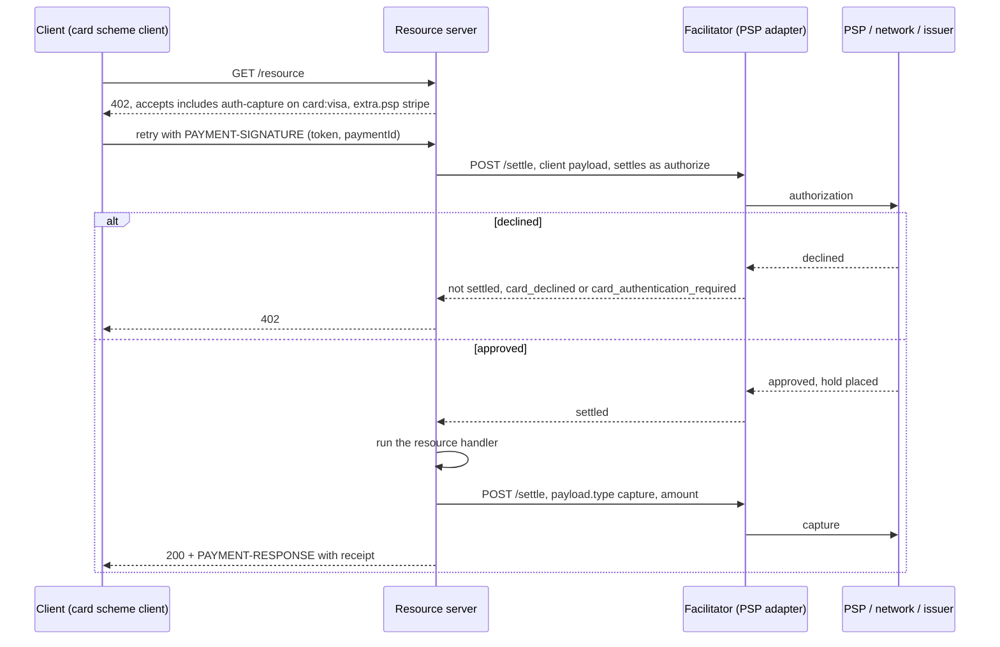

# [DRAFT] Card acceptance on `x402`

- **Status**: Draft
- **Version**: 0.2.0
- **Date**: 2026-08-08
- **Author(s)**: Stefano Amorelli ([@stefanoamorelli](https://github.com/stefanoamorelli))
- **Contributor(s)**: Erik Reppel ([@erikreppel](https://github.com/erikreppel)), Steve Kaliski (Stripe, [@sjkaliski](https://github.com/sjkaliski)), Carson Roscoe (Coinbase, [@CarsonRoscoe](https://github.com/CarsonRoscoe)), Adam Krochak (American Express)
- **Discussion**: `#wg-card-acceptance`

## Open items

| # | Open item | What it is about | Owner | Possible options |
|---|---|---|---|---|
| 1 | What goes in v1 | Whether v1 is only for agents paying for requests, with card checkout for a person in a browser, agent spending permissions, bundled micropayments, bank verification (3DS), post-payment updates, statement text and refunds handled later as separate proposals (§9). | TBD | (a) agents only, extras later; (b) also support a person paying in a browser; (c) bring one of the other extras back into v1 |
| 2 | What card token does an agent pay with? | A token usually works only with the PSP account that created it, and an agent pays many merchants it has never used before, so it needs a token each merchant's PSP account can charge (§4.2 and §4.4). | TBD | (a) network agent tokens; (b) a token the PSP shares with the merchant; (c) leave it out of the spec |
| 3 | How do card networks recognise an agent's x402 payment? | An agent payment fits neither card-network category, cardholder-initiated (CIT) or merchant-initiated (MIT), so the spec has to say what the authorization carries for the network to handle it correctly (§4.4 and §4.7). | TBD | (a) the network agent token carries it; (b) submit it as a payment without the cardholder present (e.g. Stripe `off_session`) and let the PSP set the rest; (c) a dedicated `x402` or agent marker, once a network defines one |
| 4 | Which ID ties the hold and the charge together? | The `payment-identifier` extension rejects a second message with the same ID and different contents, which is exactly what the charge after a hold is, so the draft uses its own `paymentId` (§4.4). | TBD | (a) `paymentId` on every message; (b) reuse `payment-identifier` with a rule that allows the charge message |
| 5 | How do we pay for requests that cost less than the card fee? | A card payment carries a fee that can be bigger than the price of a cheap `x402` request (§4.5). | TBD | (a) one card payment per request, and merchants offer cards only above a price they choose; (b) one hold covers several requests and the total is charged once; (c) cheap requests use other payment methods until the bundling proposal is ready |

## Motivation

`x402` found its popularity through micro, on-chain transactions, although its potential is much bigger than that. The protocol is payment-method agnostic by construction, and this document proposes cards as its first non-crypto binding.

## Summary

This document defines one thing: a card network binding for the [`auth-capture`](./scheme_auth_capture.md) scheme. The client presents an opaque PSP token, the facilitator places an authorization before the resource runs, and the resource server captures or voids it afterwards.

This first version is deliberately small. Delegated authority for agents, micropayments, step-up challenges and post-settlement events are left to follow-up proposals (§9), so that they can be specified once the base binding is agreed.

## 1 Scope

We cover the network identifier, the payment requirements and payload, the settlement contract between client, resource server and facilitator, a high-level client and server integration, decline handling, and security provisions specific to the card rail.

### 1.1 Scope decisions

Card payments involve more steps than the payment exchange, although those processes are not inherently part of the `x402` protocol. `Table 0` states, per topic, what stays out of the scope of `x402` and what this binding takes in scope.

**Table 0. Scope decisions**

| Topic | Out of scope of `x402` | In scope of this binding |
|---|---|---|
| PCI DSS | PCI DSS compliance of the parties. | The prohibition on card data on the wire. Payloads MUST NOT carry the PAN, the CVC or track data (§8.1). |
| Credential issuance and delegated authority | Which token the client holds, how it was provisioned, and whether an agent may use it. These are decided by the PSP, the card network and the issuer. | The token, carried opaque (§4.4). |
| Cardholder authentication | SCA, 3DS and any other challenge, run by the PSP and the issuer. | A distinct error when the issuer requires authentication (§7.2). |
| Network policy | Pricing, risk checks and dispute rules for `x402` transactions, defined by the card networks. | An `x402` indicator on the authorization, where the PSP exposes one (§4.7). |
| Post-settlement lifecycle | Clearing, payouts, refunds and disputes, which stay with the card networks and the PSP contract. | Nothing. Refunds run through the PSP (§4.6). |
| Merchant onboarding | KYC and the payout schedule, matters of the PSP contract. | Nothing. |

## 2 Glossary

**PSP** payment service provider. The entity that tokenizes card data and executes authorizations, captures and refunds against the card networks (e.g. Stripe, Adyen)

**PAN** primary account number. The card number

**authorization** hold placed on the cardholder's available balance for a stated amount, valid for a limited period

**capture** transfer of previously authorized funds to the merchant

**void** release of an authorization that will not be captured

**minor unit** smallest unit of a currency a card network authorizes in, for example the cent for USD (ISO 4217 exponent)

**3DS** EMV 3-D Secure. The card networks' cardholder authentication protocol, used to satisfy SCA (strong customer authentication) under PSD2

## 3 Payment lifecycle comparison between on-chain and card payments

At payment time the two rails run the same steps. The buyer produces a payment instrument (a signed transfer on-chain, a card token on cards), the facilitator checks it, the money moves, and the resource is delivered. `Figure 1` traces the exchange both rails share, then the tail that only cards have. An on-chain payment is final a few dozen seconds after settlement. A card payment is not: the funds reach the merchant days later, and refunds and disputes can move them for months afterwards. That tail is outside the scope of `x402` (§1.1).



**Figure 1. The x402 exchange, identical on both rails, and the card-only tail that follows it**

Card payments can be modeled on top of the existing `auth-capture` scheme instead of getting a scheme of their own. `Table 1` maps each on-chain step onto its card equivalent.

**Table 1. On-chain and card equivalents per step**

| Step | On-chain, `exact` | Card, `auth-capture` |
|---|---|---|
| Create the payment instrument | sign the transfer with the wallet | present a PSP token (§4.4) |
| Check before the resource runs | `/verify`, check the signature and the balance | `/settle` as `authorize`, place a hold |
| Move the funds | `/settle`, execute the on-chain transfer | `/settle` with `payload.type` `capture`, collect the held funds |
| Deliver the resource | same on both rails | same on both rails |
| After delivery | final in seconds | funds arrive in days and can keep moving for months, out of scope |

## 4 Scheme binding

### 4.1 General

The card lifecycle (authorize, then capture or void) is the lifecycle of the `auth-capture` scheme. Cards are therefore defined as a network binding for that scheme, in the same way `exact` has EVM bindings. Selection, hooks and receipts keep working as they do for the crypto schemes, and the application code stays unaware of which method paid. `Table 5` in §4.8 maps the network requirements of the parent scheme onto the sections of this binding.

### 4.2 Network identifiers

Network identifiers follow CAIP-2 as `card:<card-network>`, for example `card:visa`, `card:mastercard` and `card:amex`. Interchange, surcharge rules and acceptance differ across card networks, so the reference names the network. A server that accepts several networks lists one `accepts[]` entry per network, and a client can register `card:*` for any of them.

The PSP is named in `extra.psp` (§4.3), not in the identifier. A token is redeemable only at the PSP that minted it, so a client MUST NOT present a token minted by a PSP other than `extra.psp`.

### 4.3 `PaymentRequirements`

```json
{
  "x402Version": 2,
  "accepts": [
    {
      "scheme": "auth-capture",
      "network": "card:visa",
      "amount": "100",
      "asset": "USD",
      "payTo": "acct_1Nxyz",
      "maxTimeoutSeconds": 900,
      "extra": {
        "psp": "stripe",
        "paymentFlow": "escrow"
      }
    }
  ]
}
```

- `asset` is an ISO 4217 alphabetic currency code.
- `amount` is the amount to authorize, in minor units of `asset`. It is the ceiling for the capture.
- `payTo` is the merchant's account identifier at the PSP named in `extra.psp`.

**Table 2. `extra` fields**

| Field | Required | Type | Description |
|---|---|---|---|
| `psp` | Yes | `string` | PSP that redeems the token and executes the authorization, lowercase (e.g. `"stripe"`, `"adyen"`) |
| `paymentFlow` | Yes | `"escrow"` | MUST be `"escrow"`. Cards do not offer the `authorization` flow (§4.5) |
| `captureDeadline` | No | `number` | Absolute Unix seconds. When absent, the PSP's authorization validity applies |

### 4.4 Client payload

```json
{
  "x402Version": 2,
  "accepted": { "scheme": "auth-capture", "network": "card:visa", "...": "..." },
  "payload": {
    "token": "pm_1Nxyz",
    "paymentId": "pay_7d5d747be160e280504c099d984bcfe0"
  }
}
```

**Table 3. Client payload fields**

| Field | Required | Description |
|---|---|---|
| `token` | Yes | Opaque PSP token for the card. MUST NOT be a PAN or contain card data (§8.1) |
| `paymentId` | Yes | Client-generated identity of the payment, 16 to 128 characters, alphanumeric, hyphens and underscores. Reused unchanged on every retry of the same payment |

The token is the whole client authorization. The binding does not say how the client obtained it (hosted fields, a card on file, a wallet, a network or agentic token), nor whether an agent may use it. The PSP and the issuer decide that when they receive the authorization.

NOTE: Whether the payload carries more than the token depends on open items 2 and 3. A field is added once a party that consumes it is identified.

`paymentId` identifies the payment through its whole lifecycle, on the client payload and on every lifecycle payload (§4.6). It serves the same idempotency purpose as the `payment-identifier` extension, but is part of the payload so that the binding does not depend on an optional extension.

### 4.5 Payment flow and settlement

A card network offers no read-only way to test whether funds are available. The only reliable check is the authorization itself. An authorization commits state at the issuer and holds the cardholder's funds, so it cannot sit behind `/verify`, which is read-only.

Cards therefore bind to the `escrow` payment flow, the default of the parent scheme:

1. The first `/settle` carries the client payload and settles as `authorize`, placing a hold for `amount` before the resource runs.
2. The resource executes.
3. The second `/settle` carries a lifecycle payload with `payload.type` `capture` for the final amount, or `void` when the resource produced nothing to charge for.

`/verify` takes no part in the ordering. The `authorization` flow of the parent scheme, which relies on `/verify` before the resource and a `charge` after it, is not offered on cards, because the pre-resource check it relies on does not exist.

The resource server MAY capture during the request or later from durable state, as the parent scheme allows. Either way:

- the facilitator MUST deduplicate authorizations on `payTo` and `paymentId`. A retry with the same `paymentId` and the same token resumes the existing PSP intent instead of opening a second hold. A retry with the same `paymentId` and a different token or amount MUST be rejected;
- the facilitator MUST void any authorization it will not capture, and at the latest at `captureDeadline`, since an open authorization blocks the buyer's funds. A hold nobody touches lapses at the issuer when the authorization expires. That lapse is the card equivalent of `reclaim` and needs no action from the client; and
- the capture amount MUST NOT exceed the authorized amount. A capture for less releases the remainder of the hold.

EXAMPLE `SettleResponse` for a successful `authorize`:

```json
{
  "success": true,
  "transaction": "pi_3Nxyz",
  "network": "card:visa",
  "amount": "100"
}
```

`transaction` carries the PSP's charge or intent identifier and `amount` the amount held or captured, in minor units. A PSP that acknowledges a capture without confirming it is reported as `settlement_pending`, with the PSP identifier in `transaction`, as the core specification defines for a broadcast whose confirmation could not be established.

### 4.6 Lifecycle payloads and server consent

`capture` and `void` have no client payload to build on. The resource server authors them and passes them to `POST /settle` with `payload.type` naming the operation, as the parent scheme requires.

EXAMPLE Capture payload for a metered resource:

```json
{
  "x402Version": 2,
  "accepted": { "scheme": "auth-capture", "network": "card:visa", "...": "..." },
  "payload": {
    "type": "capture",
    "paymentId": "pay_7d5d747be160e280504c099d984bcfe0",
    "amount": "73"
  }
}
```

**Table 4. Lifecycle payload fields**

| Field | Required | Description |
|---|---|---|
| `type` | Yes | `capture` or `void` |
| `paymentId` | Yes | the `paymentId` of the authorized payment |
| `amount` | for `capture` | amount to capture in minor units, at most the authorized amount |

The parent scheme requires the binding to authenticate that relayed lifecycle operations are consented to by the resource server. On cards there is no signature to check, so consent is the authenticated identity of the resource server on the settle request, through the credential the facilitator issued it at onboarding. The facilitator MUST refuse a lifecycle payload for a `paymentId` authorized under a different `payTo`.

Each payment accepts one `capture` or one `void`, after which it is closed. A retried lifecycle settle with the same content is answered from the stored outcome instead of being submitted again. One with different content is rejected.

Refunds are not relayed in this version. The resource server issues them through the PSP, against the `transaction` identifier, and funds them from its PSP balance. The facilitator is never a source of refund funds.

### 4.7 Network identification of `x402` transactions

The facilitator SHOULD identify each authorization to the network as an `x402` transaction, so that the network and the issuer can apply the policy and risk checks they define for it. The identifier travels either as a transaction-level indicator in the authorization message or through a merchant configuration reserved for `x402` traffic, whichever the PSP exposes.

### 4.8 Network requirements of the parent scheme

The `auth-capture` scheme lists eight things every network binding MUST specify. `Table 5` gives where this binding does so.

**Table 5. Parent scheme requirements and where the card binding meets them**

| Requirement | Card binding |
|---|---|
| Hold and settlement mechanism | PSP authorization, capture and void against the card network; the capture deadline is `captureDeadline` or the PSP's authorization validity (§4.5) |
| Client authorization format | an opaque PSP token; the payment's identity is `paymentId` (§4.4) |
| Operator model | the facilitator, through its PSP integration, drives every relayed operation; the resource server initiates `capture` and `void`; refunds run out of band at the PSP (§4.6) |
| Server consent | authenticated identity of the resource server on each lifecycle settle (§4.6) |
| Replay protection | one authorization, and then one `capture` or `void`, per `payTo` and `paymentId` (§4.5 and §4.6) |
| Per-operation verification and settlement | amount ceilings and PSP calls (§4.5 and §4.6), decline classes (§7.3) |
| Refund funding | the merchant's PSP balance, out of band (§4.6) |
| Sync capture-and-void | a single `capture` for the final amount releases the remainder of the hold (§4.5) |

## 5 Client integration

### 5.1 Registration and selection

The application layer is unaffected by the addition of cards. Payment methods are scheme clients registered on the `x402Client`, so the calling code sees the same interface whichever rail ends up paying.

EXAMPLE 1 Registration of the card scheme next to existing crypto schemes:

```ts
const client = x402Client.fromConfig({
  schemes: [
    { network: "eip155:*", client: new ExactEvmScheme(evmSigner) },
    { network: "solana:*", client: new ExactSvmScheme(svmSigner) },
    { network: "card:*",   client: new CardScheme({ vault, ui }) },
  ],
});

const payFetch = wrapFetchWithPayment(fetch, client);

// Application code, identical whether a card or a chain pays:
const res = await payFetch("https://api.example.com/report");
```

Selection between rails is declarative, so by default the client takes the first entry the server offered that it supports. A custom selector, for example, may route small amounts on-chain and larger purchases to the card.

EXAMPLE 2 Amount-based routing between rails:

```ts
paymentRequirementsSelector: (v, reqs) =>
  usdCents(reqs[0]) < 50n
    ? reqs.find(isCrypto) ?? reqs[0]
    : reqs.find(isCard) ?? reqs[0],
```

### 5.2 Scheme client

`CardScheme` implements `SchemeNetworkClient` and registers under `card:*`. It takes a `vault` that returns a token the client already holds for a PSP, and a `ui` delegate for cardholder-present checkout. Either may be absent.

EXAMPLE Core of the scheme client:

```ts
export class CardScheme implements SchemeNetworkClient {
  readonly scheme = "auth-capture";

  constructor(private deps: { vault?: CardTokenVault; ui?: CardUiDelegate }) {}

  async createPaymentPayload(v: number, req: PaymentRequirements): Promise<PaymentPayloadResult> {
    const paymentId = this.paymentIds.for(req);   // stable across retries of this payment

    // A token already held for this PSP: card on file, wallet, network or agentic token.
    const held = await this.deps.vault?.tokenFor(req.extra.psp, req);
    if (held) return this.payloadFrom(v, req, { token: held, paymentId });

    // Cardholder present. PSP hosted fields; the PAN goes browser -> PSP iframe,
    // the client receives an opaque single-use token.
    if (!this.deps.ui) throw new CardCheckoutUnavailable(req);
    const tok = await this.deps.ui.collectPaymentMethod(req);   // unbounded async is permitted here
    return this.payloadFrom(v, req, { token: tok.id, paymentId });
  }
}
```

NOTE: `PAYMENT-SIGNATURE` is an HTTP header, and header values reach access logs and proxies. The prohibition on card data in payloads is specified in §8.1.

### 5.3 Payment flow



**Figure 2. Card payment flow**

## 6 Server and facilitator

### 6.1 Route configuration

EXAMPLE Mixed route configuration:

```ts
accepts: [
  { scheme: "exact", network: "eip155:8453", payTo: PAY_TO_EVM, price: "$0.97", maxTimeoutSeconds: 60 },
  { scheme: "auth-capture", network: "card:visa", payTo: "acct_1Nxyz",
    price: "$1.00", maxTimeoutSeconds: 900,
    extra: { psp: "stripe", paymentFlow: "escrow" } },
]
```

Configuration order is preserved into `accepts[]`, and the default client selector takes the first supported entry. Surcharging consumer cards can be prohibited depending on jurisdiction.

### 6.2 Facilitator requirements

The complexity of card acceptance is mostly on the facilitator, by design. The client learns to present a token, and the resource server is unchanged. The PSP integration (idempotency, decline handling, webhook ingestion) is concentrated in the facilitator, which is where `x402` already places trust.

A facilitator for a `card:<card-network>` network:

- MUST deduplicate authorizations on `payTo` and `paymentId` (§4.5);
- MUST authenticate the resource server on every lifecycle settle and bind lifecycle payloads to the payment's `payTo` (§4.6);
- MUST void any authorization it will not capture (§4.5);
- MUST rate-limit authorizations and collapse hard-decline detail (§8.2); and
- SHOULD identify each authorization to the network as an `x402` transaction (§4.7).

EXAMPLE `/supported` entry:

```json
{
  "x402Version": 2,
  "scheme": "auth-capture",
  "network": "card:visa",
  "extra": { "psps": ["stripe", "adyen"] }
}
```

`extra.psps` lists the PSPs the facilitator can authorize through on that card network.

### 6.3 Error codes

In addition to the protocol codes of the core specification, this binding defines:

- **`card_declined`**: the issuer refused the authorization. The facilitator returns this single code for every hard decline (§7.3 and §8.2)
- **`card_authentication_required`**: the issuer requires cardholder authentication that this version cannot carry out in the exchange (§7.2)

## 7 Card-specific considerations

### 7.1 Wallets

Apple Pay and Google Pay collapse tokenization and authentication into one sheet when the cardholder is present. The sheet needs a user gesture and a merchant domain registered with the PSP in advance, which the `402` response cannot carry. What reaches the binding is a PSP token like any other.

### 7.2 Cardholder authentication

An issuer may condition an authorization on cardholder authentication. In the EU, PSD2 SCA makes this a common outcome rather than an edge case. This version defines no challenge round trip inside the `402` loop. When the issuer requires authentication, the authorization fails with `card_authentication_required` and no hold is placed. The client may pick another `accepts[]` entry, or obtain a new token while the cardholder is present, so that the PSP SDK can authenticate them during checkout.

A challenge round trip over the `402` loop is proposed as a follow-up (§9).

### 7.3 Decline handling and retry limits

Card errors divide into soft declines (retriable with backoff), hard declines (not retriable) and authentication required. Retry limits are card-network rules with fines attached, hence retry classes belong in the binding specification rather than in application code. The facilitator MUST NOT resubmit a hard-declined authorization for the same `paymentId`, and MUST cap soft-decline retries per payment at the lower of the PSP's limit and the network's rule for the transaction type.

## 8 Security considerations

### 8.1 Cardholder data and PCI DSS scope

Payloads MUST NOT contain the PAN, the CVC or track data; the payload carries PSP tokens and references only. `PAYMENT-SIGNATURE` is an HTTP header, and hence can easily reach access logs, proxies and monitoring. A single leaked PAN would contaminate every log pipeline on the path. Facilitators SHOULD reject payloads containing Luhn-valid 13- to 19-digit strings as defense in depth.

PCI DSS scope follows the data flow. `Table 6` lists the resulting posture per party.

**Table 6. PCI DSS scope per party**

| Party | Card data seen | PCI DSS posture |
|---|---|---|
| Resource server | none, only tokens (and receipts) | SAQ A |
| x402 client library | none, tokens only | outside the CDE |
| Facilitator | tokens and charge ids | outside cardholder-data scope while token-only; a facilitator that proxies PANs becomes a PCI service provider requiring a full assessment |
| PSP | PAN | Level 1 service provider |

### 8.2 Abuse resistance

For on-chain transactions the `/verify` check costs nothing, but with cards the check before the resource runs reaches a real issuer, holds the buyer's funds and counts against the merchant's fraud ratios. The facilitator MUST rate-limit authorizations by card fingerprint and IP, MUST collapse hard-decline detail into `card_declined`, and MUST NOT authorize a single-use token more than once.

## 9 Follow-up proposals

The following were drafted in earlier revisions of this document and are left out of this version. Each can be proposed separately on top of the base binding, as an extension or as an additional binding.

- **Credential provenance and delegated authority.** Telling the PSP, the network and the issuer where the token comes from (single-use, card on file, agentic token), who initiated the payment, and a reference to the cardholder's mandate when they require one.
- **Micropayments.** A card binding of `batch-settlement`, with a facilitator ledger that accumulates charges below one minor unit and captures whole minor units per billing cycle.
- **`step-up-challenge`.** A corrective `402` carrying the issuer's challenge, and a retry that resumes the same payment.
- **`payment-events`.** A facilitator-to-resource-server channel for the card tail of `Figure 1`: payouts, refunds and dispute outcomes.
- **Statement descriptor and line items.** A merchant-chosen dynamic descriptor and Level 2/3 consumption data on the capture.
- **Relayed refunds and multiple captures.** `refund` as a relayed lifecycle payload, and more than one `capture` per authorization where the network allows it.

## Version History

| Version | Date | Changes | Authors |
|---|---|---|---|
| 0.2.0 | 2026-10-06 | Reduced to the base binding. `network` stays CAIP-2 with the PSP in `extra.psp`; the payload is the token and a `paymentId`; refunds run at the PSP. Provenance, micropayments, step-up and payment events move to follow-ups (§9) | @stefanoamorelli |
| 0.1.0 | 2026-08-08 | Initial draft | @stefanoamorelli |
