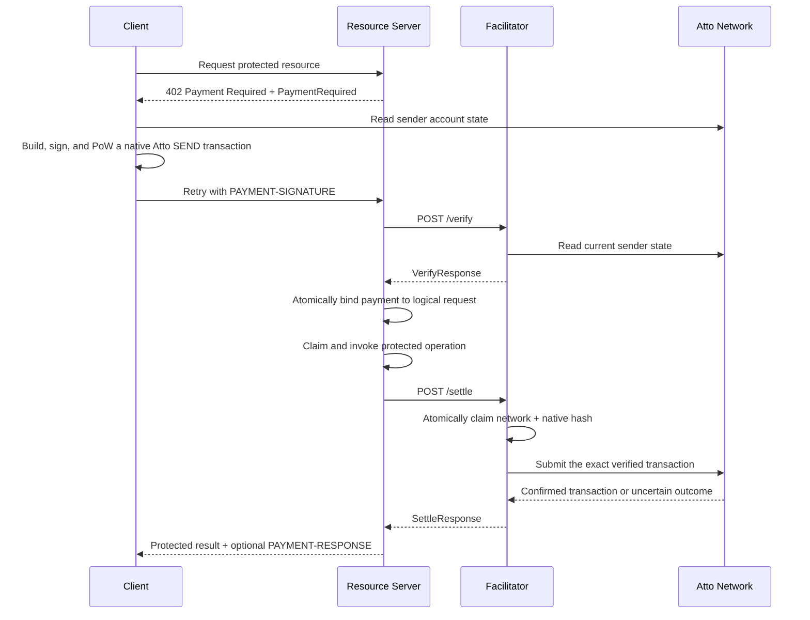

# Scheme: `exact` on `Atto`

## Versions supported

- ❌ `v1`
- ✅ `v2`

## Supported Networks

This spec uses the following [CAIP-2](https://chainagnostic.org/CAIPs/caip-2)-formatted identifiers under the proposed
`atto` namespace. Its [ChainAgnostic namespace registration](https://github.com/ChainAgnostic/namespaces/pull/178) is
pending:

- `atto:live` — Atto mainnet
- `atto:beta` — Atto beta / testnet
- `atto:dev` — Atto devnet
- `atto:local` — local / private development network

The corresponding native transaction JSON uses the uppercase Atto network values `LIVE`, `BETA`, `DEV`, and `LOCAL`.

## Summary

The x402 `exact` scheme on Atto uses a fully signed native Atto `SEND` transaction to transfer an exact amount of the
native Atto asset from the client to the resource server's recipient. The client funds the payment itself. Atto is
feeless; instead of a monetary network fee, the client computes the transaction's proof-of-work (PoW).

This is a **facilitator-submitted** method. Its default `assetTransferMethod` is `native`, its only supported
`paymentFlow` is `authorization`, and both defaults MAY be omitted from `PaymentRequirements.extra`.

- **Fee payer:** payer-funded; the facilitator only relays the signed native transaction.
- **Replay primitive:** the sender's next account-chain position (`publicKey`, `height`, and `previous`), which is shared
  with every other transaction from that account. Only one competing next block can confirm, so unrelated payer activity
  can invalidate a payment after `/verify` and resource execution but before `/settle`. This limits a sender account to
  one safely pending payment; clients SHOULD NOT create another transaction from that frontier until the first payment's
  outcome is reconciled or deliberately invalidated.
- **Validity window:** Atto has no native transaction expiry. For x402, the signed block timestamp plus
  `maxTimeoutSeconds` is the acceptance deadline. A facilitator MUST NOT begin a first broadcast after that deadline.
  This is an x402 policy deadline, not a native network expiry: an unused transaction can remain network-valid until the
  sender advances its account chain. The payer can invalidate it by publishing another next block.
- **Duplicate submission:** Atto's transaction submission API can be idempotent for the same native transaction hash and
  can return an already-confirmed transaction. Facilitators therefore MUST provide their own atomic settlement
  deduplication.

## Protocol Flow



`/settle` MUST perform full verification independently and MUST NOT assume prior `/verify` success. `/verify` is
read-only and MUST NOT reserve a transaction or sender frontier. The resource server's durable logical-request claim is
separate from the facilitator's settlement claim.

## `PaymentRequirements` for `exact`

The `exact` scheme on Atto uses the standard x402 `PaymentRequirements` object. This example matches the LOCAL fixture
used below:

```json
{
  "scheme": "exact",
  "network": "atto:local",
  "amount": "500000000",
  "asset": "atto",
  "payTo": "atto://aaqccirdeqssmjzifevcwlbnfyxtamjsgm2dknrxha4tuoz4hu7d76lv23r6q",
  "maxTimeoutSeconds": 60,
  "extra": {}
}
```

- `scheme` MUST be `"exact"`.
- `network` MUST be one of the Atto CAIP-2 identifiers above.
- `amount` MUST be the exact required amount in raw Atto units, encoded as an x402 decimal string.
- `asset` MUST be `"atto"` for this native-asset method.
- `payTo` MUST be the recipient Atto address in canonical `atto://` form.
- `maxTimeoutSeconds` MUST be a finite positive integer and defines the x402 acceptance window relative to the signed
  native block timestamp.
- If present, `extra.assetTransferMethod` MUST be `"native"` and `extra.paymentFlow` MUST be `"authorization"`.

## PaymentPayload `payload` Field

`payload.transaction` MUST be the structured address-based JSON representation of a native Atto `SEND` transaction. It
MUST NOT be a Base64 string or a binary transaction encoded inside JSON.

```json
{
  "transaction": {
    "block": {
      "type": "SEND",
      "network": "LOCAL",
      "version": 0,
      "algorithm": "V1",
      "address": "atto://aab2cb576phbbpq5odorrz2lycmwpzgwgcn2kdk7dxoimzaskuy3rg4s6qz6c",
      "height": 2,
      "balance": 9500000000,
      "timestamp": 1789732800000,
      "previous": "A0A1A2A3A4A5A6A7A8A9AAABACADAEAFB0B1B2B3B4B5B6B7B8B9BABBBCBDBEBF",
      "receiverAddress": "atto://aaqccirdeqssmjzifevcwlbnfyxtamjsgm2dknrxha4tuoz4hu7d76lv23r6q",
      "amount": 500000000
    },
    "signature": "0859A4636878EC4A6D43F9198F6A49E09773122BBE7797F71866DCC965C602E5EC5598347729945455E840EC484DB88ECE606CA4E985C56AF2D7C1B6FBB6540D",
    "work": "ABCF000000000000"
  }
}
```

Its signature and LOCAL PoW are valid, and its native block hash is
`DEDCDD3B58E06441BD653FA01B917A943C05EAFAABF140B24BADB07B2BD2EEE0`; the account-state values are illustrative.

### Full `PaymentPayload` example

```json
{
  "x402Version": 2,
  "resource": {
    "url": "https://api.example.com/premium-article",
    "description": "Access premium article",
    "mimeType": "application/json"
  },
  "accepted": {
    "scheme": "exact",
    "network": "atto:local",
    "amount": "500000000",
    "asset": "atto",
    "payTo": "atto://aaqccirdeqssmjzifevcwlbnfyxtamjsgm2dknrxha4tuoz4hu7d76lv23r6q",
    "maxTimeoutSeconds": 60,
    "extra": {}
  },
  "payload": {
    "transaction": {
      "block": {
        "type": "SEND",
        "network": "LOCAL",
        "version": 0,
        "algorithm": "V1",
        "address": "atto://aab2cb576phbbpq5odorrz2lycmwpzgwgcn2kdk7dxoimzaskuy3rg4s6qz6c",
        "height": 2,
        "balance": 9500000000,
        "timestamp": 1789732800000,
        "previous": "A0A1A2A3A4A5A6A7A8A9AAABACADAEAFB0B1B2B3B4B5B6B7B8B9BABBBCBDBEBF",
        "receiverAddress": "atto://aaqccirdeqssmjzifevcwlbnfyxtamjsgm2dknrxha4tuoz4hu7d76lv23r6q",
        "amount": 500000000
      },
      "signature": "0859A4636878EC4A6D43F9198F6A49E09773122BBE7797F71866DCC965C602E5EC5598347729945455E840EC484DB88ECE606CA4E985C56AF2D7C1B6FBB6540D",
      "work": "ABCF000000000000"
    }
  },
  "extensions": {}
}
```

For HTTP, the client serializes this entire standard `PaymentPayload` as JSON, Base64-encodes those UTF-8 bytes, and
places the result in `PAYMENT-SIGNATURE`. Only the former inner binary-to-Base64 layer is absent; the standard x402
header encoding is unchanged.

## Native Transaction JSON and Hashing

The object shown above is the x402 address-based JSON profile of a native Atto transaction:

- `block` is an Atto `SEND` block.
- `signature` is the 64-byte Ed25519 signature as 128 unprefixed hexadecimal characters.
- `work` is the 8-byte PoW value as 16 unprefixed hexadecimal characters.
- `height`, `balance`, `timestamp`, and `amount` are JSON integer numbers, not strings. Implementations MUST preserve
  their exact integer values and MUST NOT round them through an IEEE-754-only parser.
- Hashes, signatures, and work are byte strings represented as unprefixed hexadecimal. The examples use uppercase.
- `address` is the sender's canonical Atto address. Its decoded algorithm MUST equal `algorithm`; its decoded public key
  is the native block's `publicKey`.
- `receiverAddress` is the recipient's canonical Atto address. Its decoded algorithm and public key are the native
  block's `receiverAlgorithm` and `receiverPublicKey`.
- `publicKey`, `receiverAlgorithm`, and `receiverPublicKey` are redundant compatibility fields and MAY be present. A
  x402 payload parser MUST accept the transaction without them. If present, each MUST exactly equal the value decoded
  from its address; disagreement is invalid.

The current Atto node submission API requires those compatibility fields. Before submission, a facilitator MUST derive
and add them from the verified addresses. This representation normalization MUST NOT change any native block byte,
signature, work, or hash. An endpoint that accepts the address-based form directly needs no normalization.

The canonical transaction identifier is the Atto block hash:

```text
BLAKE2b-256(
  type[1] || network[1] || version[2 LE] || algorithm[1] || address.publicKey[32] ||
  height[8 LE] || balance[8 LE] || timestamp[8 signed LE] || previous[32] ||
  receiverAddress.algorithm[1] || receiverAddress.publicKey[32] || amount[8 LE]
)
```

The serialized `SEND` block is 134 bytes. The hash is not computed from JSON text, the x402 envelope, the signature,
or the work value. Verifiers MUST parse the JSON into native fields, serialize those fields using Atto's fixed binary
rules, and derive the hash from those bytes. JSON whitespace, property order, compatibility fields, hexadecimal case,
or another equivalent JSON representation therefore cannot create another settlement key. The canonical consumption
key is the normalized pair `(paymentRequirements.network, nativeBlockHash)`.

The Ed25519 signature covers that native block hash. For a `SEND`, PoW is validated against the block's `previous` hash
using the threshold selected by the native network and block timestamp.

## Client Construction

The client MUST:

1. Read the sender's latest confirmed Atto account state from a trusted node.
2. Decode the sender address and `payTo` using native Atto address rules to obtain the public-key fields used by the
   native block.
3. Construct a `SEND` block whose `address` identifies the sender, `receiverAddress` equals `payTo`, `height` is the
   current height plus one, `previous` is the current confirmed hash, `balance` is the current balance minus the required
   amount, `amount` is exactly the required amount, and `timestamp` is strictly later than the sender's last confirmed
   timestamp.
4. Serialize the native block, derive its BLAKE2b-256 hash, sign that hash with the sender's Ed25519 key, and compute PoW
   for the sender-chain position.
5. Put the address-based native `{ "block", "signature", "work" }` object directly in `payload.transaction`; the three
   redundant compatibility fields MAY be omitted.
6. Serialize and Base64-encode the outer `PaymentPayload` as required by the selected x402 transport.

## Account and Infrastructure Preconditions

- The payer account MUST already be opened and have enough confirmed balance for `amount`; construction requires its
  current height, balance, timestamp, and frontier hash.
- The recipient account need not already be opened. A confirmed `SEND` creates a receivable entry; this scheme settles
  when that `SEND` confirms and does not wait for the recipient's separate `RECEIVE` transaction.
- The client needs a trusted source of current account state and the ability to produce a signature and PoW. The
  facilitator needs a trusted Atto node for validation, submission, and recovery. A resource server MAY rely on the
  facilitator rather than operate its own node.

## Facilitator Verification Rules

A facilitator MUST apply every rule again during `/settle`.

### Protocol and JSON validation

- `paymentPayload.x402Version` and the facilitator request's `x402Version` MUST be `2`.
- `accepted` MUST match `paymentRequirements` for `scheme`, `network`, `asset`, `payTo`, `amount`,
  `maxTimeoutSeconds`, and resolved transfer method and flow.
- `paymentRequirements.maxTimeoutSeconds` MUST be a finite positive integer.
- `scheme` MUST be `"exact"`, `asset` MUST be `"atto"`, the transfer method MUST resolve to `"native"`, and the flow
  MUST resolve to `"authorization"`.
- `payload.transaction` MUST be a JSON object conforming to the address-based profile above, not a string. A verifier
  MUST decode its addresses and normalize any compatibility fields before native parsing.
- Its block MUST be `SEND`; native network, version, algorithms, integer ranges, field lengths, signature, and PoW MUST
  all be valid. The decoded sender algorithm MUST equal `block.algorithm`, and the native network MUST correspond to the
  selected CAIP-2 network.

### Transfer validation

- Decode `payTo` and require exact equality with `receiverAddress`, including its algorithm and public key.
- Parse the x402 decimal-string amount without loss and require exact equality with the native `amount`. Underpayment and
  overpayment MUST both fail.
- Derive the payer and native public key from the validated `address`; do not trust a compatibility `publicKey` field.
- Verify the Ed25519 signature over the native block hash and validate PoW against the native `previous` target.

### Account-chain and time validation

Using a trusted canonical state source, require:

- `height == current.height + 1` and `previous == current.lastTransactionHash`;
- `current.balance == block.balance + block.amount` and sufficient sender balance;
- `block.timestamp` is strictly later than the current account timestamp;
- the native timestamp is not more than one minute in the future, as required by native Atto validation; and
- the current verifier time is not later than `block.timestamp + maxTimeoutSeconds` before the first broadcast.

Atto does not impose a corresponding past-age limit or native expiry. Once a broadcast outcome is unknown, crossing the
x402 deadline MUST NOT convert it to definite failure or release the settlement claim; the transaction may already have
confirmed.

Atto exposes no separate transaction simulation or dry-run endpoint. Native signature and PoW validation plus the
canonical account-state checks above are the required preflight checks before submission.

### Read-only replay checks

`/verify` MUST compute the canonical consumption key and reject a transaction known to be confirmed, previously claimed,
or inconsistent with current sender state. It MUST NOT write a reservation. Concurrent payments from the same sender
frontier can both pass read-only verification; settlement and resource-operation claims handle that race.

## Settlement and Facilitator Recovery

Before any broadcast, the facilitator MUST atomically create a durable record with a uniqueness constraint on
`(network, nativeBlockHash)` across every process and settlement worker. A correct implementation distinguishes:

- **in progress:** one worker owns the claim and may submit or await the transaction; concurrent `/settle` calls MUST NOT
  broadcast and MUST NOT return another success;
- **confirmed:** the exact native hash is confirmed and the owning first attempt may return `success: true`; every later
  settlement claim for that key MUST fail with `duplicate_settlement`;
- **definite failure:** authoritative validation or ledger evidence proves that this exact transaction cannot settle,
  such as a competing block advancing the sender chain while the exact hash is absent from confirmed history; and
- **unknown:** submission may have happened but confirmation could not be established because of a timeout, lost
  response, node failure, or process crash. The reservation MUST remain held.

The owning worker MUST submit the exact native `block`, `signature`, and `work` that it verified. It MUST
NOT reconstruct a transaction from `PaymentRequirements` or submit JSON text as bytes. The recommended native call is
`POST /transactions/stream?deduplicate=true`; success requires the returned NDJSON transaction to have the same native
hash and to be confirmed in sender history. Atto's idempotent response for an already-confirmed hash is recovery
evidence for the original claim, not authorization for another x402 success.

If confirmation cannot be established after a possible broadcast, the facilitator MUST return the standard non-terminal
`settlement_pending` response with the canonical Atto hash in `transaction`, transition the record to unknown, and
reconcile the original hash. Recovery MUST query `GET /transactions/{hash}` and the sender's confirmed account history.
While still inside the acceptance window, a recovery worker MAY resubmit the exact same native transaction through the
idempotent API; it MUST NOT create or accept a replacement transaction. After the deadline, it MUST observe and
reconcile rather than initiate a first broadcast.

A missing lookup, confirmation timeout, expired worker lease, or crashed owner is not definite failure. A new worker may
take over an expired processing lease only after checking the original hash and sender history. The claim may transition
to definite failure and permit a separately linked replacement only when authoritative evidence shows that the original
cannot land. Unknown claims MUST NOT be released by a fixed timeout.

Repeated `/settle` calls are not a portable success-recovery API for this single-settle method. A call that races an
in-progress claim fails with `duplicate_settlement`; a call observing an unresolved possible broadcast MAY repeat
`settlement_pending`; and a call after confirmation MUST fail with `duplicate_settlement`, never return a second
`success: true`. Resource servers recover through the canonical hash and their own logical-request record.

The facilitator MUST retain either a durable confirmed-key tombstone or enough canonical history to reject every
already-confirmed hash on every later claim; pruning the local record MUST NOT make a confirmed transaction reusable.
In-progress and unknown records, including enough data to reconcile the exact transaction, MUST be retained until
confirmed or definite failure. A definite-failure record MAY discard the signed transaction after retaining the key,
evidence, and any link to a replacement through the application's retry and dispute window.

### `SettleResponse`

Illustrative successful-response shape using the fixture-derived identifiers (the fixture itself cannot settle):

```json
{
  "success": true,
  "transaction": "DEDCDD3B58E06441BD653FA01B917A943C05EAFAABF140B24BADB07B2BD2EEE0",
  "network": "atto:local",
  "payer": "atto://aab2cb576phbbpq5odorrz2lycmwpzgwgcn2kdk7dxoimzaskuy3rg4s6qz6c"
}
```

Unknown outcome after a possible broadcast:

```json
{
  "success": false,
  "errorReason": "settlement_pending",
  "transaction": "DEDCDD3B58E06441BD653FA01B917A943C05EAFAABF140B24BADB07B2BD2EEE0",
  "network": "atto:local",
  "payer": "atto://aab2cb576phbbpq5odorrz2lycmwpzgwgcn2kdk7dxoimzaskuy3rg4s6qz6c"
}
```

## Security Considerations

### Resource Server Binding and Legitimate Retries

Atto prevents two competing next blocks from spending the same sender frontier, but that network guarantee does not
prevent a resource server from delivering the same resource twice. Likewise, learning that a transaction previously
settled does not authorize a different purchase.

#### Normative protocol outcomes

Before executing the protected operation, a resource server MUST durably and atomically bind:

1. a stable application-level logical request identifier;
2. a normalized fingerprint of the operation and its `PaymentRequirements`, including resource method/path or operation
   type, merchant scope, `scheme`, `network`, `asset`, `amount`, and `payTo`; and
3. the canonical `(network, nativeBlockHash)` payment key.

The storage model MUST enforce that one payment key belongs to only one logical request and that one logical request has
only one protected-operation execution owner. Concurrent submissions for the same logical request MUST elect one owner.
A retry with the same logical identifier, fingerprint, and payment key MUST return the recorded pending status or stored
result and MUST NOT intentionally start the handler or charge again. The same payment with a different logical
identifier or fingerprint MUST be rejected, even when the facilitator or network reports it as already confirmed.

No field in the native Atto transaction signs the resource URL, x402 requirements, or an application idempotency key.
The optional x402 [`payment-identifier`](../../extensions/payment_identifier.md) extension or an existing application
idempotency key can carry the stable retry identifier, but the resource server must still bind it to the operation,
requirements, authenticated caller where applicable, and native hash. This scheme introduces no new wire field.

Without such an identifier, the resource server can still use the payment key to recover an exact retry that presents
the same payload, but the current x402 interfaces cannot correlate a replacement payment with the original logical
request. The facilitator interface also has no settlement-status lookup endpoint. Recovery therefore uses the canonical
Atto hash through a node or indexer plus the resource server's durable request record; this scheme does not add an
endpoint or silently change `/settle` into one.

After a lost response or process crash, the resource server MUST look up that durable logical-request record and
reconcile the original settlement hash before accepting a replacement payment. An unknown settlement remains reserved.
Only a definite original-payment failure permits a replacement, and the replacement MUST be linked to the same logical
request so that confirmation of either payment cannot execute the operation twice.

#### Recommended application-level idempotency

Resource servers SHOULD retain the binding and result for at least the full client retry and dispute window; payment-key
tombstones SHOULD be retained indefinitely or backed by canonical-history checks. Arbitrary external side effects cannot
be promised exactly once by x402 alone. Applications that require that guarantee need a transactional state change or
outbox plus idempotent downstream operation keys, durable inbox/deduplication at the external system, or explicit
reconciliation and compensation. Without those controls, the server can guarantee only its own durable execution claim,
not exactly-once behavior of an external effect across a crash.

## Error Reasons

The [standard v2 error reasons](../../x402-specification-v2.md#9-error-handling) apply. ATTO-specific additional reasons
are:

- `invalid_exact_atto_payload_signature`
- `invalid_exact_atto_payload_pow`
- `invalid_exact_atto_payload_amount_mismatch`
- `invalid_exact_atto_payload_recipient_mismatch`
- `invalid_exact_atto_payload_timestamp`
- `invalid_exact_atto_payload_chain_state`
- `duplicate_settlement`

## References

- [x402 v2 specification](../../x402-specification-v2.md)
- [Generic exact scheme](./scheme_exact.md)
- [HTTP transport v2](../../transports-v2/http.md)
- [Atto integration documentation](https://atto.cash/docs/integration)
- [Atto transaction format and offline signing](https://atto.cash/docs/integration/advanced/protocol-offline-signing-reference)
- [Native transaction JSON serialization source](https://github.com/attocash/commons/blob/979b0103a6c8b554848be5fbd271fc88037e7df7/commons-core/src/commonMain/kotlin/cash/atto/commons/AttoTransaction.kt)
- [Native block serialization and validation source](https://github.com/attocash/commons/blob/979b0103a6c8b554848be5fbd271fc88037e7df7/commons-core/src/commonMain/kotlin/cash/atto/commons/AttoBlock.kt)
- [Atto node transaction submission API](https://github.com/attocash/node/blob/e33b5a8ce653e39154e966853415a8d8fdc93ad6/src/main/kotlin/cash/atto/node/transaction/TransactionController.kt)
- [Atto node account-chain validation](https://github.com/attocash/node/tree/e33b5a8ce653e39154e966853415a8d8fdc93ad6/src/main/kotlin/cash/atto/node/transaction/validation/validator)
