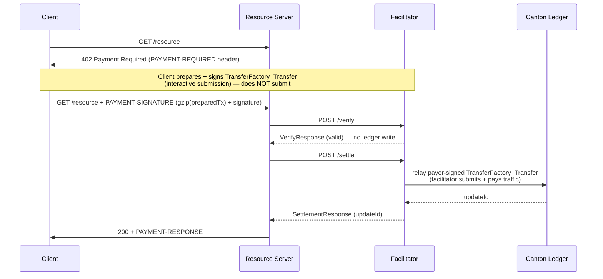

# Exact Payment Scheme for Canton Network (`exact`)

This document specifies the `exact` payment scheme for the x402 protocol on
Canton Network. The client signs a `TransferFactory_Transfer` (CIP-56 Token
Standard transfer instruction) naming the merchant as receiver, but does **not**
submit it. The client carries the complete signed transaction **inline**
(gzip-compressed) in the payment payload, so **any** facilitator can relay it —
the client is not bound to, and needs no prior relationship with, a specific
facilitator. The facilitator relays the payer-signed transaction and pays the
network traffic fee. Because the merchant holds a standing `TransferPreapproval`,
the transfer resolves directly — moving Canton Coin to the merchant in a single
facilitator-submitted transaction. No escrow, no lock step, no facilitator
custody.

## Scheme Name

`exact`

## Networks

| Network | Identifier |
|---|---|
| Canton MainNet | `canton:mainnet` |
| Canton TestNet | `canton:testnet` |
| Canton DevNet | `canton:devnet` |

## Protocol Flow

One transaction settles each payment:

- **Client (off-ledger):** signs a `TransferFactory_Transfer` — `sender = payer`,
  `receiver = merchant`, `amount`, the specific `inputHoldingCids` spent, and an
  `executeBefore` deadline — as an interactive submission. The client does not
  submit it to the ledger; it carries the complete signed submission — the
  prepared transaction (with its disclosed contracts embedded) plus the payer's
  signature — **inline and gzip-compressed** in the payment payload. The prepared
  transaction is self-contained, so any facilitator can relay it without prior
  state about this payer or payment.
- **Facilitator (on-ledger):** relays (submits) the payer-signed transaction and
  pays the traffic fee. Because the merchant holds a live `TransferPreapproval`,
  the transfer resolves `direct` and pays the merchant in one transaction. The
  facilitator signs nothing on the payer's behalf.



### Facilitator Independence

A server selects its facilitator opaquely to the client, and there may be many
facilitators. Because the signed submission travels **inline** in the payload and
is self-contained, any facilitator can relay it: the relaying participant submits
the payer-signed transaction on the payer's behalf (it neither hosts the payer
nor signs for it) and pays the traffic fee. There is no requirement that the
client be hosted on, or have any relationship with, the facilitator's
participant.

## Merchant Onboarding

Before receiving payments, the merchant MUST hold a live `TransferPreapproval`
for the Canton Coin instrument, with the merchant as receiver. The preapproval is
what lets an incoming `TransferFactory_Transfer` resolve **direct** — accepted
automatically and settled in a single transaction. Without it, the transfer
resolves to a two-step `TransferInstruction` that the merchant must accept in a
second transaction, so the facilitator cannot settle in one round-trip and MUST
reject the payment (see Verification Rule 7).

A `TransferPreapproval` is time-bounded. The merchant creates it once through its
own wallet/validator (receiver = the merchant) and reuses it for all payers, and
MUST renew it before expiry to keep the one-transaction path available.

## `PaymentRequirements` for `exact`

```json
{
  "scheme": "exact",
  "network": "canton:mainnet",
  "amount": "1000000000",
  "asset": "CC",
  "payTo": "merchant_party::1220abc...",
  "maxTimeoutSeconds": 60,
  "extra": {
    "assetTransferMethod": "transfer-factory",
    "feePayer": "ftp_facilitator::1220def...",
    "synchronizerId": "global-domain::1220xyz...",
    "instrumentId": { "admin": "DSO::1220...", "id": "Amulet" },
    "executeBeforeSeconds": 120,
    "memo": "invoice-2024-001"
  }
}
```

- `amount`: Integer string of atomic units (1 CC = 1e10 units).
  `"1000000000"` = 0.1 CC. Must match exactly what the ledger records.
- `asset`: `"CC"`. Settles Canton Coin only.
- `payTo`: Merchant's Canton party id `"<name>::<fingerprint>"`.
- `extra.assetTransferMethod`: MUST be `"transfer-factory"`.
- `extra.feePayer`: The facilitator's Canton party id — the party that relays the
  payer-signed transfer and pays its traffic fee. Clients MUST NOT alter this
  value.
- `extra.synchronizerId`: The Global Synchronizer the transfer settles on.
- `extra.instrumentId`: The Canton Coin instrument identifier
  `{ "admin": "<DSO-party>", "id": "Amulet" }`.
- `extra.executeBeforeSeconds`: Relative deadline (seconds from request time) the
  client uses to compute the absolute `executeBefore` timestamp in the transfer;
  after it, the signed transfer is no longer executable.
- `extra.memo` (optional): Seller-defined UTF-8 string, max 256 bytes. When
  present, the client MUST include it in the transfer's metadata.

## `PaymentPayload` `payload` Field

```json
{
  "x402Version": 2,
  "resource": {
    "url": "https://api.example.com/data",
    "description": "Access to protected resource",
    "mimeType": "application/json"
  },
  "accepted": {
    "scheme": "exact",
    "network": "canton:mainnet",
    "amount": "1000000000",
    "asset": "CC",
    "payTo": "merchant_party::1220abc...",
    "maxTimeoutSeconds": 60,
    "extra": {
      "assetTransferMethod": "transfer-factory",
      "feePayer": "ftp_facilitator::1220def...",
      "synchronizerId": "global-domain::1220xyz...",
      "memo": "invoice-2024-001"
    }
  },
  "payload": {
    "assetTransferMethod": "transfer-factory",
    "preparedTransaction": "<base64( gzip( prepared TransferFactory_Transfer, disclosed contracts embedded ) )>",
    "preparedTxHash": "<hex hash of the prepared tx the payer signed>",
    "signature": "<base64 ed25519 sig over preparedTxHash>",
    "hashingSchemeVersion": "HASHING_SCHEME_VERSION_V2"
  }
}
```

- `assetTransferMethod`: `"transfer-factory"`.
- `preparedTransaction`: The complete prepared `TransferFactory_Transfer` (with
  its disclosed contracts embedded), carried inline as base64 of a **single gzip
  member**. It is self-contained: the facilitator relays exactly these bytes and
  resolves nothing on the client's behalf. Encoding and size limits are defined in
  *Payload Encoding & Limits*.
- `preparedTxHash`: The hex hash of the prepared transaction the payer signed. The
  facilitator recomputes it from the decoded prepared transaction and MUST match
  this.
- `signature`: The payer's `ed25519` signature (base64) over `preparedTxHash`. The
  facilitator wraps it into the ledger's `partySignatures` for the payer party and
  derives the payer from the decoded prepared transaction's sender (Rule 8).
- `hashingSchemeVersion`: The Canton hashing scheme used to compute the signed hash
  — `HASHING_SCHEME_VERSION_V1` or `HASHING_SCHEME_VERSION_V2` (default V2).

## Payload Encoding & Limits

`payload.preparedTransaction` is the prepared transaction encoded as
`base64( gzip( bytes ) )`. Facilitators MUST enforce all of the following when
decoding it, and reject a payload that violates any of them with
`invalid_exact_canton_malformed_payload`:

- **Single gzip member.** The input MUST be exactly one gzip member: reject
  trailing bytes after the member and concatenated members, and reject the
  optional filename / comment / extra header fields.
- **Bounded decompression.** Decompress incrementally and abort as soon as either
  bound is exceeded: a compressed-size cap (RECOMMENDED ~8 KiB of gzip data) and a
  decompressed-size cap (RECOMMENDED ~64 KiB). Never allocate the output up front
  from a declared size.
- **Bounded decode.** After decompression, cap the work spent decoding the
  transaction: bound structural nesting depth, total node count, and parse time,
  and stop immediately at the first breach.

These bounds make the inline payload safe to accept from an untrusted client
(decompression-bomb, resource-exhaustion, and ambiguous-input resistance).

### Header size

HTTP servers and intermediaries supporting this scheme SHOULD accept a
`PAYMENT-SIGNATURE` header of at least 16 KiB end to end. This provides headroom
for the full payload and extension metadata: `base64(gzip(preparedTransaction))`
alone is typically 6–7 KiB, and encoding the complete `PaymentPayload` commonly
produces a header exceeding 8 KiB. Deployments that cannot accept a 16 KiB
`PAYMENT-SIGNATURE` header SHOULD use a transport, such as MCP, that does not
carry the `PaymentPayload` in an HTTP header.

## `SettlementResponse`

```json
{
  "success": true,
  "payer": "agent_party::1220...",
  "transaction": "122038abc...",
  "network": "canton:mainnet"
}
```

`transaction` is the Canton ledger `updateId` of the relayed
`TransferFactory_Transfer` execution — the single settlement transaction.
Resolvable in any SV Scan API as proof of settlement.

On failure:

```json
{
  "success": false,
  "errorReason": "invalid_exact_canton_amount_mismatch",
  "transaction": ""
}
```

## Facilitator Verification Rules (MUST)

1. **Network match.** `paymentRequirements.network` MUST equal the facilitator's
   configured network.

2. **Proof present & well-formed.** The payload MUST carry `preparedTransaction`,
   `preparedTxHash` and `signature`. If absent, reject with
   `invalid_exact_canton_missing_proof`. `preparedTransaction` MUST decode within
   the bounds of *Payload Encoding & Limits*; a malformed or over-limit payload
   rejects with `invalid_exact_canton_malformed_payload`.

3. **Signature valid.** The decoded prepared transaction MUST contain exactly one
   `TransferFactory_Transfer`, its recomputed hash MUST equal `preparedTxHash`, and
   `signature` MUST verify against the payer party over that hash. Reject with
   `invalid_exact_canton_signature_invalid`.

4. **Amount.** The transfer amount MUST equal `paymentRequirements.amount`
   converted to on-ledger Decimal (1 CC = 1e10 atomic units). Reject with
   `invalid_exact_canton_amount_mismatch`.

5. **Receiver.** The transfer receiver MUST equal `paymentRequirements.payTo`.
   Reject with `invalid_exact_canton_merchant_mismatch`.

6. **Instrument.** The transfer instrument MUST match Canton Coin
   (`extra.instrumentId`). Reject with
   `invalid_exact_canton_instrument_id_mismatch`.

7. **Preapproval.** The merchant (`payTo`) MUST hold a live `TransferPreapproval`
   for the instrument, so the transfer resolves `direct`. If it would resolve to
   a pending two-step transfer, the facilitator MUST reject **before** relaying —
   never leaving a half-settled state. Reject with
   `invalid_exact_canton_preapproval_missing`.

8. **Proven payer.** The facilitator binds the sender of the signed transfer as
   the proven payer; the client does not supply the payer.

9. **Fee payer.** `extra.feePayer` MUST equal the facilitator's own party — it is
   the relayer that submits the transfer and pays its traffic fee. Reject with
   `invalid_exact_canton_fee_payer_mismatch`.

10. **Deadline.** The transfer's `executeBefore` MUST be at least a small safety
    margin in the future at verification time. Reject with
    `invalid_exact_canton_expired`.

11. **Self-payment guard.** The proven sender MUST NOT equal the facilitator /
    `feePayer` party. Reject with `invalid_exact_canton_self_payment`.

12. **Memo.** If `paymentRequirements.extra.memo` is set, the transfer metadata
    MUST carry the identical value under `x402.memo`. Reject with
    `invalid_exact_canton_memo_mismatch`.

13. **Input sufficiency.** The input holdings embedded in the prepared transaction
    MUST have distinct contract ids and sum to at least `amount` plus the transfer's
    Amulet fees. When the facilitator's participant hosts the proven sender with read
    access, it SHOULD additionally verify each input holding is active in its ledger
    view. Reject with `invalid_exact_canton_insufficient_inputs`. Absent the
    hosted-payer check, verification does not establish the inputs are unspent; that
    is enforced only at settlement. Servers should therefore be aware that a passing
    /verify leaves residual risk of wasted resource-handler work if settlement
    subsequently fails.

## Replay & Duplicate Settlement

The payer-signed transfer names specific input holdings. Once the transfer
executes, those holdings are consumed; resubmitting the same payload references
already-spent holdings, which the ledger rejects. The replay guard is therefore
native and on-ledger — no off-chain deduplication store is required.

A facilitator MUST **relay** the signed transfer to settle. It MUST NOT treat a
previously observed `updateId` as settlement: a read of a completed update is
replayable and moves no funds, whereas relaying the signed transfer is
single-use by construction.

## Concurrency & Retry

Because each signed transfer names specific input holdings, concurrent payments
from the same payer contend for those inputs. A payment whose input holding was
consumed by a concurrent settlement fails with
`invalid_exact_canton_execute_failed`; this is transient, and the client SHOULD
retry from scratch — re-preparing and re-signing against fresh inputs. A single
payer's effective settlement parallelism is bounded by the number of distinct
spendable holdings it maintains. There is no shared nonce or sequential counter,
so payments never serialize on a per-payer counter.

## Settlement

After verification succeeds:

1. **Confirm preapproval.** Confirm the merchant holds a live
   `TransferPreapproval` for the instrument (resolves `direct`).

2. **Relay.** Submit the payer-signed `TransferFactory_Transfer` exactly as
   decoded — its execution context (instrument config, amulet rules, active open
   round) is already embedded as disclosed contracts, so the facilitator resolves
   nothing further. The facilitator is the sole submitter and pays the traffic
   fee; it signs nothing on the payer's behalf, and the funds move from the
   payer's own holdings.

3. **Confirm funds moved.** The settlement transaction consumes the payer's input
   holding and pays the merchant directly, with no pending `TransferInstruction`
   created (a pending resolution would create one — which the preapproval gate in
   Rule 7 already excludes).

4. Return `SettlementResponse` with the ledger `updateId`.

## Error Reason Codes

| Code | Meaning |
|---|---|
| `invalid_exact_canton_missing_proof` | Payload does not carry the payer-signed submission. |
| `invalid_exact_canton_malformed_payload` | `preparedTransaction` is not valid base64 / a single gzip member, or exceeds the compressed, decompressed, or decode bounds. |
| `invalid_exact_canton_signature_invalid` | `signature` does not verify against the payer over `preparedTxHash`. |
| `invalid_exact_canton_amount_mismatch` | Transfer amount ≠ `paymentRequirements.amount`. |
| `invalid_exact_canton_merchant_mismatch` | Transfer receiver ≠ `paymentRequirements.payTo`. |
| `invalid_exact_canton_instrument_id_mismatch` | Transfer instrument is not Canton Coin. |
| `invalid_exact_canton_preapproval_missing` | Merchant holds no live `TransferPreapproval`, so the transfer would not settle directly in one transaction. |
| `invalid_exact_canton_fee_payer_mismatch` | `extra.feePayer` ≠ the facilitator's own (relaying) party. |
| `invalid_exact_canton_expired` | `executeBefore` is past or within the safety margin. |
| `invalid_exact_canton_self_payment` | Proven sender equals the facilitator / `feePayer` party. |
| `invalid_exact_canton_execute_failed` | The relayed transfer was rejected on execution — e.g. an input holding was already spent (concurrent settlement) or funds were insufficient. Transient input contention SHOULD be retried. |
| `unexpected_canton_ledger_error` | Participant read failure, ledger rejection, or timeout not covered above. |

## References

- [x402 v2 spec](https://github.com/x402-foundation/x402/blob/main/specs/x402-specification-v2.md)
- [SVM scheme spec (precedent)](https://github.com/x402-foundation/x402/blob/main/specs/schemes/exact/scheme_exact_svm.md)
- [CIP-56 Canton Token Standard](https://github.com/canton-foundation/cips/blob/main/cip-0056/cip-0056.md)
- [`splice-api-token-transfer-instruction-v1` (TransferFactory / TransferInstruction)](https://github.com/hyperledger-labs/splice/tree/main/token-standard/splice-api-token-transfer-instruction-v1)
- [Splice Amulet `TransferPreapproval`](https://github.com/hyperledger-labs/splice/tree/main/daml/splice-amulet)
- [Canton network identifiers](https://docs.walletconnect.network/wallet-sdk/chain-support/canton#network-/-chain-information)
