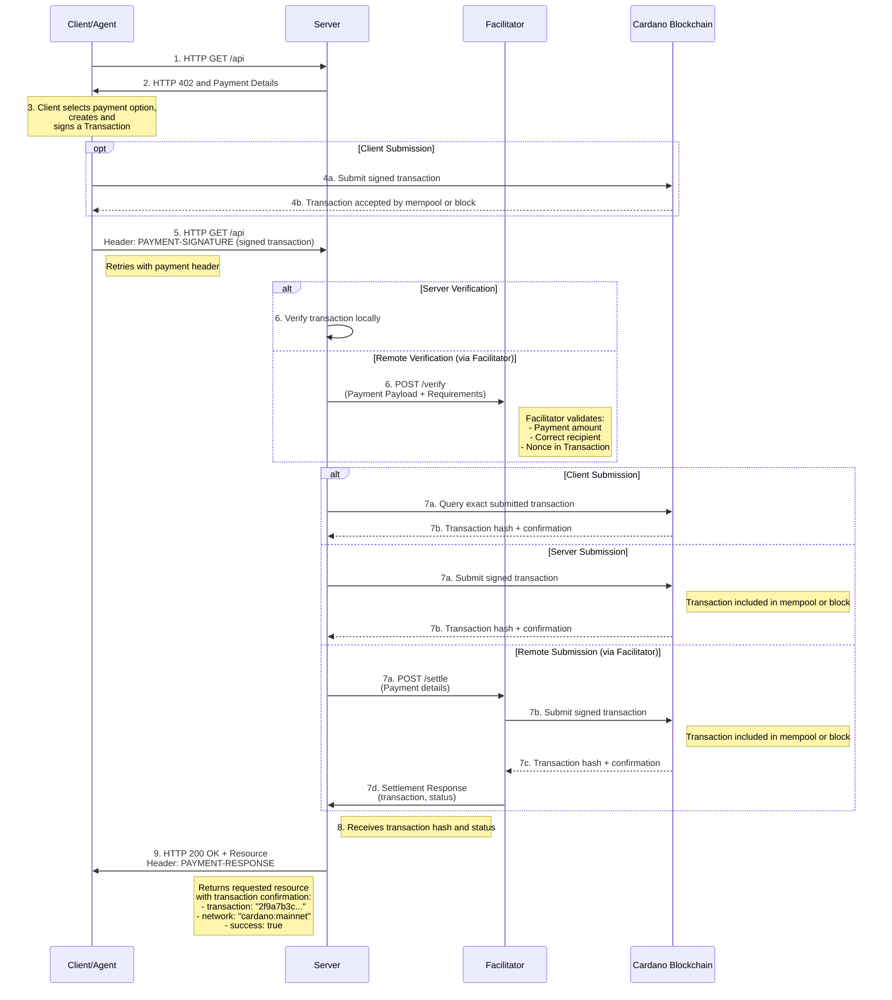
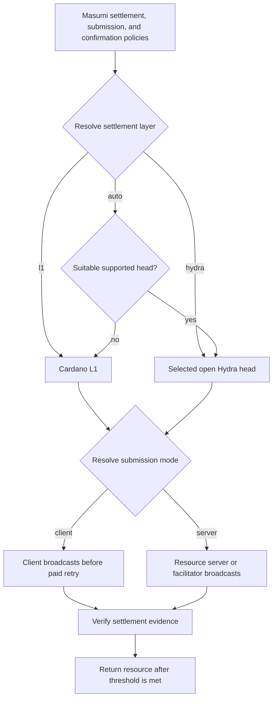

# Scheme: exact on Cardano

## Summary

This document specifies the `exact` payment scheme for the x402 protocol on Cardano. This scheme facilitates payments of Cardano Native Tokens.

It offers different assetTransferMethods to do x402 interactions:

1. Doing **Address-To-Address** Payments, similar to the regular x402 specifications on other chains.

2. Locking funds into the **Masumi** escrow (the `vested_pay` smart contract) for agent-to-agent payments with refund, result-submission, and dispute mechanics. x402 performs only the on-chain **lock**; the subsequent release/refund/dispute lifecycle is governed by the contract and the Masumi Payment Service.

3. Performing payments to **scripts** — locking funds into **any contract defined by the server**, with an optional arbitrary **datum** and script parameters applied while transaction building.

**Masumi vs. Script.** These two script-based methods serve different purposes. **Masumi** is the *concrete* agent-to-agent case: a specific deployed contract (`vested_pay`) with a fixed 19-field datum and a defined escrow lifecycle, so x402 knows the datum shape and validates it. **Script** is the *general* case: the server defines whatever contract it wants and supplies whatever datum that contract needs. Because that datum is arbitrary and contract-specific, x402 **cannot** validate its correctness — it verifies only that `payTo` is the declared script's address and attaches the datum verbatim. Use Masumi for agent payments; use Script to lock into your own contract.

**Why `assetTransferMethod` is part of the scheme and not an x402 extension.** The x402 specification reserves the two fields for different jobs: `PaymentRequirements.extra` is "scheme-specific additional information", while `extensions` carries "modular optional functionality beyond core payment mechanics". Extensions are *ignorable by construction* — servers advertise them, clients may echo them, and a payment completes correctly even when a client omits them entirely (the reference resource server explicitly passes validation in that case). The transfer method has the opposite property: it defines **where the value goes and what the payment transaction is**. A client that ignored `masumi` would pay the script address with no datum and permanently strand the funds (`vested_pay` validates nothing at lock time); a facilitator that ignored it would approve exactly such stranding locks; a server that ignored it could not declare the escrow at all. Every party has to act on the method, which makes it normative payload semantics — scheme territory, versioned with the scheme. This is also the established cross-chain pattern: EVM's `exact` scheme selects between `eip3009`, `permit2`, and `erc7710` via `extra.assetTransferMethod`, XRPL's between `sequence` and `ticketSequence`, and each facilitator implementation branches its verification on the selected method exactly as the Cardano facilitator does here. The extensions that exist in this repository (Bazaar discovery, gas sponsoring) decorate an already-chosen transfer mechanism; none defines how the asset moves.

## Network Identifiers

The canonical network identifiers for this scheme are `cardano:mainnet`, `cardano:preprod`, and `cardano:preview`. These are the only forms advertised in the `/supported` response.

These ids are valid CAIP-2 *syntax* over the `cardano` namespace, which is **not** a registered ChainAgnostic (CASA) namespace — so no strictly "canonical CAIP-2" form exists for Cardano. The scheme deliberately uses human-readable names because:

- The only standardized identifier is [CIP-34](https://cips.cardano.org/cip/CIP-0034)'s `cip34:NetworkId-NetworkMagic` form — `cip34:1-764824073` (mainnet), `cip34:0-1` (preprod), `cip34:0-2` (preview) — which disambiguates correctly but has poor developer/UX ergonomics.

Clients and facilitators **SHOULD** accept the CIP-34 forms above as **input aliases** and normalize them to the canonical id before matching, settlement, and chain selection. A facilitator MUST treat a CIP-34 alias and its canonical id as the same network (e.g. an `accepted.network` of `cip34:1-764824073` matches a `requirements.network` of `cardano:mainnet`). The alias set is closed and fixed; no other forms are recognized.

## Payment Flow

Every `assetTransferMethod` of this scheme uses the `authorization` payment flow (verify → resource → settle) defined in [Payment Flow Models](../../x402-specification-v2.md) (section 6.1): the facilitator's `verify` is read-only and `settle` (broadcast or evidence check, then confirmation) runs after the resource handler. The submission policy (who broadcasts) and the confirmation policy (how much L1 evidence is required) are orthogonal to this ordering and never change it, so `extra.paymentFlow` is not emitted for this scheme.

## Protocol Flow



The protocol flow for `exact` on Cardano is client-driven. 

1.  **Client** makes an HTTP request to a **Resource Server**.

2.  **Resource Server** responds with a `402 Payment Required` status, detailing the payment information:
    - If using the Masumi Protocol, the `extra` field will contain additional information required to build a Masumi Smart Contract interaction.
    - If using Address-To-Address payments, the `payTo` field will contain the address to which the payment must be sent.
    - If using Script payments, the `extra` field will contain parameters to be applied to scripts during transaction building.

3.  **Client** constructs and signs the transaction. In client mode, it submits the transaction before it sends the paid retry. In server mode, it leaves the transaction unsubmitted.

4.  **Client** returns the signed transaction to the **Resource Server** via the `PAYMENT-SIGNATURE` header.

5.  **Resource Server** verifies the transaction is valid:
    - **Local verification**: The server validates the transaction structure, amount, and recipient address directly.
    - **Remote verification**: The server forwards the `PAYMENT-SIGNATURE` header and `paymentRequirements` to a **Facilitator's** `/verify` endpoint to check if the transaction is valid.

6.  After successful verification, the transaction is settled:
    - **Client submission**: The **Resource Server** or **Facilitator** verifies settlement evidence for the exact transaction that the Client already submitted.
    - **Server submission**: The **Resource Server** submits the transaction directly to the Cardano blockchain.
    - **Facilitator submission**: The **Resource Server** sends the transaction to the **Facilitator's** `/settle` endpoint, which then submits it to the blockchain.

7.  The Cardano blockchain includes the transaction in the mempool or a block and returns the transaction hash and confirmation status.

8.  **Resource Server** receives the transaction hash and status:
    - If submitted via the **Facilitator**, it receives a settlement response containing the `transaction` hash and `extra.status`.
    - Cardano uses Ouroboros Praos, which has probabilistic finality. A transaction that appears in the mempool or even in a recent block can be rolled back. Granting access upon mempool inclusion (`status: "mempool"`) is therefore **strongly discouraged** and SHOULD NOT be used for any resource with real economic value. Servers that choose to accept mempool status MUST document this risk and accept full liability for rolled-back transactions.

9.  **Resource Server** grants the **Client** access to the requested resource, returning an HTTP 200 OK response with a `PAYMENT-RESPONSE` header containing:
    - `success`: Whether settlement succeeded
    - `transaction`: The Cardano transaction hash
    - `network`: The Cardano network (e.g., `cardano:mainnet`)
    - `extra.status`: The transaction status (e.g., `confirmed` or `mempool`)

### `PaymentRequired`

#### Default Schema

When the Resource Server responds with a `402 Payment Required`, it returns the payment requirements as a base64-encoded `PaymentRequired` object in the **`PAYMENT-REQUIRED` response header**. Decoded, the object has the following schema:

```js
{
  "x402Version": 2,
  "error": "PAYMENT-SIGNATURE header is required",
  "resource": {
    "url": "https://api.example.com/premium-data",
    "description": "Access to premium market data",
    "mimeType": "application/json"
  },
  "accepts": [
    {
      "scheme": "exact",
      "network": "cardano:mainnet", // cardano:preprod or cardano:preview for public testnets
      "amount": "10000", // atomic units of `asset`; USDM has 6 decimals, so 1 USDM = 1000000
      "asset": "c48cbb3d5e57ed56e276bc45f99ab39abe94e6cd7ac39fb402da47ad.0014df105553444d", // ${policyId}.${assetNameHex} — USDM on Cardano Mainnet. BOTH parts differ on Preprod: policy id e675b46e4d2242c991a8932a99db3044e80515ae14b4c4ccf6b3f4c9, asset name 0014df10745553444d. The asset name is the CIP-68 (333) label followed by the hex of 'USDM' (mainnet) / 'tUSDM' (preprod)
      "payTo": "addr1...",
      "maxTimeoutSeconds": 600, // Has to be set to a higher amount of time because of the Cardano Network speed
      "extra": {
        "submissionPolicy": "either", // optional; server, client, or either; defaults to server
        "confirmationPolicy": { "l1Confirmations": 1 }, // optional; defaults to 1
        // In case of default address-to-address payments, this may be empty or contain additional metadata
      }
    }
  ]
}
```

#### Submission and confirmation policy

`submissionPolicy` controls who submits the signed transaction. For every method, it is an optional field in `PaymentRequirements.extra`. Its values are `server`, `client`, and `either`; omission normalizes to `server`.

The paid payload MAY contain `submissionMode: "server"` or `submissionMode: "client"`. An absent value normalizes to `server`. The normalized mode MUST match the selected requirements policy. `either` is a policy, not a payload mode. A retry for the same transaction MUST use the same normalized mode.

| `submissionPolicy` | Allowed normalized `payload.submissionMode` | Submitter |
|---|---|---|
| `server` | `server` | resource server or facilitator |
| `client` | `client` | client |
| `either` | `server` or `client` | party selected by the client |

In client mode, the client broadcasts before the paid retry. The verifier MUST authenticate settlement evidence for the exact transaction and MUST NOT broadcast it again. In server mode, the resource server or facilitator verifies the transaction before broadcast.

`/supported` MAY advertise `submissionModes`. The selected policy always comes from the 402 requirements; a client MUST NOT infer it from `/supported`.

`confirmationPolicy.l1Confirmations` sets the minimum L1 evidence required before the resource is released. It is an integer from `-1` through `20`:

- `-1` means authenticated mempool acceptance.
- `0` means inclusion in a canonical block.
- `1..20` means that at least that many newer canonical blocks exist.

An absent confirmation policy normalizes to `{ "l1Confirmations": 1 }`. Greater evidence satisfies a lower threshold. The response reports the strongest verified evidence, not only the minimum.

"Authenticated" mempool acceptance means the facilitator has first-hand knowledge that a node took the transaction. When the facilitator broadcast it itself, the node's acceptance is that knowledge and it MAY settle a `-1` policy on it directly; it MUST NOT wait for block inclusion, which would settle at a stronger level than the resource server asked for and hold the response open for a full block. A facilitator that did not submit the transaction (client submission) has no such first-hand result and MUST authenticate evidence from the chain instead. Mempool acceptance can be rolled back, so a facilitator MAY refuse `-1` outright unless its operator opted in.

For all methods, the policy is a top-level `extra.confirmationPolicy` bound by the selected requirements and exact `accepted` matching. It is not part of Masumi `termsDigest`. Hydra settlement is Masumi-only and uses verified `SnapshotConfirmed` evidence instead of the L1 count.

#### Masumi assetTransferMethod Schema

> **TL;DR:** The 402 response contains all seller terms. The buyer builds one Masumi V2 lock for one asset and sends it on the paid retry.

This method supports Masumi V2 only. The buyer locks one requested asset in the deployed V2 `vested_pay` contract. x402 covers only the initial `FundsLocked` output; later Masumi state transitions are outside this scheme (see [Lifecycle boundary](#lifecycle-boundary)).

The initial request replaces `/start_job` only in the x402 flow. Native MIP-003 agents can continue to use `/start_job`. A resource server can use Masumi Payment Service, another SDK, or its own implementation.

In this section, the **requirements issuer** creates the Masumi `PaymentRequirements` and gets the seller authorization. The resource server or a service can fill this role.

The requirements contain one top-level `amount` and one `asset`. This method does not support a Masumi multi-fund payment.

`amount` MUST be a positive canonical decimal string. `asset` MUST be `lovelace` or the canonical `policyId.assetNameHex` form above.

The requirements issuer MUST generate a fresh `sellerNonce` for every new requirements object. It MUST use a cryptographically secure random generator.

It MUST store the complete requirements object, keyed by its `termsDigest`, and reuse it on the paid retry. It MUST NOT regenerate the nonce, deadlines, commitment, or policies. The first issuance for a digest is authoritative: a later response carrying the same terms MUST NOT replace it.

Before it calls a facilitator, the resource server recomputes `termsDigest` from the retry's `accepted` object and compares that object with the stored requirements. A digest it never issued, or requirements that differ from the stored copy, MUST be rejected. It binds the **first** canonical transaction ID to claim a digest, atomically; the same transaction MAY retry, and a different transaction for that digest MUST be rejected.

```js
{
  "x402Version": 2,
  "error": "PAYMENT-SIGNATURE header is required",
  "resource": {
    "url": "https://agent.example.com/weather",
    "description": "Agent job",
    "mimeType": "application/json"
  },
  "accepts": [
    {
      "scheme": "exact",
      "network": "cardano:preprod", // cardano:mainnet or cardano:preview
      "amount": "5000000", // amount locked into the escrow (of `asset`)
      "asset": "lovelace", // lovelace, or a single native token (`policyId.assetNameHex`)
      "payTo": "addr_test1w...", // the Masumi `vested_pay` escrow script address for this deployment
      "maxTimeoutSeconds": 600, // Has to be set to a higher amount of time because of the Cardano Network speed
      "extra": {
        "assetTransferMethod": "masumi",
        "submissionPolicy": "server",
        "confirmationPolicy": { "l1Confirmations": 1 },
        "inputCommitment": {
          "version": "1",
          "algorithm": "sha256",
          "parts": [
            {
              "name": "body",
              "canonicalization": "jcs",
              "mediaType": "application/json",
              "content": { "days": 3, "units": "metric" },
              "digest": "<32-byte lowercase hex>"
            }
          ],
          "digest": "<32-byte lowercase hex — equals terms.inputHash>"
        },
        "terms": {
          "version": "1",
          "paymentType": "Web3CardanoV2",
          "sellerAddress": "addr_test1q...",     // datum `seller` (key-credential address)
          "sellerReturnAddress": "addr_test1q...", // optional; omit when absent, `null` is invalid
          "sellerNonce": "<32-byte lowercase hex>",
          "buyerNonce": "",                       // empty, or 14–26 lowercase hex characters
          "agentIdentifier": "<hex>",             // omit entirely for an unregistered seller
          "inputHash": "<equals inputCommitment.digest>",
          "payByTime": "1713626260000",           // POSIX milliseconds
          "submitResultTime": "1713636260000",
          "unlockTime": "1713640260000",
          "externalDisputeUnlockTime": "1713644260000",
          "settlementPolicy": "auto"               // auto, l1, or hydra
        },
        "referenceKey": "<complete CBOR COSE_Key lowercase hex>",
        "referenceSignature": "<complete CBOR COSE_Sign1 lowercase hex>",
        "blockchainIdentifier": "<Masumi compatibility identifier lowercase hex>",
        "deployment": {                           // optional; omit for the canonical deployment
          "requiredAdmins": "2",
          "adminVkeys": ["<ordered 28-byte key hashes>"],
          "cooldownPeriod": "420000"
        }
      }
    }
  ]
}
```

`extra`, `inputCommitment`, every commitment part, `terms`, `confirmationPolicy` and `deployment` are **closed objects**: an unknown field is invalid. `terms` **MUST NOT** repeat a field that is projected into `signedTerms` from the top level. `collateral_return_lovelace` is deliberately absent — the seller never supplies or signs it (see [Escrow datum](#escrow-datum-and-client-computed-collateral)).

Wire constraints for the `extra` fields:

| Field | Constraint |
|---|---|
| `assetTransferMethod` | literal `masumi` |
| `referenceKey` | lowercase even-length hex of one complete CBOR `COSE_Key` |
| `referenceSignature` | lowercase even-length hex of one complete CBOR `COSE_Sign1` |
| `blockchainIdentifier` | lowercase even-length hex of the complete LZString-compressed compatibility identifier |
| `submissionPolicy` | optional `server`, `client`, or `either`; defaults to `server` |
| `confirmationPolicy.l1Confirmations` | optional JSON integer from `-1` through `20`; defaults to `1` |
| `areFeesSponsored` | optional boolean; MUST be `false` when present — this scheme has no fee sponsorship yet |
| `deployment.requiredAdmins` | positive canonical base-10 integer string, no greater than the length of `adminVkeys` |
| `deployment.adminVkeys` | ordered non-empty array of 28-byte lowercase hex verification-key hashes; duplicates are preserved and carry voting weight (see [Deployment and escrow address](#deployment-and-escrow-address)) |
| `deployment.cooldownPeriod` | non-negative canonical base-10 POSIX-millisecond integer string |

Constraints for `terms`:

| Field | Constraint |
|---|---|
| `version` | literal string `1` |
| `paymentType` | literal `Web3CardanoV2`. Any other value MUST be rejected — this field selects the contract generation and is not advisory |
| `sellerAddress` | key-credential Cardano address on the selected network |
| `sellerReturnAddress` | optional key-credential address on the selected network; **omitted** when absent, JSON `null` is invalid |
| `sellerNonce` | exactly 32 fresh cryptographically random bytes as 64 lowercase hex characters |
| `buyerNonce` | empty string, or 7–13 bytes as 14–26 even-count lowercase hex characters |
| `agentIdentifier` | optional `null`, empty string, or non-empty even-length lowercase hex registry asset identifier |
| `inputHash` | exactly equal to `inputCommitment.digest` |
| the four `*Time` fields | positive canonical base-10 POSIX-millisecond strings with no leading zero, satisfying the interval minimums below |
| `settlementPolicy` | `auto`, `l1`, or `hydra` |

The initial protected-resource request MAY omit a buyer nonce. An API can define one nonce source in the body, parameters, or an application header. The signed `terms.buyerNonce` field is always present and can be empty. The resource server extracts the same source on the paid retry and rejects a mismatch.

##### Lifecycle boundary

> **TL;DR:** The protected-resource request is the purchase order. Every `extra` field is issuer-derived; the buyer supplies only datum fields. x402 ends at the `FundsLocked` output.

**There is no purchase-creation step.** A `masumi` 402 answers the buyer's ordinary protected-resource request — unauthenticated, first contact, no prior handshake and no stored purchase record to look up. The requirements issuer holds that request and derives the requirements from it directly; that is what replaces `/start_job` here. No field in the 402 depends on knowing the caller's identity: [Request commitment](#request-commitment) hashes the request as received instead of MIP-004's `identifierFromPurchaser`-keyed formula, and `terms.buyerNonce` is allowed to be empty for exactly this reason.

Everything the buyer verifies before locking is issuer-derived:

| Field | Origin |
|---|---|
| `inputCommitment`, `terms.inputHash` | digest over the request content as the issuer received it |
| `terms.sellerNonce` | fresh CSPRNG value per requirements object |
| the four `*Time` fields | chosen per request, anchored to issuance time |
| `payTo` | derived from `deployment` against the canonical validator, never hand-supplied |
| `referenceKey`, `referenceSignature` | seller authorization over `termsDigest` (see [Seller-signed terms](#seller-signed-terms)) |
| `terms.sellerAddress`, `sellerReturnAddress`, `agentIdentifier` | seller configuration |
| `submissionPolicy`, `confirmationPolicy` | issuer policy |

The buyer contributes only datum fields, and none of them appear in `extra`: `buyer` is proven by the payment credential controlling `payload.nonce`, `buyer_return_address` is buyer-chosen and deliberately unmatched against `extra`, and `collateral_return_lovelace` is client-computed (see [Lock invariants](#lock-invariants)). Because `extra` and `terms` are closed objects, a buyer-supplied field in either is a rejection.

Deadlines are issued per request, not per process. A `pay_by_time` fixed once at startup drifts out of its window and the payment is then rejected, since rule 7 bounds the TTL by `maxTimeoutSeconds` while the lock invariants bound the TTL by `pay_by_time`; reusing one requirements object across buyers also collides on `termsDigest` (see [Masumi logical replay](#masumi-logical-replay)). Within a single exchange the opposite applies: the issuer stores the object and replays it verbatim on the paid retry.

**x402 ends at the `FundsLocked` output.** A settled `masumi` payment means the funds are locked in the escrow under terms both parties signed — not delivered to the seller. Releasing them runs the ordinary Masumi V2 lifecycle, which this scheme neither drives nor constrains: the seller submits a result hash (`ResultSubmitted`), the buyer may request a refund (`RefundRequested`), and a refund against a submitted result makes the escrow `Disputed` and reachable by the deployment's admin keys after `external_dispute_unlock_time` (see [Deployment and escrow address](#deployment-and-escrow-address)). The three later deadlines in the datum govern when each of those paths opens; `vested_pay` defines their exact effect, not this scheme. Masumi Payment Service, another SDK, or the resource server's own implementation drives the transitions. The deadlines and `input_hash` signed into the datum exist so that they, and any later arbitration, have a binding record of the job that was paid for.

##### Request commitment

> **TL;DR:** The server returns the exact content that it commits to. The client checks every digest and approves the content in its application context.

The commitment is built from the **content of the buyer's protected-resource request as the requirements issuer received it** — the parameters, the parsed body, and where needed the raw request bytes — and nothing else. It is what the escrow's `input_hash` binds the locked funds to, so the payment is tied to exactly the job that was requested and a later dispute can be arbitrated against it. This derivation deliberately replaces MIP-004's `SHA256(identifierFromPurchaser + ";" + canonicalJSON(input_data))`: the buyer's nonce is not an input here, which is what allows a `masumi` 402 to answer a first-contact request with no prior handshake. A Masumi Payment Service therefore cannot reproduce an x402 `input_hash` with the MIP-004 formula.

The requirements issuer returns the exact content it commits to, and the client verifies every digest before it pays. `inputCommitment.parts` is an ordered array with unique `name` values; conventional names are `parameters`, `body` and `raw`, but applications MAY define others. Every part carries:

- `name` — a unique non-empty string
- `canonicalization` — `jcs` or `raw`
- `mediaType` — optional, preserved byte-for-byte
- `content` — an RFC 8785-compatible JSON value for `jcs`, or an unpadded base64url string for `raw`
- `digest` — lowercase hex `SHA-256(partBytes)`, exactly 64 characters

For `jcs`, `partBytes = UTF-8(RFC8785-JCS(content))`. For `raw`, `partBytes = base64url-decode(content)`. A `raw` part MUST identify a stable capture point before a parser changes the bytes; for HTTP that is normally the entity body at that point, never the full HTTP message.

To build the manifest, omit each part's `content` property and the top-level `digest` property — do **not** set them to `null` or an empty value. Keep all other fields and the part order. Then:

```text
inputHash = SHA-256(
  UTF-8("masumi:x402:input:v1\n") ||
  UTF-8(JCS(manifest))
)
```

**Content echo.** Because the manifest excludes `content` by construction, omitting `content` on the wire does not change `inputHash`. `content` is therefore **REQUIRED** only for parts the issuer originates — resolved parameters, pricing terms, anything the buyer has not already seen — and **OPTIONAL** for parts derived from the client's own request bytes, which the client recomputes from what it sent. This keeps a large request body out of the `PAYMENT-REQUIRED` header without weakening the commitment.

The client **MUST** recompute every part digest and `inputHash`, using the issuer's `content` where present and its own request bytes where absent, and MUST reject a mismatch. The application **MUST** present issuer-originated content for approval before payment; the facilitator checks digests but cannot judge their application meaning. The resource server rebuilds the commitment from the signed retry and rejects a mismatch.

The complete `PAYMENT-REQUIRED` header must fit the server's actual transport limit. Servers **MUST NOT** truncate content or replace it with a URL; they SHOULD return an application error such as HTTP 413 when it does not fit, and SHOULD keep `raw` parts small. Servers **MUST NOT** capture secrets, cookies, authorization headers, x402 headers or the complete HTTP request, and MUST NOT log payment headers or committed content.

##### Seller-signed terms

> **TL;DR:** The seller signs one digest that covers the price, asset, contract, request hash, identity, deadlines, and settlement layer.

The seller signs one digest covering the price, asset, contract, request hash, identity, deadlines, and settlement layer. Client and facilitator reconstruct:

```text
signedTerms = {
  ...terms,
  scheme:              PaymentRequirements.scheme,
  assetTransferMethod: extra.assetTransferMethod,
  network:             PaymentRequirements.network,
  contractAddress:     PaymentRequirements.payTo,
  amount:              PaymentRequirements.amount,
  asset:               PaymentRequirements.asset,
  maxTimeoutSeconds:   PaymentRequirements.maxTimeoutSeconds
}

termsDigest = SHA-256(
  UTF-8("masumi:x402:terms:v1\n") ||
  UTF-8(JCS(signedTerms))
)
```

> The field set above is normative for this scheme version. `termsDigest` is only reproducible when both sides agree on it exactly, so any change to the member list is a breaking change to the scheme, not an implementation detail.

The seller calls [CIP-30](https://cips.cardano.org/cip/CIP-0030) `signData(sellerAddress, lowercaseHex(termsDigest))`; the returned `DataSignature` follows [CIP-8](https://cips.cardano.org/cip/CIP-0008). `referenceKey` carries the complete CBOR `COSE_Key` as lowercase hex and `referenceSignature` the complete CBOR `COSE_Sign1`. The attached payload is the 32-byte `termsDigest`, `hashed` is `false`, and the external AAD is empty.

Client and facilitator **MUST** decode and verify both COSE objects, checking:

- `kty = OKP (1)`, `alg = EdDSA (-8)`, `crv = Ed25519 (6)`
- a 32-byte public key with no private material
- protected `COSE_Sign1` headers carrying `alg = EdDSA (-8)` and the raw `sellerAddress`
- an unprotected `hashed = false` header and empty external AAD
- an attached payload equal to `termsDigest`
- a valid Ed25519 `Sig_structure`
- equal `kid` values when both are present
- `Blake2b-224(publicKey)` equal to the seller's payment-key credential

A `sellerAddress` with a script payment credential is invalid. The last check is what binds the signature to the **address** rather than to an arbitrary key, and MUST NOT be skipped.

##### Identity and compatibility identifier

> **TL;DR:** A non-empty signed `agentIdentifier` makes a registry claim. An omitted, `null`, or empty value means that the seller is unregistered.

A non-empty `agentIdentifier` makes a Masumi registry claim. Its first 56 hexadecimal characters MUST equal the global Masumi V2 registry policy ID `67ab0c92c4ac1610895a1c965ee50aba41a8f1513b15240723b3bd0b`; another policy is not a Masumi V2 registry. The client and facilitator **MUST** validate the asset on the selected network independently — seller authorization, metadata, endpoint, network and price — and a registered price MUST resolve to the signed top-level `amount` and `asset`. A registered price that requires more than one asset is invalid for this scheme.

An omitted, `null`, or empty `agentIdentifier` means that the seller is unregistered. The datum's `agent_identifier` is empty bytes and no component may claim registry identity or reputation. These forms select the same identity mode, but they remain different signed wire values: client and facilitator reconstruct `signedTerms` without omitting, inserting, or replacing the field.

The compatibility identifier lets Masumi tooling locate the payment:

```text
agentIdentifierHex  = terms.agentIdentifier when it is a non-empty string, otherwise ""
sellerIdentifierHex = sellerNonceHex + agentIdentifierHex

identifierText =
  sellerIdentifierHex + "." +
  buyerNonceHex + "." +
  referenceSignatureHex + "." +
  referenceKeyHex + "." +
  contractAddressBech32

blockchainIdentifier = hex(LZString.compressToUint8Array(identifierText))
```

`identifierText` is ASCII-range UTF-8. Implementations **MUST** join the encoded text values before compression and **MUST NOT** hex-decode the first four segments first. The decompressed value has five period-delimited segments; the first 64 characters of segment one are the `sellerNonce` and any remainder is `agentIdentifier`. Segment two MAY be empty and the empty segment MUST be preserved.

The following encoding-only vectors test the compatibility codec. The short key and signature values are not valid COSE objects.

**Unregistered seller with an empty buyer nonce**

| Field | Value |
|---|---|
| `sellerNonceHex` | `11` repeated 32 bytes |
| `agentIdentifierHex` | empty |
| `buyerNonceHex` | empty |
| `referenceSignatureHex` | `55` repeated 16 bytes |
| `referenceKeyHex` | `a10101` |
| `contractAddressBech32` | `addr_test1wzs4e6wc95hkwezlccjw9mdvq0r0rsgx6zk34avptga3ftgn37w4g` |

The exact `identifierText` is:

```text
1111111111111111111111111111111111111111111111111111111111111111..55555555555555555555555555555555.a10101.addr_test1wzs4e6wc95hkwezlccjw9mdvq0r0rsgx6zk34avptga3ftgn37w4g
```

The exact `blockchainIdentifier` is:

```text
230d7c6574f41d1c0acc96ade8eae04360019f607004d8809c07d005c053019cae007700bce8058680d89818c04e44002c035931a2c00daf5e00ac9bf00b6c401b80473c6535d00e6003cb8b110199db615001ca8eecc6019b58076c603b13763a80
```

**Registered seller**

| Field | Value |
|---|---|
| `sellerNonceHex` | `22` repeated 32 bytes |
| `agentIdentifierHex` | `aa` repeated 28 bytes, followed by `01` |
| `buyerNonceHex` | `01020304050607` |
| `referenceSignatureHex` | `66` repeated 16 bytes |
| `referenceKeyHex` | `a10102` |
| `contractAddressBech32` | `addr_test1wzs4e6wc95hkwezlccjw9mdvq0r0rsgx6zk34avptga3ftgn37w4g` |

The exact `identifierText` is:

```text
2222222222222222222222222222222222222222222222222222222222222222aaaaaaaaaaaaaaaaaaaaaaaaaaaaaaaaaaaaaaaaaaaaaaaaaaaaaaaa01.01020304050607.66666666666666666666666666666666.a10102.addr_test1wzs4e6wc95hkwezlccjw9mdvq0r0rsgx6zk34avptga3ftgn37w4g
```

The exact `blockchainIdentifier` is:

```text
130d7c6574f4218314e4b56f46e00602300e972d82c0662c0162c0562c0362c0763d6975b7d8f3b6f3874381e004d0402700fa005c0298067093803b802f19e4a6d05018c02715001601ac154a5006d36680560bb405b4100dc0239611ae64073001eb494192e4700e000e121e70240066610076240c0ae41e400000
```

For each vector, decompression MUST return the exact `identifierText`, including all period delimiters.

The issuer returns the complete identifier; the client does not construct it for transport. Client and facilitator reconstruct it and require:

```text
PaymentRequirements.payTo
  == signedTerms.contractAddress
  == decode(blockchainIdentifier).smartContractAddress
  == the transaction's escrow output address
```

##### Escrow datum and client-computed collateral

> **TL;DR:** The wallet builds the 19-field datum and computes structural lovelace from the final transaction. The seller does not provide collateral.

The client constructs the escrow **datum** — a Plutus `Constr 0` with the 19 ordered fields below — and attaches it as an **inline datum** on the output paying `payTo`. The scheme-level datum schema version is `masumi.vested_pay.v2`.

| # | Datum field | Value at lock | Source |
|---|-------------|---------------|--------|
| 0 | `buyer` | key address whose payment credential controls the `payload.nonce` input | client wallet |
| 1 | `buyer_return_address` | `None`, or a buyer key address | **client** — buyer-chosen, never declared |
| 2 | `seller` | seller key address | `terms.sellerAddress` |
| 3 | `seller_return_address` | `None`, or a seller key address | `terms.sellerReturnAddress` |
| 4 | `reference_key` | bytes | `extra.referenceKey` |
| 5 | `reference_signature` | bytes, length ≥ 16 | `extra.referenceSignature` |
| 6 | `seller_nonce` | bytes | `terms.sellerNonce` |
| 7 | `buyer_nonce` | bytes, possibly empty | `terms.buyerNonce` |
| 8 | `agent_identifier` | bytes, empty when unregistered | `terms.agentIdentifier` |
| 9 | `collateral_return_lovelace` | integer ≥ 0 | **client calculation** |
| 10 | `input_hash` | 32 bytes | `terms.inputHash` |
| 11 | `result_hash` | **empty** | — |
| 12 | `pay_by_time` | POSIX ms | `terms.payByTime` |
| 13 | `submit_result_time` | POSIX ms | `terms.submitResultTime` |
| 14 | `unlock_time` | POSIX ms | `terms.unlockTime` |
| 15 | `external_dispute_unlock_time` | POSIX ms | `terms.externalDisputeUnlockTime` |
| 16 | `seller_cooldown_time` | `0` | — |
| 17 | `buyer_cooldown_time` | `0` | — |
| 18 | `state` | `FundsLocked` | — |

Implementations MUST build the following Plutus Data structures. They MUST NOT encode a Cardano address as Bech32 text or as raw address bytes:

| Type | Plutus Data encoding |
|---|---|
| `Address` | `Constr 0 [paymentCredential, stakeCredentialOption]` |
| payment or stake `VerificationKey` credential | `Constr 0 [Bytes(28-byte key hash)]` |
| payment or stake `Script` credential | `Constr 1 [Bytes(28-byte script hash)]` |
| `Option<Address>.Some(address)` | `Constr 0 [address]` |
| `Option<Address>.None` | `Constr 1 []` |
| stake credential `Some(Inline(credential))` | `Constr 0 [Constr 0 [credential]]` |
| stake credential `Some(Pointer(slot, txIndex, certIndex))` | `Constr 0 [Constr 1 [Int(slot), Int(txIndex), Int(certIndex)]]` |
| stake credential `None` | `Constr 1 []` |
| every byte-string field | `Bytes` containing the decoded bytes, not hexadecimal text |
| every time, cooldown and lovelace field | `Int` |
| `FundsLocked` | `Constr 0 []` |

`buyer`, `seller` and both return addresses use **verification-key** payment credentials under this scheme, even though the CIP-57 `Address` type can represent script credentials.

**Encoding test vector.** Enterprise addresses, `None` for both return addresses: buyer payment-key hash `11` × 28, seller `22` × 28, `reference_key` `a10101`, `reference_signature` `55` × 16, `seller_nonce` `33` × 32, empty `buyer_nonce` / `agent_identifier` / `result_hash`, `collateral_return_lovelace` `1435230`, `input_hash` `44` × 32, deadlines `1785756000000` / `1785759600000` / `1785763200000` / `1785766800000`, both cooldowns `0`, state `FundsLocked`. The ledger Plutus Data CBOR is:

```text
d8799fd8799fd8799f581c11111111111111111111111111111111111111111111111111111111ffd87a80ffd87a80d8799fd8799f581c22222222222222222222222222222222222222222222222222222222ffd87a80ffd87a8043a1010150555555555555555555555555555555555820333333333333333333333333333333333333333333333333333333333333333340401a0015e65e58204444444444444444444444444444444444444444444444444444444444444444401b0000019fc75a1f001b0000019fc7910d801b0000019fc7c7fc001b0000019fc7feea800000d87980ff
```

An implementation MUST preserve the same Plutus Data tree when it decodes and re-encodes this CBOR; raw CBOR byte equality is not required.

**Collateral.** The seller never supplies or signs `collateral_return_lovelace` — the client computes it after it has selected its final addresses and output shape, from the requested asset and live protocol parameters. Let `requestedLovelace` be the top-level `amount` for a lovelace payment, or `0` for a native-token payment. The escrow output MUST satisfy:

```text
lockedLovelace = requestedLovelace + collateral_return_lovelace
```

`collateral_return_lovelace` MUST be `0` or at least **1,435,230**, and MUST be chosen so that `lockedLovelace` also clears the protocol min-UTXO of the datum **after `SubmitResult`** (a 32-byte `result_hash` and non-zero cooldowns) — otherwise the seller can never spend the escrow. For a **native-token** payment `requestedLovelace` is `0`, so a zero collateral cannot satisfy both rules and `collateral_return_lovelace` MUST therefore be at least the larger of 1,435,230 and that post-`SubmitResult` minimum. The token quantity is exact and the output carries no other native token; structural lovelace is the only extra value. Client and facilitator calculate the minimum independently.

##### Deployment and escrow address

The escrow address is deployment-specific: the validator parameters (`required_admins_multi_sig`, `admin_vks`, `cooldown_period`) are baked into the script hash, so a different parameterization yields a different address and the hash alone cannot be checked against the un-applied blueprint. This scheme uses the canonical CIP-57 blueprint from [`masumi-payment-service`](https://github.com/masumi-network/masumi-payment-service/blob/d74b2c319228bcbef36632de37875c388dcee7ce/smart-contracts/payment-v2/plutus.json):

| Property | Canonical value |
|---|---|
| datum schema | `masumi.vested_pay.v2` |
| CIP-57 validator title | `vested_pay.vested_pay.spend` |
| Plutus version | `v3` |
| blueprint digest | `SHA-256(JCS(blueprint))` = `6249de17bb87c5246106af6b0f33de22b44ca24b9c1445fa36d10eb8b583dec7` |
| default `requiredAdmins` | `2` |
| default ordered `adminVkeys` | `fc16a1fcf309aed03ec18bb2176f5ea29acea70bb79145ebaffa8e75`, `7f78161369549d8e2b138fee724c9fa606d6107a66720bdb4c48ada6`, `89eef9ea84e0ee7fe4921fa93eb2873ff6e34473f751d5d52cb75aa6` |
| default `cooldownPeriod` | `420000` ms |

When `extra.deployment` is absent, the verifier applies these default parameters. When it is present, it replaces **only** those three applied parameters against the same canonical compiled validator, preserving order and duplicate admin hashes. Either way the verifier derives the validator hash and network address itself and **MUST** require the derived address to equal `payTo`. `payTo` is never defaulted or inferred: it is signed into `signedTerms` as `contractAddress` and a mismatch is a rejection, since a look-alike `vested_pay` with different admins is a different trust domain. Preview has no canonical default and therefore requires `extra.deployment`.

An application **MUST** explicitly allow a non-default parameter set; the seller signature alone is not approval. Custom parameters need no second copy inside `signedTerms` — applying them changes the validator hash, the address contains that hash, and the signed `payTo` binds the deployment. Use the generic `script` method for any other validator or datum layout.

**What the admin keys can do.** `admin_vks` and `required_admins_multi_sig` define the escrow's dispute arbitrators, and choosing a deployment is choosing them. Their authority is deliberately narrow, but within it, absolute:

- They can settle a **`Disputed`** escrow, and only that, through the `WithdrawDisputed` redeemer. No other redeemer in `vested_pay` consults `admin_vks`, so a `FundsLocked`, `ResultSubmitted` or `RefundRequested` escrow is beyond their reach — normal completion and normal refund never involve them. An escrow becomes `Disputed` only on genuine conflict: the buyer has requested a refund *and* the seller has submitted a result hash.
- They cannot act before `external_dispute_unlock_time`, and they do not submit the settling transaction themselves. Each admin produces a CIP-8 signature over `blake2b_224(cbor(DisputeWithdrawal { own_ref, buyer_value, seller_value }))`; **anyone** may then build and land the transaction. Because `own_ref` is inside the signed payload, a signature authorizes exactly one UTxO and cannot be replayed against another — including against another deployment of the same validator.
- Settlement requires the number of `admin_vks` entries carrying a valid signature to reach `required_admins_multi_sig`.
- The signed `buyer_value` and `seller_value` are **minimum** payouts, not exact amounts. Any escrow value above their sum is unconstrained on-chain and accrues to whoever submits the transaction — an intentional finder's fee so a third party will cover the settlement cost. There is no on-chain cap on that residual: within a dispute, the admin signature set is trusted completely. Since anyone can send assets to a script address, the residual can also grow after the signatures are produced.

**Weighted voting.** `admin_vks` MAY repeat a key, and a key appearing *n* times counts *n* times toward the threshold — one physical signature filling several slots. This is intended by the contract, not a deployment bug. It means a raw count misrepresents the real authority: `requiredAdmins: 2` over `adminVkeys: [x, x, y]` is not "2 of 3", it is "`x` alone can settle". A client or wallet that surfaces a deployment for approval **MUST** present the **effective weight per distinct key** and the threshold as a fraction of total weight, never the raw array length. An issuer modelling a weighted authority MUST construct `adminVkeys` with the intended duplication.

##### Lock invariants

Because the `vested_pay` validator only runs on spend (never on the lock itself), a malformed datum is **not** rejected at lock time — it silently strands the funds. Facilitators MUST therefore enforce, and clients SHOULD validate before signing:

- `buyer` and `seller` are **public-key** (not script) credential addresses.
- The payment credential in `buyer` **controls the input named by `payload.nonce`**, and the transaction carries its valid witness. This identifies the buyer without assuming a single owner controls every input.
- No datum address is the escrow itself: `buyer`, `seller` and both return addresses MUST differ from the escrow address. `vested_pay` re-parses every output at the script address as a continuation datum (`expect new_datum: Datum`), so a payout aimed back at the escrow aborts every spend path — and Masumi's own decoder (`decodeV2ContractDatum`) rejects such a datum outright.
- The effective buyer payout target (`buyer_return_address`, else `buyer`) MUST differ from the effective seller payout target (`seller_return_address`, else `seller`); this scheme does not allow aggregated payouts.
- `state` is `FundsLocked`, `result_hash` is empty, **both cooldown timers are `0`**, and the escrow output carries **no reference script**.
- The deadlines are ordered and clear these minimum intervals: `pay_by_time + 5 min ≤ submit_result_time`, `submit_result_time + 15 min ≤ unlock_time`, `unlock_time + 15 min ≤ external_dispute_unlock_time`.
- At issuance `pay_by_time` is in the future and does not exceed the issuance time plus `maxTimeoutSeconds`; `submit_result_time` is at least 15 minutes in the future. The issuer MUST choose `maxTimeoutSeconds` large enough for its settlement expectations.
- The transaction's validity upper bound (TTL) is on or before `pay_by_time`, so the lock cannot settle after the deadline.
- The datum carries the exact COSE key and signature bytes, and `reference_signature` is at least 16 bytes.
- The collateral and value rules above hold, and the escrow output carries **exactly** the requested asset set.
- `seller_return_address` matches the signed terms exactly (declared ⇒ present in the datum with matching credentials; omitted ⇒ `None`). `buyer_return_address` is buyer-chosen and is **not** matched against `extra`.

##### Settlement and confirmation policy

> **TL;DR:** Masumi selects L1 or Hydra. Shared optional policies select the submitter and L1 evidence. Defaults are `auto`, `server`, and one confirmation.

Masumi supports Cardano L1 and Hydra settlement. `settlementPolicy` is `auto`, `l1`, or `hydra`. `auto` uses a suitable Hydra head when the client supports one and otherwise uses L1. `l1` forces L1. `hydra` requires a suitable head and does not allow fallback.

A **suitable Hydra head** is open and has a verified on-chain Init state on the selected Cardano network. Its contestation period, protocol parameters, and unique participant keys MUST be verified. The participant set MUST match an established binding between the seller and its Hydra participant. The head-opening process can establish this binding; the seller does not need to sign the head ID again in the x402 terms.

The seller or its authorized operator MUST be able to submit later V2 lifecycle transactions and to close, contest, and fan out the head. An unverified `HeadIsOpen` event or client-supplied metadata is not sufficient.

The paid payload contains `settlementLayer: "l1"` or `settlementLayer: "hydra"`. A Hydra payment also contains `headId`, the canonical lowercase 56-character hexadecimal Hydra protocol head ID from the on-chain Init transaction. It MUST NOT be a database ID, service-local name, or connection identifier. `headId` MUST be absent for L1.

Masumi uses the shared [submission and confirmation policy](#submission-and-confirmation-policy). Both fields remain in top-level `extra` and are not seller-signed.

`confirmationPolicy.l1Confirmations` is an integer from `-1` through `20`:

- `-1` means authenticated mempool acceptance.
- `0` means inclusion in a canonical block.
- `1..20` means that at least that many newer canonical blocks exist.

The default is `1`. These values are minimum evidence levels: canonical inclusion satisfies `-1`, and any greater canonical depth satisfies a lower L1 threshold. A client-submitted transaction that has left the mempool can therefore settle from canonical block evidence. Hydra requires a verified `SnapshotConfirmed` from the selected head.

The requirements issuer applies the Masumi settlement default before calculating `termsDigest`. It MUST include `settlementPolicy` in `extra.terms`. It normalizes top-level `extra.submissionPolicy` and `extra.confirmationPolicy` separately when it builds the requirements.



An internal or external facilitator MAY advertise Masumi capabilities in the matching `/supported` entry:

```json
{
  "kinds": [
    {
      "x402Version": 2,
      "scheme": "exact",
      "network": "cardano:preprod",
      "extra": {
        "assetTransferMethods": ["masumi"],
        "settlementLayers": ["l1", "hydra"],
        "areFeesSponsored": false,
        "submissionModes": ["server", "client"],
        "l1Confirmations": {
          "server": { "minimum": -1, "maximum": 20 },
          "client": { "minimum": 0, "maximum": 20 }
        }
      }
    }
  ],
  "extensions": [],
  "signers": {}
}
```

`/supported` describes available capabilities. The 402 response carries the selected policies. When `submissionPolicy` is `either`, the service MUST support every selectable submission-mode and settlement-layer combination. For L1, the selected confirmation level MUST be within both mode ranges. Otherwise the issuer MUST return separate requirements for `server` and `client` instead of `either`.

#### Script assetTransferMethod Schema

When the Resource Server requires payment to a script, the `extra` field in the `PaymentRequired` object contains additional fields required for script interactions.

```js
{
  "x402Version": 2,
  "error": "PAYMENT-SIGNATURE header is required",
  "resource": {
    "url": "https://api.example.com/premium-data",
    "description": "Access to premium market data",
    "mimeType": "application/json"
  },
  "accepts": [
    {
      "scheme": "exact",
      "network": "cardano:mainnet", // cardano:preprod or cardano:preview for public testnets
      "amount": "10000", // atomic units of `asset`; USDM has 6 decimals, so 1 USDM = 1000000
      "asset": "c48cbb3d5e57ed56e276bc45f99ab39abe94e6cd7ac39fb402da47ad.0014df105553444d", // ${policyId}.${assetNameHex} — USDM on Cardano Mainnet. BOTH parts differ on Preprod: policy id e675b46e4d2242c991a8932a99db3044e80515ae14b4c4ccf6b3f4c9, asset name 0014df10745553444d
      "payTo": "addr1...", // In case of script payments, this is the script address (the address should match the script provided in extra after applying parameters. In case of additional parameters provided, the client needs to pass the additional parameters to the server in the PAYMENT-SIGNATURE header, so that the server can reconstruct the script address and verify the payment)
      "maxTimeoutSeconds": 600, // Has to be set to a higher amount of time because of the Cardano Network speed
      "extra": {
        "assetTransferMethod": "script", // optional, can be "default" | "masumi" | "script"
        "submissionPolicy": "either", // optional; server, client, or either; defaults to server
        "confirmationPolicy": { "l1Confirmations": 1 }, // optional; defaults to 1
        // If the script assetTransferMethod is used, make sure to include all script related fields
        "scriptHash": "script_hash_here", // If the script is already on-chain, provide its hash and the client can resolve the full script
        "script": {
          // Optional full script object if not on-chain yet
          "type": "plutusV3",
          "code": "<Hex-encoded script code here>",
        },
        "parameters": {
          "param1": {"value": "Hello World", "type": "bytes"},
          "param2": {"value": 42, "type": "bigint"}
          // Script-specific parameters required for transaction building
        },
        "datum": "d8799f182aff" // optional; CBOR hex of the inline datum to attach to the payTo output
        // Additional fields for script assetTransferMethods can be added here
      }
    }
  ]
}
```

**Datum.** A contract that expects a datum on its locked UTxO declares one in `extra.datum` as **CBOR hex**; the client attaches it to the `payTo` output as an **inline datum**. This is what makes the script method able to lock funds into a real contract (most validators require a datum to be spendable — an output at a Plutus V2 script address with no datum is permanently unspendable, and a Plutus V3 validator only spends a datum-less output if it was written for the `None` case; for Plutus V1 this method cannot produce a spendable datum-bearing lock at all — see the caveat below). Omit `datum` only for scripts that spend without one.

Because the datum is arbitrary and contract-specific, **the facilitator does not verify its contents** — it cannot know what an unknown contract expects. The facilitator enforces only that `payTo` is the script address implied by `script`/`parameters` (or `scriptHash`) and attaches the datum as declared. **Providing a datum the target validator accepts is the server's responsibility**: a wrong or missing datum strands the locked funds, and x402 will not catch it. The datum is attached **inline** (PlutusV2/V3); datum-**hash** outputs (needed to later spend a PlutusV1 script) are out of scope for this method.

### `PAYMENT-SIGNATURE` Header Payload

The PAYMENT-SIGNATURE header is base64-encoded and sent in the client's request to the resource server when paying for a resource.

The payload field of the PAYMENT-SIGNATURE header must contain the following fields:

- `transaction`: The signed Cardano transaction (Base64 encoded).
- `nonce`: A UTXO reference (`txHash#index`) that is also one of the transaction's inputs. This is the replay guard the facilitator enforces (Verification Rule 5), so a payload without it MUST be rejected.
- `submissionMode`: Optional `server` or `client`. An absent value normalizes to `server`.

Example:

```js
{
  "transaction": "AAAIAQDi1HwjSnS6M+WGvD73iEyUY2FRKNj0MlRp7+3SHZM3xCvMdB0AAAAAIFRgPKOstGBLCnbcyGoOXugUYAWwVzNrpMjPCzXK4KQWAQCMoE29VLGwftex8rhIlOuFLFNfxLIJlHqGXoXA8hx6l+LMdB0AAAAAIHbPucTRIEWgO6lzqukswPZ6i72IHEKK5LyM1l9HJNZNAQBthSeHDVK8Xr5/zp3JMZPLtG5uAoVgedTA4pEnp+h8qUlUzRwAAAAAIACH0swYW/QfGCFczGnjAVPHPqZrQE5vfvJr36i6KVEFAQAC7W4K5vCwB+nprjxcNlLiOQ7SIIfyCZjmj2qSis2iTsCuzBwAAAAAIAkSUkXOoeq52GNdhwpbs+jZqqrqPdmiN3oPw5EzDIanAQAIyFNGWD6OxiFIyXSxrNEcFG0npm+nImk6InUssXb1EZgx1hwAAAAAILhsjmMKyM0n75Cd7z6ufH2LNhOMibFOGhNlLgV5RFuEAQC+Mh4kGkLwrw/11729oUQnt3xOmOreE6PcnuN6M68ZBcCuzBwAAAAAIO2PQhSSqSAawCbRr005lfjBgFOqIHo4zb2GcQ/WCxAlAAgA+QKVAAAAAAAgjiAHD0X4HNSdVPpJtf2E6W2uRc8kbvCHYkgEQ1B+w1MDAwEAAAUBAQABAgABAwABBAABBQACAQAAAQEGAAEBAgEAAQcAHrfFfj8r0Pxsudz/0UPqlX5NmPgFw1hzP3be4GZ/4LEB5XXrONxGw0qOUsq3yNKeUhOCOgCIwaa4pswKaer66EKqPGwdAAAAACBrOIN4poutFUmHfB6FbFJu8GgXoPPTGQWREqFpPfvO1B63xX4/K9D8bLnc/9FD6pV+TZj4BcNYcz923uBmf+Cx7gIAAAAAAABg4xYAAAAAAAA=",
  "nonce": "662cbf645fcd8914eb89115b83970a950493dd2fbaf39dea3b96e8cbdc132939#0",
  "submissionMode": "server"
}
```

Full PAYMENT-SIGNATURE header:

```js
{
  "x402Version": 2,
  "resource": {
    "url": "https://api.example.com/premium-data",
    "description": "Access to premium market data",
    "mimeType": "application/json"
  },
  "accepted": {
    "scheme": "exact",
    "network": "cardano:mainnet",
    "amount": "10000",
    "asset": "c48cbb3d5e57ed56e276bc45f99ab39abe94e6cd7ac39fb402da47ad.0014df105553444d",
    "payTo": "addr1...",
    "maxTimeoutSeconds": 600,
    "extra": {
      "submissionPolicy": "either",
      "confirmationPolicy": { "l1Confirmations": 1 },
      // In case of default address-to-address payments, this may be empty or contain additional metadata
    }
  },
  "payload": {
    "transaction": "AAAIAQDi1HwjSnS6M+WGvD73iEyUY2FRKNj0MlRp7+3SHZM3xCvMdB0AAAAAIFRgPKOstGBLCnbcyGoOXugUYAWwVzNrpMjPCzXK4KQWAQCMoE29VLGwftex8rhIlOuFLFNfxLIJlHqGXoXA8hx6l+LMdB0AAAAAIHbPucTRIEWgO6lzqukswPZ6i72IHEKK5LyM1l9HJNZNAQBthSeHDVK8Xr5/zp3JMZPLtG5uAoVgedTA4pEnp+h8qUlUzRwAAAAAIACH0swYW/QfGCFczGnjAVPHPqZrQE5vfvJr36i6KVEFAQAC7W4K5vCwB+nprjxcNlLiOQ7SIIfyCZjmj2qSis2iTsCuzBwAAAAAIAkSUkXOoeq52GNdhwpbs+jZqqrqPdmiN3oPw5EzDIanAQAIyFNGWD6OxiFIyXSxrNEcFG0npm+nImk6InUssXb1EZgx1hwAAAAAILhsjmMKyM0n75Cd7z6ufH2LNhOMibFOGhNlLgV5RFuEAQC+Mh4kGkLwrw/11729oUQnt3xOmOreE6PcnuN6M68ZBcCuzBwAAAAAIO2PQhSSqSAawCbRr005lfjBgFOqIHo4zb2GcQ/WCxAlAAgA+QKVAAAAAAAgjiAHD0X4HNSdVPpJtf2E6W2uRc8kbvCHYkgEQ1B+w1MDAwEAAAUBAQABAgABAwABBAABBQACAQAAAQEGAAEBAgEAAQcAHrfFfj8r0Pxsudz/0UPqlX5NmPgFw1hzP3be4GZ/4LEB5XXrONxGw0qOUsq3yNKeUhOCOgCIwaa4pswKaer66EKqPGwdAAAAACBrOIN4poutFUmHfB6FbFJu8GgXoPPTGQWREqFpPfvO1B63xX4/K9D8bLnc/9FD6pV+TZj4BcNYcz923uBmf+Cx7gIAAAAAAABg4xYAAAAAAAA=",
    "nonce": "662cbf645fcd8914eb89115b83970a950493dd2fbaf39dea3b96e8cbdc132939#0",
    "submissionMode": "server"
  }
}
```

Expanded Schema based on assetTransferMethods:

#### Masumi assetTransferMethod

```js
{
  "x402Version": 2,
  "resource": {
    "url": "https://api.example.com/premium-data",
    "description": "Access to premium market data",
    "mimeType": "application/json"
  },
  "accepted": {
    "scheme": "exact",
    "network": "cardano:preprod",
    "amount": "5000000",
    "asset": "lovelace",
    "payTo": "addr_test1w...",
    "maxTimeoutSeconds": 600,
      "extra": {
        "assetTransferMethod": "masumi",
        "submissionPolicy": "either",
        "confirmationPolicy": { "l1Confirmations": 1 },
        "inputCommitment": {
          "version": "1",
          "algorithm": "sha256",
          "parts": [
            {
              "name": "body",
              "canonicalization": "jcs",
              "mediaType": "application/json",
              "content": { "days": 3, "units": "metric" },
              "digest": "<32-byte lowercase hex>"
            }
          ],
          "digest": "<32-byte lowercase hex>"
        },
        "terms": {
          "version": "1",
          "paymentType": "Web3CardanoV2",
          "sellerAddress": "addr_test1q...",
          "sellerNonce": "<32-byte lowercase hex>",
          "buyerNonce": "",
          "inputHash": "<equals inputCommitment.digest>",
          "payByTime": "1713626260000",
          "submitResultTime": "1713636260000",
          "unlockTime": "1713640260000",
          "externalDisputeUnlockTime": "1713644260000",
          "settlementPolicy": "auto"
        },
        "referenceKey": "<complete CBOR COSE_Key lowercase hex>",
        "referenceSignature": "<complete CBOR COSE_Sign1 lowercase hex>",
        "blockchainIdentifier": "<Masumi compatibility identifier lowercase hex>"
      }
  },
  "payload": {
    "transaction": "AAAIAQDi1HwjSnS6M+WGvD73iEyUY2FRKNj0MlRp7+3SHZM3xCvMdB0AAAAAIFRgPKOstGBLCnbcyGoOXugUYAWwVzNrpMjPCzXK4KQWAQCMoE29VLGwftex8rhIlOuFLFNfxLIJlHqGXoXA8hx6l+LMdB0AAAAAIHbPucTRIEWgO6lzqukswPZ6i72IHEKK5LyM1l9HJNZNAQBthSeHDVK8Xr5/zp3JMZPLtG5uAoVgedTA4pEnp+h8qUlUzRwAAAAAIACH0swYW/QfGCFczGnjAVPHPqZrQE5vfvJr36i6KVEFAQAC7W4K5vCwB+nprjxcNlLiOQ7SIIfyCZjmj2qSis2iTsCuzBwAAAAAIAkSUkXOoeq52GNdhwpbs+jZqqrqPdmiN3oPw5EzDIanAQAIyFNGWD6OxiFIyXSxrNEcFG0npm+nImk6InUssXb1EZgx1hwAAAAAILhsjmMKyM0n75Cd7z6ufH2LNhOMibFOGhNlLgV5RFuEAQC+Mh4kGkLwrw/11729oUQnt3xOmOreE6PcnuN6M68ZBcCuzBwAAAAAIO2PQhSSqSAawCbRr005lfjBgFOqIHo4zb2GcQ/WCxAlAAgA+QKVAAAAAAAgjiAHD0X4HNSdVPpJtf2E6W2uRc8kbvCHYkgEQ1B+w1MDAwEAAAUBAQABAgABAwABBAABBQACAQAAAQEGAAEBAgEAAQcAHrfFfj8r0Pxsudz/0UPqlX5NmPgFw1hzP3be4GZ/4LEB5XXrONxGw0qOUsq3yNKeUhOCOgCIwaa4pswKaer66EKqPGwdAAAAACBrOIN4poutFUmHfB6FbFJu8GgXoPPTGQWREqFpPfvO1B63xX4/K9D8bLnc/9FD6pV+TZj4BcNYcz923uBmf+Cx7gIAAAAAAABg4xYAAAAAAAA=",
    "nonce": "662cbf645fcd8914eb89115b83970a950493dd2fbaf39dea3b96e8cbdc132939#0",
    "settlementLayer": "l1",
    "submissionMode": "client"
  }
}
```

For `settlementLayer: "hydra"`, `payload.headId` is required. It MUST be absent for L1. `submissionMode` follows the shared submission policy. An absent value normalizes to `server`; it is never `either`.

#### Script assetTransferMethod

```js
{
  "x402Version": 2,
  "resource": {
    "url": "https://api.example.com/premium-data",
    "description": "Access to premium market data",
    "mimeType": "application/json"
  },
  "accepted": {
    "scheme": "exact",
    "network": "cardano:mainnet",
    "amount": "10000",
    "asset": "c48cbb3d5e57ed56e276bc45f99ab39abe94e6cd7ac39fb402da47ad.0014df105553444d",
    "payTo": "addr1...", // script address
    "maxTimeoutSeconds": 600,
      "extra": {
        "assetTransferMethod": "script",
        "submissionPolicy": "either",
        "confirmationPolicy": { "l1Confirmations": 1 },
        "scriptHash": "script_hash_here",
        "script": {
          "type": "plutusV3",
          "code": "<Hex-encoded script code here>"
        },
        "parameters": {
          "param1": {"value": "Hello World", "type": "bytes"},
          "param2": {"value": 42, "type": "bigint"}
        }
      }
  },
  "payload": {
    "transaction": "AAAIAQDi1HwjSnS6M+WGvD73iEyUY2FRKNj0MlRp7+3SHZM3xCvMdB0AAAAAIFRgPKOstGBLCnbcyGoOXugUYAWwVzNrpMjPCzXK4KQWAQCMoE29VLGwftex8rhIlOuFLFNfxLIJlHqGXoXA8hx6l+LMdB0AAAAAIHbPucTRIEWgO6lzqukswPZ6i72IHEKK5LyM1l9HJNZNAQBthSeHDVK8Xr5/zp3JMZPLtG5uAoVgedTA4pEnp+h8qUlUzRwAAAAAIACH0swYW/QfGCFczGnjAVPHPqZrQE5vfvJr36i6KVEFAQAC7W4K5vCwB+nprjxcNlLiOQ7SIIfyCZjmj2qSis2iTsCuzBwAAAAAIAkSUkXOoeq52GNdhwpbs+jZqqrqPdmiN3oPw5EzDIanAQAIyFNGWD6OxiFIyXSxrNEcFG0npm+nImk6InUssXb1EZgx1hwAAAAAILhsjmMKyM0n75Cd7z6ufH2LNhOMibFOGhNlLgV5RFuEAQC+Mh4kGkLwrw/11729oUQnt3xOmOreE6PcnuN6M68ZBcCuzBwAAAAAIO2PQhSSqSAawCbRr005lfjBgFOqIHo4zb2GcQ/WCxAlAAgA+QKVAAAAAAAgjiAHD0X4HNSdVPpJtf2E6W2uRc8kbvCHYkgEQ1B+w1MDAwEAAAUBAQABAgABAwABBAABBQACAQAAAQEGAAEBAgEAAQcAHrfFfj8r0Pxsudz/0UPqlX5NmPgFw1hzP3be4GZ/4LEB5XXrONxGw0qOUsq3yNKeUhOCOgCIwaa4pswKaer66EKqPGwdAAAAACBrOIN4poutFUmHfB6FbFJu8GgXoPPTGQWREqFpPfvO1B63xX4/K9D8bLnc/9FD6pV+TZj4BcNYcz923uBmf+Cx7gIAAAAAAABg4xYAAAAAAAA=",
    "nonce": "662cbf645fcd8914eb89115b83970a950493dd2fbaf39dea3b96e8cbdc132939#0",
    "submissionMode": "client"
  }
}
```

### Facilitator Verification Rules

A facilitator MUST enforce all of the following rules before accepting a payment as valid. Any failure MUST result in a rejection.

1. **Network Validation**: The transaction MUST be destined for the correct Cardano network (mainnet, preprod, or preview) as declared in `PaymentRequirements.network`. The facilitator MUST reject transactions built for a different network.

2. **Recipient Verification**: At least one transaction output MUST send funds to the address specified in `PaymentRequirements.payTo`. The facilitator MUST NOT accept transactions where the recipient address differs from `payTo`.

3. **Amount Verification**: The output sent to `payTo` MUST contain a value greater than or equal to the amount declared in `PaymentRequirements.amount` for the asset identified by `PaymentRequirements.asset`. The facilitator MUST verify both the policy ID and the asset name match exactly.

4. **Asset Verification**: The asset unit in the transaction MUST exactly match `PaymentRequirements.asset` (format: `${policyId}.${assetNameHex}`). The facilitator MUST NOT accept a different asset, even one of equal market value.

5. **Nonce / Replay Prevention**: The `payload.nonce` MUST be a valid UTXO reference (`txHash#index`) included as an input in the transaction. The selected settlement ledger is Cardano L1 unless a Masumi payload selects Hydra. In server mode, before submission, the facilitator MUST verify that the nonce is unspent in the selected ledger: the current L1 UTXO set for L1, or the authenticated current UTXO state of the verified `headId` for Hydra. In client mode, authenticated settlement evidence MUST prove that the exact submitted transaction consumed the nonce in that same ledger. Hydra evidence requires a verified `SnapshotConfirmed` transition for the exact transaction and head; an unauthenticated `GetUTxO`, `HeadIsOpen` event, or snapshot from another head is not sufficient. This ensures uniqueness without requiring a Hydra UTXO to exist on L1.

6. **Submission Check**: An absent `payload.submissionMode` normalizes to `server`. The normalized mode MUST match `submissionPolicy`. In server mode, the facilitator submits only after verification, and MUST first run complete ledger **phase-1 validation** of the signed transaction — Plutus script evaluation alone is not sufficient, because it admits unbalanced and unauthenticated transactions. In client mode, it MUST verify authenticated evidence for the exact transaction and MUST NOT submit it again. `/supported` MUST advertise only the submission modes the facilitator can actually perform; a facilitator without a phase-1 validator does not offer `server`.

7. **TTL / Expiry Check**: Before first submission, the transaction's TTL (time-to-live slot) MUST not have passed. The TTL MUST NOT be later than the slot corresponding to the current network time plus `PaymentRequirements.maxTimeoutSeconds`. Both client and facilitator MUST convert wall-clock time to a slot using the current system-start and era summary; they MUST NOT compare seconds against slots as raw values, and MUST NOT assume one slot per second (this holds only from Shelley onward, and is a protocol parameter rather than a constant). After authenticated evidence proves that the selected ledger accepted the transaction within its validity interval, later confirmation checks MAY continue after the TTL.

8. **Minimum UTXO Check**: The output paying `payTo` SHOULD carry at least the protocol minimum lovelace for its serialized size, `(160 + |serialized_output|) * coinsPerUtxoByte` (see [Minimum UTXO Value](#minimum-utxo-value-min-ada)). An output below this minimum yields a transaction the node rejects at submission, so the facilitator SHOULD reject it during `verify()` rather than let `settle()` fail. Because `coinsPerUtxoByte` is governance-settable, the facilitator MUST read it from live protocol parameters. A facilitator without access to live protocol parameters MAY skip this check and rely on the node to reject an undersized output at submission.

9. **Confirmation Check**: For L1 settlement, authenticated evidence MUST meet `confirmationPolicy.l1Confirmations`. Canonical inclusion satisfies `-1`; greater canonical depth satisfies a lower threshold. A client-submitted transaction that has left the mempool MAY settle from canonical block evidence. The resource MUST NOT be released before the threshold is met.

**Masumi assetTransferMethod — additional rules.** When `requirements.extra.assetTransferMethod` is `masumi`, the facilitator MUST additionally enforce (rule 2's "recipient" is the escrow output paying `payTo`):

- **Schema.** `extra`, `inputCommitment`, each commitment part, `terms`, `confirmationPolicy` and `deployment` validate as **closed objects**; an unknown field, a `terms` field that duplicates a projected top-level field, or a missing required field is a rejection. `paymentType` MUST be `Web3CardanoV2`; any other value is rejected rather than ignored.
- **Commitment.** Every part digest and `inputCommitment.digest` recompute correctly, and `terms.inputHash` equals `inputCommitment.digest`.
- **Seller authorization.** `signedTerms` reconstructs from `terms` plus the projected `PaymentRequirements` fields, `termsDigest` recomputes, and both COSE objects decode and verify against it — including `Blake2b-224(publicKey)` equal to the seller's payment-key credential. A `sellerAddress` with a script payment credential is rejected.
- **Escrow address.** The verifier applies the canonical (or explicitly allowed custom) deployment parameters to the canonical blueprint, derives the validator hash and network address itself, and requires it to equal `payTo`. `payTo` MUST also equal `signedTerms.contractAddress` and the contract address decoded from `blockchainIdentifier`. There is **exactly one** escrow output at `payTo`.
- **Identity.** A non-empty `terms.agentIdentifier` MUST start with the global Masumi V2 registry policy ID `67ab0c92c4ac1610895a1c965ee50aba41a8f1513b15240723b3bd0b` and requires independent validation on the selected network (asset, seller authorization, metadata, endpoint, network, exact price). The registered price resolves to the signed `amount`/`asset`. An omitted, `null`, or empty value requires empty datum agent bytes and makes no registry claim.
- The output paying `payTo` carries an **inline datum** decoding against the `masumi.vested_pay.v2` schema, with `state == FundsLocked`, empty `result_hash`, and **both cooldown timers `0`**; the output carries **no reference script**.
- `seller` equals `terms.sellerAddress`, and the payment credential in `buyer` **controls the input named by `payload.nonce`** with a valid witness present. Both are **public-key** credential addresses.
- Neither participant nor either return address equals the escrow address, and the effective buyer payout target differs from the effective seller payout target (see the lock invariants above).
- `reference_key`, `reference_signature`, `seller_nonce`, `buyer_nonce`, `agent_identifier`, `input_hash` and the four time bounds in the datum match the signed terms exactly, and `reference_signature` is at least 16 bytes. `buyer_return_address` is buyer-chosen and is **not** matched; `seller_return_address` matches the signed terms exactly (declared ⇒ present with matching credentials; omitted ⇒ `None`).
- **Value.** `lockedLovelace` equals `requestedLovelace + collateral_return_lovelace`, where `requestedLovelace` is `amount` for a lovelace payment and `0` for a native-token payment; a native token MUST match `amount` exactly. The escrow output MUST carry **exactly** the requested asset set — no extra native tokens. `collateral_return_lovelace` MUST be `0` or ≥ **1,435,230**, and MUST be large enough that `lockedLovelace` clears the post-`SubmitResult` min-UTXO.
- **Deadline.** The transaction MUST carry a validity upper bound (TTL) whose slot time is on/before `pay_by_time`, and the four deadlines MUST clear the minimum intervals in the lock invariants.
- **Settlement.** `settlementPolicy` MUST allow `payload.settlementLayer`. For L1, the nonce and exact transaction MUST have authenticated evidence at or above `confirmationPolicy`: mempool or stronger canonical evidence for `-1`, and canonical inclusion/depth for `0..20`. For Hydra server submission, the nonce MUST be unspent in the authenticated current UTXO state of the verified head before broadcast. For either submission mode, a verified `SnapshotConfirmed` transition for the canonical protocol `headId` MUST prove that the exact transaction consumed that nonce. The verifier also validates the suitable head and seller-participant binding.
- **Minimum UTXO.** The escrow output MUST hold enough lovelace for the protocol min-UTXO of the datum **after `SubmitResult`** (32-byte `result_hash` + non-zero cooldowns), so the seller's later spend stays above min-UTXO. Rule 8's carve-out applies: a facilitator without live protocol parameters MAY skip this check and rely on the node's own min-UTXO rejection at submission.

A single Masumi payment locks **one** asset — lovelace, or one native token plus its structural lovelace (which covers the collateral and min-UTXO). `PaymentRequirements` carries a single `asset`/`amount`, so a multi-asset basket is out of scope for this scheme.

A valid Masumi settlement means the funds are **locked in the escrow**, not delivered to the seller; releasing them is governed by the contract in later transactions outside this scheme.

**Script assetTransferMethod — additional rules.** When `requirements.extra.assetTransferMethod` is `script`, the facilitator MUST:

- Verify `payTo` is the script address implied by the declared `script` (+ `parameters`) or `scriptHash` — i.e. reconstruct the script's payment credential and confirm it equals `payTo`'s. This binds the payment to the advertised contract; a `payTo` that is not that script address MUST be rejected.

The facilitator **MUST NOT** be expected to validate `extra.datum`: the contract is server-defined and its datum is arbitrary, so no general facilitator can judge whether the datum is correct for the target validator. The client attaches `extra.datum` to the `payTo` output verbatim as an inline datum, and the facilitator passes it through unverified. Consequently the **server owns datum correctness** — a datum the contract does not accept (or a missing datum for a contract that requires one) strands the locked funds, and this scheme provides no on-chain or facilitator guard against it. A facilitator MAY optionally reject a script payment whose `payTo` output carries no inline datum when it has reason to require one, but this is not mandated because some scripts spend without a datum.

**Plutus V1 caveat.** This method attaches datums **inline only**, but the ledger cannot represent an inline datum in a Plutus V1 script context — an output carrying an inline datum at a V1 script address cannot be spent by that script. Servers SHOULD NOT declare a `plutusV1` script together with `extra.datum` under this method (a V1 contract that requires a datum needs a datum-*hash* output, which is out of scope here), and a facilitator MAY reject that combination outright rather than let the funds strand.

### `PAYMENT-RESPONSE` Header Payload

The `PAYMENT-RESPONSE` header is base64-encoded and returned to the client by the resource server.

Once decoded, the `PAYMENT-RESPONSE` is a JSON string with the following properties:

Schema:

```js
{
  "success": true, // true or false
  "network": "cardano:mainnet",
  "transaction": "2f9a7b3c...", // Transaction hash of the payment if successful
  "extra": {
    "status": "confirmed", // "mempool" when authenticated mempool evidence is strongest
    "submissionMode": "server",
    "confirmations": 1
  },
  // Optional error field in case of failure
  "errorReason": "Utxo not found in utxo set" // Example error reason
}
```

The response reports the strongest verified evidence. Before block inclusion, `status` is `mempool` and `confirmations` is `-1`. After inclusion, `status` is `confirmed` and `confirmations` is the actual number of newer canonical blocks. That number MUST meet the selected policy before `success` is `true`.

For Masumi Hydra settlement, `extra` instead contains `settlementLayer: "hydra"`, the canonical protocol `headId`, `submissionMode`, and `status: "snapshotConfirmed"`. Masumi L1 responses contain `settlementLayer: "l1"` in addition to the shared fields.

#### Pending confirmation

If a valid transaction has not reached the required evidence level, the resource server MAY keep the request open or return HTTP 402 with `success: false`, `errorReason: "payment_pending"`, the canonical transaction ID in `extra.transactionId`, and `extra.status: "pending"`. Before block inclusion, `confirmations` is absent; after inclusion, it reports the current depth below the threshold.

The server MAY include `Retry-After`. A paid retry MUST repeat the exact original `PAYMENT-SIGNATURE`. The client MUST NOT build another transaction. The server resumes observation of the same canonical transaction ID and MUST NOT submit it again. The protected operation MUST be idempotent if it can run before settlement reaches the required evidence.

The protected handler runs once settlement reaches the required evidence, as in the other `exact` schemes. A resource server that chooses to run it earlier is responsible for making that operation idempotent across the paid retries described above.

## Transaction Fees

The **client** constructs and signs the complete transaction (Protocol Flow step 3). The Cardano network fee is a field of the transaction body, balanced against the client's own inputs — so the **client pays the fee**, alongside the asset being transferred.

The selected client, resource server, or facilitator broadcasts the already-signed transaction. Broadcasting consumes none of the submitter's funds. A facilitator does **not** require a funded wallet, only a provider connection for UTXO/slot queries and transaction submission. A facilitator MAY expose an address in `/supported` for observability, but it is not used to pay or sign.

The facilitator advertises this as `areFeesSponsored: false` in its `/supported` entry and the resource server restates it in `PaymentRequirements.extra`. It is structural rather than negotiated, so it is `false` for every Cardano `assetTransferMethod`.

**Fee sponsorship** (the facilitator paying the fee on the client's behalf) is **not supported** by this scheme version. It is achievable on Cardano through collaborative, multi-party transaction building — the facilitator contributing an input to cover the fee and co-signing the transaction — but that requires a different, interactive construction flow than the client-builds-and-signs model specified here, and is left to a future extension.

## Minimum UTXO Value (min-ada)

Every Cardano transaction output must hold at least a minimum amount of ADA, proportional to the output's serialized size. The recipient output that carries the payment is subject to this rule, so the client must provide enough ADA for it. The ledger computes the per-output minimum (Babbage era onward, unchanged in Conway; see [CIP-55](https://cips.cardano.org/cip/CIP-0055)) as:

```
minUTxO(output) = (160 + |serialized_output|) * coinsPerUtxoByte
```

- `coinsPerUtxoByte` — a protocol parameter, currently **4310 lovelace/byte** on mainnet and the public testnets. It is governance-settable, so implementations MUST read it from live protocol parameters rather than hardcode it.
- `160` — a constant overhead (20 words x 8 bytes) covering the transaction input and its entry in the UTXO map.
- `|serialized_output|` — the CBOR byte length of the output (address, value, and any datum or script reference).

Because the threshold is a function of output size, **there is no single fixed value**:

- **Pure-lovelace payment** (`asset: "lovelace"`): the requested `amount` is itself the output coin and must satisfy the formula — in practice ~1 ADA (≈ 1,000,000 lovelace) for a minimal output. An `amount` below the minimum yields an unbalanceable transaction and MUST be rejected at build time.
- **Native-asset payment** (e.g. USDM): the multi-asset entry (28-byte policy id + asset name + quantity) enlarges the output, raising the minimum to roughly **1.2–1.5 ADA**. This ADA is sent **in addition to** the token amount, is drawn from the client's inputs, and travels with the token until the recipient spends the output.

The **client** funds this min-ada — it builds and signs the transaction (see [Transaction Fees](#transaction-fees)); the **facilitator** is uninvolved. Implementations SHOULD let the transaction builder derive the exact minimum from the protocol parameters fetched during construction, rather than assume a constant, so payments stay valid across protocol-parameter changes.

## Duplicate Settlement Mitigation (RECOMMENDED)

### Vulnerability

A race condition exists in the settlement flow: if the same signed transaction is submitted to the facilitator's `/settle` endpoint multiple times before the first submission is confirmed on-chain, each call may return a successful response.

Cardano's eUTXO model provides strong replay protection once a payment settles: the transaction consumes the `nonce` UTXO (Facilitator Verification Rule 5), so any later verification of a transaction that reuses that UTXO fails because the input no longer exists in the UTXO set. However, this guard only takes effect once the spend is observable on-chain. In the window between submission and confirmation, two concurrent `/settle` calls can each verify the nonce as still unspent and submit the same transaction. Cardano nodes deduplicate transactions by hash — a transaction already in the mempool or a recent block is not re-applied — so the second submission does not double-spend, but the facilitator may still return `success` to every caller. A malicious client can exploit this to obtain access to multiple resources while only paying once.

### Recommended Mitigation

Merchants and/or Facilitators SHOULD maintain a short-term, in-memory cache of transaction payloads that are currently being settled. Before proceeding with settlement, the merchant/facilitator checks whether the transaction has already been seen:

1. After verification succeeds, derive the cache key from the **canonical Cardano transaction ID** computed over the transaction body. The key MUST NOT be the complete signed CBOR or its encoding: witness sets and equally valid CBOR encodings differ without changing the ledger transaction ID, so an encoding-level key is trivially bypassed by re-serializing the same logical transaction.
2. If the key is already present in the cache, return its cached outcome or await the in-flight first submission, and reject the duplicate settlement with a `"duplicate_settlement"` error rather than executing the protected operation twice.
3. If the key is not present, insert it into the cache — atomically, before the first `await` on submission, so concurrent calls cannot both pass the check — and proceed with submission.
4. Retain each entry until the transaction's TTL has passed **plus** the implementation's confirmation and rollback grace period. A shorter fixed timeout (e.g. a flat 120 seconds) reopens the race while the transaction can still land.

The claim SHOULD be released only after it is established that no submission occurred, or after a definitive ledger rejection, so a legitimate retry can re-attempt. A timeout, transport failure, unknown node result or mempool-only result MUST retain the claim; the service then reconciles by transaction ID.

This approach requires no external storage — only an in-process map with time-based eviction. It preserves the facilitator's otherwise stateless design while closing the duplicate settlement attack vector. Note that the cache is per-process: across multiple facilitator instances it does not deduplicate, but the on-chain nonce spend (Rule 5) remains the authoritative cross-instance replay guard.

### Implementation limits

An implementation MAY bound what it will process — transaction size and input count, inline script and datum size, script parameter count, commitment part count and content size, admin-key count — and MUST reject beyond its budget rather than process it. These budgets are implementation policy, not ledger rules.

### Masumi logical replay

Transaction-level deduplication is **not sufficient** for `masumi`. A client can build several *different* transactions from the same 402 — different inputs, change, or fee — each carrying a valid escrow datum for the same seller terms. Every one of them passes verification and locks funds, and the tx-ID cache above catches none of them, so the buyer pays repeatedly for one job.

`masumi` therefore has a logical replay key in addition to the transaction ID: **`termsDigest`**, which by construction covers the price, asset, contract, request commitment, identity and deadlines of exactly one issued 402.

- The requirements issuer MUST bind each `termsDigest` to the **first** durably claimed transaction ID, atomically, in the same record that holds the issued requirements. A retry carrying the same transaction is idempotent; a *different* transaction for the same digest is a conflict and MUST NOT start further work, even if it lands earlier in canonical ledger order. This binding is a property of the payment, not of the HTTP request that carried it.
- Once claimed, a `termsDigest` SHOULD stay bound to that transaction ID, including after rejection or expiry. A failed payment needs new requirements with a fresh `sellerNonce` — reusing the terms would reuse the signature.
- The facilitator MAY cache `termsDigest` → transaction ID → outcome as an advisory check, retained through the signed validity window plus the confirmation and rollback grace period.
- The verified `blockchainIdentifier` is a compatibility lookup key for the same record; it does not replace the `termsDigest` binding.

Every additional valid lock for one `termsDigest` is a duplicate deposit and remains governed by the Masumi V2 refund and withdrawal paths — x402 does not recover it.
