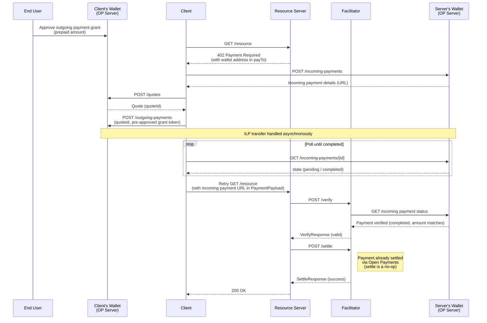

# Scheme: `exact` on `ILP` (Open Payments)

## Versions supported

- ❌ `v1` - not supported.
- ✅ `v2`

## Supported Networks

This spec uses a CAIP-2-style identifier for the Interledger Protocol:

- `ilp:openpayments` — Interledger Protocol via the [Open Payments](https://openpayments.dev) standard

## Summary

The x402 `exact` scheme on ILP uses the [Open Payments](https://openpayments.dev) standard to transfer funds between wallets. Unlike blockchain-based schemes, settlement occurs entirely within the Open Payments infrastructure before the facilitator is involved — the facilitator's role is verification only; settle is a no-op.

The client pre-authorizes an outgoing payment grant with their wallet before making requests. When a `402` is received, the client creates an incoming payment at the server's wallet, sends funds via ILP, and retries the request with the incoming payment URL as proof of payment. The facilitator verifies payment status by checking the incoming payment at the server's wallet.

## Protocol Flow



**Flow Steps:**

1. **Grant Approval** (pre-setup): End user approves an outgoing payment grant with their wallet, providing a prepaid amount for automated payments.
2. **Initial Request**: Client makes a request to the protected resource.
3. **402 Response**: Server responds with `402 Payment Required` including the Open Payments wallet address in `payTo`.
4. **Incoming Payment Creation**: Client creates an incoming payment request at the server's wallet address.
5. **Quote Creation**: Client creates a quote at their wallet's resource server, referencing the incoming payment URL.
6. **Outgoing Payment**: Client creates an outgoing payment at their wallet using the pre-approved grant token and the quote ID, triggering the ILP transfer.
7. **Poll for Completion**: Client polls the incoming payment URL until its state is `completed`. The ILP transfer is handled asynchronously by the Open Payments infrastructure.
8. **Retry with Payment**: Client retries the request with the incoming payment URL in `PaymentPayload.payload`.
9. **Verification**: Server forwards the payload to the facilitator, which fetches the incoming payment status from the server's wallet.
10. **Settlement**: Facilitator confirms payment (already settled via Open Payments — settle is a no-op).
11. **Resource Access**: Server returns the requested resource to the client.

### Prerequisites

Before making requests, the client MUST obtain a pre-approved outgoing payment grant from their Open Payments wallet. This grant allows the client to create outgoing payments without interactive user approval for each request.

## `PaymentRequirements` for `exact`

In addition to the standard x402 `PaymentRequirements` fields, the `exact` scheme on ILP requires the following:

```json
{
  "scheme": "exact",
  "network": "ilp:openpayments",
  "amount": "100",
  "asset": "USD",
  "payTo": "https://wallet.example.com/alice",
  "maxTimeoutSeconds": 300,
  "extra": {
    "assetScale": 2
  }
}
```

**Field definitions:**

- `amount`: The payment amount expressed in the smallest unit of the asset (e.g., cents for USD with `assetScale: 2`, so `"100"` = $1.00).
- `asset`: The [ISO 4217](https://en.wikipedia.org/wiki/ISO_4217) currency code (e.g., `"USD"`, `"EUR"`).
- `payTo`: The server's Open Payments wallet address URL. The client uses this to discover the server's incoming payment endpoint and create an incoming payment.
- `extra.assetScale`: Number of decimal places for the asset (e.g., `2` for USD cents, `0` for a zero-decimal currency). Populated from the wallet address discovery response.

The `asset` and `extra.assetScale` fields are populated by the server from the Open Payments wallet address endpoint. Fetching `payTo` returns a wallet address object containing `assetCode` and `assetScale`:

```json
{
  "id": "https://wallet.example.com/alice",
  "assetCode": "USD",
  "assetScale": 2,
  "authServer": "https://auth.wallet.example.com",
  "resourceServer": "https://wallet.example.com"
}
```

Servers MUST include `extra.assetScale` and `asset` in the `PaymentRequirements`. The client requires both fields to construct the incoming payment and cannot proceed without them.

## PaymentPayload `payload` Field

The `payload` field of the `PaymentPayload` MUST contain the URL of the incoming payment created at the server's wallet:

```json
{
  "incomingPaymentUrl": "https://wallet.example.com/incoming-payments/2f1b0150-db73-49e8-8713-628baa4a17ff"
}
```

**Full `PaymentPayload` object:**

```json
{
  "x402Version": 2,
  "resource": {
    "url": "https://api.example.com/premium-data",
    "description": "Access to premium market data",
    "mimeType": "application/json"
  },
  "accepted": {
    "scheme": "exact",
    "network": "ilp:openpayments",
    "amount": "100",
    "asset": "USD",
    "payTo": "https://wallet.example.com/alice",
    "maxTimeoutSeconds": 300,
    "extra": {
      "assetScale": 2
    }
  },
  "payload": {
    "incomingPaymentUrl": "https://wallet.example.com/incoming-payments/2f1b0150-db73-49e8-8713-628baa4a17ff"
  }
}
```

**Field definitions:**

- `incomingPaymentUrl`: The full URL of the incoming payment resource created at the server's wallet. The facilitator uses this to verify payment status.

## Facilitator Verification Rules (MUST)

A facilitator verifying an `exact` scheme on ILP MUST enforce all of the following checks:

### 1. Protocol Validation

> **Note:** `x402Version` validation and `payload.accepted.network` / `requirements.network` matching are enforced by the x402 framework before the mechanism's verify handler is invoked. Mechanism implementations do not need to repeat these checks.

- The `x402Version` MUST be `2` (framework-enforced).
- Both `payload.accepted.scheme` and `requirements.scheme` MUST be `"exact"`.
- `payload.accepted.network` MUST match `requirements.network` (framework-enforced).

### 2. Incoming Payment URL Validation

- `payload.incomingPaymentUrl` MUST be a valid URL.
- The host of `payload.incomingPaymentUrl` MUST match the host of `requirements.payTo`.
- The `walletAddress` field of the fetched incoming payment MUST equal `requirements.payTo`.

### 3. Payment Status

- The facilitator MUST fetch the incoming payment from `payload.incomingPaymentUrl` using an authenticated Open Payments client.
- The incoming payment `state` MUST be `"completed"`. A payment that is `"pending"` or `"processing"` MUST be retried up to an implementation-defined maximum before rejecting. A payment that is not completed after retries MUST be rejected.
- The `receivedAmount.value` of the incoming payment MUST equal `requirements.amount` exactly.
- The `receivedAmount.assetCode` MUST match `requirements.asset` (case-insensitive).
- The `receivedAmount.assetScale` MUST match `requirements.extra.assetScale` (when provided).

### 4. Time-Based Validation

- The incoming payment MUST have been created within `requirements.maxTimeoutSeconds` of the current time. The facilitator SHOULD use the incoming payment's `createdAt` timestamp for this check.
- Incoming payments older than `maxTimeoutSeconds` MUST be rejected.

### 5. Replay Prevention

- The facilitator MUST track used incoming payment URLs to prevent the same URL from being accepted more than once for distinct requests.
- An incoming payment URL MAY be reused within an implementation-defined idempotency window (e.g., 5 seconds) to handle network retries for the same request.
- After the idempotency window, the same URL MUST NOT be accepted again.

## Settlement Logic

Settlement for the `exact` scheme on ILP is a **no-op**. Funds are transferred directly between wallets by the ILP network during the client's outgoing payment and poll steps (steps 6–7 in the protocol flow). No on-chain or facilitator-driven settlement action is required.

The facilitator MUST return a successful `SettleResponse` immediately without performing any additional action.

## `SettlementResponse`

The `SettlementResponse` for the `exact` scheme on ILP:

```json
{
  "success": true,
  "transaction": "https://wallet.example.com/incoming-payments/2f1b0150-db73-49e8-8713-628baa4a17ff",
  "network": "ilp:openpayments"
}
```

The `transaction` field contains the `incomingPaymentUrl` from the payment payload — there is no blockchain transaction hash, but the incoming payment URL uniquely identifies the completed payment and serves as the audit reference. `payer` is omitted as the sender's wallet address is not exposed by the incoming payment resource.

## Security Considerations

### Wallet URL Binding

The `walletAddress` of the fetched incoming payment MUST equal `requirements.payTo`. Without this check, a client could present a completed payment made to a different wallet.

### Replay Attacks

Because the same incoming payment URL could theoretically be reused across multiple requests, facilitators MUST maintain a record of used URLs. The idempotency window accommodates legitimate network retries without allowing full replays.

### Time Window Enforcement

`maxTimeoutSeconds` bounds how old a payment can be. Facilitators MUST enforce this to prevent stale payment URLs from being reused long after the payment was made.

### Grant Token Security

The client's outgoing payment grant token is a bearer credential. Clients MUST store it securely and rotate it when compromised. The grant token is never transmitted to the resource server or facilitator.

### Settlement Atomicity

Atomicity is guaranteed by the Open Payments infrastructure — funds are fully transferred between wallets before `/verify` is ever called. There is no window in which payment can be partially settled or rolled back at the x402 layer.

## Appendix

### Open Payments Resources

- [Open Payments specification](https://openpayments.dev/introduction/overview/)
- [Interledger Protocol](https://interledger.org)
- [Open Payments TypeScript SDK](https://github.com/interledger/open-payments)

### Asset Scale

Asset scale defines the relationship between the `amount` field and the human-readable currency value:

| Currency | Asset Scale | Amount `"100"` equals |
|----------|-------------|----------------------|
| USD      | 2           | $1.00                |
| EUR      | 2           | €1.00                |
| JPY      | 0           | ¥100                 |

### Network Identifier

`ilp:openpayments` follows a CAIP-2-style `<namespace>:<reference>` format where:

- `ilp` identifies the Interledger Protocol namespace
- `openpayments` identifies the Open Payments standard as the payment rail

This design is intentionally extensible — future variants such as `ilp:spsp` (Simple Payment Setup Protocol) may be added without breaking the existing `ilp:openpayments` implementation.
