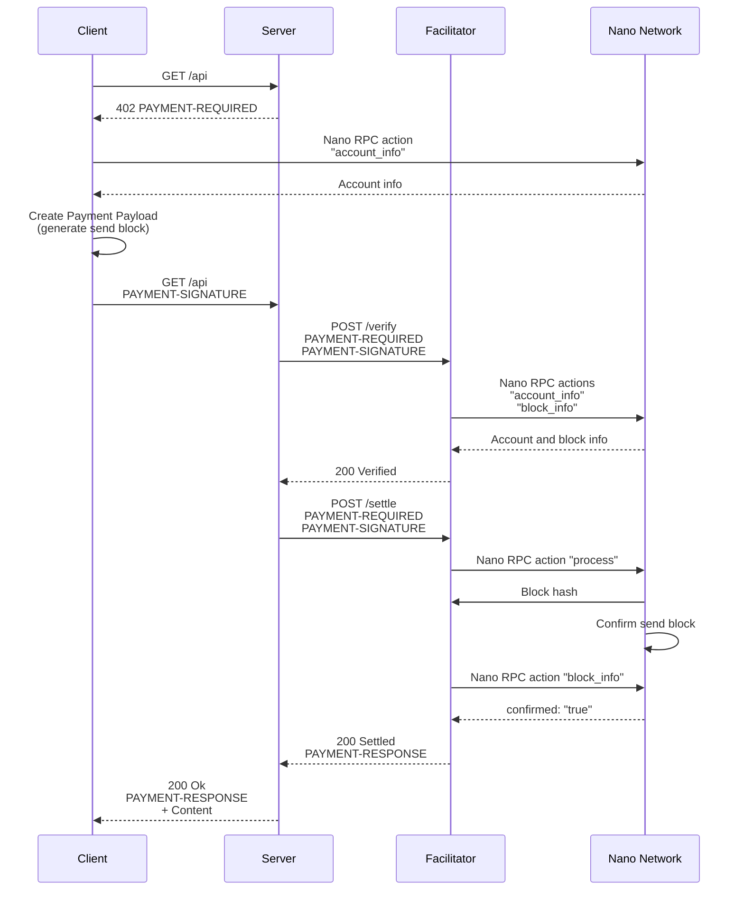

# Scheme: `exact` on `Nano`

## x402 Versions Supported

- ✅ v2

## Supported Networks

- `nano:mainnet` — Nano mainnet (Main network)
- `nano:*` — Any other Nano network

## Summary

The `exact` scheme on Nano uses send blocks for fixed-amount payments. The **`Client`** creates a [send block] based on the **`Resource Server`**'s payment requirement. The **`Facilitator`** verifies and settles this [send block] on the network. No fee calculation is required as Nano is a feeless network and network settlement typically takes about half a second.

## Protocol Flow

The high-level flow for the `exact` scheme is as follows:

1. **`Client`** sends an HTTP request to the **`Resource Server`** for a resource.
2. **`Resource Server`** responds with a `402 Payment Required` status, including `PaymentRequirements` in a `PAYMENT-REQUIRED` header specifying the `exact` scheme, network, asset `XNO`, account to `payTo`, and `amount` (in [raw units]).
3. **`Client`** constructs and signs a [send block] for the exact amount, and places it inside a `PaymentPayload`. Block construction requires communication with the Nano network to retrieve up-to-date account information.
4. **`Client`** resends the request to **`Resource Server`** with the `PaymentPayload` attached within `PAYMENT-SIGNATURE` header.
5. **`Resource Server`** forwards the `PaymentPayload` to the **`Facilitator`** for verification (`/verify`).
6. **`Facilitator`** verifies the `PaymentPayload` with the aid of communication with the Nano network to retrieve up-to-date account and block information.
7. Upon verification, the **`Resource Server`** forwards the `PaymentPayload` to the **`Facilitator`** for settlement (`/settle`).
8. **`Facilitator`** processes the [send block] contained within the `PaymentPayload` and broadcasts it to the Nano network for confirmation.
9. **`Facilitator`** polls the network for block confirmation.
10. Upon block confirmation (settlement), **`Facilitator`** communicates the confirmation hash back to the **`Resource Server`** within `PAYMENT-RESPONSE` header.
11. **`Resource Server`** delivers the paid resource to the **`Client`** along with `PAYMENT-RESPONSE` header.



## `PaymentRequirements` for `exact`

This payment requirement appears inside the `accepts` array of a `PaymentRequired` object carried in the `PAYMENT-REQUIRED` header.

```json
{
  "scheme": "exact",
  "network": "nano:mainnet",
  "asset": "XNO",
  "amount": "10000000000000000000000000000", // raw units
  "payTo": "nano_3ah94brzdm3e5nzzpstzcyxgkddt3ydgzi4478jshawrh7gtof5sb8twxqxt",
  "maxTimeoutSeconds": 120
}
```

- `scheme`: Always `exact` for this scheme.
- `network`: CAIP-2 network identifier, e.g. `nano:mainnet` (Nano mainnet)
- `asset`: This value MUST always be `XNO` as the payment is in native Nano currency. XNO is the ticker for Nano currency.
- `amount`: The amount MUST be expressed in [raw units] (1 nano unit = 10^30 raw units). For example 10000000000000000000000000000 raw units = 0.01 nano units.
- `payTo`: The Nano account that will be receiving the payment. Nano accounts are prefixed with `nano_`.
- `maxTimeoutSeconds`: The maximum number of seconds the **`Facilitator`** SHOULD check for confirmation of the send block on the Nano network.

No additional `extra` fields are required.

## `PaymentPayload` for `exact` (`PAYMENT-SIGNATURE` Header)

**`Client`** includes `PaymentPayload` inside a base64-encoded `PAYMENT-SIGNATURE` header:

```json
{
  "x402Version": 2,
  "resource": {
    "url": "https://example.com/api/data",
    "description": "Access to protected API endpoint",
    "mimeType": "application/json"
  },
  "accepted": {
    "scheme": "exact",
    "network": "nano:mainnet",
    "asset": "XNO",
    "amount": "10000000000000000000000000000", // raw units
    "payTo": "nano_3ah94brzdm3e5nzzpstzcyxgkddt3ydgzi4478jshawrh7gtof5sb8twxqxt",
    "maxTimeoutSeconds": 120
  },
  "payload": {
    "block": {
      "type": "state",
      "account": "nano_3qgmh14nwztqw4wmcdzy4xpqeejey68chx6nciczwn9abji7ihhum9qtpmdr",
      "previous": "F47B23107E5F34B2CE06F562B5C435DF72A533251CB414C51B2B62A8F63A00E4",
      "representative": "nano_1hza3f7wiiqa7ig3jczyxj5yo86yegcmqk3criaz838j91sxcckpfhbhhra1",
      "balance": "20000000000000000000000000000", // represents balance that will remain *after* the payment is performed for 'amount' in 'accepted'
      "link": "19D3D919475DEED4696B5D13018151D1AF88B2BD3BCFF048B45031C1F36D1858",
      "link_as_account": "nano_3ah94brzdm3e5nzzpstzcyxgkddt3ydgzi4478jshawrh7gtof5sb8twxqxt",
      "signature": "3BFBA64A775550E6D49DF1EB8EEC2136DCD74F....77FFF15FD11E6E2162A1714731B743D1E941FA4560A",
      "work": "ffffffd2e1234567"
    }
  },
  "extensions": {}
}
```

The payload field of the `PAYMENT-SIGNATURE` header must follow the following schema:

- `block`: The full contents of the [send block] which authorizes the transfer of [raw units] on the Nano network. During creation of the [send block], the **`Client`** will use Nano RPC action [account_info] to request the account information it needs to construct the block. Additionally a small Proof-of-Work nonce (for anti-spam purposes on the Nano network) MUST be generated and included in the block.

## Verification

For the **`Facilitator`** to verify a payment in the `exact` scheme, follow these checks in the recommended order:

1. **x402 Version Check** - `PaymentPayload.x402Version` MUST be equal to any of the **`Facilitator`**'s supported x402 versions.
2. **Asset Check** - `PaymentPayload.accepted.asset` MUST be `XNO`.
3. **Block Structure Check** - `PaymentPayload.payload.block`'s structure MUST match that of a Nano [send block].
4. **Valid Block Check** - `PaymentPayload.payload.block` MUST be validated by decoding `PaymentPayload.payload.block.account` into its 32-byte public key, computing the hash of the block (incorporating the `account`, `previous`, `representative`, `balance`, and `link` fields found inside `PaymentPayload.payload.block`), and verifying the `PaymentPayload.payload.block.signature` against that hash and public key.
5. **payTo Check** - `PaymentPayload.payload.block.link_as_account` MUST exactly match `PaymentPayload.accepted.payTo`.
6. **Frontier Hash Check** - `PaymentPayload.payload.block.previous` MUST exactly match frontier hash for `PaymentPayload.payload.block.account`. Use Nano RPC action [account_info] to query information for `PaymentPayload.payload.block.account` and check that the `frontier` field returned in the query is equal to `PaymentPayload.payload.block.previous`.
7. **Balance Check** - `PaymentPayload.payload.block.account` MUST have balance to cover payment. Use Nano RPC action [account_info] to query information for `PaymentPayload.payload.block.account` and ensure that the delta between the `balance` field (_previous_balance_) returned in the query and `PaymentPayload.payload.block.balance` (_new_balance_) is equal to `PaymentPayload.accepted.amount` (_payment_amount_). Calculation is _previous_balance_ - _new_balance_ = _payment_amount_.
8. **Work Difficulty Check** - The `PaymentPayload.payload.block.work` nonce MUST be validated to ensure it meets the network's current minimum difficulty threshold for a send transaction.
9. **Previous Confirmation Check** - **`Facilitator`** MUST verify that the calculated hash of the send block does not already exist as a confirmed block. Use Nano RPC action [block_info], passing the calculated hash of `PaymentPayload.payload.block` as a parameter, to check for previous confirmation of this hash. This step also provides fork protection (see **Appendix** later in this document).

## Settlement

The **`Facilitator`** determines settlement using a two-step approach:

1. **Processed Step** - **`Facilitator`** broadcasts `PaymentPayload.payload.block` using Nano node RPC action [process] and notes the returned hash of the processed block.
2. **Confirmed Step** - **`Facilitator`** polls the network for confirmation of the processed block's hash using Nano node RPC action [block_info]. Check for the existence of field `confirmed: "true"` in the response to determine if the block is confirmed. Polling SHOULD occur at one second intervals, up to a maximum of `maxTimeoutSeconds` specified in the initial payment requirement.

`Processed` means that the Nano node has checked the validity of the block and published the block to the network. The block is not yet confirmed.

`Confirmed` means that the block has achieved consensus on the network.

It is recommended that the **`Facilitator`** waits half a second before initial polling for block confirmation using Nano node RPC action [block_info]. As a typical Nano block confirms in half a second, this small wait should reduce the need for additional polling and provides an improved user experience for the payer.

### Successful Settlement Response

The `SettlementResponse` for the `exact` scheme:

```json
{
  "success": true,
  "payer": "nano_3qgmh14nwztqw4wmcdzy4xpqeejey68chx6nciczwn9abji7ihhum9qtpmdr",
  "transaction": "0DF7EC8E0955E2A242E3C68B36CBDD639FBB56914AF63AE87295F17D30D9C9D4",
  "network": "nano:mainnet"
}
```

Field Descriptions:

- `payer`: The Nano account that signed the send block.
- `transaction`: Confirmation hash of the send block.

The **`Resource Server`** base64-encodes the Settlement Response and sends it to **`Client`** in a `PAYMENT-RESPONSE` header:

```json
HTTP/1.1 200 OK
Content-Type: application/json
PAYMENT-RESPONSE: eyJzdWNjZXNzI.....I2NiJ9

{
  "data": "paid resource response data",
  "timestamp": "2026-08-26T10:30:00Z"
}
```

## Appendix

## Fork protection (recommended practice for **`Resource Server`** and **`Facilitator`**)

**`Resource Server`** SHOULD temporarily store the `payload.block.previous` value of any ongoing verification / settlement attempt. If any further payment attempt reaches the **`Resource Server`** with the same `payload.block.previous` field, the **`Resource Server`** should reject it. Once the ongoing payment attempt is verified and settled, the **`Resource Server`** no longer needs to store the `payload.block.previous` value. **`Resource Server`** SHOULD also first check that the block is valid before performing this step (similar to **Valid Block Check** of Verification earlier in this document).

Additionally during verification a **`Facilitator`** SHOULD check whether the send block in the payment payload has previously been confirmed on the Nano network (see **Previous Confirmation Check** of Verification earlier in this document).

Both these practices prevent accidental or malicious fork submission. Forks are blocks with the same `previous` value.

If two blocks with the same `previous` value are broadcast to the Nano network, the first block to achieve consensus will be confirmed onto the network ledger. The other block gets rejected forever.

[send block]: https://docs.nano.org/protocol-design/blocks/#state-blocks
[raw units]: https://docs.nano.org/integration-guides/the-basics/#units
[work]: https://docs.nano.org/protocol-design/spam-work-and-prioritization/#work-algorithm-details
[account_info]: https://docs.nano.org/commands/rpc-protocol/#account_info
[block_info]: https://docs.nano.org/commands/rpc-protocol/#block_info
[process]: https://docs.nano.org/commands/rpc-protocol/#process
