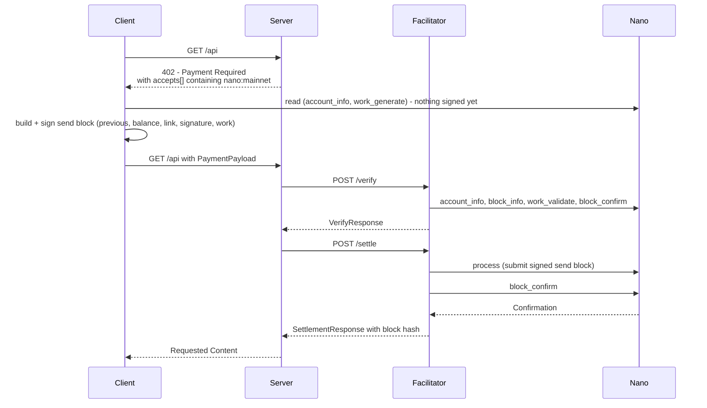

# Scheme: `exact` on `nano:mainnet`

## Summary

The `exact` scheme on Nano transfers an exact amount of Nano (XNO) from the payer to the resource
server's `payTo` account, in the `client-submitted (payment proof)` family of
[`scheme_exact.md`](./scheme_exact.md).

The payer signs a Nano `send` block and does not submit it. The payload carries the signed block, so
the proof travels with the request and can be checked without the payer holding a facilitator-signed
authorization. The facilitator submits the block during `settle`, which is what makes the block land.
Because the block names its own `previous` frontier and `balance`, the signing account's state fixes
one `settle` at most: a later transfer from that account makes the block unprocessable.

Nano has no issuer and transfers carry no network fee: the settlement's exact `amount` is the entire
cost to the payer, and no sub-cent minimum applies to a payment.

**Version Support:** This specification supports x402 v2 only. v1 fields and headers are out of scope.

## Supported Networks

Nano networks MUST use CAIP-2 identifiers:

- `nano:mainnet`

Implementations MAY support additional `nano:*` identifiers (for example a private or test network),
but this specification defines behavior only for `nano:mainnet`. An implementation that supports
another `nano:*` identifier MUST document it and MUST reject unsupported identifiers deterministically.

## References

The wire behavior below is not proposed here: it is the behavior of four shipped implementations and
of the open PR that first specified it, [`#3432`](https://github.com/x402-foundation/x402/pull/3432).
This document is the network implementation file for that scheme, written against those artifacts:

- `@x402nano/exact` — TypeScript, both sides (x402nano).
- `x402-nano-exact` — Python resource-server scheme for the `x402` Python SDK
  ([pursekeeper/x402-nano-exact](https://github.com/pursekeeper/x402-nano-exact)).
- `facilitator.pursekeeper.dev` — a live Nano facilitator implementing the verification checks in this
  document and settling third-party payments; its `/supported` is the public reference for the
  `extra` fields below.

## Protocol Flow



1. **Client** requests a protected resource.
2. **Resource server** responds `402 Payment Required` with a v2 `PaymentRequired` carrying a
   `nano:mainnet` entry in `accepts[]`.
3. **Client** reads `account_info` for its payer account (frontier, balance, representative) and
   generates proof of work over that frontier.
4. **Client** builds and signs a Nano `send` block for exactly `amount` raw to `payTo`, and does not
   submit it.
5. **Client** retries the request with a v2 `PaymentPayload` carrying the signed block.
6. **Resource server** calls facilitator `verify` with the payload and the selected
   `PaymentRequirements`.
7. On success, the resource server calls facilitator `settle`. The facilitator submits the block with
   `process` and waits for confirmation.
8. On success, the resource server releases the resource and returns `PAYMENT-RESPONSE`.

Nothing is signed for a route the client does not pay: reading `account_info` and generating work are
free and unauthenticated, so the `authorization` flow can be attempted without risk of a charge.

## `PaymentRequirements` for `exact`

`PaymentRequirements` follows the core v2 schema. Nano has one asset (XNO) and the recipient's
address is the instrument, so `payTo` doubles as the recipient and as the transfer's destination.

```json
{
  "scheme": "exact",
  "network": "nano:mainnet",
  "amount": "10000000000000000000000000000",
  "asset": "XNO",
  "payTo": "nano_1111111111111111111111111111111111111111111111111111hifc8npp",
  "maxTimeoutSeconds": 300,
  "extra": {
    "asset": "XNO",
    "work": "required",
    "workThreshold": "fffffff800000000"
  }
}
```

### Field Notes

- `amount`: **raw units, decimal string**. 1 XNO is `10^30` raw (the smallest unit). The wire value is
  always raw, so `"10000000000000000000000000000"` is 0.01 XNO. Implementations MUST NOT put a decimal
  point on the wire, and MUST NOT round to a fiat-style precision such as 6 decimals.
- `asset`: `XNO`, the network's only native unit.
- `payTo`: the recipient's Nano address. Implementations SHOULD accept `nano_` and the legacy `xrb_`
  prefix as input and MUST emit `nano_`.
- `maxTimeoutSeconds`: positive integer. It bounds the facilitator's polling (see Replay and Expiry),
  and does not expire the signed block.
- `extra.asset`: MUST equal `asset` when present. Kept for parity with shipped implementations.
- `extra.work`: `"required"`. Settlement is a single submitted block, so the payer's work is a
  verification criterion, not an option.
- `extra.workThreshold`: the send-block difficulty a client MUST meet, as a 16-character hex string.
  Servers SHOULD copy the value the selected facilitator advertises in `/supported`, because the
  threshold is a versioned protocol parameter; `fffffff800000000` is the current mainnet send
  threshold (node v21+; receive blocks use `fffffe0000000000`).
- `extra` MAY contain additional metadata, but unknown keys MUST NOT change verification of amount,
  recipient, asset, frontier, or work.
- Discovery hints for onboarding a client that does not yet hold XNO belong in the `rail-hint`
  extension proposed in [#3144](https://github.com/x402-foundation/x402/issues/3144), not here.

## `PAYMENT-SIGNATURE` Payload

The Nano exact payload carries one signed `send` block:

```json
{
  "signedBlock": {
    "type": "state",
    "account": "nano_1jwwcrj9ps8rqi9rbpmw39mrar7ush7r1tibs9qhwwt146yi6m118rpmhru1",
    "previous": "66b5E8C3...C4CF",
    "representative": "nano_1jwwcrj9ps8rqi9rbpmw39mrar7ush7r1tibs9qhwwt146yi6m118rpmhru1",
    "balance": "999900000000000000000000000000",
    "link": "nano_1111111111111111111111111111111111111111111111111111hifc8npp",
    "link_as_account": "nano_1111111111111111111111111111111111111111111111111111hifc8npp",
    "signature": "9F0A...4C2E",
    "work": "2bf29ef00786a6bc"
  }
}
```

`signedBlock` is the same object the Nano node accepts in `process`: everything in it is covered by
the signature except `work`, which is verified separately against `previous`. A conforming
implementation MUST verify the signature over the block's own fields — no facilitator-supplied
wrapper is signed — which is why this scheme has no equivalent of a Solana `feePayer` or a NEAR
relayer account to describe.

### Field Notes

- `balance`: the account's balance **after** the payment, decimal string in raw. `amount` is
  `previousBalance - balance`, so a payer whose signed `balance` does not match the requirement cannot
  be settled for less and still verify.
- `previous`: the frontier of the payer account this block extends. This is the replay primitive, and
  it is why the block can be verified statelessly.
- `link`: the recipient, encoded as a Nano address. Some implementations carry the same value under
  `link_as_account`; verifiers MUST accept either key and MUST reject a payload where both are present
  and disagree.
- `signature`: 128-character uppercase hex, the Ed25519-Blake2b signature over the block. A malformed
  or non-canonical signature MUST be rejected (`invalid_signature`), never repaired.
- `work`: 16-character hex nonce validating `previous` at `extra.workThreshold` (see Work
  Requirement).

## Facilitator Verification Rules (MUST)

A facilitator verifying a Nano `exact` payment MUST reject any payload that fails any rule below.

### 1. Version, Scheme, and Network

- `payload.x402Version` MUST equal `2`.
- `payload.accepted.scheme` and the required scheme MUST both be `exact`.
- `payload.accepted.network` MUST equal `PaymentRequirements.network` and MUST be a `nano:*`
  identifier this implementation supports (`nano:mainnet` here).

### 2. Requirement Consistency

- `asset`, `payTo`, and `amount` in `payload.accepted` MUST exactly match `PaymentRequirements`.
- `payTo` MUST be a well-formed Nano address (prefix, encoding, and checksum).
- `amount` MUST be a positive integer string in raw.
- `maxTimeoutSeconds` MUST be an integer greater than `0`.
- `extra`, when present, MUST NOT alter the required transfer target, amount, frontier, work
  threshold, or settlement semantics.

### 3. Block Structure

- `payload.signedBlock` MUST be present and MUST be a state block with `type` `"state"`.
- `account`, `previous`, `representative`, and `link` MUST be well-formed Nano addresses and
  `signature` MUST be 128-character hex.
- `balance` MUST be a decimal string in raw, and `work` MUST be 16-character hex.
- Unknown keys MAY be ignored, but a payload that cannot be decoded MUST be rejected.

### 4. Signature

- The Ed25519-Blake2b signature MUST verify against the block's own fields (account, previous,
  representative, balance, link) with the public key decoded from `account`.
- Verification MUST fail closed if the block cannot be reconstructed for signing.

### 5. Account State and Frontier

- The facilitator MUST query `account_info` for `account` and reject the payload if the account does
  not exist or is not yet open (`account_not_found`).
- `signedBlock.previous` MUST equal `account_info.frontier` (`frontier_mismatch`, or a distinct
  `frontier_moved` when the frontier changed between verify and settle; see Settlement).
- `signedBlock.balance` MUST be strictly less than `account_info.balance`, so a block that transfers
  nothing or a negative amount cannot be settled (`invalid_balance_delta`).
- `account_info.balance - signedBlock.balance` MUST equal `PaymentRequirements.amount` exactly
  (`amount_mismatch`). Overpayment is not a passing outcome: the payload's unsigned-for diff is
  compared to the requirement, and the two must be equal.
- `signedBlock.representative` MUST equal `account_info.representative`. A block that sets a different
  representative silently re-delegates the payer's voting weight, so it MUST NOT be accepted as a
  plain payment. A client that legitimately needs to change its representative includes that change in
  a publishable block of its own.
- If `account_info` cannot be read from the configured node, verification MUST fail closed.

### 6. Destination

- `link` (or `link_as_account`) MUST equal `PaymentRequirements.payTo` (`destination_mismatch`).

### 7. Work Requirement

- The facilitator MUST validate the proof of work with `work_validate` over `hash = previous` — the
  work is computed over the frontier, not over the block hash — at the required difficulty
  (`extra.workThreshold`, or the implementation's current mainnet send threshold), and MUST reject on
  failure (`insufficient_work`).
- The facilitator MUST NOT accept a payload whose `work` merely parses.

### 8. Replay and Expiry

- A signed send block has **no expiry**: it stays valid until the account's frontier changes, however
  long that takes. `maxTimeoutSeconds` bounds the facilitator's polling, not the block's validity. A
  facilitator MUST NOT report expiry as the failure of a block whose frontier is unchanged.
- Single-use is enforced by the chain: consuming the block moves the frontier, so a resubmission can
  never settle twice. A facilitator SHOULD still return a distinct reason (`already_settled` or
  `frontier_moved`) rather than submitting a block it can see is stale.
- Verifiers MUST NOT treat `previous` as reusable across accounts: it is an account-relative value.

## Settlement

Settlement is one submission of the client's block. It is `upfront`-shaped in effect — nothing is
charged unless the resource server settles — and the finality boundary is the block's confirmation.

1. Re-read `account_info` for the payer account.
2. If the frontier still equals `signedBlock.previous`, submit the block with `process`.
3. If the frontier has moved, return `success: false` with `errorReason` `frontier_moved`. The client
   MUST refetch `account_info`, re-sign with the new `previous`, `balance` and `representative`, and
   re-present. A generic error here is a spec violation: without a distinct reason a client cannot
   tell a stale frontier from a bad payment and will not retry.
4. Wait until the block is confirmed, then return `success: true` with the block hash. A `process`
   acknowledgement is not confirmation: settlement success MUST reflect the on-chain effect, not the
   submission's return code.
5. On failure, return `success: false` with an implementation-specific `errorReason` and no
   transaction hash.
6. On `success: false`, `payer` MUST be omitted unless it has been independently verified from chain
   state. `payer` MUST NOT be taken from untrusted client-claimed payload fields.

### Withdrawing an unsettled block

A client that has handed out a signed block and no longer wants it settled publishes any block on the
same account, for example a `change` block with the same representative and balance. That moves the
frontier and invalidates the outstanding send. A resource server SHOULD discard payloads it does not
settle promptly, and MUST re-check the original block hash before accepting a replacement block for
the same request, so a re-signed payment cannot be substituted after an earlier one was accepted.

### Duplicate Settlement Mitigation (RECOMMENDED)

The same race the [SVM scheme](./scheme_exact_svm.md#duplicate-settlement-mitigation-recommended) and
the [NEAR scheme](./scheme_exact_near.md#10-duplicate-settlement-mitigation-recommended) describe
applies here, with one difference: the chain itself makes double settlement impossible, and it does so
with no blockhash lifetime and no block-height window to evict on.

**Vulnerability.** Two `/settle` calls for the same payload can both observe a successful
submission: the first moves the frontier, the second is rejected by the node as a fork or gap, but a
facilitator that reads only its own submission status may report success to both callers. A malicious
client could obtain two resources for one payment.

**Recommended Mitigation.** Facilitators SHOULD keep a short-term in-memory cache keyed by a hash of
the signed block (`previous` plus `signature` is sufficient and unambiguous):

1. After verification succeeds, derive the cache key from the signed block.
2. If the key is already present, reject settlement with `duplicate_settlement`.
3. Otherwise insert the key before submitting, and process.
4. Evict after the block is confirmed, or after the payer account's frontier is observed to have moved
   past `signedBlock.previous` (at which point the block can no longer land).

This needs no external storage and no long-lived state — an in-process map with the two eviction
triggers above — and it preserves the facilitator's otherwise stateless design.

## `PAYMENT-RESPONSE` Example

Success:

```json
{
  "success": true,
  "transaction": "66B5E8C352E10D6D7078CD9562F7501F41E318E3D4AC3C12B00511B1F96CD4CF",
  "network": "nano:mainnet",
  "payer": "nano_1jwwcrj9ps8rqi9rbpmw39mrar7ush7r1tibs9qhwwt146yi6m118rpmhru1"
}
```

Failure:

```json
{
  "success": false,
  "errorReason": "frontier_moved",
  "transaction": "",
  "network": "nano:mainnet"
}
```

## `SettlementResponse` Field Notes

- `transaction`: the settled send block hash, uppercase hex. Publishable at any Nano explorer.
- `payer`: the payer account. Include only when it was verified from the block and the account state,
  never from the payload alone.

## Appendix

### Implementing Verification Against a Nano Node

The checks in §§5–7 use only standard Nano node RPC methods. No custom endpoint and no archival node
is required:

- **Account state (frontier, balance, representative, open status):** `account_info`
  (`{"account": ..., "representative": true, "receivable": false}`). The `frontier` field is the
  replay primitive; `balance` and `representative` are compared against the signed block.
- **Work validation:** `work_validate` with `hash` = `previous` and `difficulty` = the required
  threshold; it returns `{valid: "1"}` or `{valid: "0"}`. Work is generated over the frontier, so a
  client that computes it over the block hash fails here, as it should.
- **Confirmation:** `block_confirm` (or `block_info`) for the settled block hash. Treat a submission
  acknowledgement as pending, not settled.
- **Signature:** no RPC is needed. The Ed25519-Blake2b signature over the block's own fields is
  verifiable offline against the public key encoded in `account`.

Implementations SHOULD pin one node for a verify/settle pair so the frontier they read is the frontier
they act on, and MUST fail closed when node state cannot be read. A facilitator MAY use several nodes,
in which case it MUST treat a disagreement about the frontier as a failure to determine state.

### Amounts and Precision

The fixed supply is about `1.33 × 10^8` XNO, so every amount is representable in `10^30` raw with room
to spare. Implementations SHOULD parse raw amounts as integers, not floating point, and SHOULD reject
an XNO price with more than 30 decimal places rather than rounding it: rounding a price changes what
the payer was asked to pay. A price above the total supply is almost certainly raw units typed where
XNO was meant, and SHOULD be rejected as such.

### Transport Header Mapping (HTTP v2)

- `PAYMENT-REQUIRED`: carries `PaymentRequired`.
- `PAYMENT-SIGNATURE`: carries `PaymentPayload`.
- `PAYMENT-RESPONSE`: carries `SettlementResponse`.

### References

- [x402 Core Specification v2](../../x402-specification-v2.md)
- [HTTP Transport v2](../../transports-v2/http.md)
- [Exact Scheme Overview](./scheme_exact.md)
- [Nano protocol: block types and state blocks](https://docs.nano.org/protocol-design/blocks/)
- [Nano node RPC: `account_info`, `work_validate`, `process`, `block_confirm`](https://docs.nano.org/commands/rpc-protocol/)
- [`x402nano/exact`](https://github.com/x402nano/exact) — TypeScript implementation
- [`pursekeeper/x402-nano-exact`](https://github.com/pursekeeper/x402-nano-exact) — Python SDK implementation
