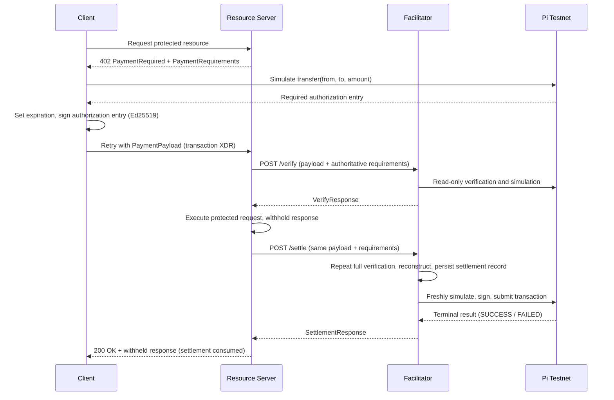

# Scheme: `exact` on `pinet` (Pi Network)

## Versions supported

This scheme only supports x402 `v2`.

## Supported Networks

This specification uses the Pi Network [CAIP-2](https://namespaces.chainagnostic.org/pinet/caip2) namespace, whose registration is pending review in [ChainAgnostic/namespaces#199](https://github.com/ChainAgnostic/namespaces/pull/199):

| Network         | Network passphrase | Estimated ledger seconds |
| --------------- | ------------------ | ------------------------ |
| `pinet:testnet` | `Pi Testnet`       | 5                        |

Network passphrases are case-sensitive and are part of the Soroban authorization signature domain. `pinet:mainnet` is not supported by this version of the scheme.

The native Pi asset contract on `pinet:testnet` is:

```text
CDG6ZM2SHXIHD5HZ2E62B7D76RY5DUHDNQVPSHRVDNN7W4EW47FXLEXQ
```

The contract ID is derived from the native asset and the `Pi Testnet` network passphrase. Implementations MAY use any trusted Pi Testnet RPC endpoint that reports the matching passphrase. The public endpoint is `https://rpc.testnet.minepi.com`.

## Summary

The x402 `exact` scheme on Pi uses [SEP-41](https://github.com/stellar/stellar-protocol/blob/master/ecosystem/sep-0041.md) token transfers. The client authorizes a Soroban authorization entry for one exact `transfer(from, to, amount)` invocation. The facilitator independently verifies that authorization, rebuilds the transaction with its own account as fee-paying source, simulates it, signs it, and submits it to Pi Testnet.

This version supports:

- `pinet:testnet` only;
- account (`G...`) payers and account (`G...`), muxed-account (`M...`), or contract (`C...`) recipients;
- facilitator-sponsored fees; and
- the native Pi asset contract as the initial accepted asset.

Other allowlisted SEP-41 contracts MAY use the same mechanism after their interface, decimals, transfer behavior, and network deployment are verified. Pi Mainnet is out of scope.

## Ledger Timeout Profile

Clients set the authorization expiration to:

```text
validUntilLedgerSeq = currentLedger + ceil(maxTimeoutSeconds / estimatedLedgerSeconds)
```

`estimatedLedgerSeconds` is a normative per-network constant published in this specification's supported-networks table; for `pinet:testnet` it is currently 5. Implementations MUST use the published table value so that clients and facilitators compute identical expiration bounds; they MUST NOT derive a divergent value at runtime and MUST NOT accept an arbitrary caller-selected value.

The published value is maintained by this specification's maintainers with the following procedure: sample the `ledgerCloseTime` of at least the 100 most recent consecutive ledgers via the RPC method [`getLedgers`](https://developers.stellar.org/docs/data/apis/rpc/api-reference/methods/getLedgers), compute the arithmetic mean of the successive close-time deltas, and round to the nearest positive integer second (minimum 1). The value is re-validated after every Pi protocol upgrade and whenever target ledger timing changes. Updating it is a change to the supported-networks table of this specification, not a per-implementation runtime decision.

A facilitator MUST resolve the value independently of the client and enforce the expiration bound during both verification and settlement.

## Protocol Flow

This scheme uses the default x402 v2 `authorization` payment flow — verify → resource → settle → respond — defined in section 6.1 of the [core specification](../../x402-specification-v2.md). The resource server executes the protected request after a successful `VerifyResponse` and withholds the response until settlement succeeds. `extra.paymentFlow` is therefore omitted from `PaymentRequirements`; this scheme does not use the `upfront` or `escrow` flows.



1. The client requests a protected resource.
2. The resource server responds with x402 v2 `PaymentRequired` containing a Pi `exact` `PaymentRequirements` entry.
3. The client validates the requirements and constructs one invocation of the selected asset contract's `transfer(from, to, amount)` function.
4. The client simulates the invocation on the selected Pi network and obtains the required Soroban authorization entry.
5. The client sets the authorization expiration from the ledger timeout profile and authorizes the address credential with the payer's Ed25519 signature.
6. The client places the base64-encoded transaction-envelope XDR in `PaymentPayload.payload.transaction` and retries the resource request.
7. The resource server sends the payload and its authoritative requirements to the facilitator's `/verify` endpoint.
8. The facilitator performs all verification rules below without submitting a transaction.
9. On a successful `VerifyResponse`, the resource server executes the protected request and withholds the response.
10. The resource server sends the same payload and requirements to `/settle`.
11. The facilitator repeats full verification, reconstructs and freshly simulates the transaction, persists its settlement record, signs and submits the transaction, and waits for a terminal result.
12. The resource server returns the withheld response only after a successful `SettlementResponse`, and records that settlement as consumed for the protected request.

`/settle` MUST NOT trust a prior `/verify` result.

Because the resource executes before settlement is final, a resource server SHOULD reserve this flow for work whose result it can discard without external effect if settlement fails, and MUST NOT return the withheld response unless the `SettlementResponse` is successful.

## `PaymentRequirements` for `exact`

Pi uses the standard x402 v2 fields and requires `extra.areFeesSponsored: true`:

```json
{
  "scheme": "exact",
  "network": "pinet:testnet",
  "amount": "10000000",
  "asset": "CDG6ZM2SHXIHD5HZ2E62B7D76RY5DUHDNQVPSHRVDNN7W4EW47FXLEXQ",
  "payTo": "GDBWQYJNS6N3H6G4VFNG3GHTOGG2P24JWGPJI5HPYFKZTZQKNY5LHZGM",
  "maxTimeoutSeconds": 60,
  "extra": {
    "areFeesSponsored": true
  }
}
```

- `network` MUST be a supported `pinet:*` CAIP-2 identifier.
- `amount` MUST be a positive base-10 integer string in the asset's smallest unit and MUST fit in a positive Soroban `i128`. Signs, whitespace, decimal points, exponent notation, and base prefixes are invalid.
- Native Pi has seven decimal places: 1 Pi is 10,000,000 stroops.
- `asset` MUST be a valid contract StrKey on the selected network and accepted by both the resource server and facilitator. Unknown contracts are denied by default.
- `payTo` MUST be a valid account (`G...`), muxed-account (`M...`), or contract (`C...`) StrKey.
- `maxTimeoutSeconds` MUST be a finite positive integer within the resource server's and facilitator's configured bounds.
- `extra.areFeesSponsored` MUST be present and `true`.
- `extra.paymentFlow` MUST be absent or `"authorization"`. Requirements advertising any other flow MUST be rejected.

The facilitator's asset policy is authoritative. `/supported` identifies the scheme and network; it is not a comprehensive asset registry.

## `PaymentPayload.payload`

Over the HTTP transport the server advertises `PaymentRequired` in the base64-encoded `PAYMENT-REQUIRED` response header and the client sends `PaymentPayload` in the `PAYMENT-SIGNATURE` request header; see [transports-v2/http.md](../../transports-v2/http.md). This scheme is transport-agnostic and adds no transport-specific fields.

The scheme-specific payload contains one field:

```json
{
  "transaction": "AAAAAgAAAABriIN4poutFUmHfB6FbFJu8GgXoPPTGQWREqFpPfvO1AAAAAAAAAAAAAAAAAAAAA..."
}
```

`transaction` is the base64 encoding of canonical XDR for a `TransactionEnvelope`. Its transaction contains one `invokeHostFunction` operation with the signed Soroban authorization entry. The envelope itself is not signed by the client.

A complete example is:

```json
{
  "x402Version": 2,
  "resource": {
    "url": "https://example.com/weather",
    "description": "Access to protected content",
    "mimeType": "application/json"
  },
  "accepted": {
    "scheme": "exact",
    "network": "pinet:testnet",
    "amount": "10000000",
    "asset": "CDG6ZM2SHXIHD5HZ2E62B7D76RY5DUHDNQVPSHRVDNN7W4EW47FXLEXQ",
    "payTo": "GDBWQYJNS6N3H6G4VFNG3GHTOGG2P24JWGPJI5HPYFKZTZQKNY5LHZGM",
    "maxTimeoutSeconds": 60,
    "extra": {
      "areFeesSponsored": true
    }
  },
  "payload": {
    "transaction": "AAAAAgAAAABriIN4poutFUmHfB6FbFJu8GgXoPPTGQWREqFpPfvO1AAAAAAAAAAAAAAAAAAAAA..."
  }
}
```

## Client Construction Rules

A client MUST fail closed if any rule cannot be established.

- The client MUST construct the `transfer(from, to, amount)` invocation itself from the authoritative `PaymentRequirements`, and MUST NOT adopt an invocation supplied by any other party.
- Simulation is used only to obtain the authorization entry structure and its nonce. Before signing, the client MUST verify that the returned entry's root invocation exactly matches the invocation it constructed: the same asset contract, the same `transfer` function name, and the same three arguments. The root invocation MUST contain no sub-invocations.
- The client MUST reject a simulation result carrying any number of authorization entries other than one, and MUST verify that the entry uses address credentials whose address is the payer.
- The client MUST set `signatureExpirationLedger` itself from the ledger timeout profile, and MUST NOT adopt an expiration supplied by simulation.

These rules mirror facilitator [Rule 3](#3-authorization-entry), and are required in addition to it. An honest facilitator rejects a mismatched root invocation, but that protects the facilitator rather than the payer: a signature the payer has already produced over an attacker-chosen invocation is usable by anyone who obtains it. See [Payer Trust in Simulation](#payer-trust-in-simulation).

## Facilitator Verification Rules

A facilitator MUST fail closed if any rule cannot be established. `/verify` MUST be read-only.

### 1. Protocol and Requirements

- `PaymentPayload.x402Version` MUST equal `2`.
- Both `accepted.scheme` and the authoritative `PaymentRequirements.scheme` MUST equal `exact`.
- `accepted` MUST match the authoritative requirements field-for-field, including `network`, `amount`, `asset`, `payTo`, `maxTimeoutSeconds`, and `extra`. The client-provided copy is not authoritative.
- The requirements MUST satisfy every field rule above. A missing or malformed field MUST NOT disable a dependent check.
- The network passphrase resolved for `accepted.network` MUST exactly match the value in the supported-networks table.
- The asset MUST be deployed on that network, expose the required SEP-41 interface, and be allowed for the resource server and recipient.

### 2. Envelope and Invocation Structure

- `payload.transaction` MUST be strict base64 that decodes and canonically re-encodes as a supported transaction-envelope XDR value, without trailing bytes. The decoded size MUST be within a configured limit.
- The envelope MUST be a v1 transaction envelope (`ENVELOPE_TYPE_TX`). Fee-bump envelopes MUST be rejected.
- The envelope signature list MUST be empty.
- The transaction MUST contain exactly one operation, of type `invokeHostFunction`, with no operation source account.
- The host function type MUST be `hostFunctionTypeInvokeContract`.
- The invoked contract MUST equal `accepted.asset`.
- The function name MUST be `transfer` and it MUST have exactly three arguments:
  1. `from`: an account (`G...`) address;
  2. `to`: the `MuxedAddress` represented by `accepted.payTo`; and
  3. `amount`: a positive `i128` equal to parsed `accepted.amount`.

Every other client-envelope field is classified as **rejected** or **ignored**; nothing else in the client envelope may influence the settled transaction.

Rejected — the payload is invalid if any of the following is present or non-default:

- a memo other than `MEMO_NONE`;
- preconditions other than `PRECOND_NONE` or a pure time-bounds precondition (`PRECOND_TIME`); ledger bounds, minimum-sequence conditions, minimum-sequence age/gap, and extra signers MUST be rejected;
- an operation source account; or
- any unknown or unsupported envelope, transaction, or operation extension field.

Ignored — structurally required in a valid envelope, but never copied into the settled transaction:

- the client transaction source account and sequence number;
- the client fee bid;
- the time bounds inside a permitted `PRECOND_TIME` precondition; and
- client-provided Soroban transaction data (footprint and resource fees), which the facilitator replaces with fresh simulation results.

This is deliberately stricter than the [`exact` on Stellar](./scheme_exact_stellar.md) scheme, which copies client ledger bounds, memo, minimum-sequence conditions, and extra signers into the rebuilt transaction. The Pi scheme rebuilds the settled transaction from verified components only.

For an `M...` recipient, the facilitator MUST preserve both its underlying Ed25519 account and its `u64` multiplexing identifier when constructing the `MuxedAddress` argument.

### 3. Authorization Entry

- The operation MUST contain exactly one authorization entry.
- The entry MUST use `sorobanCredentialsAddress`; source-account credentials and unsigned credentials are invalid.
- The credential address MUST equal `from` and MUST be a `G...` account address. Contract (`C...`) payer credentials MUST be rejected in this version.
- The root invocation MUST exactly match the operation's asset contract, `transfer` function, and three arguments. It MUST contain no sub-invocations.
- The entry's signature MUST be exactly one Ed25519 signature by the master public key of `from`, verified under the selected Pi network passphrase. Native Soroban account authentication ([CAP-46-11](https://github.com/stellar/stellar-protocol/blob/master/core/cap-0046-11.md#stellar-account-authentication)) would otherwise accept any sorted signer vector whose combined weight reaches the account's medium threshold; this version deliberately narrows that to the single-master-key case, matching the initial implementation scope. Multi-signer and non-master-key signer sets MUST be rejected. Accounts whose threshold configuration does not allow the master key alone to reach the medium threshold are unsupported and will fail host validation. Additional or unexpected authorization entries or signers are invalid.
- Its nonce MUST be present and valid under Soroban authorization rules.
- At verification and settlement, `validUntilLedgerSeq` MUST be greater than the current ledger and MUST NOT exceed:
  ```text
  currentLedger + ceil(maxTimeoutSeconds / estimatedLedgerSeconds)
  ```

The authorization is for the invocation only. The transaction envelope MUST remain unsigned until the facilitator reconstructs it.

Contract payers are deferred deliberately. In this scheme's single top-level SEP-41 `transfer` invocation, only a custom-account contract implementing the Soroban `__check_auth` interface could act as `from`; an ordinary contract authorizes downstream calls with `authorize_as_current_contract`, which requires that contract to be the invoker and is therefore incompatible with this flow. Because a custom account's signature payload is opaque, a facilitator cannot generically inspect its signers. A future version that admits eligible `C...` payers MUST define them as custom-account contracts implementing [`__check_auth`](https://github.com/stellar/rs-soroban-sdk/blob/main/soroban-sdk/src/auth.rs), treat the credential signature as opaque, require exactly one authorization entry, and rely on successful host validation of `__check_auth` during fresh simulation rather than signer inspection.

### 4. Facilitator and Resource Safety

- The client transaction source MUST NOT be any facilitator signer.
- The facilitator MUST NOT equal `from` or appear as an authorization signer.
- The facilitator MUST select its settlement source and signer only from trusted local configuration.
- The envelope, operation, authorization tree, footprint, resource dimensions, classic fee, resource fee, and total encoded size MUST be within configured limits before expensive RPC work is performed.
- `payer` MUST be returned only after the payer authorization has been verified; it MUST NOT be copied from unverified input.

### 5. Simulation and Payment Effect

- The facilitator MUST freshly simulate the verified invocation against the current ledger. Client-provided simulation results and Soroban data are untrusted.
- Simulation MUST succeed and show that `from` has sufficient spendable balance.
- Simulation MUST emit exactly one qualifying SEP-41 `transfer` event from `accepted.asset`, with topics identifying `from` and the destination address represented by `accepted.payTo`, and data containing exactly `accepted.amount`.
- Facilitators MUST recognize the SEP-41 scalar and map transfer-event formats. For an `M...` recipient, the event data MUST contain a `to_muxed_id` equal to the multiplexing identifier encoded in `accepted.payTo`. For a `G...` or `C...` recipient, `to_muxed_id` MUST be absent or void.
- In the map format, after `amount` (and `to_muxed_id`, where applicable) have been validated, unknown map keys MUST be ignored for forward compatibility with [SEP-41 events](https://github.com/stellar/stellar-protocol/blob/master/ecosystem/sep-0041.md#events); unknown keys alone MUST NOT invalidate the event. Additional transfer events or conflicting effects remain invalid.

For example, with `amount` `10000000`:

- `M...` recipient (`M...` encoding account `GDBW...HZGM` with multiplexing identifier `7`): the event's `to` topic contains the underlying account `GDBW...HZGM`, and the map-format data contains `amount: 10000000` and `to_muxed_id: 7` (`u64`).
- `C...` recipient (`CA7Q...ESTN`): the event's `to` topic contains the contract address `CA7Q...ESTN`, and `to_muxed_id` is absent or void.
- Apart from the single qualifying transfer, there MUST be no other transfer, mint, burn, or clawback effect on the accepted asset, and no other effect that debits the payer or credits the recipient. Unexpected invocation trees or balance changes MUST be rejected.
- Because native Pi is both the payment asset and the network fee asset, protocol-level fee charge and fee refund events ([CAP-67](https://github.com/stellar/stellar-protocol/blob/master/core/cap-0067.md#new-events-for-representing-fees)) are expected in transaction metadata and are not payment effects. They MUST affect only the configured facilitator signer and MUST be within the facilitator's fee cap; a fee or refund event affecting any other account MUST be rejected.

## Error Reporting

`invalidReason` and `errorReason` MUST be stable tokens without appended human text. Standard x402 v2 error codes apply, including `invalid_payment_requirements` for malformed requirements, `insufficient_funds` for insufficient payer balance, and the non-terminal `settlement_pending` for a broadcast transaction whose confirmation could not be established. This scheme's conditions for returning `settlement_pending`, and the normative semantics of the scheme-specific `duplicate_settlement` token, are defined in the Settlement section below.

## Transaction Fees

The facilitator fully controls settlement fees and MUST NOT use the client's fee bid or Soroban resource data.

After fresh settlement simulation, the facilitator MUST:

- replace the Soroban footprint and resource fee with the simulation result;
- set the settlement fee to `simulationResourceFee + inclusionFeeBid`, where `inclusionFeeBid` is at least the current network base fee multiplied by the transaction's operation count (one in this scheme) and MAY be raised to account for surge pricing; and
- reject the payment if any fee or resource dimension exceeds operator policy.

The current Pi Testnet base fee is 100,000 stroops (0.01 Pi), one thousand times the 100-stroop default in upstream Stellar tooling; implementations MUST NOT inherit fee constants from that tooling. Facilitators SHOULD resolve the current base fee and surge indicators from the network's `fee_stats` endpoint or recent ledger headers.

Facilitators MAY expose `maxTransactionFeeStroops` as a circuit breaker. Its configured value MUST exceed the minimum `inclusionFeeBid` plus the largest permitted resource fee; a cap below that floor would reject every conforming settlement.

## Settlement

### 1. Independent Verification and Reconstruction

The facilitator MUST repeat every verification rule. It then:

1. obtains a fresh sequence number for a funded facilitator account, using per-signer serialization or another atomic sequence allocator;
2. reconstructs a new transaction with that account as source and fresh facilitator-chosen time bounds: a `maxTime` no later than the earlier of `now + maxTimeoutSeconds` and the wall-clock estimate of the authorization's remaining lifetime (`(validUntilLedgerSeq - currentLedger) × estimatedLedgerSeconds` from now), and a `minTime` of zero or the current time. Client time bounds are never copied;
3. copies only the verified `invokeHostFunction` operation and its signed authorization entry;
4. simulates the reconstructed transaction;
5. applies the fresh Soroban transaction data and bounded fee; and
6. signs the final envelope with the facilitator key.

### 2. Settlement Identity and Duplicate Handling

Every settlement is identified by the tuple `(network, payer, authorization nonce)`. Before the first network submission, the facilitator MUST durably record that identity and the settlement state, so that duplicates, restarts, and uncertain results converge on one outcome.

Duplicate handling is determined by the tuple together with the client payload (the canonical client transaction XDR and the authoritative requirements):

- Same tuple, same payload: the request MUST converge on the stored outcome — the stored terminal success or failure response, or a non-terminal `settlement_pending` response while the record is unresolved.
- Same tuple, different payload: the request MUST be rejected as `duplicate_settlement`.

`duplicate_settlement` MUST NOT be returned merely because a matching record is unresolved. Concurrent requests MUST be serialized against the same record.

The final transaction hash differs from any hash of the client envelope because the facilitator changes the source, sequence number, fees, Soroban data, and envelope signature.

#### Recommended Settlement Record

The following record layout is RECOMMENDED; any implementation that provides the duplicate-handling and reconciliation behavior above is conforming. Store, per settlement identity: a payload hash, the exact signed final transaction XDR, the submitted transaction hash for the selected network passphrase, and the settlement state with its eventual terminal response.

For payload comparison, a domain-tagged, length-delimited hash such as `SHA-256("x402/exact/pinet/settlement-payload/v1" || 0x00 || u32be(len(txXdr)) || txXdr || u32be(len(reqJcs)) || reqJcs)` — where `txXdr` is the canonical re-encoded client transaction XDR and `reqJcs` is the [RFC 8785](https://www.rfc-editor.org/rfc/rfc8785) serialization of the authoritative requirements — makes replicas of one facilitator derive the same identity. The hash never appears on the wire, so any equivalent deterministic comparison of the same inputs is also conforming.

### 3. Submission and Reconciliation

The facilitator submits the exact signed XDR stored in the settlement record and polls Pi RPC by the stored transaction hash until `SUCCESS` or `FAILED`. It MUST NOT return `success: true` for RPC acceptance or `PENDING` alone.

On `SUCCESS`, the facilitator MUST inspect the result and events and confirm the exact payment effect specified in the simulation rules, applying the same native fee-event allowance: [CAP-67](https://github.com/stellar/stellar-protocol/blob/master/core/cap-0067.md#new-events-for-representing-fees) fee charge/refund events affecting only the facilitator signer are expected and are not payment effects. On `FAILED`, or if the confirmed effects do not match, it returns `invalid_transaction_state`.

If the submission result is uncertain, the facilitator MUST retain the signed XDR and transaction hash, return `settlement_pending` with that hash, and reconcile by that hash. It MUST NOT rebuild the same authorization with a new sequence number or submit different XDR while the outcome is unresolved. Restarts, timeouts, duplicates, and concurrent requests MUST converge on the same journal record.

## `SettlementResponse`

Successful settlement returns the confirmed transaction hash and the client address that paid the asset:

```json
{
  "success": true,
  "transaction": "a1b2c3d4e5f67890a1b2c3d4e5f67890a1b2c3d4e5f67890a1b2c3d4e5f67890",
  "network": "pinet:testnet",
  "payer": "GCNCQ6RRVEERQXWGKB3XMRK6VGJRIHGT5UTDAAU6QEU5NL2AHFOJDYLC"
}
```

An uncertain submission is non-terminal:

```json
{
  "success": false,
  "errorReason": "settlement_pending",
  "transaction": "a1b2c3d4e5f67890a1b2c3d4e5f67890a1b2c3d4e5f67890a1b2c3d4e5f67890",
  "network": "pinet:testnet",
  "payer": "GCNCQ6RRVEERQXWGKB3XMRK6VGJRIHGT5UTDAAU6QEU5NL2AHFOJDYLC"
}
```

## Facilitator `/supported` Entry

```json
{
  "x402Version": 2,
  "scheme": "exact",
  "network": "pinet:testnet",
  "extra": {
    "areFeesSponsored": true
  }
}
```

Facilitator accounts SHOULD be listed under `pinet:*` in the `/supported` response's `signers` map. Asset acceptance remains resource-server and facilitator policy.

## Security Considerations

### Replay and Duplicate Settlement

Soroban consumes an address-credential authorization nonce when the authorized invocation succeeds, preventing the same authorization from transferring funds twice on-chain. The bounded ledger expiration limits its lifetime. The durable facilitator journal prevents concurrent or uncertain submissions from causing fee-sponsorship races.

The Soroban nonce does not bind a payment to an HTTP request and does not stop a resource server from delivering two resources for one settlement. A resource server MUST durably associate the confirmed settlement identity with one protected request and atomically consume it with resource delivery, or use an equivalent reservation/finalization state machine. The x402 `payment-identifier` extension MAY supply an application idempotency key, but it does not replace server-side consumption state.

### Authorization Scope

The payer authorizes only one SEP-41 transfer invocation, including the asset, payer, recipient, amount, nonce, and expiration. Exact operation and authorization-tree validation prevents additional calls from being smuggled under the sponsored transaction.

### Facilitator Safety

The facilitator never signs client-provided envelope contents directly. It copies only the verified invocation and authorization into a fresh transaction, derives resource data and fees from its own simulation, and applies size, fee, and resource caps. This prevents a client from using the facilitator as payer, signer, or unbounded fee sponsor.

### Payer Trust in Simulation

Soroban's authorization model requires the authorization entry to be produced by simulation, so the payer signs a structure that originates at an RPC endpoint rather than one it constructed. This distinguishes `exact` on Pi from the same scheme on EVM and SVM, where the client builds locally everything it signs, and the RPC supplies only auxiliary values.

A simulation endpoint that returns an entry whose root invocation is a different transfer — another recipient, another amount — obtains the payer's signature over that transfer if the client signs the entry without checking it. Such a signature is bounded only by the payer's balance and by `signatureExpirationLedger`; the amount is not constrained by the `PaymentRequirements` the payer agreed to.

The signature is never returned to the simulation endpoint, so exploitation additionally requires that operator to obtain the payload, by also acting as or colluding with the resource server or the facilitator. Since the payload is delivered to the resource server by design, and the resource server is an untrusted counterparty, implementations MUST NOT rely on that separation.

Clients MUST therefore apply the [Client Construction Rules](#client-construction-rules), and payers SHOULD treat the configured simulation endpoint as trusted infrastructure rather than an interchangeable performance choice.

### Atomicity and Network Isolation

The token transfer and authorization-nonce consumption occur atomically in one transaction; a failed invocation commits neither. Authorization payloads are domain-separated by the exact Pi network passphrase, so an authorization for `pinet:testnet` is invalid on a network with a different passphrase.

## References

- [x402 v2 specification](../../x402-specification-v2.md)
- [Exact scheme overview](./scheme_exact.md)
- [Pi CAIP-2 namespace](https://namespaces.chainagnostic.org/pinet/caip2)
- [SEP-41 Soroban token interface](https://github.com/stellar/stellar-protocol/blob/master/ecosystem/sep-0041.md)
- [SEP-41 token events](https://github.com/stellar/stellar-protocol/blob/master/ecosystem/sep-0041.md#events)
- [CAP-67 unified asset events, including fee events](https://github.com/stellar/stellar-protocol/blob/master/core/cap-0067.md#new-events-for-representing-fees)
- [CAP-46-11 account authentication](https://github.com/stellar/stellar-protocol/blob/master/core/cap-0046-11.md#stellar-account-authentication)
- [Soroban custom-account interface](https://github.com/stellar/rs-soroban-sdk/blob/main/soroban-sdk/src/auth.rs)
- [RPC `getLedgers`](https://developers.stellar.org/docs/data/apis/rpc/api-reference/methods/getLedgers)
- [Soroban authorization](https://developers.stellar.org/docs/learn/fundamentals/contract-development/authorization)
- [RFC 8785 JSON Canonicalization Scheme](https://www.rfc-editor.org/rfc/rfc8785)
