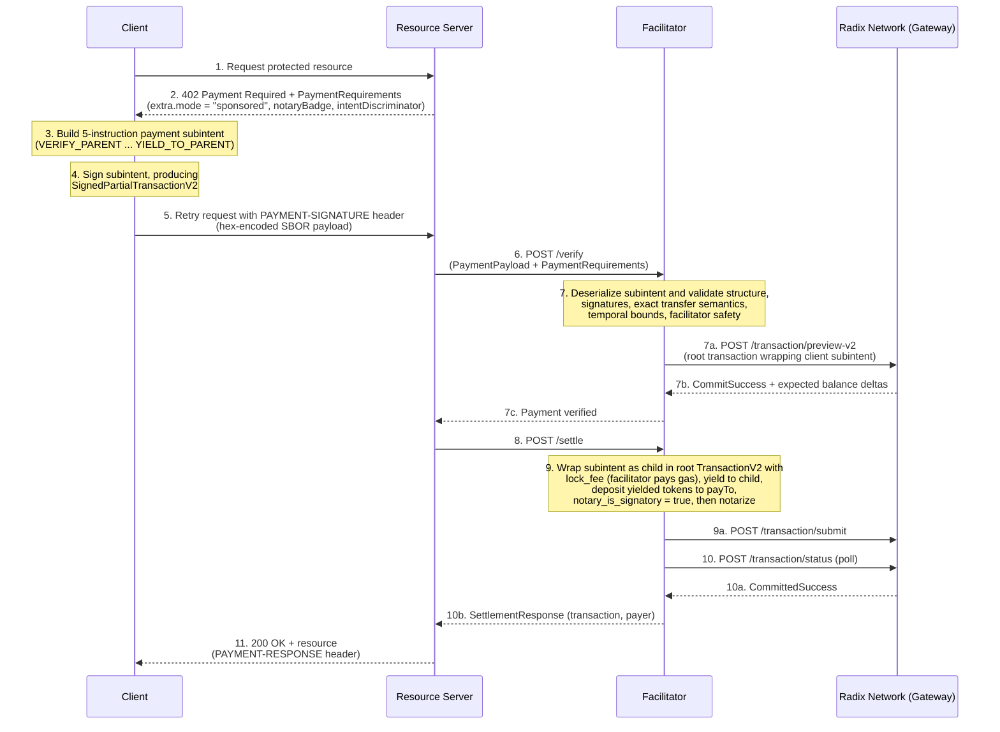
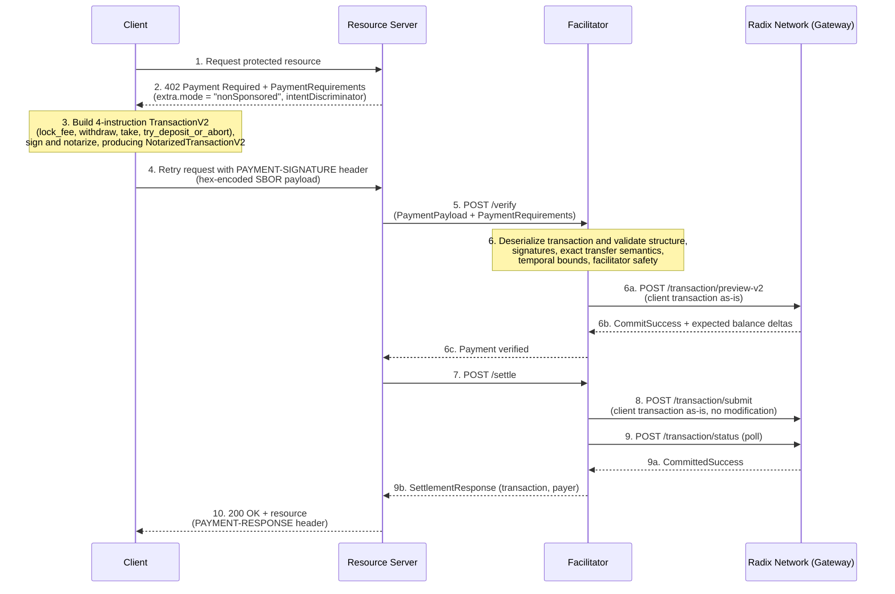

# Scheme: `exact` on `Radix`

## Versions supported

- ❌ `v1`
- ✅ `v2`

## Supported Networks

- `radix:mainnet` — Radix Mainnet (network ID `1`)
- `radix:stokenet` — Radix Stokenet (network ID `2`)

## Summary

The x402 `exact` scheme on Radix transfers an exact amount of a fungible resource from the client to the resource server (`payTo`).

This scheme transfers exactly one fungible resource per payment. Multi-resource payments are out of scope.

This specification supports two settlement modes:

1. **Sponsored (recommended):** The client signs a payment subintent; the facilitator wraps it in a root transaction, pays gas, and submits.
2. **Non-sponsored:** The client signs a complete transaction including gas payment; the facilitator verifies and submits it.

In both modes the facilitator MUST only submit transactions that pay exactly `requirements.amount` of `requirements.asset` to `requirements.payTo`.

## Protocol Flow

### A) Sponsored flow (recommended)



1. **Client** requests a protected resource.
2. **Resource Server** returns `402 Payment Required` with `PaymentRequirements` containing `extra.mode = "sponsored"`.
3. **Client** builds a Radix payment subintent that withdraws the exact fungible resource amount and yields it to the parent (see [Client Subintent Construction](#client-subintent-construction-sponsored)).
4. **Client** signs the subintent, producing a `SignedPartialTransactionV2`.
5. **Client** hex-encodes the SBOR-serialized `SignedPartialTransactionV2` and sends it in `PaymentPayload.payload.transaction`.
6. **Resource Server** forwards payload + requirements to **Facilitator** for verification.
7. **Facilitator** deserializes the subintent, validates structure, signatures, exact transfer semantics, and facilitator safety.
8. **Resource Server** requests settlement.
9. **Facilitator** wraps the verified subintent as a child in a root transaction, pays gas via `lock_fee`, ensures the yielded tokens reach `payTo`, notarizes, and submits to the Radix network.
10. **Facilitator** polls for commit confirmation and reports the settlement result.
11. **Resource Server** returns the protected response.

### B) Non-sponsored flow



1. **Client** requests a protected resource.
2. **Resource Server** returns `402 Payment Required` with `PaymentRequirements` containing `extra.mode = "nonSponsored"`.
3. **Client** builds and signs a complete Radix V2 transaction that locks fees, withdraws the asset, and deposits it to `payTo` (see [Client Transaction Construction](#client-transaction-construction-non-sponsored)).
4. **Client** hex-encodes the SBOR-serialized `NotarizedTransactionV2` and sends it in `PaymentPayload.payload.transaction`.
5. **Resource Server** forwards payload + requirements to **Facilitator** for verification.
6. **Facilitator** deserializes the transaction, validates structure, signatures, and exact transfer semantics.
7. **Resource Server** requests settlement.
8. **Facilitator** submits the verified transaction to the Radix network.
9. **Facilitator** polls for commit confirmation and reports the settlement result.
10. **Resource Server** returns the protected response.

## `PaymentRequirements` for `exact`

In addition to the standard x402 `PaymentRequirements` fields (see [§5 Types](../../x402-specification-v2.md#5-types)):

- `network`: MUST be `radix:mainnet` or `radix:stokenet`.
- `asset`: A valid Radix fungible resource address (bech32m-encoded; `resource_rdx1...` on mainnet, `resource_tdx_2_1...` on stokenet).
- `payTo`: The Radix account address that receives the payment.
- `amount`: A base-10 decimal string interpreted as a Radix `Decimal` (whole tokens, not atomic subunits). Comparison against the manifest `Decimal` argument is **numeric, not lexical** — clients MAY emit any valid Radix `Decimal` representation (e.g. `"10"`, `"10.0"`, `"10.000000000000000000"` are all equivalent); facilitators MUST parse both `requirements.amount` and the manifest `Decimal` argument as Radix `Decimal` values and compare for numeric equality.

> **Deviation from core-spec atomic units:** The core specification describes `amount` as "atomic token units". Radix transaction manifests express fungible amounts exclusively as `Decimal` (18 fractional digits), and resources have per-resource divisibility (0–18), so there is no single integer-subunit representation to compare against. This spec therefore defines `amount` as a Radix `Decimal` string, with the numeric-equality rule above as the normative comparison. This mirrors the treatment of XRPL issued-currency values.

The `extra` field MUST include:

- `extra.mode`: `"sponsored"` or `"nonSponsored"`.
- `extra.notaryBadge` (sponsored mode only): The facilitator's notary virtual badge as a `NonFungibleGlobalId` string. Clients pass this directly to the `VERIFY_PARENT` access rule (see [Appendix A](#a-verify_parent)).
- `extra.intentDiscriminator`: A string-encoded `u64` value. The client MUST set `IntentHeaderV2.intent_discriminator` to this value when constructing the subintent (sponsored) or transaction (non-sponsored). This allows the facilitator to control intent uniqueness for replay protection and correlation.

> **Retry behavior:** If a client retries after a failed request, the new `PaymentRequirements` will contain a fresh `intentDiscriminator`; the client MUST rebuild and re-sign the subintent or transaction with the new value.
>
> **Double-commit caution:** A rebuilt intent is a *new* intent — the Radix ledger's single-commit guarantee applies per intent hash, so a rebuilt payload and its predecessor could **both** commit if the predecessor was already submitted and is still within its validity window. Resource servers MUST NOT issue a fresh `intentDiscriminator` for a payment whose previous payload may still be pending; they SHOULD only do so if the previous payload was never submitted, was permanently rejected, or its `max_proposer_timestamp_exclusive` has passed.

**Example (sponsored):**

```json
{
  "scheme": "exact",
  "network": "radix:mainnet",
  "amount": "10",
  "asset": "resource_rdx1tknxxxxxxxxxradxrdxxxxxxxxx009923554798xxxxxxxxxradxrd",
  "payTo": "account_rdx129a9wuey40lducsne6r8e5q7xmt07068gcede0x0nrwtsnehss5d52",
  "maxTimeoutSeconds": 60,
  "extra": {
    "mode": "sponsored",
    "notaryBadge": "resource_rdx1nfxxxxxxxxxxed25sgxxxxxxxxx002236757237xxxxxxxxxed25sg:[5ab09b486b64c1bf2eb2b39f8cb57cb6cff8a83f034730f457d4e06173]",
    "intentDiscriminator": "8374029156381940237"
  }
}
```

**Example (non-sponsored):**

```json
{
  "scheme": "exact",
  "network": "radix:stokenet",
  "amount": "25",
  "asset": "resource_tdx_2_1tknxxxxxxxxxradxrdxxxxxxxxx009923554798xxxxxxxxxtfd2jc",
  "payTo": "account_tdx_2_129a9wuey40lducsne6r8e5q7xmt07068gcede0x0nrwtsnehrlel8s",
  "maxTimeoutSeconds": 120,
  "extra": {
    "mode": "nonSponsored",
    "intentDiscriminator": "1629384750192837465"
  }
}
```

## PaymentPayload `payload` Field

The `payload` field always contains a single `transaction` key with a hex-encoded SBOR byte string:

```json
{
  "transaction": "4d220504..."
}
```

The facilitator determines how to deserialize the value by inspecting `accepted.extra.mode`:

| `extra.mode` | Serialized type | Description |
|---|---|---|
| `"sponsored"` | `SignedPartialTransactionV2` | Client-signed subintent (no root transaction) |
| `"nonSponsored"` | `NotarizedTransactionV2` | Fully signed and notarized transaction |

Hex strings MUST be lowercase, with no `0x` prefix.

All bech32m-encoded addresses (resource, account, component, transaction-intent and subintent hashes) appearing in `PaymentRequirements`, manifest arguments, and `SettlementResponse` MUST be in canonical lowercase form. Facilitators compare addresses by string equality; uppercase or mixed-case bech32m payloads MAY be rejected as `invalid_payload`.

**Full `PaymentPayload` example (sponsored):**

```json
{
  "x402Version": 2,
  "resource": {
    "url": "https://example.com/resource",
    "description": "Protected data",
    "mimeType": "application/json"
  },
  "accepted": {
    "scheme": "exact",
    "network": "radix:mainnet",
    "amount": "10",
    "asset": "resource_rdx1tknxxxxxxxxxradxrdxxxxxxxxx009923554798xxxxxxxxxradxrd",
    "payTo": "account_rdx129a9wuey40lducsne6r8e5q7xmt07068gcede0x0nrwtsnehss5d52",
    "maxTimeoutSeconds": 60,
    "extra": {
      "mode": "sponsored",
      "notaryBadge": "resource_rdx1nfxxxxxxxxxxed25sgxxxxxxxxx002236757237xxxxxxxxxed25sg:[5ab09b486b64c1bf2eb2b39f8cb57cb6cff8a83f034730f457d4e06173]",
      "intentDiscriminator": "8374029156381940237"
    }
  },
  "payload": {
    "transaction": "4d220504..."
  }
}
```

**Full `PaymentPayload` example (non-sponsored):**

```json
{
  "x402Version": 2,
  "resource": {
    "url": "https://example.com/resource",
    "description": "Protected data",
    "mimeType": "application/json"
  },
  "accepted": {
    "scheme": "exact",
    "network": "radix:stokenet",
    "amount": "25",
    "asset": "resource_tdx_2_1tknxxxxxxxxxradxrdxxxxxxxxx009923554798xxxxxxxxxtfd2jc",
    "payTo": "account_tdx_2_129a9wuey40lducsne6r8e5q7xmt07068gcede0x0nrwtsnehrlel8s",
    "maxTimeoutSeconds": 120,
    "extra": {
      "mode": "nonSponsored",
      "intentDiscriminator": "1629384750192837465"
    }
  },
  "payload": {
    "transaction": "4d220504..."
  }
}
```

## Client Subintent Construction (Sponsored)

The client MUST construct a `SubintentManifestV2` with exactly **5 instructions**:

```
VERIFY_PARENT
    Enum<AccessRule::Protected>(
        Enum<CompositeRequirement::BasicRequirement>(
            Enum<BasicRequirement::Require>(
                Enum<ResourceOrNonFungible::NonFungible>(
                    NonFungibleGlobalId("<notary_badge>")
                )
            )
        )
    )
;

ASSERT_WORKTOP_IS_EMPTY;

CALL_METHOD
    Address("<client_account>")
    "withdraw"
    Address("<asset>")
    Decimal("<amount>")
;

TAKE_ALL_FROM_WORKTOP
    Address("<asset>")
    Bucket("payment")
;

YIELD_TO_PARENT Bucket("payment");
```

Where:

- `<notary_badge>` is the value of `extra.notaryBadge` from `PaymentRequirements`.
- `<client_account>` is the client's Radix account address.
- `<asset>` is `requirements.asset`.
- `<amount>` is `requirements.amount`.

The client then:

1. Sets `IntentHeaderV2.network_id` to match the target network (`1` for mainnet, `2` for stokenet).
2. Sets `IntentHeaderV2.intent_discriminator` to the value of `extra.intentDiscriminator` (parsed as `u64`).
3. Sets `max_proposer_timestamp_exclusive` based on `maxTimeoutSeconds` (see [Appendix B](#b-timestamp-based-expiry)).
4. Sets epoch bounds to a wide safety window (see [Appendix B](#b-timestamp-based-expiry)).
5. Signs the subintent with their account key(s), producing a `SignedPartialTransactionV2`.
6. Serializes with `to_raw()` and hex-encodes the result (lowercase, no prefix).

> **Note:** The subintent is self-contained: it starts with `VERIFY_PARENT` + `ASSERT_WORKTOP_IS_EMPTY` (receives nothing from the parent) and ends by yielding the payment bucket to the parent. This enables preview-style wallet UX with user-settable guarantees.

## Client Transaction Construction (Non-sponsored)

The client MUST construct a `TransactionManifestV2` with exactly 4 instructions:

```
CALL_METHOD
    Address("<client_account>")
    "lock_fee"
    Decimal("<fee>")
;

CALL_METHOD
    Address("<client_account>")
    "withdraw"
    Address("<asset>")
    Decimal("<amount>")
;

TAKE_ALL_FROM_WORKTOP
    Address("<asset>")
    Bucket("payment")
;

CALL_METHOD
    Address("<payTo>")
    "try_deposit_or_abort"
    Bucket("payment")
    None
;
```

Where:

- `<client_account>` is the client's Radix account address.
- `<fee>` is a sufficient XRD amount to cover network fees (client's discretion).
- `<asset>` is `requirements.asset`.
- `<amount>` is `requirements.amount`.
- `<payTo>` is `requirements.payTo`.

> **Why `try_deposit_or_abort`?** Using `try_deposit_or_abort` instead of `deposit` avoids requiring deposit authorization on the receiving account. If `payTo` has deposit restrictions that would reject the asset, the facilitator's preview step (§8) will detect the failure before submission.

The client then:

1. Builds a `TransactionV2` with appropriate headers (network ID, timestamp bounds, epoch safety window) (see [Appendix B](#b-timestamp-based-expiry)). `IntentHeaderV2.intent_discriminator` MUST be set to the value of `extra.intentDiscriminator` (parsed as `u64`).
2. Signs with their account key(s).
3. Notarizes the transaction, producing a `NotarizedTransactionV2`.
4. Serializes with `to_raw()` and hex-encodes the result (lowercase, no prefix).

The transaction MUST NOT contain any subintents (`non_root_subintents` MUST be empty).

## Facilitator Verification Rules (MUST)

Before submitting any transaction, the facilitator MUST enforce all checks below. Failure on any check MUST result in rejection.

### 1. Protocol validation

- `x402Version` MUST be `2`.
- `payload.accepted.scheme` and `requirements.scheme` MUST both be `"exact"`.
- `payload.accepted.network` MUST equal `requirements.network`.
- Network MUST be one of `radix:mainnet` or `radix:stokenet`.
- `accepted.extra.mode` MUST be `"sponsored"` or `"nonSponsored"`.

### 2. Deserialization

- If `extra.mode` is `"sponsored"`: decode `payload.transaction` as hex-encoded `SignedPartialTransactionV2`.
- If `extra.mode` is `"nonSponsored"`: decode `payload.transaction` as hex-encoded `NotarizedTransactionV2`.
- Deserialization failure MUST result in rejection.

### 3. Subintent structure validation (sponsored mode)

The decoded `SignedPartialTransactionV2` MUST satisfy:

- **No nested subintents:** Both `partial_transaction.non_root_subintents` and `non_root_subintent_signatures` MUST be empty (the `PartialTransactionV2` contains exactly one root subintent and no children).
- **Instruction count:** The subintent manifest MUST contain exactly **5 instructions**.
- **Instruction sequence:**

  | Index | Instruction | Constraints |
  |-------|-------------|-------------|
  | 0 | `VERIFY_PARENT` | Access rule is the client's security mechanism (not constrained by this spec) |
  | 1 | `ASSERT_WORKTOP_IS_EMPTY` | No arguments |
  | 2 | `CALL_METHOD` | address = client account, method = `"withdraw"`, args = `(asset, amount)` |
  | 3 | `TAKE_ALL_FROM_WORKTOP` | resource = `asset` |
  | 4 | `YIELD_TO_PARENT` | yields exactly one bucket containing the withdrawn resource |

- **Resource match:** The `Address` argument to `withdraw` and `TAKE_ALL_FROM_WORKTOP` MUST equal `requirements.asset`.
- **Amount match:** The `Decimal` argument to `withdraw` MUST equal `requirements.amount` when both are parsed as Radix `Decimal` (numeric equality, not string equality).

### 4. Transaction structure validation (non-sponsored mode)

The decoded `NotarizedTransactionV2` MUST satisfy:

- **No subintents:** `transaction_intent.non_root_subintents` MUST be empty.
- **Instruction count:** The transaction manifest MUST contain exactly **4 instructions**.
- **Instruction sequence:**

  | Index | Instruction | Constraints |
  |-------|-------------|-------------|
  | 0 | `CALL_METHOD` | method = `"lock_fee"`, address = client account |
  | 1 | `CALL_METHOD` | address = client account, method = `"withdraw"`, args = `(asset, amount)` |
  | 2 | `TAKE_ALL_FROM_WORKTOP` | resource = `asset` |
  | 3 | `CALL_METHOD` | address = `payTo`, method = `"try_deposit_or_abort"`, args = `(bucket, None)` |

- **Resource match:** `asset` in instructions 1 and 2 MUST equal `requirements.asset`.
- **Amount match:** `amount` in instruction 1 MUST equal `requirements.amount` when both are parsed as Radix `Decimal` (numeric equality, not string equality).
- **Destination match:** The address in instruction 3 MUST equal `requirements.payTo`.

### 5. Facilitator safety

**Sponsored mode:**

- The withdraw address (instruction 2) MUST NOT equal the facilitator's fee-paying account.
- The facilitator's fee-paying account MUST NOT appear as an `Address` argument in any instruction of the subintent.
- The subintent MUST NOT contain `lock_fee` or `lock_contingent_fee` calls (fee payment is the facilitator's root intent responsibility; subintents cannot lock uncontingent fees by protocol rule).
- The subintent MUST NOT contain any instructions beyond the mandated sequence (no `CALL_FUNCTION`, no additional `CALL_METHOD`, etc.).

**Non-sponsored mode:**

- The facilitator's own address MUST NOT appear as an `Address` argument in any instruction of the transaction.
- The `lock_fee` source account MUST NOT equal the facilitator's address.

These checks prevent the facilitator from being tricked into paying for the transferred asset or authorizing unintended operations.

### 6. Temporal validity and replay protection

**Sponsored mode:**

- `IntentHeaderV2.network_id` MUST match the target network (`1` for mainnet, `2` for stokenet).
- `IntentHeaderV2.intent_discriminator` MUST equal the value provided in `accepted.extra.intentDiscriminator`.
- `max_proposer_timestamp_exclusive` MUST be set (not `None`).
- `max_proposer_timestamp_exclusive` MUST be in the future relative to the current `proposer_round_timestamp`.
- `max_proposer_timestamp_exclusive` MUST NOT exceed `proposer_round_timestamp + maxTimeoutSeconds + 60` (60 s construction tolerance).
- `end_epoch_exclusive` MUST be greater than the current epoch.

**Non-sponsored mode:**

- `IntentHeaderV2.network_id` MUST match the target network.
- `IntentHeaderV2.intent_discriminator` MUST equal the value provided in `accepted.extra.intentDiscriminator`.
- `max_proposer_timestamp_exclusive` MUST be set and satisfy the same timestamp rules as sponsored mode.
- `end_epoch_exclusive` MUST be greater than the current epoch.

**Replay protection (both modes):** The facilitator MUST maintain a cache of `SubintentHash` (sponsored) and `TransactionIntentHash` (non-sponsored) values it has observed. A hash is added to the cache on first observation (verify or settle) and retained until the payload's `max_proposer_timestamp_exclusive` has passed. Any verify or settle for a hash already in the cache MUST be rejected with `invalid_exact_radix_expired`. Cache entries MAY be pruned once `max_proposer_timestamp_exclusive` has passed; from that point the Radix ledger rejects the payload regardless.

> **Note:** Replay correctness is enforced by the Radix ledger (subintents are single-consumption; transaction intents are single-commit). The facilitator-side cache exists to short-circuit duplicates before they reach the gateway and to convert parallel duplicates into a clean rejection at the facilitator boundary, not as the primary security mechanism.

### 7. Signature validation

**Sponsored mode:**

- `root_subintent_signatures` MUST contain at least one valid signature over the `SubintentHash`.
- The signing key(s) MUST correspond to the client account's access rule (i.e., the signer is authorized to withdraw from the client account).

**Non-sponsored mode:**

- The transaction MUST contain valid intent signatures from key(s) authorized by the client account.
- The transaction MUST be validly notarized.

### 8. Preview / simulation

- The facilitator MUST preview the composed transaction against current ledger state before submitting.
  - Sponsored mode: preview the full root transaction (with the client subintent as a child).
  - Non-sponsored mode: preview the client's transaction as-is.
- The preview MUST return `CommitSuccess`.
- Balance deltas MUST reflect:
  - Client decreases by exactly `requirements.amount` of `requirements.asset`.
  - `payTo` increases by exactly `requirements.amount` of `requirements.asset`.
  - Expected network fees (from the fee payer).
  - No other unexpected balance changes.

> **Scope of preview detection:** Preview executes against committed ledger state and detects duplicates that have already committed. Duplicates that are pending in a core node mempool — possibly on a different node than the one the gateway routed the preview to — may pass preview. The facilitator's hash cache (§6) catches those before submission; any that survive both layers are deduplicated by the ledger at commit time and surface as a terminal failure during settlement polling.

Implementations MAY apply stricter policy controls (allowlists, max amounts, method constraints) but MUST NOT relax the rules above.

## Settlement

### Sponsored

The facilitator settles a verified sponsored payment as follows:

1. **Compose root transaction:** Wrap the client's `SignedPartialTransactionV2` as a child subintent in a new `TransactionV2`. The facilitator's root intent MUST:
   - Pay gas via `lock_fee` from the facilitator's account.
   - Yield to the child subintent to trigger its execution.
   - Ensure the yielded tokens reach `payTo` for exactly `requirements.amount`.

   The specific root manifest structure is a facilitator implementation detail — this spec only constrains the outcome (tokens reach `payTo` for the exact amount).

2. **Set `notary_is_signatory: true`:** The facilitator MUST set `notary_is_signatory: true` in the `TransactionHeaderV2`. This causes the notary's signature to produce a virtual Ed25519 badge in the auth zone, which is required for `VERIFY_PARENT` to succeed in the client's subintent (see [Appendix A](#a-verify_parent)).

3. **Notarize:** Sign and notarize the composed transaction with the facilitator's notary key (the key corresponding to `extra.notaryBadge` in `PaymentRequirements`).

4. **Submit:** Submit the compiled transaction hex to the Gateway via `POST /transaction/submit`.

5. **Confirm:** Poll `POST /transaction/status` with the transaction intent hash until the status is `CommittedSuccess` or a terminal failure.

### Non-sponsored

1. **Submit:** Submit the client's `NotarizedTransactionV2` hex to the Gateway via `POST /transaction/submit`.

2. **Confirm:** Poll `POST /transaction/status` with the transaction intent hash until the status is `CommittedSuccess` or a terminal failure.

## `SettlementResponse`

```json
{
  "success": true,
  "transaction": "txid_rdx1qfum8kywlta7gk4r5cf3p8xdvr6kv39dxfl06ykhzrclm8emwrex3jnj6s",
  "network": "radix:mainnet",
  "payer": "account_rdx129a9wuey40lducsne6r8e5q7xmt07068gcede0x0nrwtsnehss5d52"
}
```

- `transaction`: The bech32m-encoded transaction intent hash (`txid_rdx1...` on mainnet, `txid_tdx_2_1...` on stokenet).
- `payer`: The client's account address (the address that paid the transferred asset, not the gas sponsor).

## Error Responses

When verification or settlement fails, the facilitator MUST return an appropriate error code in the `invalidReason` (verify) or `errorReason` (settle) field. Radix uses a combination of generic protocol-level codes (defined in `x402-specification-v2.md` §9) and Radix-specific codes:

| Error Code | Description |
|---|---|
| `invalid_payload` | Payload is malformed or does not match requirements — covers SBOR decode failure, wrong instruction count, unexpected instruction type or arguments, intent discriminator mismatch, facilitator safety violations, and asset address / transfer amount / deposit destination mismatches against `requirements` |
| `invalid_payment_requirements` | The `PaymentRequirements` object itself is invalid or malformed — e.g., missing `extra.mode`, missing `extra.notaryBadge` in sponsored mode, an invalid `asset` or `payTo` address, or an `amount` that does not parse as a Radix `Decimal` |
| `invalid_exact_radix_expired` | Timestamp or epoch bounds are out of range or already passed, OR the payload's `SubintentHash`/`TransactionIntentHash` has already been observed by this facilitator (replay) |
| `invalid_exact_radix_signature` | Missing or invalid subintent/transaction signatures |
| `unexpected_verify_error` | Transaction preview returned a status other than `CommitSuccess`, or another unexpected verification failure |

## Serialization

All Radix transaction payloads use **SBOR** (Scrypto Binary Object Representation) encoding, transmitted as **lowercase hex strings** (no `0x` prefix, no base64).

### Wire format: `SignedPartialTransactionV2` (sponsored mode)

```
SignedPartialTransactionV2
├── partial_transaction: PartialTransactionV2
│   ├── root_subintent: SubintentV2
│   │   ├── intent_core: IntentCoreV2
│   │   │   ├── instructions: InstructionsV2 (the 5-instruction manifest)
│   │   │   ├── blobs: BlobsV1
│   │   │   └── message: MessageV2
│   │   └── intent_header: IntentHeaderV2
│   │       ├── network_id: u8
│   │       ├── start_epoch_inclusive: Epoch
│   │       ├── end_epoch_exclusive: Epoch
│   │       ├── intent_discriminator: u64
│   │       ├── min_proposer_timestamp_inclusive: Option<Instant>
│   │       └── max_proposer_timestamp_exclusive: Option<Instant>
│   └── non_root_subintents: [] (MUST be empty)
├── root_subintent_signatures: IntentSignaturesV2 (≥1 signature)
└── non_root_subintent_signatures: [] (MUST be empty)
```

### Wire format: `NotarizedTransactionV2` (non-sponsored mode)

```
NotarizedTransactionV2
├── signed_transaction: SignedTransactionIntentV2
│   ├── transaction_intent: TransactionIntentV2
│   │   ├── root_intent_core: IntentCoreV2
│   │   │   ├── instructions: InstructionsV2 (the 4-instruction manifest)
│   │   │   ├── blobs: BlobsV1
│   │   │   └── message: MessageV2
│   │   ├── root_intent_header: IntentHeaderV2
│   │   │   ├── network_id: u8
│   │   │   ├── start_epoch_inclusive: Epoch
│   │   │   ├── end_epoch_exclusive: Epoch
│   │   │   ├── intent_discriminator: u64
│   │   │   ├── min_proposer_timestamp_inclusive: Option<Instant>
│   │   │   └── max_proposer_timestamp_exclusive: Option<Instant>
│   │   ├── transaction_header: TransactionHeaderV2
│   │   │   ├── notary_public_key: PublicKey
│   │   │   ├── notary_is_signatory: bool
│   │   │   └── tip_basis_points: u32
│   │   └── non_root_subintents: [] (MUST be empty for x402)
│   └── transaction_intent_signatures: IntentSignaturesV2
└── notary_signature: NotarySignatureV2
```

### Tooling

| Platform | Package | Status |
|---|---|---|
| Rust | `radix-transactions` crate | Available |
| Python | `radix-engine-toolkit` on PyPI (UniFFI binding) | Available |
| TypeScript | `@steleaio/radix-engine-toolkit` npm package | Available — community fork adding V2 manifest/intent support not yet exposed by the official `@radixdlt/radix-engine-toolkit` |

## Security Considerations

### DoS on sponsored facilitators

In sponsored mode the facilitator pays gas on behalf of the client, creating a potential denial-of-service vector. Mitigations:

- Facilitators SHOULD rate-limit verification and settlement requests per client or resource-server identity.
- Facilitators MAY require resource-server authentication (e.g., API keys or mTLS) before accepting requests.
- Facilitators MUST bound the maximum gas expenditure per client or resource-server within a given time window to prevent unbounded cost from malicious or misconfigured callers.

### Subintent front-running

A signed `SignedPartialTransactionV2` is a bearer credential — anyone who obtains it could attempt to wrap it in their own root transaction and submit it. The `VERIFY_PARENT` instruction mitigates this by restricting which notary (and therefore which facilitator) can include the subintent. Without `VERIFY_PARENT`, any party could front-run the intended facilitator.

### Settlement atomicity

Both settlement modes are atomic at the ledger level: either the entire transaction commits (and `payTo` receives exactly `requirements.amount`) or it is rejected with no state change. The facilitator's preview step (§8) provides an additional pre-submission guarantee that balance deltas match expectations.

### Protocol-level security

Additional security considerations (replay attack prevention, trust model, authentication integration) are specified in `x402-specification-v2.md` §10.

## Appendix

### A. `VERIFY_PARENT`

**REQUIRED.** Clients MUST prepend `VERIFY_PARENT` to their subintent to restrict which aggregator (facilitator) can include it. Without `VERIFY_PARENT`, any party who obtains the `SignedPartialTransactionV2` can wrap it in their own root transaction.

#### Virtual badge mechanism

> **Curve restriction:** In sponsored mode, the facilitator's notary key MUST be Ed25519. Secp256k1 notaries are not supported by this spec.

On Radix, when a key signs a V2 transaction, the engine synthesizes a **virtual signature badge** in the transaction's auth zone. The notary's badge is a `NonFungibleGlobalId` composed of:

1. The well-known **Ed25519 signature virtual badge resource address** (network-specific, see below).
2. A `NonFungibleLocalId::Bytes(blake2b_256(<public_key_bytes>)[3..])` — the last 29 bytes of the Blake2b-256 hash of the public key (the same `PublicKeyHash` bytes used in virtual account addresses).

`VERIFY_PARENT` checks that the **parent** transaction's auth zone contains a specified badge. By requiring the facilitator's notary badge, the client ensures only the intended facilitator can consume the subintent.

#### Facilitator requirement: `notary_is_signatory`

For the notary's virtual badge to appear in the auth zone, the facilitator MUST set `notary_is_signatory: true` in `TransactionHeaderV2`. Without this flag, the notary signature is used only for transaction validity — it does **not** produce a badge, and `VERIFY_PARENT` will fail.

> **V2 constraint:** When `notary_is_signatory` is `true`, the notary MUST NOT also appear in the intent signatures (V2 forbids duplicating a signer as notary).

#### Client construction of the access rule

The client reads `extra.notaryBadge` from `PaymentRequirements` and passes it directly as the `NonFungibleGlobalId` in the `VERIFY_PARENT` instruction. No derivation is required — the facilitator provides the badge in ready-to-use form.

Clients SHOULD validate that the resource address component of `notaryBadge` matches the well-known Ed25519 signature badge for the target network:

| Network | Ed25519 signature badge resource |
|---|---|
| Mainnet | `resource_rdx1nfxxxxxxxxxxed25sgxxxxxxxxx002236757237xxxxxxxxxed25sg` |
| Stokenet | `resource_tdx_2_1nfxxxxxxxxxxed25sgxxxxxxxxx002236757237xxxxxxxxx3e2cpa` |

#### Complete 5-instruction subintent example (mainnet)

```
VERIFY_PARENT
    Enum<AccessRule::Protected>(
        Enum<CompositeRequirement::BasicRequirement>(
            Enum<BasicRequirement::Require>(
                Enum<ResourceOrNonFungible::NonFungible>(
                    NonFungibleGlobalId("resource_rdx1nfxxxxxxxxxxed25sgxxxxxxxxx002236757237xxxxxxxxxed25sg:[5ab09b486b64c1bf2eb2b39f8cb57cb6cff8a83f034730f457d4e06173]")
                )
            )
        )
    )
;

ASSERT_WORKTOP_IS_EMPTY;

CALL_METHOD
    Address("account_rdx129a9wuey40lducsne6r8e5q7xmt07068gcede0x0nrwtsnehss5d52")
    "withdraw"
    Address("resource_rdx1tknxxxxxxxxxradxrdxxxxxxxxx009923554798xxxxxxxxxradxrd")
    Decimal("10")
;

TAKE_ALL_FROM_WORKTOP
    Address("resource_rdx1tknxxxxxxxxxradxrdxxxxxxxxx009923554798xxxxxxxxxradxrd")
    Bucket("payment")
;

YIELD_TO_PARENT Bucket("payment");
```

#### Facilitator verification

The facilitator MUST accept `VERIFY_PARENT` at instruction index 0 and validate the remaining 4 instructions starting at index 1. The `VERIFY_PARENT` access rule content is not constrained by this spec — it is the client's security mechanism.

### B. Timestamp-based expiry

Radix V2's `IntentHeaderV2` supports precise wall-clock validity via `min_proposer_timestamp_inclusive` and `max_proposer_timestamp_exclusive` (both `Option<Instant>`). These are validated against the ledger's `proposer_round_timestamp` at commit time, enabling exact mapping from `maxTimeoutSeconds` without the lossy epoch rounding of earlier approaches.

**Timestamp conversion:**

```
max_proposer_timestamp_exclusive = now + maxTimeoutSeconds
min_proposer_timestamp_inclusive = now   (SHOULD be set; optional but recommended)
```

**Epoch safety window:**

Epoch fields (`start_epoch_inclusive`, `end_epoch_exclusive`) are mandatory in `IntentHeaderV2`. They serve as a wide safety window — not the normative expiry mechanism. Set them as:

```
start_epoch_inclusive = current_epoch
end_epoch_exclusive   = current_epoch + ceil(maxTimeoutSeconds / 300) + 10
```

The `+10` epochs (~50 min) ensures the epoch window never expires before the timestamp window, even under variable epoch durations.

**Facilitator validation:**

Facilitators MUST reject payloads where `max_proposer_timestamp_exclusive` exceeds `proposer_round_timestamp + maxTimeoutSeconds + 60`. The 60-second tolerance accounts for clock skew between the client's construction time and the facilitator's verification time.

### C. Address format table

Radix addresses are bech32m-encoded: an HRP, the separator character `1`, and a base32-encoded data part ending in a 6-character checksum computed over the HRP and data. The human-readable part (HRP) is the concatenation of two official specifiers (see [Address Concepts](https://docs.radixdlt.com/docs/concepts)):

- **Entity specifier** — the type of entity being addressed, e.g. `account_`, `resource_`, `component_`.
- **Network specifier** (the `network_hrp_suffix` in [Well-Known Addresses](https://docs.radixdlt.com/docs/well-known-addresses)) — `rdx` for mainnet, `tdx_2_` for Stokenet (generally `tdx_<hex_id>_` for testnets), `sim` for the local simulator.

For entity addresses the data part encodes 30 bytes: 1 entity-type byte followed by the 29 address bytes. Transaction intent hashes (`txid_`) and subintent hashes (`subtxid_`) use the same HRP scheme to encode 32-byte hashes.

| Entity | Mainnet HRP (network specifier `rdx`) | Stokenet HRP (network specifier `tdx_2_`) | Resulting address prefix (mainnet / stokenet) |
|---|---|---|---|
| Account | `account_rdx` | `account_tdx_2_` | `account_rdx1...` / `account_tdx_2_1...` |
| Resource | `resource_rdx` | `resource_tdx_2_` | `resource_rdx1...` / `resource_tdx_2_1...` |
| Component | `component_rdx` | `component_tdx_2_` | `component_rdx1...` / `component_tdx_2_1...` |
| Transaction intent hash | `txid_rdx` | `txid_tdx_2_` | `txid_rdx1...` / `txid_tdx_2_1...` |
| Subintent hash | `subtxid_rdx` | `subtxid_tdx_2_` | `subtxid_rdx1...` / `subtxid_tdx_2_1...` |

Bech32m is case-insensitive at decode time, but this spec mandates **canonical lowercase** for every encoded value to keep facilitator address comparisons a pure string equality. Mixed-case bech32m strings are not valid bech32m at all (the encoding forbids mixing); uppercase-only strings decode to the same bytes as their lowercase form but are out-of-spec for x402 payloads.

### D. Gateway API endpoints

| Operation | Endpoint | Purpose |
|---|---|---|
| Preview | `POST /transaction/preview-v2` | Simulate transaction before submission |
| Submit | `POST /transaction/submit` | Submit compiled transaction |
| Status | `POST /transaction/status` | Poll for commit status |
| Ledger state | `POST /status/gateway-status` | Get current epoch and `proposer_round_timestamp` |

**Base URLs:**
- Mainnet: `https://mainnet.radixdlt.com`
- Stokenet: `https://stokenet.radixdlt.com`

Facilitators running their own Radix node MAY use the equivalent node Core API endpoints (`/core/transaction/*`, `/core/lts/*`) instead of the public Gateway; running a dedicated node is the recommended production setup for high-volume integrators.

## Recommendation

- Prefer sponsored mode for best user experience (client does not need XRD for gas).
- Clients MUST include `VERIFY_PARENT` in sponsored subintents.
- Always preview immediately before settlement.
- Maintain strict policy around allowed resources and maximum transfer amounts per request.
