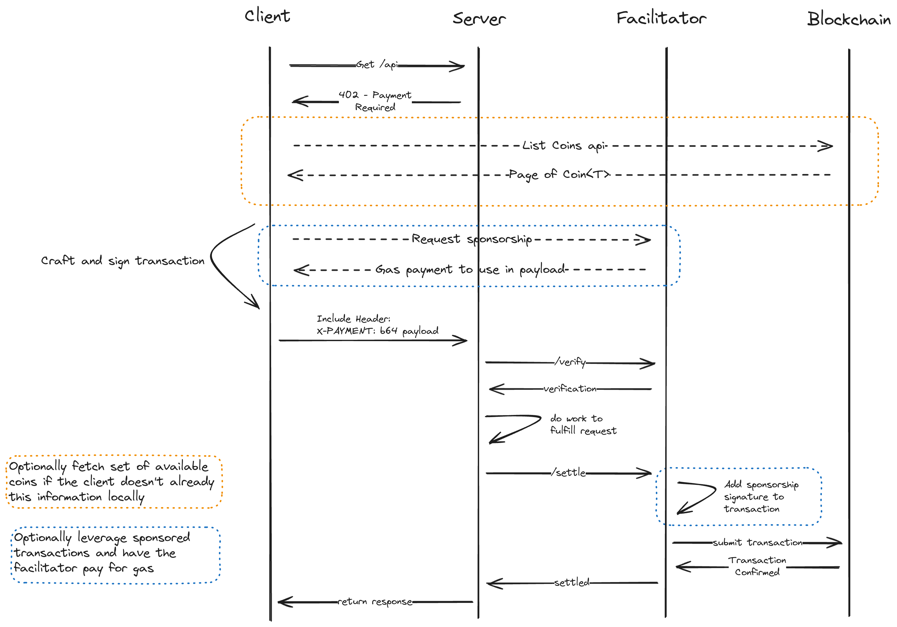

# Scheme: `exact` on `Sui`

## Summary

The `exact` scheme on Sui transfers a specific amount of an asset type `T` from the payer to
the resource server via two construction paths:

- **Classic `Coin<T>`** — the payer forms a complete signed transaction moving a
  `0x2::coin::Coin<T>` of the exact amount. RETAINED unchanged for back-compat and for amounts
  below the gasless minimum.
- **Gasless (Address Balances)** — the payer forms a transaction composed exclusively of
  protocol-allowlisted stablecoin operations against its Address Balance, with
  `gasPayment = []` and `gasPrice = 0`. This eliminates the coin-object storage cost and the
  interactive gas-station round trip, riding Sui's
  [gasless stablecoin transfers](https://docs.sui.io/develop/transaction-payment/gasless-stablecoin-transfers)
  (protocol v125).

In both paths the payer signs the complete transaction, so the facilitator cannot redirect
funds beyond the recipient(s) the resource server declared in `PaymentRequirements`.
Verification is effects-based, so a single-output gasless transfer satisfies the classic path's
verification rule verbatim. Core types (`PaymentRequirements`, `PaymentPayload`,
`SettleResponse`, `VerifyResponse`) are defined in
[x402-specification-v2.md](../../x402-specification-v2.md#5-types); Sui networks use CAIP-2
`sui:mainnet` / `sui:testnet` / `sui:devnet`.

## Protocol Sequencing



The following outlines the flow of the `exact` scheme on `Sui`:

1. Client makes a request to a `resource server` and receives a payment required response.
2. If the client doesn't already have local information about the asset it owns (Coin objects
   and/or an Address Balance) it can request it from an RPC service for transaction construction.
3. On the **gasless path** the client builds over a gRPC/GraphQL RPC endpoint, which
   auto-resolves gasless eligibility (`gasPayment = []`, `gasPrice = 0`) — no interactive
   gas-station round trip. On the **classic `Coin<T>` path**, if the facilitator supports
   sponsorship and the client wants it, the client follows the interactive sponsorship protocol
   in the appendix.
4. Craft and sign a transaction to be used as payment.
5. Resend the request to the `resource server` including the `PaymentPayload`.
6. `resource server` passes the `PaymentPayload` to the `facilitator` for verification.
7. `resource server` does the work to fulfill the request.
8. `resource server` requests settlement from the `facilitator`.
9. On the classic sponsored path the `facilitator` provides its signature; on the gasless path
   there is no sponsor signature (the transaction carries no gas payment).
10. `facilitator` submits the transaction to the `Sui` network for execution and reports back
    to the `resource server` the result of the transaction.
11. `resource server` returns the response to the client.

## PaymentPayload `payload` Field

The `payload` field of the `PaymentPayload` MUST contain the following fields:

- `signature`: The user signature over the Sui transaction.
- `transaction`: The Base64-encoded BCS-serialized Sui transaction itself.

Example `payload`:

```json
{
  "signature": "99X8xzbQkOBY3yUnaeCvDslpGdMfB81aqEf7QQC8RhXJ6rripVz2Z21Vboc/CAmodHZkcDjiraFbJlzqQJKkBQ==",
  "transaction": "AAAIAQDi1HwjSnS6M+WGvD73iEyUY2FRKNj0MlRp7+3SHZM3xCvMdB0AAAAAIFRgPKOstGBLCnbcyGoOXugUYAWwVzNrpMjPCzXK4KQWAQCMoE29VLGwftex8rhIlOuFLFNfxLIJlHqGXoXA8hx6l+LMdB0AAAAAIHbPucTRIEWgO6lzqukswPZ6i72IHEKK5LyM1l9HJNZNAQBthSeHDVK8Xr5/zp3JMZPLtG5uAoVgedTA4pEnp+h8qUlUzRwAAAAAIACH0swYW/QfGCFczGnjAVPHPqZrQE5vfvJr36i6KVEFAQAC7W4K5vCwB+nprjxcNlLiOQ7SIIfyCZjmj2qSis2iTsCuzBwAAAAAIAkSUkXOoeq52GNdhwpbs+jZqqrqPdmiN3oPw5EzDIanAQAIyFNGWD6OxiFIyXSxrNEcFG0npm+nImk6InUssXb1EZgx1hwAAAAAILhsjmMKyM0n75Cd7z6ufH2LNhOMibFOGhNlLgV5RFuEAQC+Mh4kGkLwrw/11729oUQnt3xOmOreE6PcnuN6M68ZBcCuzBwAAAAAIO2PQhSSqSAawCbRr005lfjBgFOqIHo4zb2GcQ/WCxAlAAgA+QKVAAAAAAAgjiAHD0X4HNSdVPpJtf2E6W2uRc8kbvCHYkgEQ1B+w1MDAwEAAAUBAQABAgABAwABBAABBQACAQAAAQEGAAEBAgEAAQcAHrfFfj8r0Pxsudz/0UPqlX5NmPgFw1hzP3be4GZ/4LEB5XXrONxGw0qOUsq3yNKeUhOCOgCIwaa4pswKaer66EKqPGwdAAAAACBrOIN4poutFUmHfB6FbFJu8GgXoPPTGQWREqFpPfvO1B63xX4/K9D8bLnc/9FD6pV+TZj4BcNYcz923uBmf+Cx7gIAAAAAAABg4xYAAAAAAAA="
}
```

Full `PaymentPayload` object (single-output, gasless path; `extra` carries `name`/`version`
per the core EVM examples and may carry the OPTIONAL Sui fields described below):

```json
{
  "x402Version": 2,
  "resource": {
    "url": "https://api.example.com/resource",
    "description": "Access to protected content",
    "mimeType": "application/json"
  },
  "accepted": {
    "scheme": "exact",
    "network": "sui:mainnet",
    "amount": "10000",
    "asset": "0xdba34672e30cb065b1f93e3ab55318768fd6fef66c15942c9f7cb846e2f900e7::usdc::USDC",
    "payTo": "0x1eb7c57e3f2bd0fc6cb9dcffd143ea957e4d98f805c358733f76dee0667fe0b1",
    "maxTimeoutSeconds": 60,
    "extra": {}
  },
  "payload": {
    "signature": "99X8xzbQkOBY3yUnaeCvDslpGdMfB81aqEf7QQC8RhXJ6rripVz2Z21Vboc/CAmodHZkcDjiraFbJlzqQJKkBQ==",
    "transaction": "AAAIAQDi1HwjSnS6M..."
  },
  "extensions": {}
}
```

## Gasless Construction (Address Balances)

When the asset is an allowlisted stablecoin and the per-transfer amount meets the protocol
minimum, the payer SHOULD construct a **gasless** transaction against its Address Balance.
Sui's gasless stablecoin transfer feature (protocol v125,
[docs](https://docs.sui.io/develop/transaction-payment/gasless-stablecoin-transfers)) accepts
such a transaction with no gas token, no sponsor, and no coin-object creation, provided the
following protocol constraints hold:

1. **Gas fields.** The transaction MUST set `gasPayment = []` (empty) and `gasPrice = 0`.
2. **Allowlisted operations only.** Every MoveCall command MUST be one of the
   protocol-allowlisted stablecoin operations. The relevant set is the four functions
   that exist in the framework: `0x2::balance::send_funds`, `0x2::balance::redeem_funds`,
   `0x2::coin::send_funds`, and `0x2::coin::into_balance` (the Move SDK's
   `tx.balance({ type, balance })` input resolves to `balance::redeem_funds` for an
   Address Balance and `coin::into_balance` for a `Coin<T>`, then `balance::send_funds`
   to the recipient). A transfer to recipient `R` of `amount` of asset `T` from an Address
   Balance is one `0x2::balance::send_funds<T>(balance, R)` command. When the source is a
   `Coin<T>` OBJECT (the common case after a normal coin transfer), the SDK additionally
   emits the native `SplitCoins` (and, when merging fragments, `MergeCoins`) commands to
   carve exact change off the coin before converting it — these move no asset to a third
   party and are tolerated; `TransferObjects` and every other non-MoveCall command MUST be
   rejected.
3. **No object writes.** Per the protocol, "no objects are written during the transaction,
   and all input coins are consumed or converted to address balances." A gasless transaction
   therefore cannot create, mutate, transfer, or wrap any object — which bounds the entire
   attack surface to value movement among Address Balances of the allowlisted asset.
4. **Allowlisted assets.** Only protocol-allowlisted stablecoins are gasless-eligible (e.g.
   USDC). A non-allowlisted asset MUST use the classic `Coin<T>` path.
5. **Minimum transfer amount.** The protocol applies a minimum transfer balance of `0.01`
   units per transfer on networks that enforce the allowlist parameter. This minimum is a
   **protocol parameter, NOT a security boundary**, and verification MUST NOT rely on it: an
   empirical testnet probe settled a sub-`0.01` and a `1`-base-unit gasless transfer that the
   chain did NOT reject (testnet digest `G94L1nqGrzuMG3CQvsRKX3eosBuCFxSvzq7srwuLcVr7`).
   Verification anchors only on the exact `amount`/`outputs` (see Verification). Below the
   minimum on an enforcing network, the payer MUST fall back to the classic `Coin<T>` path.
6. **Natural expiry (TTL).** When `gasPayment` is empty the protocol stamps the transaction
   with a `ValidDuring { minEpoch, maxEpoch }` window of approximately two epochs. This is the
   transaction's natural expiry: a stale signed transaction ceases to be executable after the
   window, and verification's simulation step fails for an expired transaction (testnet
   staleness probe digest `Cgv8wqkDzWru4mZEddWDNhi8174LTELHXACiYSMCr9SK`).

A single-output gasless transfer credits exactly `payTo` and satisfies the unchanged
single-`payTo` verification rule. Empirical confirmation: a single gasless `send_funds`
settled with `gasPrice = 0` and `gasPayment = []` (testnet digest
`B8XnHLauQt2V2ehe4pWGTk6RXc4vKA8CLE9FNoADW3NJ`).

## Declared Outputs (`extra.outputs`, OPTIONAL)

Because a Sui programmable transaction natively expresses N transfers in one atomic
transaction, the resource server MAY declare more than one recipient for a single payment.
When it does, it includes an `outputs` array in `PaymentRequirements.extra`:

| Field           | Type     | Required | Description                                                       |
| --------------- | -------- | -------- | ----------------------------------------------------------------- |
| `extra.outputs` | `array`  | Optional | Ordered list of `{ to, amount }` recipients of the asset.         |
| `outputs[].to`  | `string` | Required | Recipient address (an AddressOwner of the asset).                 |
| `outputs[].amount` | `string` | Required | Atomic-unit amount credited to `to`, as a decimal string.      |

Rules:

- The resource server MUST set `sum(outputs[].amount) == amount`. A requirements object whose
  declared outputs do not sum to `amount` is invalid and MUST be rejected
  (`invalid_payment_requirements`).
- When `extra.outputs` is **present**, verification anchors on the EXACT payer debit: the
  payer MUST be debited exactly `amount`, each declared recipient MUST be credited exactly its
  declared amount, and there MUST be no undeclared recipient of the asset.
- When `extra.outputs` is **absent**, verification is UNCHANGED from the single-recipient
  rule: `payTo`'s observed balance change MUST equal `amount`. `extra.outputs` is opt-in
  per-resource; the default wire shape carries no `outputs` and behaves identically to the
  merged spec.

`extra.outputs` is chain-native atomic routing: it lets `PaymentRequirements` declare what a
payer could otherwise construct freely in a single PTB, and verification gets STRICTER (every
output is matched precisely; no skim to an undeclared address is possible). Generic
use cases: marketplace order routing (split a sale across a vendor and a platform),
affiliate/revenue splits, and tax withholding — each atomic in one transaction.

Example `PaymentRequirements` with declared outputs (a two-recipient split summing to
`amount`):

```json
{
  "scheme": "exact",
  "network": "sui:mainnet",
  "amount": "50000",
  "asset": "0xdba34672e30cb065b1f93e3ab55318768fd6fef66c15942c9f7cb846e2f900e7::usdc::USDC",
  "payTo": "0x6fa6e5271e1d5eb02721930843a275aa1f9f4d6ba0dff88c5f8dcd367d9edceb",
  "maxTimeoutSeconds": 60,
  "extra": {
    "outputs": [
      { "to": "0x6fa6e5271e1d5eb02721930843a275aa1f9f4d6ba0dff88c5f8dcd367d9edceb", "amount": "49000" },
      { "to": "0x369cf71b2f13b63c165c207bc3f263b1df9da754ca6a2d09300d9b4bf45f62f0", "amount": "1000" }
    ]
  }
}
```

The matching gasless transaction is a single PTB with one `0x2::balance::send_funds<USDC>`
command per declared output. A two-output gasless split settled on testnet with `gasPrice = 0`
and `gasPayment = []` (digest `7JR6LzfYqupyX57kuW1eovGg8Pro6jNBGvSmDSYP2hAB`).

## Prebuilt Transactions (`extra.buildUrl`, OPTIONAL)

A facilitator MAY offer a convenience endpoint that returns unsigned transaction bytes
matching the requirements, advertised as a URL in `PaymentRequirements.extra.buildUrl`:

| Field            | Type     | Required | Description                                                          |
| ---------------- | -------- | -------- | -------------------------------------------------------------------- |
| `extra.buildUrl` | `string` | Optional | Absolute `https` URL that returns unsigned tx bytes for these terms. |

When a client chooses the prebuilt path:

1. The client POSTs the agreed terms to `extra.buildUrl` and receives Base64 unsigned tx bytes.
2. **Before signing, the client MUST independently verify the bytes**: BCS-decode them, then
   confirm (a) the sender equals the client's own address, (b) `gasPayment == []` and
   `gasPrice == 0` (gasless path), (c) every command is an allowlisted operation, and (d) the
   recipients and amounts match `extra.outputs` (or the single `payTo`/`amount`) exactly. For
   (d) the client MUST dry-run/simulate the unsigned bytes against an RPC node and apply the
   SAME exact-fee balance-change check the facilitator's verify uses, with the expected payer
   pinned to the client's own address — every declared recipient credited exactly, the client
   debited exactly the total, and no undeclared recipient of the asset. The client MUST NOT
   sign bytes whose decoded outputs, sender, gas fields, or simulated balance changes do not
   match the agreed `PaymentRequirements`.
3. The client signs the verified bytes and submits the resulting `PaymentPayload` exactly as
   on the self-built path.

`extra.buildUrl` is purely a convenience: a client that ignores it and self-builds produces an
identical `PaymentPayload`. The facilitator never holds the payer key, and the client's own
pre-sign verification — not trust in the facilitator — is what binds the signature to the
agreed terms. A prebuilt-path payment settled on testnet (digest
`4uPkvJjxfFqcDZzX6pFCebhBRPMHMFLkVsi9QA88gRey`).

## Verification

Steps to verify a payment for the `exact` scheme:

1. Verify `x402Version == 2`, the `scheme` is `"exact"`, and the `network` matches the
   requirements (`invalid_x402_version` / `invalid_scheme` / `invalid_network`). The
   `PaymentPayload.payload` MUST have the shape `{ signature, transaction }`
   (`invalid_payload`).
2. Verify the signature is valid over the provided transaction AND the recovered address
   equals the transaction's `sender` (`invalid_exact_sui_payload_signature`). This binds the
   debit to the signer.
3. **Gasless-shape assertions (gasless path only).** BCS-decode the transaction and assert
   `gasPayment == []` ∧ `gasPrice == 0`, and that EVERY command is either an allowlisted
   MoveCall (`0x2::balance::send_funds` / `redeem_funds`, `0x2::coin::send_funds` /
   `into_balance`) or one of the native coin-plumbing commands `SplitCoins` / `MergeCoins`
   (which a `Coin<T>`-object source emits to carve exact change). `TransferObjects` and every
   other command MUST be rejected. Because no object writes are possible, this replaces
   gas-cap guards entirely: with zero gas there is no facilitator gas to drain. A non-empty
   `gasPayment`, a non-zero `gasPrice`, or a disallowed command on the gasless path MUST be
   rejected (`invalid_payload`).
4. **Replay guard.** Compute the transaction's digest from the signed bytes and look it up
   on-chain (e.g. `getTransactionBlock`); if it is already committed, reject
   (`invalid_transaction_state`). Simulation MUST NOT be relied on as the replay guard: a
   gasless Address-Balance transfer has no object inputs, so re-simulating already-executed
   bytes still SUCCEEDS (see Security Considerations).
5. Simulate the transaction (e.g. `dryRunTransactionBlock` / `simulateTransaction`) to ensure
   it would still succeed and has not expired (the TTL window). A TTL-expired transaction
   fails simulation (`invalid_transaction_state`).
6. Verify the outputs of the simulation against the agreed recipients, reading the asset's
   `balanceChanges`:
   - If `extra.outputs` is present: each declared recipient MUST be credited EXACTLY its
     declared amount; the payer MUST be debited EXACTLY `amount` (= the sum of outputs); and
     there MUST be no undeclared recipient of the asset. Only AddressOwner credits count;
     ObjectOwner/Shared credits MUST be rejected. A mismatch MUST be rejected
     (`invalid_exact_sui_payload_outputs_mismatch`).
   - If `extra.outputs` is absent: the resource server's address (`payTo`) MUST see a balance
     change equal to `amount` in the agreed `asset` (`invalid_exact_sui_payload_recipient_mismatch`).

   > Verification asserts only the **asset** balance changes. A simulation previews a phantom
   > SUI gas line because it runs with a non-zero budget; gasless-ness is asserted from the
   > decoded transaction's `gasPrice == 0` / `gasPayment == []` (step 3), not from the
   > simulated SUI line.

Return `{ isValid, payer }` (and `invalidReason` when invalid) per
[VerifyResponse](../../x402-specification-v2.md#54-verifyresponse-schema).

## Settlement

Settlement is performed via the facilitator broadcasting the signed transaction to the network
for execution. On the gasless path the broadcast is **keyless**: the facilitator holds no payer
key and only relays the already-signed bytes — a third party can broadcast the payer's signed
transaction without any additional signature (testnet keyless-broadcast digest
`ABhoH9CG4EbWQjfvQ8GoCciweNLLcfcpvgCDaXnc9P3A`).

Re-broadcast is **idempotent**: the chain commits a given signed transaction at most once. The
facilitator MUST treat a re-settle of an already-committed transaction as a success returning
the original digest, not as a new payment. It does so by checking executed-first — compute the
digest from the signed bytes, look it up on-chain, and if it is already committed return that
digest WITHOUT re-broadcasting (re-broadcasting an executed gasless transaction can error on
some RPC transports). This executed-first check also means a re-settle does NOT re-run the
replay guard against itself.

Before broadcasting a NOT-yet-executed transaction, the facilitator SHOULD re-run the
verification steps above (defense in depth). The `SettleResponse` returns `success`, the
transaction `digest` (as `transaction`), the `network`, and the `payer` per
[SettleResponse](../../x402-specification-v2.md#53-settlementresponse-schema).

## Security Considerations

- **Replay attack prevention.** Settlement is at-most-once per signed transaction: the chain
  refuses to commit the same transaction twice. **Simulation is NOT a sufficient replay guard
  on the gasless path** — a gasless Address-Balance transfer has no object inputs, so
  re-simulating already-executed bytes still SUCCEEDS (nothing was consumed). Verification
  therefore detects a replay statelessly by computing the transaction digest from the signed
  bytes and looking it up on-chain (Verification step 4): an already-committed digest is
  rejected (`invalid_transaction_state`). At settlement the facilitator likewise checks
  executed-first and returns the original digest as an idempotent success WITHOUT
  re-broadcasting — re-broadcasting an executed gasless transaction can error on some RPC
  transports, so the executed-first check is the portable way to keep a re-settle a no-op
  rather than a failure. The ~2-epoch `ValidDuring` TTL on the gasless path additionally
  bounds how long a signed-but-unbroadcast transaction remains executable (the simulation
  step in Verification fails once it expires). A facilitator MAY additionally support the
  [`payment-identifier`](../../extensions/payment_identifier.md) extension for
  application-level verify/settle deduplication; this scheme does not require it for safety.
- **Authorization scope.** The payer signs the complete transaction, so the facilitator cannot
  redirect funds. On the gasless path the allowlisted-operation set plus the no-object-writes
  bound mean the only possible effect is a value movement of the allowlisted asset among
  Address Balances; combined with the exact payer-debit and per-output checks, the signature
  authorizes EXACTLY the declared recipients and amounts and nothing else. `extra.outputs`
  does not widen authorization: it can only ever be matched by a transaction whose total payer
  debit equals `amount`, so the payer's trust model is unchanged from the single-output case.
- **Settlement atomicity.** All declared outputs settle in a single transaction; a Sui PTB is
  all-or-nothing, so a partial split (one recipient credited but not another) is impossible.
- **Independently recomputable settlement.** Verification is effects-based: the digest is
  recomputed from the signed bytes and the per-output `balanceChanges` are checked against the
  declared outputs. On the gasless path there are no gas side-effects to net out of the
  balance-change set, so any third party can recompute a settled payment's exact outcome from
  public chain data alone — digest, per-output credits, payer debit — with no trust in the
  facilitator's report. Receipt or attestation extensions can bind to this recomputable result
  without additional on-chain state.
- **No-object-writes bound.** Because a gasless transaction cannot write objects, it cannot be
  used to mint, upgrade, transfer object capabilities, or perform any side effect beyond the
  asset transfer — the BCS command-shape allowlist in Verification step 3 enforces this and is
  strictly tighter than a gas cap.
- **Prebuilt-transaction trust.** A client MUST independently verify `extra.buildUrl` bytes
  before signing (decode + check sender/gas/outputs, dry-run RECOMMENDED). Signing is the only
  authorization act, so a malicious or buggy build endpoint cannot move funds the client did
  not approve.
- **Minimum-amount parameter.** The `0.01` gasless minimum is a protocol parameter and MUST NOT
  be treated as a verification invariant; verification anchors on exact amounts regardless of
  whether a given network enforces the minimum.

## Appendix

### Sponsored Transactions (classic `Coin<T>` path)

Sui supports sponsored transactions via an interactive transaction-construction protocol with a
gas station. This appendix applies to the **classic `Coin<T>` path only**; the gasless path
needs no sponsor. If a facilitator supports sponsoring of `Coin<T>` transactions it SHOULD
communicate this via the `PaymentRequirements.extra.gasStation` field. If a client wants
sponsorship, the flow is:

1. Client makes a request and gets a payment-required response from the service.
2. Client constructs a partial transaction (without gas payment) to pay for the request based
   on the provided `PaymentRequirements`.
3. Client sends the partial transaction to the gas station at
   `PaymentRequirements.extra.gasStation`. The gas station fills in the necessary gas
   information (gas objects, budget, etc.) and sends back a fully formed transaction.
4. Client signs the transaction and sends it along with its request.
5. When the facilitator settles, it notices it is the sponsor of the transaction (and that the
   gas-payment information matches what was provided to the client) and provides its own
   signature over the transaction before broadcasting.

### Future Work

The gasless Address Balances construction (above) supersedes the previously-noted coin-object
storage-cost inefficiency and the interactive sponsorship round trip for allowlisted
stablecoins; both are resolved for that path.

Remaining future work: the Address Balances feature may be extended to support `EIP-3009`
and/or `EIP-2612` style authorizations that would let a client authorize a payment without
crafting a fully formed transaction (a signed authorization object rather than a signed
transaction). That is left to a follow-up.

### Recommendation

- For allowlisted stablecoin payments at or above the protocol minimum, use the **gasless
  Address Balances path**: no gas token, no sponsor, no interactive gas-station round trip, no
  coin-object storage cost. Single-output by default; declared `extra.outputs` for atomic
  multi-recipient routing.
- For non-allowlisted assets or amounts below an enforcing network's gasless minimum, use the
  **classic `Coin<T>` path**, where the client pays gas or engages in the interactive
  sponsorship protocol.
- As a follow-up, investigate `EIP-3009`/`EIP-2612`-style authorizations on top of Address
  Balances.
