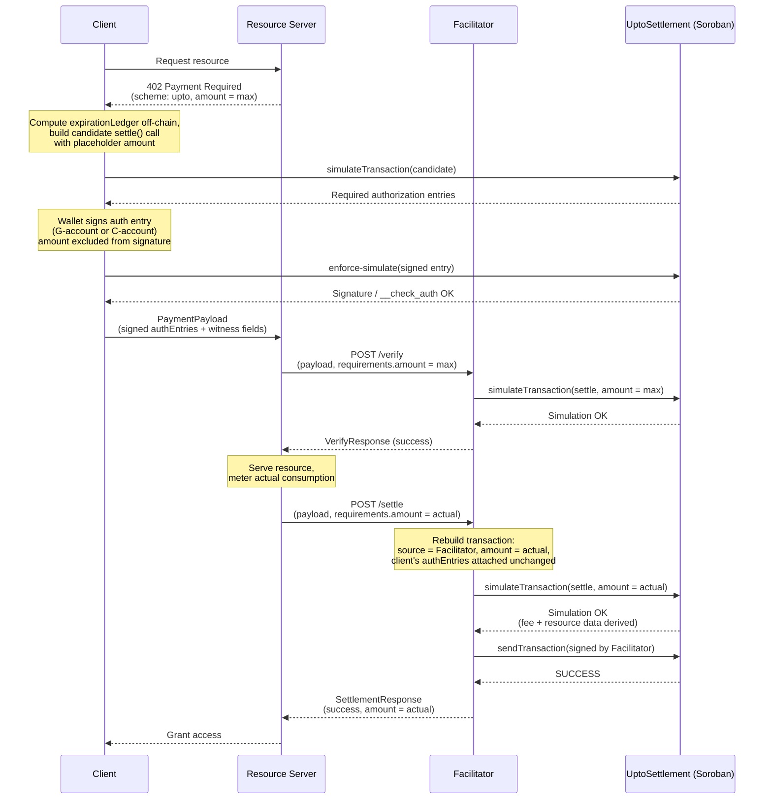

# Scheme: `upto` on `Stellar`

## Versions supported

- ❌ `v1` - we don't plan to support v1 for now.
- ✅ `v2`

## Supported Networks

This spec uses [CAIP-2](https://namespaces.chainagnostic.org/stellar/caip2) identifiers:

- `stellar:pubnet`  Stellar mainnet
- `stellar:testnet`  Stellar testnet

## Summary

The x402 `upto` on Stellar authorizes a transfer of **up to a maximum amount** of a
[SEP-41](https://stellar.org/protocol/sep-41) token. The client signs an
authorization for a ceiling; the actual amount charged is determined later,
after a resource has been served, based on real consumption (tokens
generated, bytes transferred, compute used).

> **Note**
> **Scope:** This spec covers [SEP-41](https://stellar.org/protocol/sep-41)-compliant
> Soroban tokens only. Classic Stellar assets are not supported. Payers may
> be either **G-accounts** (classic Stellar accounts) or **C-accounts**
> (Soroban smart-wallet/custom-account contracts). Both use signed
> `SorobanAuthorizationEntry` values on the wire. A G-account signer produces
> the protocol-defined Stellar-account signature; a C-account wallet produces
> whatever signature value its own `__check_auth` implementation expects
> (passkey assertions, multisig proofs, session-key proofs, and so on). There
> is intentionally no universal C-account keypair algorithm: clients integrate
> a wallet-provided auth-entry signer instead. `payTo` may likewise be any
> valid Stellar `Address` accepted by the selected SEP-41 token.

“C-account support” means the scheme and wire format do not assume a specific
smart-wallet implementation. A particular C-account is usable only when its
wallet can sign the authorization entry and its `__check_auth` policy accepts
the `settle` + `approve` invocation tree defined here. An arbitrary account
contract may deliberately reject that tree; no protocol can bypass the
account's own authorization policy.

Settlement is handled by a single, minimal, **stateless** contract
(`UptoSettlement`), deployed once per network. It holds no funds at any
point  there is no escrow or deposit step  and stores no per-request
state on-chain. Every authorization is fully self-contained in one signed
authorization entry, and is settled in exactly one transaction containing
exactly one operation.

## Example Use Cases

- Paying for LLM token generation (charge per token generated)
- Bandwidth or data transfer metering (charge per byte transferred in a single request)
- Dynamic compute pricing (charge based on actual resources consumed)

## Why `UptoSettlement` exists, and why it needs no storage

The core difficulty `upto` has to solve: the client must sign *something*
before the amount to be charged is known, and that signature must still
bind everything else that matters  recipient, asset, ceiling, timing
tightly enough that nothing else about the payment can be tampered with
afterward.

Soroban's authorization model checks a signed invocation's arguments
*exactly* against what's submitted on-chain. A contract call signed with a
fixed `amount` therefore can't later be settled for a different amount
the signature simply wouldn't match. So a plain, direct token transfer
can't be pre-signed for `upto`; `amount` has to be excluded from what's
signed, and Soroban's `require_auth_for_args` makes that possible: it lets
a contract author authorize against a **custom argument tuple** chosen by
the contract, rather than the literal argument list of the function that
was actually invoked. `UptoSettlement.settle` uses this to authorize
against `(payTo, asset, maxAmount, validAfter, deadline, expirationLedger,
salt, autoRevoke)`  everything except `amount`.

That still leaves a mechanical problem: once `amount` is free to vary,
nothing has actually authorized a token to move at all  SEP-41 token
transfers themselves still require a matching signed invocation with fixed
arguments, same as any other Soroban call. `UptoSettlement` resolves this
using the standard SEP-41 allowance pattern (`approve` / `transfer_from`):

1. The client signs an authorization entry whose root is the `settle` call
   above, with `token.approve(from, UptoSettlement, maxAmount,
   expirationLedger)` as a **fixed-argument** sub-invocation  this is
   still fine to pre-sign, because both the *ceiling* and the *expiration*,
   unlike the eventual charge, are chosen and known up front by the client
   itself (see § `UptoSettlement` Contract Interface for why
   `expirationLedger` specifically must be client-chosen rather than
   computed later).
2. Inside `settle()`, the contract grants itself that allowance (satisfied
   by the pre-signed sub-invocation), then calls
   `transfer_from(self, from, payTo, amount)`. This leg requires no
   separate signature at all, because the contract itself is both the
   invoker and the `spender`  a contract authorizing its own call is
   satisfied automatically.
3. If the client opts in (`autoRevoke = true`), a second pre-signed,
   fixed-argument sub-invocation  `token.approve(from, UptoSettlement, 0,
   0)`  lets the contract zero out any unused allowance in the same
   atomic call, when `amount < maxAmount`.

Because steps 1–3 all happen inside one transaction, there is no
*inter-transaction* window between approval and transfer. With
`autoRevoke = true`, no unused allowance survives the settlement. With
`autoRevoke = false`, the unused remainder remains until
`expirationLedger`; it cannot be drawn through `UptoSettlement` without a
new valid `settle` authorization, but clients SHOULD still use
`autoRevoke = true` to minimize residual on-chain authority.

This also removes the need for the contract to track any state of its own.
Replay protection doesn't come from a stored nonce or request record
it comes entirely from Soroban's own protocol-level behavior: every signed
authorization entry carries its own nonce, assigned at signing time, and
is consumed on first successful use. `UptoSettlement` doesn't need to
duplicate that bookkeeping; it just relies on the platform already doing
it.

One deliberate scope limitation follows from this: because Stellar permits
exactly one `invokeHostFunction` operation per transaction, each signed
authorization can only ever be consumed by exactly one `settle` call.
Metering many small draws against a single ceiling across multiple
transactions is out of scope for `upto` and is reserved for the separate
`batch-settlement` scheme. Each `upto` authorization is a single-shot,
single-transaction settlement.

## `PaymentRequirements` for `upto`

```json
{
  "scheme": "upto",
  "network": "stellar:testnet",
  "amount": "10000000",
  "asset": "CBIELTK6YBZJU5UP2WWQEUCYKLPU6AUNZ2BQ4WWFEIE3USCIHMXQDAMA",
  "payTo": "GBHEGW3KWOY2OFH767EDALFGCUTBOEVBDQMCKU4APMDLQNBW5QV3W3KO",
  "maxTimeoutSeconds": 60,
  "extra": {
    "areFeesSponsored": true,
    "settlementContract": "CABCDEF...UPTOSETTLEMENT"
  }
}
```

`amount` is **phase-dependent**: it's the maximum authorized at
verification time, and the actual charge at settlement time. Both phases
use the same `PaymentRequirements` shape; only the value of `amount`
differs between them. See § Phase-Dependent `amount` Semantics for the
full rationale.

**`extra` field definitions:**

- `areFeesSponsored`: whether the facilitator covers the network fee for
  settlement. Currently always `true`  the client never needs an XLM
  balance to complete payment.
- `settlementContract`: the canonical `UptoSettlement` contract address for
  this network  one deployment per network, known in advance by the
  facilitator (hardcoded or config-driven), not something the facilitator
  looks up from this field. It's included here so the facilitator can
  *validate* the resource server's requirements against the address it
  already trusts (§ Facilitator Verification Rules, rule 2), catching a
  misconfigured or malicious resource server pointing settlement at the
  wrong contract. If it doesn't match, the facilitator MUST reject before
  verification proceeds any further.

## Phase-Dependent `amount` Semantics in `PaymentRequirements`

The `/verify` and `/settle` calls to the facilitator share the same
`PaymentPayload` and `PaymentRequirements` types  there is no separate
settlement-specific message type. In `upto`, the `amount` field of
`PaymentRequirements` carries different meaning depending on which call
it's part of:

- At verification time, `amount` represents the **maximum** the client has
  authorized.
- At settlement time, `amount` represents the **actual** amount to settle,
  which MUST be `<= ` the previously authorized maximum.

The resource server communicates the final charge to the facilitator purely
by setting `amount` to the real, metered value in the settlement-time
`PaymentRequirements` it sends to `/settle`  determined from actual
resource consumption (tokens generated, bytes transferred, compute used),
with no additional fields or separate settlement type needed to convey it.

`payload.accepted.amount` does **not** change between phases. It remains the
original maximum selected and signed by the client, and is therefore the
facilitator's settle-time source of truth for the ceiling. Only the separate
settlement-time `requirements.amount` supplied by the resource server changes
to the actual charge.

**Rationale**: reusing `PaymentRequirements` unchanged for both phases keeps
the protocol simple and avoids introducing a settlement-specific message
shape. `amount` naturally maps to "how much" in both contexts  how much is
authorized at verification time, how much to charge at settlement time  so
the same field carries the right meaning in each phase without needing to be
renamed or duplicated.

## Protocol Flow

1. **Client** makes a request to a **Resource Server**.
2. **Resource Server** responds with a `402 Payment Required` status and a
   `PaymentRequired` header whose `accepts[]` entry has `scheme: "upto"` and
   `amount` set to the **maximum** the client may be charged.
3. **Client** computes `expirationLedger` off-chain:
   `currentLedger + ceil(maxTimeoutSeconds / estimatedLedgerSeconds)`
   (fallback `estimatedLedgerSeconds = 5`)  see § Time Semantics. This
   value, along with `deadline`, becomes part of what the client signs; the
   contract never computes it.
4. **Client** builds a candidate invocation using a funded simulation source
   G-account that is **different from `from`**. This is mandatory for a
   C-account payer (a C-account cannot be a transaction source) and mandatory
   for this sponsored flow with a G-account payer as well. The source is used only to
   make the recording-mode simulation produce an address-credential auth
   entry for the payer; it is not included in the signed invocation and need
   not be the eventual facilitator. Using `from` as the transaction or
   operation source would produce implicit source-account authorization,
   which cannot be transplanted into the facilitator-sponsored transaction.
   The candidate invokes
   `UptoSettlement.settle(from, payTo, asset, maxAmount, validAfter,
   deadline, expirationLedger, salt, autoRevoke, amount)`  `amount` here is
   a placeholder (e.g. `0`) used only to shape the simulation locally; it
   plays no role in what gets signed. Every other argument, including
   `expirationLedger` from step 3, is real and final.
5. **Client** simulates this candidate call to identify the required
   authorization entries: the root invocation over `(payTo, asset,
   maxAmount, validAfter, deadline, expirationLedger, salt, autoRevoke)`,
   with `token.approve(from, UptoSettlement, maxAmount, expirationLedger)`
   as a sub-invocation, and  only if `autoRevoke = true`
   `token.approve(from, UptoSettlement, 0, 0)` as a second sub-invocation.
6. **Client** asks the payer's auth-entry signer to sign the entry:
   - for a G-account, the signer produces the protocol-defined Ed25519
     account signature (collecting enough configured signer weight to satisfy
     the account threshold where necessary);
   - for a C-account, the connected smart-wallet implementation produces the
     contract-specific signature value accepted by that account's
     `__check_auth`.
   The client signs **only the authorization entry**  there is no meaningful
   full transaction to sign at this point, since `amount` is not known yet.
7. **Client** attaches the signed entry to the candidate and re-simulates in
   **enforcing mode**. For a C-account this executes `__check_auth`; for a
   G-account it verifies the Stellar-account signature and threshold. The
   client MUST reject if this simulation fails or still reports missing
   signers.
8. **Client** encodes the signed authorization entry (base64 XDR) along
   with the plaintext witness fields and sends them to the resource server
   as the `PaymentPayload`.
9. **Resource Server** forwards `PaymentPayload` and `PaymentRequirements`
   (with `amount` still set to the authorized maximum) to the
   **Facilitator's** `/verify` endpoint.
10. **Facilitator** reconstructs a candidate `settle` invocation using
   `amount = requirements.amount` (the maximum, at this phase), attaches the
   client's signed authorization entries, and validates structure, auth
   entry shape, expiration, and the bound fields (§ Facilitator Verification
   Rules).
11. **Facilitator** simulates this candidate call in enforcing mode at the worst case
    (`amount = maxAmount`) to confirm it would succeed, and returns a
    `VerifyResponse`.
12. **Resource Server**, upon successful verification, serves the resource
    and determines the actual amount to charge based on consumption.
13. **Resource Server** forwards the payload to the Facilitator's `/settle`
    endpoint with `requirements.amount` now set to the **actual** charge.
    - NOTE: `/settle` MUST perform full verification independently and MUST
      NOT assume prior verification.
14. **Facilitator** rebuilds the transaction with `amount = requirements.amount`,
    its own account as source, and the client's previously signed
    authorization entries attached unchanged.
15. **Facilitator** re-simulates the rebuilt transaction in enforcing mode to verify it
    succeeds, confirms the expected transfer event, and derives the
    settlement fee and fresh Soroban resource data from that simulation.
16. **Facilitator** signs the rebuilt transaction with its own key and
    submits it via RPC `sendTransaction`, then polls for confirmation.
17. **Resource Server** grants the **Client** access upon successful
    settlement.



## `PaymentPayload` `payload` Field

The payload carries **signed authorization entries**, not a full signed
transaction  there is no complete transaction to sign until `amount` is
filled in at settlement time.

```json
{
  "from": "GBHEGW3KWOY2OFH767EDALFGCUTBOEVBDQMCKU4APMDLQNBW5QV3W3KO",
  "payTo": "GBHEGW3KWOY2OFH767EDALFGCUTBOEVBDQMCKU4APMDLQNBW5QV3W3KO",
  "asset": "CBIELTK6YBZJU5UP2WWQEUCYKLPU6AUNZ2BQ4WWFEIE3USCIHMXQDAMA",
  "maxAmount": "10000000",
  "validAfter": 1755000000,
  "deadline": 1755000060,
  "expirationLedger": 1245678,
  "salt": "9f3a45bb4d6d275472c3213d4932...",
  "autoRevoke": true,
  "authEntries": [
    "AAAAAgAAAABriIN4poutFUmHfB6FbFJu8..."
  ]
}
```

- `expirationLedger`: **REQUIRED**, chosen and signed by the client  not
  computed by the contract. The client estimates this off-chain (current
  ledger + padding for `deadline`'s remaining seconds, same formula as
  before, just done client-side rather than on-chain) and includes it as
  part of what's signed. This is a correctness requirement, not a style
  choice: Soroban checks a signed sub-invocation's arguments by exact
  match, so if the contract instead recomputed this value internally at
  settlement time  using whatever the current ledger happens to be at
  that later moment  it would almost never match the value baked into the
  `approve(maxAmount, expirationLedger)` sub-invocation the client actually
  signed back when the authorization entry was built. Real time elapses
  between signing and settlement (verification, resource-serving, and
  settlement submission all happen in between), so the ledger sequence
  reliably moves in that window  a contract-side recomputation would
  reliably produce a mismatch and fail authorization, not just occasionally.
- `authEntries`: base64-encoded XDR of the signed `SorobanAuthorizationEntry`
  objects  the root entry over `(payTo, asset, maxAmount, validAfter,
  deadline, expirationLedger, salt, autoRevoke)`, plus its
  `approve(maxAmount, expirationLedger)` sub-invocation and, if
  `autoRevoke`, the `approve(0, 0)` sub-invocation. All three are captured
  within a single root `SorobanAuthorizationEntry`'s invocation tree, so in
  practice this is a one-element array. This version requires exactly one
  entry; the array shape is retained for wire-format forward compatibility.
- `from`: a valid `G...` or `C...` Stellar address. No separate `accountType`
  discriminator is sent; the address variant already identifies the payer
  kind, and the credential signature itself remains opaque to x402.
- The address credential's `signatureExpirationLedger` MUST equal
  `expirationLedger`. Using one ledger value for both the signed auth entry
  and temporary allowance prevents the two lifetimes from drifting apart.
- `autoRevoke`: clients SHOULD set this to `true`. If `false`, any unspent
  allowance remains until `expirationLedger`, although the stateless
  settlement contract has no independently callable path that can consume it.
- `salt`: **REQUIRED**. A client-chosen, application-layer discriminator
  **not** a cryptographic requirement. Soroban assigns each signed
  authorization entry its own nonce at signing time, independent of its
  arguments, so two authorizations remain independently replay-safe even if
  every other field is identical. `salt` exists for a narrower, operational
  reason: two concurrent authorizations to the same resource server can
  easily end up with an identical `(payTo, asset, maxAmount, validAfter,
  deadline, autoRevoke)` tuple  e.g. two requests landing on the same
  price tier and the same deadline rounding  which would otherwise be
  indistinguishable to any tooling that keys off those fields (request
  logs, idempotency checks, correlating a payload back to the resource
  server's own request ID). Making it required, rather than optional,
  means every implementation gets this disambiguation by default instead of
  only when a client happens to think of it.

## `UptoSettlement` Contract Interface

```rust
use soroban_sdk::{contract, contractimpl, token, Address, BytesN, Env, IntoVal};

#[contract]
pub struct UptoSettlement;

#[contractimpl]
impl UptoSettlement {
    pub fn settle(
        env: Env,
        from: Address,
        pay_to: Address,
        asset: Address,
        max_amount: i128,
        valid_after: u64,
        deadline: u64,
        expiration_ledger: u32,
        salt: BytesN<32>,
        auto_revoke: bool,
        amount: i128,
    ) -> i128 {
        // 1. Verify authorization  every field except `amount` is bound.
        //    expiration_ledger is included here: it must be replayed verbatim
        //    into the approve() calls below, exactly as signed  see note below.
        from.require_auth_for_args(
            (
                pay_to.clone(),
                asset.clone(),
                max_amount,
                valid_after,
                deadline,
                expiration_ledger,
                salt.clone(),
                auto_revoke,
            )
                .into_val(&env),
        );

        // 2. Verify validity window
        let now = env.ledger().timestamp();
        if now < valid_after {
            panic!("not_yet_valid");
        }
        if now >= deadline {
            panic!("expired");
        }

        // 3. Verify payment parameters
        if max_amount <= 0 || amount < 0 || amount > max_amount {
            panic!("invalid_amount");
        }

        let token = token::TokenClient::new(&env, &asset);
        let this = env.current_contract_address();

        // 4. Grant this contract temporary approval up to max_amount, using the
        //    client-supplied expiration_ledger  NOT recomputed here. This must
        //    match, byte-for-byte, the value baked into the client's pre-signed
        //    approve() sub-invocation, or the authorization check fails.
        token.approve(&from, &this, &max_amount, &expiration_ledger);

        // 5. Execute the transfer  contract is spender & invoker, so this leg
        //    needs no separate signature
        if amount > 0 {
            token.transfer_from(&this, &from, &pay_to, &amount);
        }

        // 6. Optional cleanup  only if the client opted in and the transfer
        //    didn't already drain the allowance to zero on its own
        if auto_revoke && amount < max_amount {
            token.approve(&from, &this, &0, &0);
        }

        amount
    }
}
```

**`expiration_ledger` is chosen and signed by the client  it is not
computed inside the contract.** An earlier draft of this spec had the
contract derive it from `deadline` via a helper (`ledger_seq_for`) at
settlement time. That's wrong, not just suboptimal: Soroban checks a signed
sub-invocation's arguments by **exact match** against what's submitted
on-chain. The client's signature is created against a specific
`approve(max_amount, expiration_ledger)` sub-invocation, with a specific
`expiration_ledger` value baked in at signing time (when the client
simulates the candidate call, using whatever the current ledger sequence
happens to be *then*). If `settle()` instead recomputed this value itself
at execution time  using the ledger sequence at *that* later moment,
after verification and resource-serving have both taken place  the
recomputed value would almost never equal the one in the signed entry,
since real time (and therefore ledger sequence) reliably advances in
between. The call would fail authorization essentially every time, not
occasionally. The fix is for the client to choose `expiration_ledger`
themselves (off-chain, using `currentLedger + ceil(maxTimeoutSeconds /
estimatedLedgerSeconds)` with the network estimate or the 5-second fallback),
sign it as part of the witness, and have `settle()` simply replay
that exact value into its `approve()` calls rather than deriving anything.

## Facilitator Verification Rules (MUST)

A facilitator verifying an `upto` payload on Stellar MUST enforce all of the
following before sponsoring and signing the transaction  at both `/verify`
and `/settle`, each independently. `/settle` MUST NOT skip these checks on
the assumption that `/verify` already ran.

### 1. Protocol Validation

- `x402Version` MUST be `2`.
- Both `payload.accepted.scheme` and `requirements.scheme` MUST be `"upto"`.
- `payload.accepted.network` MUST match `requirements.network`.
- The candidate and rebuilt transaction MUST contain exactly one operation,
  of type `invokeHostFunction`, with no operation-level source account.

### 2. Witness Field Consistency

- `payload.payTo` and `payload.asset` MUST equal both their corresponding
  `payload.accepted` fields and the current `requirements` fields exactly.
- `payload.maxAmount` MUST equal `payload.accepted.amount`, which remains the
  original authorized maximum at both phases.
- At `/verify`, `requirements.amount` MUST equal `payload.maxAmount`.
- At `/settle`, `requirements.amount` is the actual charge and MUST satisfy
  `0 <= requirements.amount <= payload.maxAmount`; it MUST NOT be substituted
  for the maximum when checking the signed authorization tree.
- `payload.accepted.extra.settlementContract` and
  `requirements.extra.settlementContract` MUST both match the canonical
  contract address configured for `requirements.network`.
- `payload.accepted.maxTimeoutSeconds` MUST equal
  `requirements.maxTimeoutSeconds`, and both
  `payload.accepted.extra.areFeesSponsored` and
  `requirements.extra.areFeesSponsored` MUST be `true`.
- `payload.maxAmount` MUST be greater than `0`, `validAfter` MUST be strictly
  less than `deadline`, and `deadline - validAfter` MUST NOT exceed
  `requirements.maxTimeoutSeconds`.
- At both phases, the latest closed ledger timestamp MUST satisfy
  `validAfter <= now < deadline`. At `/verify`, `deadline` MUST also be no
  later than `now + requirements.maxTimeoutSeconds`.

### 3. Authorization Entry Structure

- The authorization entry's root invocation MUST target
  `UptoSettlement.settle` on the canonical `settlementContract`, with args
  exactly `(payTo, asset, maxAmount, validAfter, deadline, expirationLedger,
  salt, autoRevoke)`  `amount` MUST NOT appear in the signed argument
  tuple.
- The root invocation's `subInvocations` MUST contain **exactly**:
  `token.approve(from, settlementContract, maxAmount, expirationLedger)`,
  and, if and only if `payload.autoRevoke = true`, `token.approve(from,
  settlementContract, 0, 0)`. No other sub-invocations are permitted. The
  `expirationLedger` value here MUST match `payload.expirationLedger`
  exactly  both come from the same client-signed field, and the contract
  itself never modifies or recomputes it.
- Exactly one authorization entry is permitted. Its credential address MUST
  equal `payload.from`, and its nonce MUST be present.
- Credential type MUST be address-based authorization, not source-account
  implicit authorization. Implementations MUST accept legacy
  `sorobanCredentialsAddress`, and MAY accept newer address credential
  variants (including `sorobanCredentialsAddressV2` and delegated-address
  credentials) on networks where those variants are active. The credential
  address MUST be either `Address::Account` (G-account) or
  `Address::Contract` (C-account) and MUST equal `payload.from`.
- The facilitator MUST treat the credential's `signature` field as opaque.
  For a G-account it has the protocol-defined account-signature shape; for a
  C-account its `ScVal` type and contents are defined entirely by that
  contract's `__check_auth`. The facilitator MUST NOT require an Ed25519
  shape for a C-account or attempt to reproduce wallet-specific verification
  off-chain.
- The credential's `signatureExpirationLedger` MUST equal
  `payload.expirationLedger`. That value MUST be at least the current ledger
  and MUST NOT exceed `currentLedger + ceil(requirements.maxTimeoutSeconds /
  estimatedLedgerSeconds)`. Implementations SHOULD use the current network
  estimate for `estimatedLedgerSeconds` when available and MUST fall back to
  `5` seconds when no estimate is available. The same rule applies
  independently at `/verify` and `/settle`.
  Since the client chooses this value themselves (§ `UptoSettlement`
  Contract Interface), the facilitator MUST independently bound it rather
  than trusting it  an excessively distant `expirationLedger` would leave
  the granted allowance live far longer than the authorization's actual
  `deadline` implies, which is a real (if minor) hygiene concern even though
  the contract's own `deadline` check still gates `settle()` itself.

### 4. Maximum Amount Enforcement (settlement time)

- At settle time, `requirements.amount` (the actual charge) MUST be `<=
  payload.maxAmount`. This is enforced independently by the contract itself
  (`settle` panics on violation)  the facilitator MUST still check it
  before submitting, to avoid paying a fee for a transaction it can predict
  will fail.
- `requirements.amount` MAY be `0`.
- Negative settlement amounts MUST be rejected.

### 5. 🚨 Facilitator Safety

- The transaction source account the facilitator builds MUST be the
  facilitator's own address, never the client's.
- The facilitator MUST NOT be the `from` address.
- The facilitator address does not appear anywhere in the signed
  authorization  this scheme is deliberately facilitator-agnostic, so
  **any** party holding the signed entries may submit settlement.
  Deployments that need settlement restricted to one specific facilitator
  MUST enforce that off-chain (e.g. the resource server only forwards
  payloads to a trusted facilitator's endpoint).
- For a positive amount, the simulation MUST emit exactly the expected token
  transfer (payer decrease and recipient increase) and no other balance
  changes. For amount `0`, it MUST emit no transfer and no balance change.
  Expected `approve` events MAY also be present.

### 6. Simulation

- The facilitator MUST re-simulate against current ledger state at both
  `/verify` (worst-case `amount = maxAmount`) and `/settle`
  (`amount = requirements.amount`).
- Both simulations MUST run with the signed auth entry attached, in enforcing
  mode. A C-account's `__check_auth` MUST execute successfully; a G-account's
  signature and configured threshold MUST validate. Structural inspection
  alone is never sufficient proof of authorization.
- The simulation MUST succeed without errors and MUST confirm the exact
  balance change specified by the phase-appropriate `amount`.
- A C-account's `__check_auth` MAY emit diagnostic/contract events or update
  that account's own policy state (for example, a spending-limit counter).
  Such account-auth effects do not invalidate an otherwise correct payment,
  but all token balance changes must still be limited to the expected payer
  debit and recipient credit, and the facilitator's fee ceiling still applies.

## Transaction Fees

- The facilitator MUST derive the settlement fee from a fresh simulation at
  settle time: `simulationResourceFee + inclusionBuffer` (buffer `>= 100`
  stroops).
- The facilitator MUST refresh Soroban resource data (footprint,
  `resourceFee` cap) from that same simulation.
- Since the client never builds a full transaction, there is no client-set
  fee bid to override  the facilitator determines the entire fee itself
  from simulation.
- A `maxTransactionFeeStroops` safety ceiling applies (default 50,000
  stroops, operator-overridable). Exceeding it MUST cause the facilitator to
  reject with `invalid_upto_stellar_payload_fee_exceeds_maximum`.

## Settlement Logic

### Phase 1: Transaction Reconstruction

1. Parse the client's signed authorization entries.
2. Build a fresh `invokeHostFunction` operation calling
   `UptoSettlement.settle(from, payTo, asset, maxAmount, validAfter,
   deadline, expirationLedger, salt, autoRevoke, amount)`, with
   `amount = requirements.amount`
   (the phase-appropriate value  max at verify, actual at settle) and the
   client's signed authorization entries attached.
3. Re-simulate and derive the settlement fee and fresh Soroban resource data
   from the result.
4. Assemble the transaction with:
   - **Source Account**: Facilitator's Stellar address (spends its own
     sequence number, pays fees).
   - **Operation**: The single `invokeHostFunction` call above.
   - **Auth Entries**: The client's signed entries, unmodified.
   - **Fee / Soroban Data**: As derived in step 3.

### Phase 2: Transaction Submission

1. Sign with the facilitator's key.
2. Submit via RPC `sendTransaction`.
3. Confirm `PENDING`, then poll for `SUCCESS` / `FAILED`.

### Phase 3: `SettlementResponse`

```json
{
  "success": true,
  "transaction": "a1b2c3d4e5f6...",
  "network": "stellar:testnet",
  "payer": "GBHEGW3KWOY2OFH767EDALFGCUTBOEVBDQMCKU4APMDLQNBW5QV3W3KO",
  "amount": "3400000"
}
```

- `success`: whether settlement succeeded.
- `errorReason`: omitted on success; present and machine-readable on failure.
- `transaction`: the confirmed settlement transaction hash.
- `network`: CAIP-2 network identifier.
- `payer`: the `from` address.
- `amount`: actual base units charged, echoing the settlement-phase
  `requirements.amount`. MAY be `"0"`.

## Time Semantics: Timestamp vs. Ledger Sequence

Stellar has two independent expiration systems in play here, and this
scheme touches both:

- `validAfter` / `deadline` (wire fields, Unix seconds) are the
  contract-enforced authority, checked via `env.ledger().timestamp()`.
- The signed authorization entry's own expiration and the
  `expirationLedger` argument passed to the positive `approve` call are the
  same ledger sequence number  there is no exact protocol-guaranteed
  seconds-per-ledger
  conversion (~5s average, not a guarantee).

Implementations MUST treat `deadline` as authoritative. **The client**
computes `expirationLedger` off-chain using
`currentLedger + ceil(maxTimeoutSeconds / estimatedLedgerSeconds)` and uses
the current network estimate for `estimatedLedgerSeconds` when available
(fallback `estimatedLedgerSeconds = 5`). The client uses that same value as
the auth entry's
`signatureExpirationLedger`. The contract does not compute or
adjust this value at settlement time (§ `UptoSettlement` Contract
Interface explains why: a contract-side recomputation would almost never
match what was actually signed, since real time elapses between signing
and settlement). Underestimating at signing time risks the allowance or
the auth entry itself expiring before `deadline` is reached  which would
silently block a settlement that the contract's own `deadline` check would
otherwise have accepted.

## Error Codes

- `invalid_upto_stellar_settlement_not_yet_valid`: `env.ledger().timestamp() < validAfter`  settlement attempted before the authorization's validity window opens.
- `invalid_upto_stellar_settlement_expired`: `env.ledger().timestamp() >= deadline`  settlement attempted after the authorization's validity window has closed. Note this can also surface indirectly as a simulation failure if the *auth entry's own* ledger-sequence expiration (§ Time Semantics) lapses first  implementations SHOULD distinguish the two where possible, since one indicates the wire-level `deadline` was reached and the other indicates the padding computed for `expirationLedger` was insufficient.
- `invalid_upto_stellar_settlement_exceeds_amount`: attempted settlement
  amount exceeds `maxAmount`.
- `invalid_upto_stellar_settlement_negative_amount`: attempted settlement
  amount is negative. An amount of zero is valid and consumes the
  authorization without transferring tokens.
- `invalid_upto_stellar_payload_invalid_max_amount`: `maxAmount` is not a
  positive integer.
- `invalid_upto_stellar_account_authentication`: enforcing-mode simulation
  rejected the payer authorization. For a G-account this includes invalid or
  insufficient signatures; for a C-account it includes a malformed proof or
  rejection by `__check_auth`.
- `invalid_upto_stellar_payload_fee_exceeds_maximum`: settlement fee derived
  from simulation exceeds `maxTransactionFeeStroops`.
- `UPTO_ALLOWANCE_REQUIRED` (with `412`): the reconstructed transaction fails
  simulation at verify time (e.g. insufficient balance, missing trustline
  for a classic asset wrapped by a Stellar Asset Contract).

## Security Considerations

1. **No overcharge**: `amount > maxAmount` is rejected both by the
   contract's own check and, redundantly, by the SEP-41 allowance the
   contract granted itself moments earlier in the same transaction.
2. **No redirection**: `payTo` is part of the signed root invocation;
   nothing in `settle()` can alter it after the fact.
3. **Allowance lifetime**: because `approve` and `transfer_from` happen in
   the same atomic transaction, there is no race window between them. When
   `autoRevoke = true`, any unused remainder is cleared before commit. When
   it is `false`, the remainder survives until `expirationLedger`; the
   contract exposes no call that can spend it without a fresh client
   authorization, but `true` is still the recommended hygiene default.
4. **Facilitator-agnostic by design**: no facilitator identity is bound into
   the signature; any holder of the signed authorization entries can submit
   settlement. This trades a security property (binding settlement to one
   named party) for simplicity and statelessness  deployments that need
   the former must enforce it off-chain (trusted-facilitator allowlisting
   at the resource-server layer).
5. **`maxAmount` in the witness is informational relative to the true
   ceiling**: the *approved* allowance, not the signed `maxAmount` value
   alone, is what ultimately gates `transfer_from`. In practice they're
   equal because `settle()` always approves exactly `maxAmount` itself  but
   implementers should understand that the enforcement mechanism is the
   allowance the contract grants, not merely a stored/compared number.
6. **Stateless replay protection**: replay prevention comes entirely from
   Soroban's protocol-level, per-address authorization-entry nonce
   consumption, not from any `UptoSettlement`-tracked record, since none
   exists.
7. **Server/metering trust**: the client trusts the resource
   server/facilitator to meter honestly up to the authorized ceiling.
   Nothing in this scheme removes that assumption  it governs how much the
   client is willing to authorize, not whether the metering itself is
   truthful.
8. **Reserved for `batch-settlement`**: multi-settlement/streaming against
   one authorization is not supported by `upto`. Stellar permits exactly one
   `invokeHostFunction` operation per transaction, so each `upto`
   authorization can only be consumed by one `settle` call. Aggregating many
   small draws for later settlement belongs to the separate
   `batch-settlement` scheme.
9. **C-account policy compatibility**: a smart wallet may enforce policies
   over the authorization context. The context binds `maxAmount` and includes
   `approve(maxAmount)` but deliberately excludes the final `amount`, so a
   spending-limit policy may conservatively account for the authorized maximum
   rather than the later actual charge. Clients MUST surface wallet rejection
   instead of weakening or rewriting the signed tree.

## Appendix

### Authorization Pattern

The client signs **authorization entries only**, never a full transaction.
This is required, not optional, for this scheme: a full transaction would
need `amount` fixed at build time, which defeats the entire point of
`upto`. The client:

- Spends no sequence number of its own.
- Requires no XLM balance (fees are fully sponsored by the facilitator).
- Signs a bounded, well-defined argument tuple rather than an entire
  transaction envelope, which keeps the signed payload small and its scope
  easy to audit.

This signing flow supports both account kinds through one auth-entry signer
boundary:

- A **G-account adapter** may use the Stellar SDK's `authorizeEntry` /
  `basicNodeSigner` path. The resulting signature must satisfy the account's
  configured threshold; a multi-signer wallet is responsible for collecting
  sufficient signatures before returning the final entry.
- A **C-account adapter** delegates to the smart wallet. It returns a complete
  signed authorization entry containing the contract-specific signature
  `ScVal` expected by `__check_auth`. The x402 client and facilitator do not
  interpret that proof.

In either case, the adapter MUST preserve the credential variant, credential
address, nonce, root invocation, and sub-invocation tree it received. The only
permitted mutations are:

- setting `signatureExpirationLedger` to `payload.expirationLedger`; and
- populating the credential signature/proof fields.

This exception for `signatureExpirationLedger` is required because entries
returned by recording-mode simulation have their final expiration populated
as part of signing. Implementations MUST compare the returned entry against
the unsigned entry and reject every other mutation. If delegated credentials
are used, the delegated wrapper and signer tree MUST be constructed before
the adapter receives the entry; signing MUST NOT introduce or rewrite that
tree. An enforcing-mode simulation then provides the authoritative
verification.

### Implementer References

Implementers should read the following Stellar documentation:

1. **[Signing Soroban contract invocations](https://developers.stellar.org/docs/build/guides/transactions/signing-soroban-invocations)**
   — Covers auth-entry signing, G-account versus C-account authorization,
   Recording versus Enforcing simulation, and sponsored transactions.
2. **[Authorization](https://developers.stellar.org/docs/learn/fundamentals/contract-development/authorization)**
   — Covers `require_auth`, `require_auth_for_args`, authorization entries,
   replay protection, and the underlying authorization model.
3. **[Stellar transaction and authorization-entry structure](https://developers.stellar.org/docs/learn/fundamentals/contract-development/contract-interactions/stellar-transaction)**
   — Covers `SorobanAuthorizationEntry`, credentials, authorized invocation
   trees, and sub-invocations.
4. **[Complex Account example](https://developers.stellar.org/docs/build/smart-contracts/example-contracts/complex-account)**
   — Demonstrates `__check_auth` and how a C-account can apply authorization
   policies to the invocation context.
5. **[Transaction Simulation](https://developers.stellar.org/docs/learn/fundamentals/contract-development/contract-interactions/transaction-simulation)**
   — Covers Recording and Enforcing simulation and how authorization entries
   are generated and validated.

### Example Authorization Entry Tree

```
SorobanAuthorizationEntry
├── credentials: Address(from, nonce, signatureExpirationLedger, signature)
│   signature: G-account protocol signatures OR C-account-defined ScVal
└── rootInvocation: ContractFn
    contract: UptoSettlement
    function: "settle"
    args: [payTo, asset, maxAmount, validAfter, deadline, expirationLedger, salt, autoRevoke]
    subInvocations:
      ├── ContractFn
      │   contract: <asset token address>
      │   function: "approve"
      │   args: [from, spender=UptoSettlement, amount=maxAmount, expirationLedger]
      │
      └── ContractFn                          # present only if autoRevoke = true
          contract: <asset token address>
          function: "approve"
          args: [from, spender=UptoSettlement, amount=0, expiration_ledger=0]
```

Note that `from` is carried by the address credential, not repeated in the
custom root argument tuple. The credential's `signatureExpirationLedger`,
the root `expirationLedger`, and the first sub-invocation's
`expirationLedger` are the *same client-chosen value*, fixed at signing time.
The contract replays it, never derives it. The settlement `amount` never
appears anywhere in this tree  it is supplied only at submission time, by
whichever party ultimately calls `settle`.
