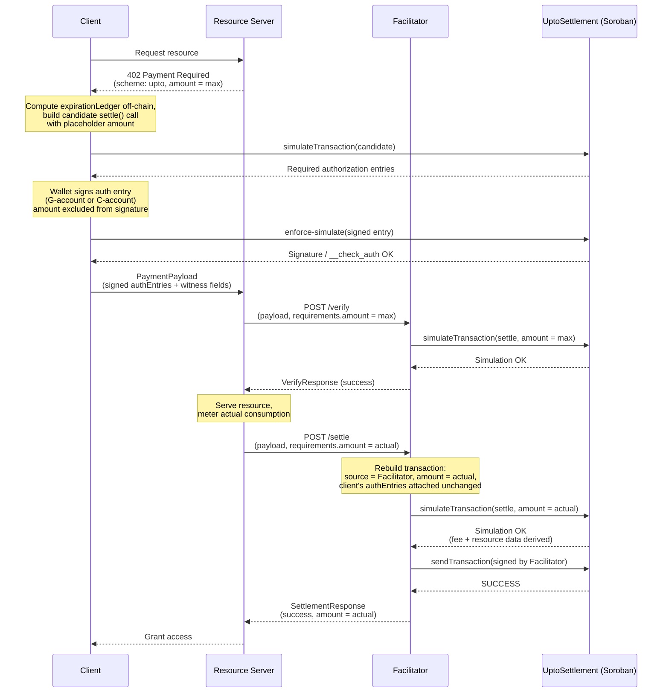

# Scheme: `upto` on `Stellar`

## Versions supported

- ❌ `v1` is not supported.
- ✅ `v2`

## Supported Networks

[CAIP-2](https://namespaces.chainagnostic.org/stellar/caip2) identifiers:
- `stellar:pubnet`: Stellar mainnet
- `stellar:testnet`: Stellar testnet

## Summary

`upto` on Stellar authorizes a transfer of **up to** a maximum amount, with the
settled amount fixed at settlement time. Like [`exact` on
Stellar](../exact/scheme_exact_stellar.md), the client signs [Soroban
authorization entries][auth-entry-signing] rather than a full transaction, and
the facilitator sponsors network fees.

Unlike `exact`, the settled amount is unknown when the client signs. Two
conformant profiles close that gap while preserving all four [core `upto`
properties](./scheme_upto.md#core-properties-must):

| Profile | Settlement path | Buyer accounts | Ships a contract | Facilitator binding |
| --- | --- | --- | --- | --- |
| **`stateless`** (base) | `UptoSettlement` (stateless), atomic `approve` + `transfer_from` | G- and C-accounts | Yes | Facilitator-agnostic |
| **`contract`** (stateful) | `UptoSettlement`, atomic pull-and-refund | G- and C-accounts | Yes, a different contract | Bound to one named facilitator |

Both profiles are equally conformant; neither is a fallback for the other.
`stateless` is presented first because it has no implementation-defined
boundary to get wrong (no app-managed nonce or TTL, replay protection is the
protocol's own guarantee). `contract` exists because `stateless` leaves one
specific risk open by design — settlement by an unintended party holding a
leaked authorization — and some deployments need that closed badly enough to
accept the extra settlement cost and the TTL-sizing responsibility that comes
with it. § Choosing between `stateless` and `contract` states the trade-off
and the topology each one fits. Every MUST in this document applies
per-profile: implementers pick one (or both) and implement its own section in
full, not a blend of the two.

> [!IMPORTANT]
> **Verification status.** Every property below is closed against real
> `stellar:testnet` behaviour, each backed by a settled transaction hash, not
> simulation alone.
>
> **`stateless`** (Iam0TI, [`0d1026/Rialto`](https://github.com/0d1026/Rialto)):
> a genuine partial settlement (`300,000` of a `1,000,000` signed ceiling,
> [`2ea539f6...`](https://stellar.expert/explorer/testnet/tx/2ea539f67aa8daff06698a93279345c88c71dd41a5a77f77d65335f4113a11d5))
> and a genuine maximum settlement (`500,000` of `500,000`,
> [`b76b45a3...`](https://stellar.expert/explorer/testnet/tx/b76b45a383f7e54991e3fad6beb0143b7b78c2bff25e929305fe911241869763)),
> both decoded from the raw on-chain `settle` call arguments, not taken on
> trust from labels.
>
> **`contract`** ([Eras256/Periplo](https://github.com/Eras256/Periplo),
> [`conformance/RESULTS.md`](https://github.com/Eras256/Periplo/blob/main/conformance/RESULTS.md),
> settled tx
> [`cc46374e...`](https://stellar.expert/explorer/testnet/tx/cc46374e34f70ff479ccf919d55df33d0bf1a05e1c7479fa8f90dac596c5d218)):
> 1. `require_auth_for_args` accepts a root argument tuple of `(authorization,)`
>    while the [SEP-41] `transfer` rides as a sub-invocation for `max_amount`.
>    **Closed.** Confirmed via `inspectAuthEntry` on a real simulation: root
>    call `argCount=1`, one sub-invocation.
> 2. The pull-and-refund sequence fits within Soroban's per-transaction read,
>    write, instruction and memory limits. **Closed.** `2,026,530` instructions
>    of a `400,000,000` ceiling, `392` read bytes and `680` write bytes.
> 3. `temporary()` storage TTL can always cover `deadline_ledger − current_ledger`
>    under the `MAX_WINDOW_LEDGERS` bound. **Closed.** The settled nonce
>    entry's `liveUntilLedgerSeq`, read back from RPC, exceeded `deadline_ledger`.
>
> **Not yet closed for either profile:** § C-account support below states a
> real, independently confirmed gap for one specific C-account signing
> pattern. Read it before advertising `upto` support for delegated
> smart-account signers.
>
> `extra.uptoProfile` and `extra.settlementContract` are proposed field names.
> Happy to align with whatever convention the maintainers prefer.

> [!NOTE]
> [SEP-41] Soroban tokens only; classic assets are out of scope. Amounts are
> `i128` in the token's own precision. USDC on Stellar uses **7 decimals**.

## Why a SEP-41 allowance alone is insufficient

`approve` / `transfer_from` measured against the four core properties:

| Core property | Allowance behaviour | Conformant |
| --- | --- | --- |
| 4. Maximum amount | The allowance is a ceiling. | ✅ |
| 2. Time-bound | `expiration_ledger` bounds validity. | ✅ (no `validAfter`) |
| 3. **Recipient binding** | `transfer_from` lets the spender choose **any** `to`. Nothing the client signed constrains the destination. | ❌ |
| 1. **Single-use** | An allowance is a standing balance, drawable across many calls until exhausted or expired. | ❌ |

Recipient binding is decisive: it would let a compromised facilitator redirect
funds, which is the risk Core Property 3 exists to eliminate. Enforcing all
four requires code that runs at settlement — a bare allowance never does.
Both profiles below solve this the same structural way (a stateless or
stateful `UptoSettlement` contract that binds `payTo` into what the client
signs and controls the actual transfer), which is why a bare
`approve`/`transfer_from` integration, with no settlement contract at all, is
not a third profile: it cannot satisfy Properties 1 or 3 by construction.

> A facilitator implementing `upto` on Stellar via bare `approve` /
> `transfer_from`, with no `UptoSettlement`-style contract enforcing recipient
> binding and single use, does not satisfy Core Properties 1 or 3 and MUST NOT
> advertise `upto` support.

## Choosing between `stateless` and `contract`

Neither profile is a universal default. The right choice depends on
deployment topology.

`stateless` fits a **single-operator** deployment: one resource server, one
trusted facilitator, a controlled channel between them, where the
leaked-authorization risk (§ Profile `stateless`, Security considerations) is
already minimized operationally, and the lower settlement cost and simpler,
storage-free implementation are worth more.

`contract` fits a **federated or multi-facilitator** deployment, where more
than one facilitator may plausibly see the same signed payload
(catalog-driven discovery routing, a resource server trying more than one
facilitator, a facilitator that receives a payload for `/verify` but never
proceeds to `/settle`), and closing the leaked-authorization risk matters more
than the extra settlement cost or the TTL-sizing responsibility of an
app-managed nonce.

Implementers choose per deployment. This spec does not declare one profile
conformant and the other not, and a facilitator MAY support both, advertising
each via its own `extra.uptoProfile` value.

## C-account support (both profiles)

Payers under **either** profile MAY be a G-account (`G...`) or a C-account
(`C...`) Stellar address. `require_auth_for_args`/`require_auth` dispatch to
either the protocol-defined Ed25519 account signature or the C-account's own
`__check_auth`; neither profile's contract special-cases which kind is used.

Facilitators MUST treat the credential's `signature` field as opaque. For a
G-account it has the protocol-defined account-signature shape. For a
C-account its `ScVal` type and contents are defined entirely by that
account's `__check_auth`. Facilitators MUST NOT require an Ed25519 shape for
a C-account credential or attempt to reproduce wallet-specific verification
off-chain. Enforcing-mode simulation is the authoritative check.

A C-account cannot be a transaction source. When building the candidate
invocation for simulation, clients MUST use a separate, funded G-account as
the simulation source when the payer is a C-account. This source only
produces a valid simulation; it is never included in the signed authorization
tree and need not be the eventual facilitator.

A C-account's spending policy sees `maxAmount` at signing time, not the later
actual settlement amount. This is true under every `upto` profile on Soroban,
since the settled amount is unknown by construction when the client signs.
Clients MUST surface a wallet's policy rejection rather than weakening or
rewriting the signed authorization tree.

> [!WARNING]
> **A real, currently open gap in delegated C-account signing, not yet closed
> by anyone.** Everything above is confirmed for a C-account whose *own*
> `__check_auth` directly evaluates the signed authorization (a custom account
> contract that is itself the signer). It is **not** confirmed for a C-account
> that *delegates* authorization to an external or session signer — the
> smart-account pattern most relevant to autonomous-agent payments, where an
> agent holds a scoped key and the account's own policy contract is meant to
> gate what that key can spend through.
>
> Attempting exactly this against OpenZeppelin's `stellar-accounts` crate (the
> most widely used Soroban smart-account reference implementation) traps
> `__check_auth` with `UnreachableCodeReached` on every construction tried —
> both a `Signer::Delegated` and a `Signer::External` signer — against both a
> real `UptoSettlement`-style contract and a trivial single-line probe
> contract used specifically to rule out the target contract's own complexity
> as the cause. Seven concrete hypotheses were tested and ruled out with real
> evidence (encoding method, nonce reuse, nested-entry presence, `AuthPayload`
> content, `soroban-sdk` version alignment, target-contract complexity, signer
> type), and `stellar-accounts` itself was independently confirmed to have no
> test coverage of this real, host-driven `require_auth_for_args` path in
> either the crate or its own official example. Filed as a diagnostic request
> at [OpenZeppelin/stellar-contracts#839](https://github.com/OpenZeppelin/stellar-contracts/issues/839),
> open as of this writing.
>
> Since **both** profiles in this document rest on `require_auth_for_args` for
> exactly the same reason (excluding the settlement amount from what's
> signed), this gap is not specific to one profile — it is a property of the
> underlying Soroban mechanism both profiles depend on, evaluated against one
> specific, popular smart-account library. Implementations and integrators
> MUST NOT assume "C-accounts are supported" extends to a delegated/session-key
> signer until this is independently resolved. A directly-signing custom
> account (the account contract's own `__check_auth` evaluates the
> authorization itself, with no delegation) is unaffected by this finding and
> remains verified.

## Profile `stateless`

Contributed by [Iam0TI](https://github.com/Iam0TI) via
[x402-foundation/x402#3134](https://github.com/x402-foundation/x402/pull/3134),
with a reference implementation at
[`0d1026/Rialto`](https://github.com/0d1026/Rialto/tree/mvp/contracts/upto-settlement).

### Why `UptoSettlement` needs no storage

The core difficulty `upto` has to solve: the client must sign *something*
before the amount to be charged is known, and that signature must still bind
everything else that matters — recipient, asset, ceiling, timing — tightly
enough that nothing else about the payment can be tampered with afterward.

Soroban's authorization model checks a signed invocation's arguments
*exactly* against what's submitted on-chain. A contract call signed with a
fixed `amount` therefore can't later be settled for a different amount — the
signature simply wouldn't match. So a plain, direct token transfer can't be
pre-signed for `upto`; `amount` has to be excluded from what's signed, and
Soroban's `require_auth_for_args` makes that possible: it lets a contract
author authorize against a **custom argument tuple** chosen by the contract,
rather than the literal argument list of the function that was actually
invoked. `UptoSettlement.settle` uses this to authorize against `(payTo,
asset, maxAmount, validAfter, deadline, expirationLedger, salt, autoRevoke)`
— everything except `amount`.

That still leaves a mechanical problem: once `amount` is free to vary,
nothing has actually authorized a token to move at all — SEP-41 token
transfers themselves still require a matching signed invocation with fixed
arguments, same as any other Soroban call. `UptoSettlement` resolves this
using the standard SEP-41 allowance pattern (`approve` / `transfer_from`):

1. The client signs an authorization entry whose root is the `settle` call
   above, with `token.approve(from, UptoSettlement, maxAmount,
   expirationLedger)` as a **fixed-argument** sub-invocation — this is still
   fine to pre-sign, because both the *ceiling* and the *expiration*, unlike
   the eventual charge, are chosen and known up front by the client itself.
2. Inside `settle()`, the contract grants itself that allowance (satisfied by
   the pre-signed sub-invocation), then calls `transfer_from(self, from,
   payTo, amount)`. This leg requires no separate signature at all, because
   the contract itself is both the invoker and the `spender` — a contract
   authorizing its own call is satisfied automatically.
3. If the client opts in (`autoRevoke = true`), a second pre-signed,
   fixed-argument sub-invocation — `token.approve(from, UptoSettlement, 0,
   0)` — lets the contract zero out any unused allowance in the same atomic
   call, when `amount < maxAmount`.

Because steps 1–3 all happen inside one transaction, there is no
*inter-transaction* window between approval and transfer. With `autoRevoke =
true`, no unused allowance survives the settlement. With `autoRevoke =
false`, the unused remainder remains until `expirationLedger`; it cannot be
drawn through `UptoSettlement` without a new valid `settle` authorization,
but clients SHOULD still use `autoRevoke = true` to minimize residual
on-chain authority.

This also removes the need for the contract to track any state of its own.
Replay protection doesn't come from a stored nonce or request record — it
comes entirely from Soroban's own protocol-level behavior: every signed
authorization entry carries its own nonce, assigned at signing time, and is
consumed on first successful use. `UptoSettlement` doesn't need to duplicate
that bookkeeping; it just relies on the platform already doing it.

One deliberate scope limitation follows from this: because Stellar permits
exactly one `invokeHostFunction` operation per transaction, each signed
authorization can only ever be consumed by exactly one `settle` call.
Metering many small draws against a single ceiling across multiple
transactions is out of scope for `upto` and is reserved for the separate
`batch-settlement` scheme.

### `PaymentRequirements`

```json
{
  "scheme": "upto",
  "network": "stellar:testnet",
  "amount": "10000000",
  "asset": "CBIELTK6YBZJU5UP2WWQEUCYKLPU6AUNZ2BQ4WWFEIE3USCIHMXQDAMA",
  "payTo": "GBHEGW3KWOY2OFH767EDALFGCUTBOEVBDQMCKU4APMDLQNBW5QV3W3KO",
  "maxTimeoutSeconds": 60,
  "extra": {
    "areFeesSponsored": true,
    "uptoProfile": "stateless",
    "settlementContract": "CABCDEF...UPTOSETTLEMENT"
  }
}
```

`amount` is **phase-dependent**: the maximum authorized at verification time,
the actual charge at settlement time. Both phases use the same
`PaymentRequirements` shape; only the value of `amount` differs between them.

**`extra` field definitions:**

- `areFeesSponsored`: whether the facilitator covers the network fee for
  settlement. Currently always `true` — the client never needs an XLM balance
  to complete payment.
- `uptoProfile`: `"stateless"` for this profile.
- `settlementContract`: the canonical `UptoSettlement` contract address for
  this network and profile — one deployment per network, known in advance by
  the facilitator (hardcoded or config-driven), not something the facilitator
  looks up from this field. It's included here so the facilitator can
  *validate* the resource server's requirements against the address it
  already trusts, catching a misconfigured or malicious resource server
  pointing settlement at the wrong contract. If it doesn't match, the
  facilitator MUST reject before verification proceeds any further.

### Protocol Flow

1. **Client** makes a request to a **Resource Server**.
2. **Resource Server** responds with a `402 Payment Required` status and a
   `PaymentRequired` header whose `accepts[]` entry has `scheme: "upto"`,
   `extra.uptoProfile: "stateless"`, and `amount` set to the **maximum** the
   client may be charged.
3. **Client** computes `expirationLedger` off-chain:
   `currentLedger + ceil(maxTimeoutSeconds / estimatedLedgerSeconds)`
   (fallback `estimatedLedgerSeconds = 5`). This value, along with `deadline`,
   becomes part of what the client signs; the contract never computes it.
4. **Client** builds a candidate invocation using a funded simulation source
   G-account that is **different from `from`**. This is mandatory for a
   C-account payer and mandatory for this sponsored flow with a G-account
   payer as well. The source is used only to make the recording-mode
   simulation produce an address-credential auth entry for the payer; it is
   not included in the signed invocation and need not be the eventual
   facilitator. The candidate invokes `UptoSettlement.settle(from, payTo,
   asset, maxAmount, validAfter, deadline, expirationLedger, salt,
   autoRevoke, amount)` — `amount` here is a placeholder (e.g. `0`) used only
   to shape the simulation locally; it plays no role in what gets signed.
   Every other argument, including `expirationLedger` from step 3, is real
   and final.
5. **Client** simulates this candidate call to identify the required
   authorization entries: the root invocation over `(payTo, asset, maxAmount,
   validAfter, deadline, expirationLedger, salt, autoRevoke)`, with
   `token.approve(from, UptoSettlement, maxAmount, expirationLedger)` as a
   sub-invocation, and — only if `autoRevoke = true` — `token.approve(from,
   UptoSettlement, 0, 0)` as a second sub-invocation.
6. **Client** asks the payer's auth-entry signer to sign the entry: for a
   G-account, the protocol-defined Ed25519 account signature (collecting
   enough configured signer weight to satisfy the account threshold where
   necessary); for a C-account, the connected smart-wallet implementation's
   own `__check_auth`-accepted signature value. The client signs **only the
   authorization entry** — there is no meaningful full transaction to sign at
   this point, since `amount` is not known yet.
7. **Client** attaches the signed entry to the candidate and re-simulates in
   **enforcing mode**. The client MUST reject if this simulation fails or
   still reports missing signers.
8. **Client** encodes the signed authorization entry (base64 XDR) along with
   the plaintext witness fields and sends them to the resource server as the
   `PaymentPayload`.
9. **Resource Server** forwards `PaymentPayload` and `PaymentRequirements`
   (with `amount` still set to the authorized maximum) to the
   **Facilitator's** `/verify` endpoint.
10. **Facilitator** reconstructs a candidate `settle` invocation using
    `amount = requirements.amount` (the maximum, at this phase), attaches the
    client's signed authorization entries, and validates structure, auth
    entry shape, expiration, and the bound fields (§ Facilitator Verification
    Rules below).
11. **Facilitator** simulates this candidate call in enforcing mode at the
    worst case (`amount = maxAmount`) to confirm it would succeed, and
    returns a `VerifyResponse`.
12. **Resource Server**, upon successful verification, serves the resource
    and determines the actual amount to charge based on consumption.
13. **Resource Server** forwards the payload to the Facilitator's `/settle`
    endpoint with `requirements.amount` now set to the **actual** charge.
    `/settle` MUST perform full verification independently and MUST NOT
    assume prior verification.
14. **Facilitator** rebuilds the transaction with `amount =
    requirements.amount`, its own account as source, and the client's
    previously signed authorization entries attached unchanged.
15. **Facilitator** re-simulates the rebuilt transaction in enforcing mode to
    verify it succeeds, confirms the expected transfer event, and derives the
    settlement fee and fresh Soroban resource data from that simulation.
16. **Facilitator** signs the rebuilt transaction with its own key and
    submits it via RPC `sendTransaction`, then polls for confirmation.
17. **Resource Server** grants the **Client** access upon successful
    settlement.



### `PaymentPayload` `payload` Field

```json
{
  "from": "GBHEGW3KWOY2OFH767EDALFGCUTBOEVBDQMCKU4APMDLQNBW5QV3W3KO",
  "payTo": "GBHEGW3KWOY2OFH767EDALFGCUTBOEVBDQMCKU4APMDLQNBW5QV3W3KO",
  "asset": "CBIELTK6YBZJU5UP2WWQEUCYKLPU6AUNZ2BQ4WWFEIE3USCIHMXQDAMA",
  "maxAmount": "10000000",
  "validAfter": 1755000000,
  "deadline": 1755000060,
  "expirationLedger": 1245678,
  "salt": "9f3a45bb4d6d275472c3213d4932...",
  "autoRevoke": true,
  "authEntries": [
    "AAAAAgAAAABriIN4poutFUmHfB6FbFJu8..."
  ]
}
```

- `expirationLedger`: **REQUIRED**, chosen and signed by the client, not
  computed by the contract. Soroban checks a signed sub-invocation's
  arguments by exact match, so if the contract instead recomputed this value
  internally at settlement time it would almost never match the value baked
  into the `approve(maxAmount, expirationLedger)` sub-invocation the client
  actually signed — real time elapses between signing and settlement, so the
  ledger sequence reliably moves in that window.
- `authEntries`: base64-encoded XDR of the signed `SorobanAuthorizationEntry`
  objects — the root entry plus its sub-invocations, all captured within a
  single root entry's invocation tree, so in practice this is a one-element
  array.
- `from`: a valid `G...` or `C...` Stellar address.
- The address credential's `signatureExpirationLedger` MUST equal
  `expirationLedger`.
- `autoRevoke`: clients SHOULD set this to `true`.
- `salt`: **REQUIRED**, a client-chosen, application-layer discriminator, not
  a cryptographic requirement — Soroban assigns each signed authorization
  entry its own nonce independent of its arguments, so `salt` exists purely
  to disambiguate two authorizations with an otherwise identical tuple in
  request logs, idempotency checks, and correlation back to the resource
  server's own request ID.

### `UptoSettlement` Contract Interface

```rust
use soroban_sdk::{contract, contractimpl, token, Address, BytesN, Env, IntoVal};

#[contract]
pub struct UptoSettlement;

#[contractimpl]
impl UptoSettlement {
    pub fn settle(
        env: Env,
        from: Address,
        pay_to: Address,
        asset: Address,
        max_amount: i128,
        valid_after: u64,
        deadline: u64,
        expiration_ledger: u32,
        salt: BytesN<32>,
        auto_revoke: bool,
        amount: i128,
    ) -> i128 {
        // 1. Verify authorization — every field except `amount` is bound.
        //    expiration_ledger is included here: it must be replayed verbatim
        //    into the approve() calls below, exactly as signed — see note below.
        from.require_auth_for_args(
            (
                pay_to.clone(),
                asset.clone(),
                max_amount,
                valid_after,
                deadline,
                expiration_ledger,
                salt.clone(),
                auto_revoke,
            )
                .into_val(&env),
        );

        // 2. Verify validity window
        let now = env.ledger().timestamp();
        if now < valid_after {
            panic!("not_yet_valid");
        }
        if now >= deadline {
            panic!("expired");
        }

        // 3. Verify payment parameters
        if max_amount <= 0 || amount < 0 || amount > max_amount {
            panic!("invalid_amount");
        }

        let token = token::TokenClient::new(&env, &asset);
        let this = env.current_contract_address();

        // 4. Grant this contract temporary approval up to max_amount, using the
        //    client-supplied expiration_ledger — NOT recomputed here. This must
        //    match, byte-for-byte, the value baked into the client's pre-signed
        //    approve() sub-invocation, or the authorization check fails.
        token.approve(&from, &this, &max_amount, &expiration_ledger);

        // 5. Execute the transfer — contract is spender & invoker, so this leg
        //    needs no separate signature
        if amount > 0 {
            token.transfer_from(&this, &from, &pay_to, &amount);
        }

        // 6. Optional cleanup — only if the client opted in and the transfer
        //    didn't already drain the allowance to zero on its own
        if auto_revoke && amount < max_amount {
            token.approve(&from, &this, &0, &0);
        }

        amount
    }
}
```

**`expiration_ledger` is chosen and signed by the client — it is not computed
inside the contract.** An earlier draft of this design had the contract
derive it from `deadline` via a helper at settlement time. That's wrong, not
just suboptimal: Soroban checks a signed sub-invocation's arguments by
**exact match** against what's submitted on-chain. If `settle()` instead
recomputed this value itself at execution time, using the ledger sequence at
that later moment, the recomputed value would almost never equal the one in
the signed entry, since real time (and therefore ledger sequence) reliably
advances between signing and settlement. The fix is for the client to choose
`expiration_ledger` themselves, sign it as part of the witness, and have
`settle()` simply replay that exact value into its `approve()` calls rather
than deriving anything.

### Facilitator Verification Rules (MUST)

A facilitator verifying an `upto` `stateless` payload on Stellar MUST enforce
all of the following before sponsoring and signing the transaction — at both
`/verify` and `/settle`, each independently. `/settle` MUST NOT skip these
checks on the assumption that `/verify` already ran.

**1. Protocol Validation.** `x402Version` MUST be `2`. Both
`payload.accepted.scheme` and `requirements.scheme` MUST be `"upto"`.
`payload.accepted.network` MUST match `requirements.network`. The candidate
and rebuilt transaction MUST contain exactly one operation, of type
`invokeHostFunction`, with no operation-level source account.

**2. Witness Field Consistency.** `payload.payTo` and `payload.asset` MUST
equal both their corresponding `payload.accepted` fields and the current
`requirements` fields exactly. `payload.maxAmount` MUST equal
`payload.accepted.amount`, which remains the original authorized maximum at
both phases. At `/verify`, `requirements.amount` MUST equal
`payload.maxAmount`. At `/settle`, `requirements.amount` is the actual charge
and MUST satisfy `0 <= requirements.amount <= payload.maxAmount`; it MUST NOT
be substituted for the maximum when checking the signed authorization tree.
`payload.accepted.extra.settlementContract` and
`requirements.extra.settlementContract` MUST both match the canonical
contract address configured for `requirements.network`.
`payload.accepted.maxTimeoutSeconds` MUST equal
`requirements.maxTimeoutSeconds`, and both `payload.accepted.extra.
areFeesSponsored` and `requirements.extra.areFeesSponsored` MUST be `true`.
`payload.maxAmount` MUST be greater than `0`, `validAfter` MUST be strictly
less than `deadline`, and `deadline - validAfter` MUST NOT exceed
`requirements.maxTimeoutSeconds`. At both phases, the latest closed ledger
timestamp MUST satisfy `validAfter <= now < deadline`. At `/verify`,
`deadline` MUST also be no later than `now + requirements.maxTimeoutSeconds`.

**3. Authorization Entry Structure.** The authorization entry's root
invocation MUST target `UptoSettlement.settle` on the canonical
`settlementContract`, with args exactly `(payTo, asset, maxAmount,
validAfter, deadline, expirationLedger, salt, autoRevoke)` — `amount` MUST
NOT appear in the signed argument tuple. The root invocation's
`subInvocations` MUST contain **exactly**: `token.approve(from,
settlementContract, maxAmount, expirationLedger)`, and, if and only if
`payload.autoRevoke = true`, `token.approve(from, settlementContract, 0,
0)`. No other sub-invocations are permitted. Exactly one authorization entry
is permitted. Its credential address MUST equal `payload.from`, and its
nonce MUST be present. Credential type MUST be address-based authorization,
not source-account implicit authorization. The facilitator MUST treat the
credential's `signature` field as opaque. The credential's
`signatureExpirationLedger` MUST equal `payload.expirationLedger`, MUST be at
least the current ledger, and MUST NOT exceed `currentLedger +
ceil(requirements.maxTimeoutSeconds / estimatedLedgerSeconds)`.

**4. Maximum Amount Enforcement (settlement time).** At settle time,
`requirements.amount` (the actual charge) MUST be `<= payload.maxAmount`.
This is enforced independently by the contract itself (`settle` panics on
violation) — the facilitator MUST still check it before submitting, to avoid
paying a fee for a transaction it can predict will fail.
`requirements.amount` MAY be `0`. Negative settlement amounts MUST be
rejected.

**5. 🚨 Facilitator Safety.** The transaction source account the facilitator
builds MUST be the facilitator's own address, never the client's. The
facilitator MUST NOT be the `from` address. The facilitator address does not
appear anywhere in the signed authorization — this profile is deliberately
facilitator-agnostic, so **any** party holding the signed entries may submit
settlement. Deployments that need settlement restricted to one specific
facilitator MUST enforce that off-chain. For a positive amount, the
simulation MUST emit exactly the expected token transfer (payer decrease and
recipient increase) and no other balance changes. For amount `0`, it MUST
emit no transfer and no balance change.

**6. Simulation.** The facilitator MUST re-simulate against current ledger
state at both `/verify` (worst-case `amount = maxAmount`) and `/settle`
(`amount = requirements.amount`). Both simulations MUST run with the signed
auth entry attached, in enforcing mode. The simulation MUST succeed without
errors and MUST confirm the exact balance change specified by the
phase-appropriate `amount`.

> [!WARNING]
> Soroban's simulator **records** `require_auth()` without verifying
> signatures. Simulation is not authorization verification. A payload with
> absent or invalid signatures can simulate successfully. Verify signatures
> explicitly.

### Transaction Fees

The facilitator MUST derive the settlement fee from a fresh simulation at
settle time: `simulationResourceFee + inclusionBuffer` (buffer `>= 100`
stroops). The facilitator MUST refresh Soroban resource data (footprint,
`resourceFee` cap) from that same simulation. Since the client never builds a
full transaction, there is no client-set fee bid to override. A
`maxTransactionFeeStroops` safety ceiling applies (default 50,000 stroops,
operator-overridable). Exceeding it MUST cause the facilitator to reject with
`invalid_upto_stellar_payload_fee_exceeds_maximum`.

### Settlement Logic

**Phase 1: Transaction Reconstruction.** Parse the client's signed
authorization entries. Build a fresh `invokeHostFunction` operation calling
`UptoSettlement.settle(...)` with `amount = requirements.amount` (max at
verify, actual at settle) and the client's signed authorization entries
attached. Re-simulate and derive the settlement fee and fresh Soroban
resource data from the result. Assemble the transaction with the
facilitator's own account as source, the single call above as the only
operation, the client's signed entries unmodified, and the derived fee/data.

**Phase 2: Transaction Submission.** Sign with the facilitator's key. Submit
via RPC `sendTransaction`. Confirm `PENDING`, then poll for `SUCCESS` /
`FAILED`. If the settlement transaction broadcasts successfully but its
confirmation cannot be established (a node/RPC error or timeout while
waiting for the result), the facilitator MAY return `settlement_pending`
(see [x402 spec §9](../../x402-specification-v2.md#9-error-handling)) with
the broadcast transaction hash in `transaction`, mirroring
[`scheme_upto_evm.md`'s equivalent handling](./scheme_upto_evm.md#phase-4-settlement-logic),
so the caller can reconcile on chain before retrying.

**Phase 3: `SettlementResponse`.**

```json
{
  "success": true,
  "transaction": "a1b2c3d4e5f6...",
  "network": "stellar:testnet",
  "payer": "GBHEGW3KWOY2OFH767EDALFGCUTBOEVBDQMCKU4APMDLQNBW5QV3W3KO",
  "amount": "3400000"
}
```

### Time Semantics: Timestamp vs. Ledger Sequence

Stellar has two independent expiration systems in play here. `validAfter` /
`deadline` (wire fields, Unix seconds) are the contract-enforced authority,
checked via `env.ledger().timestamp()`. The signed authorization entry's own
expiration and the `expirationLedger` argument passed to the positive
`approve` call are a ledger sequence number — there is no exact
protocol-guaranteed seconds-per-ledger conversion (~5s average, not a
guarantee). Implementations MUST treat `deadline` as authoritative. The
client computes `expirationLedger` off-chain and uses that same value as the
auth entry's `signatureExpirationLedger`. Underestimating at signing time
risks the allowance or the auth entry itself expiring before `deadline` is
reached, which would silently block a settlement the contract's own
`deadline` check would otherwise have accepted.

### Error Codes (`stateless`)

- `invalid_upto_stellar_settlement_not_yet_valid`: settlement attempted
  before the authorization's validity window opens.
- `invalid_upto_stellar_settlement_expired`: settlement attempted after the
  authorization's validity window has closed. This can also surface
  indirectly as a simulation failure if the auth entry's own ledger-sequence
  expiration lapses first; implementations SHOULD distinguish the two where
  possible.
- `invalid_upto_stellar_settlement_exceeds_amount`: attempted settlement
  amount exceeds `maxAmount`.
- `invalid_upto_stellar_settlement_negative_amount`: attempted settlement
  amount is negative. An amount of zero is valid.
- `invalid_upto_stellar_payload_invalid_max_amount`: `maxAmount` is not a
  positive integer.
- `invalid_upto_stellar_account_authentication`: enforcing-mode simulation
  rejected the payer authorization.
- `invalid_upto_stellar_payload_fee_exceeds_maximum`: settlement fee derived
  from simulation exceeds `maxTransactionFeeStroops`.
- `UPTO_ALLOWANCE_REQUIRED` (with `412`): the reconstructed transaction fails
  simulation at verify time.

### Security Considerations (`stateless`)

1. **No overcharge**: `amount > maxAmount` is rejected both by the contract's
   own check and, redundantly, by the SEP-41 allowance the contract granted
   itself moments earlier in the same transaction.
2. **No redirection**: `payTo` is part of the signed root invocation; nothing
   in `settle()` can alter it after the fact.
3. **Allowance lifetime**: because `approve` and `transfer_from` happen in
   the same atomic transaction, there is no race window between them. When
   `autoRevoke = true`, any unused remainder is cleared before commit. When
   it is `false`, the remainder survives until `expirationLedger`; the
   contract exposes no call that can spend it without a fresh client
   authorization, but `true` is still the recommended hygiene default.
4. **Facilitator-agnostic by design**: no facilitator identity is bound into
   the signature; any holder of the signed authorization entries can submit
   settlement. This trades a security property (binding settlement to one
   named party) for simplicity and statelessness — deployments that need the
   former must enforce it off-chain.
5. **A behavior worth documenting precisely**: SEP-41 `approve` replaces
   rather than adds to an existing allowance. If a buyer uses `autoRevoke =
   false` and leaves a remainder allowance from one authorization, a
   **subsequent**, unrelated `stateless` authorization settling against the
   same `(from, asset, UptoSettlement)` triple will silently overwrite that
   remainder via its own fresh `approve()` call. The practical exposure is
   small — the remainder was already unreachable except through another
   `settle()` call requiring its own fresh signature — but implementations
   SHOULD document this rather than let "the remainder survives until
   `expirationLedger`" read as a more durable guarantee than it is.
6. **Stateless replay protection**: replay prevention comes entirely from
   Soroban's protocol-level, per-address authorization-entry nonce
   consumption, not from any `UptoSettlement`-tracked record, since none
   exists.
7. **Server/metering trust**: the client trusts the resource
   server/facilitator to meter honestly up to the authorized ceiling. Nothing
   in this scheme removes that assumption.
8. **C-account policy compatibility**: see § C-account support above,
   including the open delegated-signer gap.

## Profile `contract`

Contributed by [Eras256/Periplo](https://github.com/Eras256/Periplo).

### Protocol Flow

1. Client requests a resource; server responds `402` with `amount` set to the
   authorized **maximum**, plus `extra.areFeesSponsored`, `extra.uptoProfile`
   and `extra.settlementContract`.
2. Client builds an `Authorization` (below) and an invocation of
   `UptoSettlement.settle`, then simulates to identify required auth entries.
3. Client signs the auth entries: the root invocation restricted to
   `(authorization,)`, plus the [SEP-41] `transfer` sub-invocation for
   `max_amount`. Expiration is `currentLedger + ceil(maxTimeoutSeconds /
   estimatedLedgerSeconds)`. Use the current network estimate for
   `estimatedLedgerSeconds` where available; fall back to `5`.
4. Client retries with the base64 XDR in `payload.transaction`.
5. Resource server calls `/verify`. At this phase `requirements.amount`
   carries the **maximum**.
6. Resource server serves the request, meters consumption, and calls
   `/settle` with `requirements.amount` set to the **actual charge**.
7. Facilitator re-verifies independently, rebuilds the transaction with its
   own account as source, and passes `actual_amount` as the unsigned second
   argument to `settle`.
8. Facilitator simulates, derives fee and fresh Soroban resource data, signs,
   submits, and polls for confirmation.

`/settle` MUST perform full verification independently and MUST NOT assume
prior verification.

### The `Authorization` struct

```rust
#[contracttype]
#[derive(Clone)]
pub struct Authorization {
    pub from: Address,           // buyer
    pub to: Address,             // MUST equal requirements.payTo (Property 3)
    pub asset: Address,          // SEP-41 token
    pub max_amount: i128,        // ceiling (Property 4)
    pub valid_after_ledger: u32, // Property 2
    pub deadline_ledger: u32,    // Property 2
    pub nonce: BytesN<32>,       // Property 1
    pub facilitator: Address,    // binds the settling party
}
```

Every field is covered by the client's signature. `facilitator` binds
settlement to one operator, mirroring `witness.facilitator` in the [EVM
profile](./scheme_upto_evm.md). It prevents an intercepted payload being
settled elsewhere.

**Ledger sequences, not timestamps.** Stellar auth entries expire by
`signatureExpirationLedger`. `valid_after_ledger` and `deadline_ledger` are
ledger sequences derived client-side from `maxTimeoutSeconds`. At the default
`60` and ~5-second ledgers, an authorization is valid for roughly 12 ledgers.
Implementations MUST NOT convert timestamps to ledger sequences by assuming a
fixed interval over long horizons.

### The `UptoSettlement` contract

```rust
pub fn settle(env: Env, authorization: Authorization, actual_amount: i128)
```

`actual_amount` is supplied by the facilitator and is **deliberately
excluded** from what the client signs. The contract enforces:

```rust
// 1. Authorize the client for the authorization only (excludes actual_amount).
authorization.from.require_auth_for_args((authorization.clone(),).into_val(&env));
authorization.facilitator.require_auth();

// 2. Time bounds.
let ledger = env.ledger().sequence();
if ledger < authorization.valid_after_ledger { panic_with_error!(&env, Error::NotYetValid); }
if ledger > authorization.deadline_ledger   { panic_with_error!(&env, Error::Expired); }

// 4. Ceiling.
if actual_amount < 0 || actual_amount > authorization.max_amount {
    panic_with_error!(&env, Error::AmountExceedsMaximum);
}

// 1. Single use.
let key = DataKey::Nonce(authorization.nonce.clone());
if env.storage().temporary().has(&key) { panic_with_error!(&env, Error::AuthorizationConsumed); }
env.storage().temporary().set(&key, &authorization.deadline_ledger);
env.storage().temporary().extend_ttl(&key, ttl, ttl);

// 3. Recipient binding: `to` comes from the signed struct.
let token = token::Client::new(&env, &authorization.asset);
token.transfer(&authorization.from, &env.current_contract_address(), &authorization.max_amount);
if actual_amount > 0 { token.transfer(&env.current_contract_address(), &authorization.to, &actual_amount); }
let refund = authorization.max_amount - actual_amount;
if refund > 0 { token.transfer(&env.current_contract_address(), &authorization.from, &refund); }
```

**`require_auth_for_args` is what makes `upto` expressible on Soroban.** A
plain `require_auth()` authorizes the invocation with its full argument
list, including `actual_amount`. That forces the client to know the charge
at signing time, collapsing `upto` into `exact`. Restricting the authorized
tuple to `(authorization,)` decouples the ceiling from the charge.

**Why pull-and-refund.** The client's signed sub-invocation is
`transfer(from, UptoSettlement, max_amount)`. Auth entries commit to
**exact** sub-invocation arguments, so the contract cannot instead call
`transfer(from, to, actual_amount)`. The mismatch fails authorization. All
legs execute in one transaction: there is **no custody window**. Costs,
stated plainly:

- Up to **three** token transfers per settlement. The refund leg is skipped
  when `actual_amount == max_amount`, the payout leg when `actual_amount ==
  0`. Implementations MUST verify the flow fits Stellar's
  [per-transaction limits](https://lab.stellar.org/network-limits).
- The client must hold **`max_amount`**, not `actual_amount`, at settlement.
  Resource servers SHOULD keep ceilings tight.
- The buyer needs a **trustline** to the asset first.

**Nonce storage and TTL.** Soroban entries can be evicted, which appears to
risk replay. It does not, because **the deadline dominates the nonce**: the
expiry check runs before the nonce check, so an entry only needs to survive
until `deadline_ledger`. Implementations MUST size the TTL to cover
`deadline_ledger − currentLedger` and MUST reject windows exceeding the
contract's maximum supported TTL. This is why `temporary()` storage is
correct and cheaper than `persistent()`.

**Required test vector — the TTL boundary.** An implementation-defined
boundary exists here that `stateless` has no equivalent of: the deployed
`MAX_WINDOW_LEDGERS` ceiling on `deadline_ledger − valid_after_ledger`, and
the TTL-covers-deadline property, MUST both be exercised on both sides of
their boundary before a `contract`-profile deployment is considered
conformant. Concretely, against the reference implementation
(`CAK3R734WLT4JU2XMQOJ6NIB3BWGPI442CH44EFJG5AORMXFE7G4MQFW`,
`stellar:testnet`): `MAX_WINDOW_LEDGERS = 17,280` (~1 day at 5s/ledger,
independently checked against the network's own real
`state_archival.max_entry_ttl`, not assumed); a window at or under the ceiling
settles normally; a window exceeding it is rejected before any token moves. A
settled nonce's `liveUntilLedgerSeq`, read back from RPC after settlement,
MUST exceed `deadline_ledger` — the property closed against a real settled
transaction, not simulation, in the verification-status callout at the top of
this document. Implementations MUST derive the TTL from the signed
`deadline_ledger` at settlement time (`ttl =
deadline_ledger.saturating_sub(current_ledger)`) rather than a separately
configured, fixed ceiling — deriving it any other way reintroduces exactly
the "TTL smaller than what the authorization actually needs" failure mode
this test vector exists to rule out.

### `PaymentRequirements`

```json
{
  "scheme": "upto",
  "network": "stellar:testnet",
  "amount": "50000000",
  "asset": "CBIELTK6YBZJU5UP2WWQEUCYKLPU6AUNZ2BQ4WWFEIE3USCIHMXQDAMA",
  "payTo": "GBHEGW3KWOY2OFH767EDALFGCUTBOEVBDQMCKU4APMDLQNBW5QV3W3KO",
  "maxTimeoutSeconds": 60,
  "extra": {
    "areFeesSponsored": true,
    "uptoProfile": "contract",
    "settlementContract": "CDLZFC3SYJYDZT7K67VZ75HPJVIEUVNIXF47ZG2FB2RMQQVU2HHGCYSC"
  }
}
```

- `amount` is **phase-dependent** per [Core Property
  5](./scheme_upto.md#5-phase-dependent-amount-semantics-in-paymentrequirements):
  the authorized **maximum** at `/verify`, the **actual charge** at `/settle`.
- `extra.areFeesSponsored`: currently always `true`, matching `exact`.
- `extra.uptoProfile`: `"contract"`.
- `extra.settlementContract`: REQUIRED. It is the canonical `UptoSettlement`
  deployment address for this profile on this network. `contract` and
  `stateless` are different contracts; implementations supporting both MUST
  deploy and configure both addresses.

### `PaymentPayload` `payload` field

```json
{
  "transaction": "AAAAAgAAAABriIN4poutFUmHfB6FbFJu8GgXoPPTGQWREqFpPfvO1AAA...",
  "authorization": {
    "from": "GBHE...", "to": "GBHE...", "asset": "CBIE...",
    "maxAmount": "50000000",
    "validAfterLedger": 0, "deadlineLedger": 58291204,
    "nonce": "9f2c1a...",
    "facilitator": "GA7QYNF7SOWQ3GLR2BGMZEHXAVIRZA4KVWLTJJFC7MGXUA74P7UJVSGZ"
  }
}
```

`transaction` is the base64 XDR of a transaction with a single
`invokeHostFunction` calling `UptoSettlement.settle`, carrying signed auth
entries.

`authorization` is **advisory only**. Facilitators MUST derive every enforced
value from the XDR auth entries, never from this field, and MUST reject a
mismatch between the two.

### Facilitator verification rules (MUST)

**1. Protocol.** `x402Version` is `2`. Both `payload.accepted.scheme` and
`requirements.scheme` are `"upto"`. Networks match. `extra.uptoProfile` is
`"contract"` and matches between payload and requirements.

**2. Transaction structure.** Exactly one `invokeHostFunction` operation,
type `hostFunctionTypeInvokeContract`, contract equal to
`extra.settlementContract`, function `"settle"`. The decoded `Authorization`
MUST satisfy: `to` equals `requirements.payTo`; `asset` equals
`requirements.asset`; `facilitator` equals the facilitator's own address;
`max_amount` equals the **verify-phase** `requirements.amount`;
`valid_after_ledger <= currentLedger < deadline_ledger`; and
`deadline_ledger - currentLedger <= ceil(maxTimeoutSeconds /
estimatedLedgerSeconds)`.

**3. Authorization entries.** Signed entries for `authorization.from`.
Credential type MUST be address-based authorization
(`sorobanCredentialsAddress`, or a newer address-credential variant on
networks where it is active), never source-account implicit authorization.
The credential address MUST be either `Address::Account` (G-account) or
`Address::Contract` (C-account) and MUST equal `authorization.from`; its
`signature` field MUST be treated as opaque (§ C-account support). The
authorized root argument tuple MUST be exactly `(authorization,)`. An entry
covering `actual_amount` indicates a client that has fixed the charge and
MUST be rejected. Exactly one `subInvocation`: `transfer(from,
settlementContract, max_amount)` on `requirements.asset`. All required
signers present. Entry expiration within the `maxTimeoutSeconds` bound.

**4. 🚨 Facilitator safety.** The client-supplied transaction source and
operation source MUST NOT be the facilitator. The facilitator MUST NOT be
`authorization.from`, and MUST NOT appear as a signer in any client-supplied
auth entry. Simulation MUST emit balance changes consistent **only** with
the payer decrease, recipient increase, and the transient contract legs.
**No others.** These mirror [`exact`
§4](../exact/scheme_exact_stellar.md#4--facilitator-safety) and are equally
load-bearing.

**5. Simulation.** Re-simulate against current ledger state at both
`/verify` and `/settle`; simulation MUST succeed; at `/settle`, events MUST
confirm a net transfer to `authorization.to` of exactly the settle-phase
`requirements.amount`.

> [!WARNING]
> Soroban's simulator **records** `require_auth()` without verifying
> signatures. Simulation is not authorization verification. A payload with
> absent or invalid signatures can simulate successfully. Verify signatures
> explicitly.

### Settle-time verification

At `/settle`, `requirements.amount` carries the **actual** amount, which may
be below the signed ceiling. Facilitators MUST:

1. **Verify the client's signature against `authorization.max_amount`**, not
   `requirements.amount`. The client signed the ceiling.
2. Validate `0 <= requirements.amount <= authorization.max_amount`.
3. Invoke `settle` with `actual_amount = requirements.amount`.
4. Re-check `deadline_ledger`. Metering happens between verify and settle.

> A facilitator enforcing `max_amount === requirements.amount` at settle time
> rejects all partial settlements and breaks the scheme. The equality check
> in rule 2 applies **only** to `/verify`.

### Fees, throughput and settlement response

Fee handling is identical to [`exact` on
Stellar](../exact/scheme_exact_stellar.md#transaction-fees): derive from a
fresh settle-time simulation (`simulationResourceFee + inclusionBuffer`,
buffer ≥ 100 stroops), refresh Soroban resource data, never reuse the
client's bid. Because `upto` runs up to three transfers, implementations
SHOULD set a higher default `maxTransactionFeeStroops` than `exact` and
reject with `invalid_upto_stellar_payload_fee_exceeds_maximum` when
exceeded.

Facilitators SHOULD use **channel accounts**. The facilitator is the
transaction source, so its sequence number is the bottleneck under bursty
agent traffic.

If the settlement transaction broadcasts successfully but its confirmation
cannot be established, the facilitator MAY return `settlement_pending` (see
[x402 spec §9](../../x402-specification-v2.md#9-error-handling)) with the
broadcast transaction hash in `transaction`, same as § Profile `stateless`,
Settlement Logic above.

`SettlementResponse` follows the `upto` extension defined in
[`scheme_upto_evm.md` §3](./scheme_upto_evm.md#3-settlementresponse-schema-extension):
the base schema plus `amount`, the **actual** amount charged in atomic units
(may be `0`).

```json
{ "success": true, "transaction": "a1b2...", "network": "stellar:testnet",
  "payer": "GBHE...", "amount": "1858000" }
```

### Error codes (`contract`)

`upto` on Stellar uses the standard x402 error codes defined in the
[x402 specification](../../x402-specification-v2.md#9-error-handling), plus
two that carry over from its scheme and its network:

- **`invalid_upto_stellar_payload_settlement_exceeds_amount`**: attempted to
  settle for more than the authorized maximum. Mirrors
  `invalid_upto_evm_payload_settlement_exceeds_amount`.
- **`invalid_upto_stellar_payload_fee_exceeds_maximum`**: the
  simulation-derived settlement fee exceeds `maxTransactionFeeStroops`.
  Mirrors `invalid_exact_stellar_payload_fee_exceeds_maximum`.

Every rejection MUST carry a non-null `reason`.

### Security considerations (`contract`)

**Facilitator cannot redirect funds.** `to` is inside the signed struct and
read from the auth entry, never from the advisory payload field.

**Facilitator cannot overcharge.** `actual_amount > max_amount` panics. Even
a fully compromised facilitator is bounded by the signed ceiling.

**Facilitator can undercharge or not settle.** Inherent to `upto` on every
network: the resource server chooses the charge. `upto` bounds the buyer's
downside; it does not guarantee the seller's revenue.

**Unsettled authorizations lock nothing.** No funds move at signing time.
The exposure is the buyer keeping `max_amount` liquid until `deadline_ledger`,
which is why short `maxTimeoutSeconds` values are preferable.

**Contract balance is transient by design.** Any implementation allowing a
balance to persist across transactions has introduced custody.
Implementations SHOULD assert a zero contract balance at the end of
`settle`.

**Nonce generation.** Clients MUST use a cryptographically random 32-byte
`nonce`. A predictable nonce lets an observer pre-consume it, denying
service.

## A third design, named here but not specified

Both profiles above ship a shared `UptoSettlement` contract that every
buyer's authorization is checked against. A pure self-enforcement design is
possible instead: a buyer's own C-account `__check_auth` enforces all four
core properties itself (recipient allowlist, cap, ledger window,
consumed-nonce set), and the client authorizes a direct SEP-41
`transfer(from, to, actual_amount)` with no intermediary contract at all.
That is a genuinely different value proposition from either profile above:
zero shared-contract trust surface, since there is nothing between the
buyer's own account and the token transfer for either `contract` or
`stateless` to be a dependency of. It is also the narrowest — it only ever
works for a buyer running a policy-enforcing custom account, with no path for
a plain G-account payer, unlike either documented profile — and it would
inherit the exact same open delegated-signer question named in § C-account
support above, since it too relies on the account's own `__check_auth`. It is
not written up as a third profile here because, unlike `contract` and
`stateless`, nobody has yet built and settled a real transaction against it.
This paragraph records the design space, not a specified and evidenced
option.

## Out of scope

Per [`upto` core](./scheme_upto.md#out-of-scope): multi-settlement,
streaming, recurring payments and open-ended allowances. On Stellar,
`batch-settlement` additionally requires a Soroban escrow, a voucher store,
double-spend prevention and its own audit; it is deliberately deferred.

## Appendix

`upto` reuses `exact`'s transport, fee sponsorship, auth-entry signing model
and facilitator safety rules verbatim. The differences are confined to the
settlement target (contract vs. token), the authorized argument tuple, the
exact tuple shape (`(authorization,)` for `contract` vs. `(payTo, asset,
maxAmount, validAfter, deadline, expirationLedger, salt, autoRevoke)` for
`stateless`), phase-dependent `amount` semantics, and the `amount` field in
the settlement response. Implementations SHOULD share verification code
between `exact` and whichever `upto` profile(s) they support where these do
not diverge.

As in `exact`, clients authorize via [auth-entry signing][auth-entry-signing]
rather than full transaction signing: no client [sequence number] is spent,
both C- and G-accounts are supported (subject to § C-account support), and
fee sponsorship is required. Full transaction signing is not supported for
`upto`.

### Implementer References

Implementers should read the following Stellar documentation:

1. **[Signing Soroban contract invocations](https://developers.stellar.org/docs/build/guides/transactions/signing-soroban-invocations)**
   — Covers auth-entry signing, G-account versus C-account authorization,
   Recording versus Enforcing simulation, and sponsored transactions.
2. **[Authorization](https://developers.stellar.org/docs/learn/fundamentals/contract-development/authorization)**
   — Covers `require_auth`, `require_auth_for_args`, authorization entries,
   replay protection, and the underlying authorization model.
3. **[Stellar transaction and authorization-entry structure](https://developers.stellar.org/docs/learn/fundamentals/contract-development/contract-interactions/stellar-transaction)**
   — Covers `SorobanAuthorizationEntry`, credentials, authorized invocation
   trees, and sub-invocations.
4. **[Complex Account example](https://developers.stellar.org/docs/build/smart-contracts/example-contracts/complex-account)**
   — Demonstrates `__check_auth` and how a C-account can apply authorization
   policies to the invocation context.
5. **[Transaction Simulation](https://developers.stellar.org/docs/learn/fundamentals/contract-development/contract-interactions/transaction-simulation)**
   — Covers Recording and Enforcing simulation and how authorization entries
   are generated and validated.

### Example Authorization Entry Tree (`stateless`)

```
SorobanAuthorizationEntry
├── credentials: Address(from, nonce, signatureExpirationLedger, signature)
│   signature: G-account protocol signatures OR C-account-defined ScVal
└── rootInvocation: ContractFn
    contract: UptoSettlement
    function: "settle"
    args: [payTo, asset, maxAmount, validAfter, deadline, expirationLedger, salt, autoRevoke]
    subInvocations:
      ├── ContractFn
      │   contract: <asset token address>
      │   function: "approve"
      │   args: [from, spender=UptoSettlement, amount=maxAmount, expirationLedger]
      │
      └── ContractFn                          # present only if autoRevoke = true
          contract: <asset token address>
          function: "approve"
          args: [from, spender=UptoSettlement, amount=0, expiration_ledger=0]
```

[SEP-41]: https://stellar.org/protocol/sep-41
[auth-entry-signing]: https://developers.stellar.org/docs/build/guides/freighter/sign-auth-entries
[sequence number]: https://developers.stellar.org/docs/learn/glossary#sequence-number
